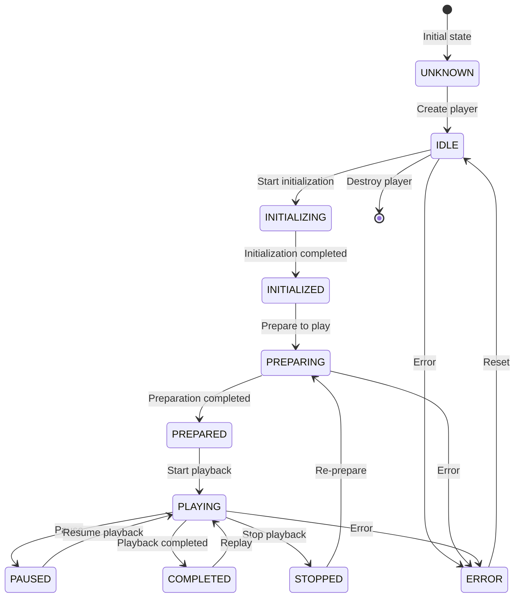

> 📚 **Recommended Reading Path**
>
> [Core Capabilities](./CoreFeatures-EN.md) → [Integration Setup](./Integration-EN.md) → [Quick Start](./QuickStart-EN.md) → **API Reference**

---

# **AliPlayerKit API Reference**

AliPlayerKit provides a rich set of API interfaces to enable developers to directly control player behavior. This document offers detailed descriptions of the main AliPlayerKit interfaces.

>  🤖 **AI-Friendly Tip**
>
>  AliPlayerKit provides comprehensive code comments for all core APIs (including classes and methods). In IDEs such as Android Studio, you can view related descriptions through hover tooltips or Quick Documentation features, thereby improving development efficiency. Meanwhile, this also makes the APIs more friendly to AI programming tools, helping them better understand API semantics.

---

## **1. Core APIs**

### **1.1 AliPlayerKit (Global Interface)**

`AliPlayerKit` is the global settings class that provides the entry point for global configuration and initialization. It is the unique global entry of the entire player framework.

**Initialization Methods**

| Method | Parameters | Return | Description |
|-----|------|-------|------|
| `init(Context)` | context: Application context | void | Initialize global settings, should be called in Application.onCreate() |

**Status Query**

| Method | Parameters | Return | Description |
|-----|------|-------|------|
| `isInitialized()` | - | boolean | Check whether initialized |
| `getContext()` | - | Context | Get ApplicationContext |
| `getPlayerKitVersion()` | - | String | Get Kit version |
| `getSdkVersion()` | - | String | Get underlying SDK version |
| `getDeviceId()` | - | String | Get device ID |

**Configuration Methods**

| Method | Parameters | Return | Description |
|-----|------|-------|------|
| `setDebugModeEnabled(boolean)` | enable: Whether to enable | void | Set Debug mode |
| `isDebugModeEnabled()` | - | boolean | Check whether Debug mode is enabled |
| `setLogPanelEnabled(boolean)` | enable: Whether to enable | void | Set log panel display |
| `isLogPanelEnabled()` | - | boolean | Check whether log panel is enabled |
| `setDisableScreenshot(boolean)` | disable: Whether to disable | void | Set whether to disable screenshots |
| `isDisableScreenshot()` | - | boolean | Check whether screenshots are disabled |
| `setPlayerViewType(PlayerViewType)` | viewType: View type | void | Set player view type |
| `getPlayerViewType()` | - | PlayerViewType | Get current player view type |
| `setOnGlobalInit(OnGlobalInitCallback)` | callback: Global initialization callback | void | Set global initialization configuration callback. See [Custom Configuration](./advanced/CustomConfig-EN.md) |

**Cache Management**

| Method | Parameters | Return | Description |
|-----|------|-------|------|
| `clearCaches()` | - | void | Clear player cache |

**Global APIs**

| Method | Parameters | Return | Description |
|-----|------|-------|------|
| `getLogger()` | - | IPlayerLogger | Get global logger instance |
| `getPreloader()` | - | IPlayerPreloader | Get global preloader instance |
| `setLogger(IPlayerLogger)` | logger: Logger instance | void | Set custom logger implementation |
| `setPreloader(IPlayerPreloader)` | preloader: Preloader instance | void | Set custom preloader implementation |

---

### **1.2 AliPlayerView (View - View Component)**

`AliPlayerView` is the core player view component, responsible for UI presentation and slot management. As the **View** layer in the MVC architecture, it is responsible for rendering the player interface and managing UI components.

**Controller Binding**

| Method | Parameters | Return | Description |
|-----|------|-------|------|
| `attach(AliPlayerController)` | controller | void | Bind controller (automatically uses default slots) |
| `detach()` | - | void | Detach UI, only unbinding the view from the controller |

**Lifecycle**

| Method | Parameters | Return | Description |
|-----|------|-------|------|
| `bindLifecycle(LifecycleOwner)` | lifecycleOwner | boolean | Bind lifecycle |

**Other Methods**

| Method | Parameters | Return | Description |
|-----|------|-------|------|
| `onBackPressed()` | - | boolean | Handle back key event, returning true means handled |
| `getSlotManager()` | - | SlotManager | Get the slot manager |

---

### **1.3 AliPlayerController (Controller)**

`AliPlayerController` is the playback controller, responsible for playback logic and state management. As the **Controller** layer in the MVC architecture, it coordinates interactions between View and Model.

**Constructors**

| Method | Parameters | Description |
|-----|------|------|
| `AliPlayerController(Context)` | context: Application context | Create controller (using default lifecycle strategy) |
| `AliPlayerController(Context, IPlayerLifecycleStrategy)` | context, lifecycleStrategy | Create controller (with custom lifecycle strategy) |

**Configuration and Initialization**

| Method | Parameters | Return | Description |
|-----|------|-------|------|
| `configure(AliPlayerModel)` | model: Playback data | void | Configure playback data, **must be called before `attach()`** |
| `getModel()` | - | AliPlayerModel | Get current playback data configuration |
| `getPlayer()` | - | IMediaPlayer | Get player instance |
| `destroy()` | - | void | Destroy player and release all resources, should be called in `onDestroy()` |

**State Management**

| Method | Parameters | Return | Description |
|-----|------|-------|------|
| `getStateStore()` | - | IPlayerStateStore | Get player state store |
| `getStrategyManager()` | - | StrategyManager | Get strategy manager |

**View Settings**

| Method | Parameters | Return | Description |
|-----|------|-------|------|
| `setDisplayView(AliDisplayView)` | displayView | void | Set the player display view |
| `setSurface(Surface)` | surface | void | Set the player Surface |
| `surfaceChanged()` | - | void | Notify that the Surface has changed |

**Lifecycle Methods**

| Method | Parameters | Return | Description |
|-----|------|-------|------|
| `onResume()` | - | void | Manually handle resume (for non-LifecycleOwner scenarios) |
| `onPause()` | - | void | Manually handle pause (for non-LifecycleOwner scenarios) |

---

### **1.4 AliPlayerModel (Model)**

`AliPlayerModel` is the player data model, encapsulating playback configuration data. As the **Model** layer in the MVC architecture, it encapsulates all configuration data required by the player. It uses the Builder pattern to create instances.

**Builder Methods**

| Method | Parameters | Description |
|-----|------|------|
| `videoSource(VideoSource)` | Video source object | Set video resource (required) |
| `sceneType(int)` | Scene type | Set the playback scene type |
| `coverUrl(String)` | Cover image URL | Set the cover image address |
| `videoTitle(String)` | Video title | Set the video title |
| `autoPlay(boolean)` | Whether to auto play | Set whether to auto play |
| `traceId(String)` | Trace ID | Set the trace identifier |
| `startTime(long)` | Start position | Set the start position (milliseconds) |
| `isHardWareDecode(boolean)` | Whether to use hardware decoding | Set whether to enable hardware decoding |
| `allowedScreenSleep(boolean)` | Whether to allow sleep | Set whether to allow screen sleep |
| `onPlayerConfig(OnPlayerConfigCallback)` | Instance configuration callback | Set instance-level player configuration callback (optional). See [Custom Configuration](./advanced/CustomConfig-EN.md) |
| `build()` | - | Build the AliPlayerModel instance |

**Property Getter Methods**

| Method | Return | Description |
|-----|-------|------|
| `getVideoSource()` | VideoSource | Get the video resource object |
| `getSceneType()` | int | Get the playback scene type |
| `getCoverUrl()` | String | Get the cover image address |
| `getVideoTitle()` | String | Get the video title |
| `isAutoPlay()` | boolean | Get whether auto play is enabled |
| `getTraceId()` | String | Get the trace ID |
| `getStartTime()` | long | Get the start position |
| `isHardWareDecode()` | boolean | Get whether hardware decoding is enabled |
| `isAllowedScreenSleep()` | boolean | Get whether screen sleep is allowed |

---

## **2. Slot System**

The slot system is AliPlayerKit's UI extension mechanism, allowing developers to customize each UI component of the player.

### **2.1 SlotManager**

`SlotManager` is the unified entry point of the slot system, providing slot registration, visibility control, and management capabilities. It is obtained via `AliPlayerView.getSlotManager()`.

**Registration Methods**

| Method | Parameters | Description |
|-----|------|------|
| `register(SlotType, SlotBuilder)` | type, builder | Register a slot builder (overriding the default implementation) |

**Visibility Control Methods**

| Method | Parameters | Description |
|-----|------|------|
| `hide(SlotType)` | type: Slot type | Hide the entire slot |
| `show(SlotType)` | type: Slot type | Show a previously hidden slot |
| `hideElements(SlotType, String...)` | type, elementKeys | Hide specific elements within a slot |
| `showElements(SlotType, String...)` | type, elementKeys | Show previously hidden elements within a slot |
| `setHiddenElements(SlotType, Set<String>)` | type, elementKeys | Set the hidden elements set of a slot (replacement) |
| `setAllHiddenElements(Map)` | map | Batch set hidden elements for multiple slots |

**Management Methods**

| Method | Parameters | Return | Description |
|-----|------|-------|------|
| `clearAll()` | - | void | Clear all registered slots (start from blank) |
| `rebuildSlots()` | - | void | Rebuild all slots |
| `getSlotView(SlotType)` | slotType: Slot type | View | Get the slot view of the specified type |
| `bindData(AliPlayerModel)` | model: Playback data | void | Bind playback data to the slot system |
| `unbindData()` | - | void | Unbind playback data |
| `updateSceneType(int)` | sceneType: Scene type | void | Update scene type and rebuild slots |

### **2.2 ISlot (Slot Interface)**

Custom slots need to implement the `ISlot` interface, which defines the slot lifecycle.

| Method | Description |
|-----|------|
| `onAttach(SlotHost)` | Called when the slot is attached to the host |
| `onDetach()` | Called when the slot is detached from the host |
| `onBindData(AliPlayerModel)` | Called when playback data is bound |
| `onUnbindData()` | Called when playback data is unbound |

> **Tip**: It is recommended to extend `BaseSlot` to implement custom slots; the framework will automatically manage the event subscription lifecycle.

### **2.3 SlotType**

| Constant | Description |
|-----|------|
| `SlotType.PLAYER_SURFACE` | Player Surface View Slot: The core view used to display the player video content |
| `SlotType.FULLSCREEN` | Fullscreen Management Slot: Manages the player's fullscreen toggle logic |
| `SlotType.GESTURE_CONTROL` | Gesture Control Slot: Handles player gesture control (single tap, double tap, long press, drag, etc.) |
| `SlotType.LANDSCAPE_HINT` | Landscape Viewing Hint Slot: Prompts users to view landscape videos in fullscreen |
| `SlotType.COVER` | Cover Image Slot: Displays the video cover image |
| `SlotType.CENTER_DISPLAY` | Center Display Slot: Displays status information in the center area (such as speed, brightness, volume, etc.) |
| `SlotType.PLAY_STATE` | Playback State Slot: Displays playback state (such as error messages, loading, etc.) |
| `SlotType.LOG_PANEL` | Log Panel Slot: Displays player log information for debugging |
| `SlotType.TOP_BAR` | Top Control Bar Slot: Displays back button, title, settings, etc. |
| `SlotType.BOTTOM_BAR` | Bottom Control Bar Slot: Displays playback controls, progress bar, etc. |
| `SlotType.SETTING_MENU` | Settings Menu Slot: Displays settings menu (such as speed, resolution, mirror, rotation, etc.) |

### **2.4 SceneType**

| Constant | Value | Description |
|-----|---|------|
| `SceneType.VOD` | 0 | VOD scene: Regular video playback, supports all playback control features |
| `SceneType.LIVE` | 1 | Live scene: Real-time live stream playback, does not support seek, speed, etc. |
| `SceneType.VIDEO_LIST` | 2 | Video list playback scene: Player in a video list, with vertical gestures disabled |
| `SceneType.RESTRICTED` | 3 | Restricted playback scene: Restricts timeline operations, suitable for education and training |
| `SceneType.MINIMAL` | 4 | Minimal playback scene: Only the playback view, without any UI |

### **2.5 PlayerViewType**

| Constant | Description |
|-----|------|
| `PlayerViewType.DISPLAY_VIEW` | AliDisplayView (recommended): The official display view component, with better compatibility and performance |
| `PlayerViewType.SURFACE_VIEW` | SurfaceView: Independent rendering thread, does not support animations |
| `PlayerViewType.TEXTURE_VIEW` | TextureView: Supports animations and transformations, suitable for scenes requiring view animations |

For details, see [Slot System](./advanced/SlotSystem-EN.md).

---

## **3. Video Source**

### **3.1 VideoSourceFactory**

| Method | Parameters | Return | Description |
|-----|------|-------|------|
| `VideoSourceFactory.createVidAuthSource(String, String)` | vid, playAuth | VideoSource | Create a VidAuth video source (recommended) |
| `VideoSourceFactory.createVidStsSource(String, String, String, String, String)` | vid, accessKeyId, accessKeySecret, securityToken, region | VideoSource | Create a VidSts video source |
| `VideoSourceFactory.createUrlSource(String)` | url: Video URL | VideoSource | Create a URL video source |

> **Recommendation**: For production environments, it is recommended to use the **VidAuth** approach. This method offers higher security and can be combined with Alibaba Cloud VOD service to achieve end-cloud collaboration, providing richer playback capabilities. See [Multi Video Source Support](./advanced/VideoSource-EN.md).

### **3.2 VideoSource**

| Method | Return | Description |
|-----|-------|------|
| `isValid()` | boolean | Check whether the video source is valid |
| `getType()` | int | Get the video source type |
| `getSourceId()` | String | Get the video source ID |

---

## **4. Player Interface**

### **4.1 IMediaPlayer**

`IMediaPlayer` defines the core operation interface of the player, obtained via `AliPlayerController.getPlayer()`.

**Playback Control**

| Method | Parameters | Description |
|-----|------|------|
| `start()` | - | Start playback |
| `pause()` | - | Pause playback |
| `toggle()` | - | Toggle play/pause |
| `stop()` | - | Stop playback |
| `replay()` | - | Replay |
| `seekTo(long)` | positionMs | Seek to the specified position (milliseconds) |
| `release()` | - | Release player resources |

**Data Source**

| Method | Parameters | Description |
|-----|------|------|
| `setDataSource(AliPlayerModel)` | model | Set the video data source |

**View Settings**

| Method | Parameters | Description |
|-----|------|------|
| `setDisplayView(AliDisplayView)` | displayView | Set the display view |
| `setSurface(Surface)` | surface | Set the rendering Surface |
| `surfaceChanged()` | - | Notify that the Surface has changed |

**Playback Settings**

| Method | Parameters | Description |
|-----|------|------|
| `setSpeed(float)` | speed | Set playback speed (0.3 ~ 3.0) |
| `setLoop(boolean)` | loop | Set loop playback |
| `setMute(boolean)` | mute | Set mute |
| `setScaleType(int)` | scaleType | Set the rendering scale type |
| `setMirrorType(int)` | mirrorType | Set the mirror mode |
| `setRotation(int)` | rotation | Set the rotation angle |
| `selectTrack(TrackQuality)` | trackQuality | Select resolution |
| `snapshot()` | - | Take a snapshot |

**State Query**

| Method | Return | Description |
|-----|-------|------|
| `getPlayerId()` | String | Get the unique player identifier |
| `getStateStore()` | IPlayerStateStore | Get the state store interface |

### **4.2 ScaleType**

| Constant | Value | Description |
|-----|---|------|
| `ScaleType.FIT_XY` | 0 | Stretch to fill the view |
| `ScaleType.FIT_CENTER` | 1 | Display fully with aspect ratio preserved (may show black bars) |
| `ScaleType.CENTER_CROP` | 2 | Fill with aspect ratio preserved (may crop) |

### **4.3 MirrorType**

| Constant | Value | Description |
|-----|---|------|
| `MirrorType.NONE` | 0 | No mirror |
| `MirrorType.HORIZONTAL` | 1 | Horizontal mirror |
| `MirrorType.VERTICAL` | 2 | Vertical mirror |

### **4.4 Rotation**

| Constant | Value | Description |
|-----|---|------|
| `Rotation.DEGREE_0` | 0 | 0 degrees |
| `Rotation.DEGREE_90` | 90 | 90 degrees |
| `Rotation.DEGREE_180` | 180 | 180 degrees |
| `Rotation.DEGREE_270` | 270 | 270 degrees |

---

## **5. State Store Interface**

### **5.1 IPlayerStateStore**

`IPlayerStateStore` provides read-only access to player states, obtained via `AliPlayerController.getStateStore()` or `IMediaPlayer.getStateStore()`.

**Playback State**

| Method | Return | Description |
|-----|-------|------|
| `getPlayState()` | PlayerState | Get the current playback state |
| `getDuration()` | long | Get the total video duration (milliseconds) |
| `getCurrentPosition()` | long | Get the current playback position (milliseconds) |
| `getCurrentSpeed()` | float | Get the current playback speed |

**Video Settings**

| Method | Return | Description |
|-----|-------|------|
| `getVideoSize()` | VideoSize | Get the video size (may be null) |
| `getCurrentRotation()` | int | Get the current rotation angle |
| `getCurrentScaleType()` | int | Get the current scale type |
| `getCurrentMirrorType()` | int | Get the current mirror mode |

**Playback Settings**

| Method | Return | Description |
|-----|-------|------|
| `isLoop()` | boolean | Whether loop playback is enabled |
| `isMute()` | boolean | Whether mute is enabled |
| `isFullscreen()` | boolean | Whether in fullscreen |

**Resolution**

| Method | Return | Description |
|-----|-------|------|
| `getTrackQualityList()` | List<TrackQuality> | Get the resolution list |
| `getCurrentTrackIndex()` | int | Get the current resolution index |

### **5.2 PlayerState**

The player state transition diagram is as follows:



| Constant | Description |
|-----|------|
| `PlayerState.UNKNOWN` | Unknown state: Player state is unknown or uninitialized |
| `PlayerState.IDLE` | Idle state: Player has been created but not yet initialized, or its resources have been released |
| `PlayerState.INITIALIZING` | Initializing: Player is initializing and preparing to load video resources |
| `PlayerState.INITIALIZED` | Initialized: Player initialization is complete, but not yet ready to play |
| `PlayerState.PREPARING` | Preparing: Player is preparing video resources and parsing video information |
| `PlayerState.PREPARED` | Prepared: Player preparation is complete and playback can begin |
| `PlayerState.PLAYING` | Playing: Player is playing the video |
| `PlayerState.PAUSED` | Paused: Player has paused playback |
| `PlayerState.COMPLETED` | Completed: Video playback has completed |
| `PlayerState.STOPPED` | Stopped: Player has stopped playback |
| `PlayerState.ERROR` | Error: An error has occurred in the player |

---

## **6. Event System**

### **6.1 PlayerEventBus**

`PlayerEventBus` is the global event bus, used for publishing and subscribing to player events.

**Subscription Methods**

| Method | Parameters | Description |
|-----|------|------|
| `subscribe(Class<T>, EventListener<T>)` | eventType, listener | Subscribe to a specific event type |
| `unsubscribe(Class<T>, EventListener<T>)` | eventType, listener | Unsubscribe from a specific event |
| `unsubscribe(EventListener<?>)` | listener | Unsubscribe all subscriptions of this listener |
| `unsubscribeAll()` | - | Clear all subscriptions (use with caution) |

**Publish Methods**

| Method | Parameters | Description |
|-----|------|------|
| `post(PlayerEvent)` | event | Publish an event |

**Query Methods**

| Method | Return | Description |
|-----|-------|------|
| `getSubscriberCount(Class<?>)` | int | Get the number of subscribers for the specified event type |
| `hasSubscribers(Class<?>)` | boolean | Check whether there are any subscribers |

### **6.2 PlayerCommand**

Player commands are used to control player behavior and are published via `PlayerEventBus.post()`.

| Command Class | Parameters | Description |
|-------|------|------|
| `PlayerCommand.Play` | playerId | Play command |
| `PlayerCommand.Pause` | playerId | Pause command |
| `PlayerCommand.Toggle` | playerId | Toggle play/pause |
| `PlayerCommand.Stop` | playerId | Stop command |
| `PlayerCommand.Replay` | playerId | Replay command |
| `PlayerCommand.Seek` | playerId, position | Seek command (position unit: milliseconds) |
| `PlayerCommand.SetSpeed` | playerId, speed | Set playback speed (0.3 ~ 3.0) |
| `PlayerCommand.Snapshot` | playerId | Snapshot command |
| `PlayerCommand.SetLoop` | playerId, loop | Set loop playback |
| `PlayerCommand.SetMute` | playerId, mute | Set mute |
| `PlayerCommand.SetScaleType` | playerId, scaleType | Set the rendering scale type |
| `PlayerCommand.SetMirrorType` | playerId, mirrorType | Set the mirror mode |
| `PlayerCommand.SetRotation` | playerId, rotation | Set the rotation angle |
| `PlayerCommand.SelectTrack` | playerId, trackQuality | Switch resolution |

**Usage Example**

```java
// 发布播放命令
PlayerEventBus.getInstance().post(new PlayerCommand.Play(playerId));

// 发布跳转命令
PlayerEventBus.getInstance().post(new PlayerCommand.Seek(playerId, 5000));

// 设置播放速度
PlayerEventBus.getInstance().post(new PlayerCommand.SetSpeed(playerId, 1.5f));
```

### **6.3 PlayerEvents**

Player state changes are published via events and can be subscribed to for monitoring.

| Event Class | Properties | Description |
|-------|------|------|
| `PlayerEvents.StateChanged` | oldState, newState | Playback state changed |
| `PlayerEvents.Prepared` | duration | Player preparation completed |
| `PlayerEvents.FirstFrameRendered` | - | First frame rendered |
| `PlayerEvents.VideoSizeChanged` | width, height | Video size changed |
| `PlayerEvents.Info` | duration, currentPosition, bufferedPosition | Playback info update |
| `PlayerEvents.Error` | errorCode, errorMsg | Error event |
| `PlayerEvents.LoadingBegin` | - | Loading started |
| `PlayerEvents.LoadingProgress` | percent, netSpeed | Loading progress |
| `PlayerEvents.LoadingEnd` | - | Loading ended |
| `PlayerEvents.SetSpeedCompleted` | speed | Set speed completed |
| `PlayerEvents.SnapshotCompleted` | result, snapshotPath, width, height | Snapshot completed |
| `PlayerEvents.SetLoopCompleted` | loop | Set loop completed |
| `PlayerEvents.SetMuteCompleted` | mute | Set mute completed |
| `PlayerEvents.SetScaleTypeCompleted` | scaleType | Set scale type completed |
| `PlayerEvents.SetMirrorTypeCompleted` | mirrorType | Set mirror completed |
| `PlayerEvents.SetRotationCompleted` | rotation | Set rotation completed |
| `PlayerEvents.TrackQualityListUpdated` | trackQualityList | Resolution list updated |
| `PlayerEvents.TrackSelected` | trackIndex | Resolution selection completed |

**Usage Example**

```java
// 订阅播放事件
PlayerEventBus.getInstance().subscribe(PlayerEvents.Prepared.class, event -> {
    long duration = event.duration;  // 视频总时长
});

// 订阅错误事件
PlayerEventBus.getInstance().subscribe(PlayerEvents.Error.class, event -> {
    int code = event.errorCode;
    String msg = event.errorMsg;
});
```

For details, see [Event System](./advanced/EventSystem-EN.md).

---

## **7. Log System**

### **7.1 IPlayerLogger**

`IPlayerLogger` provides global log configuration capabilities, obtained via `AliPlayerKit.getLogger()`.

| Method | Parameters | Return | Description |
|-----|------|-------|------|
| `enableConsoleLog(boolean)` | enable | void | Enable/disable console log |
| `isConsoleLogEnabled()` | - | boolean | Check whether console log is enabled |
| `setLogLevel(int)` | level | void | Set the log level |
| `getLogLevel()` | - | int | Get the current log level |
| `setLogCallback(LoggerCallback)` | callback | void | Set the log callback listener |

### **7.2 LogLevel**

| Constant | Value | Description |
|-----|---|------|
| `LogLevel.VERBOSE` | 0 | Most detailed level, outputs all debug information |
| `LogLevel.DEBUG` | 1 | Debug level |
| `LogLevel.INFO` | 2 | Info level |
| `LogLevel.WARN` | 3 | Warning level |
| `LogLevel.ERROR` | 4 | Error level |
| `LogLevel.NONE` | 100 | Disable all logs |

For details, see [Log System](./advanced/LogSystem-EN.md).

---

## **8. Preload Interface**

### **8.1 IPlayerPreloader**

`IPlayerPreloader` provides global preload management capabilities, obtained via `AliPlayerKit.getPreloader()`.

| Method | Parameters | Return | Description |
|-----|------|-------|------|
| `addTask(PlayerPreloadTask, PreloadCallback)` | task, listener | String | Add a preload task and return the task ID |
| `cancelTask(String)` | taskId | void | Cancel the specified task |
| `pauseTask(String)` | taskId | void | Pause the specified task |
| `resumeTask(String)` | taskId | void | Resume the specified task |

### **8.2 PreloadCallback**

| Method | Parameters | Description |
|-----|------|------|
| `onCompleted(String, VideoSource)` | taskId, source | Preload completed |
| `onError(String, VideoSource, int, String)` | taskId, source, code, message | Preload error |
| `onCanceled(String, VideoSource)` | taskId, source | Preload canceled |

---

## **9. Player Lifecycle Strategy**

### **9.1 IPlayerLifecycleStrategy**

`IPlayerLifecycleStrategy` defines the lifecycle management strategy of player instances, used to optimize the creation and reuse of player instances.

| Method | Parameters | Return | Description |
|-----|------|-------|------|
| `init(IPlayerFactory)` | factory | void | Initialize the strategy |
| `acquire(Context, String)` | context, uniqueId | IMediaPlayer | Acquire a player instance |
| `recycle(IMediaPlayer, String, boolean)` | player, uniqueId, force | void | Recycle a player instance |
| `clear()` | - | void | Clear all resources |
| `preload(Context, int)` | context, count | void | Preload player instances |

**Built-in Strategies**

| Strategy Class | Description |
|-------|------|
| `DefaultLifecycleStrategy` | Default strategy: Create a new instance each time, destroy immediately after use |
| `ReusePoolLifecycleStrategy` | Reuse pool strategy: Suitable for list-style streaming playback |
| `IdScopedPoolLifecycleStrategy` | ID-scoped strategy: One-to-one mapping between IDs and instances |
| `SingletonLifecycleStrategy` | Singleton strategy: Globally unique instance |

For details, see [Player Lifecycle Strategy](./advanced/PlayerLifecycleStrategy-EN.md).

---

## **10. Strategy System**

### **10.1 StrategyManager**

`StrategyManager` is responsible for managing the lifecycle of all strategies, obtained via `AliPlayerController.getStrategyManager()`.

| Method | Parameters | Return | Description |
|-----|------|-------|------|
| `register(IStrategy)` | strategy | void | Register a strategy |
| `unregister(IStrategy)` | strategy | void | Unregister a strategy |
| `getStrategy(String)` | name | IStrategy | Get a strategy by name |
| `start(StrategyContext)` | context | void | Start all strategies |
| `stop()` | - | void | Stop all strategies |
| `reset()` | - | void | Reset all strategies |
| `updateContext(StrategyContext)` | context | void | Update context and restart strategies |
| `destroy()` | - | void | Destroy the manager |
| `getStrategyCount()` | - | int | Get the number of strategies |
| `isStarted()` | - | boolean | Check whether started |

### **10.2 IStrategy**

Custom strategies must implement the `IStrategy` interface.

| Method | Description |
|-----|------|
| `getName()` | Get the strategy name |
| `onStart(StrategyContext)` | Called when the strategy starts |
| `onStop()` | Called when the strategy stops |
| `onReset()` | Called when the strategy is reset |

For details, see [Strategy System](./advanced/StrategySystem-EN.md).

---

## **11. Custom Configuration**

AliPlayerKit provides a two-tier custom configuration mechanism, allowing developers to inject custom SDK configurations at key moments.

### **11.1 OnGlobalInitCallback**

The global initialization configuration callback interface, triggered after `AliPlayerKit.init()` completes, executed only once.

| Method | Description |
|------|------|
| `void onGlobalInit()` | Configuration callback after global initialization is complete |

**Registration**: `AliPlayerKit.setOnGlobalInit(OnGlobalInitCallback callback)`

### **11.2 OnPlayerConfigCallback**

The instance-level player configuration callback interface, triggered before `prepare()` within `configure()`.

| Method | Parameters | Description |
|------|------|------|
| `void onPlayerConfig(IMediaPlayer player)` | player - Player instance | Configuration callback called before prepare() |

**Registration**: `AliPlayerModel.Builder.onPlayerConfig(OnPlayerConfigCallback callback)`

For details, see [Custom Configuration](./advanced/CustomConfig-EN.md).

---

The above content covers the main API interfaces of AliPlayerKit.

For more information about the design and usage of each player subsystem, please refer to the related documents under the **[advanced/](./advanced/)** directory, which will help you gain a deeper understanding of AliPlayerKit's overall architecture and extension mechanisms.

