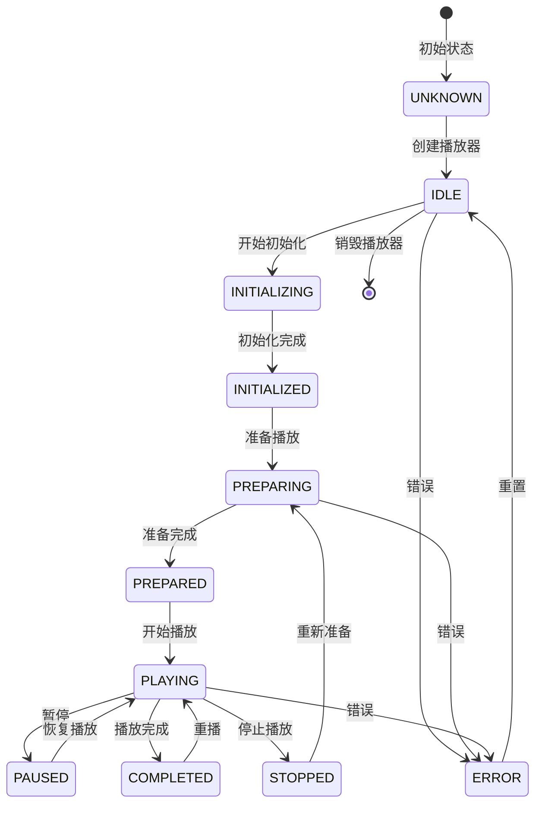

Language: 中文简体 | [English](ApiReference-EN.md)

> 📚 **推荐阅读路径**
>
> [核心能力](./CoreFeatures.md) → [集成准备](./Integration.md) → [快速开始](./QuickStart.md) → **API 参考**

---

# **AliPlayerKit API 参考**

AliPlayerKit 提供了丰富的 API 接口，方便开发者直接控制播放器的行为。本文档提供 AliPlayerKit 主要接口的详细说明。

>  **提示**：AliPlayerKit 为所有核心 API（包括类和方法）提供了完善的代码注释。在 Android Studio 等 IDE 中，可通过悬停提示或 Quick Documentation 等功能查看相关说明，从而提升开发效率；同时，也使 API 对 AI 编程工具更加友好，有助于 AI 编程工具更好地理解 API 语义。

---

## **1. 核心 API**

### **1.1 AliPlayerKit（全局接口）**

`AliPlayerKit` 是全局设置类，提供全局配置和初始化入口，是整个播放器框架的唯一全局入口。

**初始化方法**

| 方法 | 参数 | 返回值 | 说明 |
|-----|------|-------|------|
| `init(Context)` | context: 应用上下文 | void | 初始化全局设置，应在 Application.onCreate() 中调用 |

**状态查询**

| 方法 | 参数 | 返回值 | 说明 |
|-----|------|-------|------|
| `isInitialized()` | - | boolean | 检查是否已初始化 |
| `getContext()` | - | Context | 获取 ApplicationContext |
| `getPlayerKitVersion()` | - | String | 获取 Kit 版本号 |
| `getSdkVersion()` | - | String | 获取底层 SDK 版本号 |
| `getDeviceId()` | - | String | 获取设备 ID |

**配置方法**

| 方法 | 参数 | 返回值 | 说明 |
|-----|------|-------|------|
| `setDebugModeEnabled(boolean)` | enable: 是否启用 | void | 设置 Debug 模式 |
| `isDebugModeEnabled()` | - | boolean | 检查 Debug 模式是否启用 |
| `setLogPanelEnabled(boolean)` | enable: 是否启用 | void | 设置日志面板显示 |
| `isLogPanelEnabled()` | - | boolean | 检查日志面板是否启用 |
| `setDisableScreenshot(boolean)` | disable: 是否禁止 | void | 设置是否禁止截屏 |
| `isDisableScreenshot()` | - | boolean | 检查是否禁止截屏 |
| `setPlayerViewType(PlayerViewType)` | viewType: 视图类型 | void | 设置播放器视图类型 |
| `getPlayerViewType()` | - | PlayerViewType | 获取当前播放器视图类型 |

**缓存管理**

| 方法 | 参数 | 返回值 | 说明 |
|-----|------|-------|------|
| `clearCaches()` | - | void | 清除播放器缓存 |

**全局 API**

| 方法 | 参数 | 返回值 | 说明 |
|-----|------|-------|------|
| `getLogger()` | - | IPlayerLogger | 获取全局日志实例 |
| `getPreloader()` | - | IPlayerPreloader | 获取全局预加载实例 |
| `setLogger(IPlayerLogger)` | logger: 日志实例 | void | 设置自定义日志实现 |
| `setPreloader(IPlayerPreloader)` | preloader: 预加载实例 | void | 设置自定义预加载实现 |

---

### **1.2 AliPlayerView（View - 视图组件）**

`AliPlayerView` 是核心的播放器视图组件，负责 UI 展示和插槽管理。作为 MVC 架构中的 **View** 层，它负责渲染播放器界面并管理 UI 组件。

**控制器绑定**

| 方法 | 参数 | 返回值 | 说明 |
|-----|------|-------|------|
| `attach(AliPlayerController, AliPlayerModel)` | controller, model | void | 绑定控制器和数据（使用默认 UI） |
| `attach(AliPlayerController, AliPlayerModel, SlotRegistry)` | controller, model, registry | void | 绑定控制器和数据（自定义 UI） |
| `detach()` | - | void | 解绑并释放资源 |

**生命周期**

| 方法 | 参数 | 返回值 | 说明 |
|-----|------|-------|------|
| `bindLifecycle(LifecycleOwner)` | lifecycleOwner | boolean | 绑定生命周期 |

**其他方法**

| 方法 | 参数 | 返回值 | 说明 |
|-----|------|-------|------|
| `onBackPressed()` | - | boolean | 处理返回键事件，返回 true 表示已处理 |
| `getSlotManager()` | - | ISlotManager | 获取插槽管理器 |

---

### **1.3 AliPlayerController（Controller - 控制器）**

`AliPlayerController` 是播放控制器，负责播放逻辑和状态管理。作为 MVC 架构中的 **Controller** 层，它协调 View 和 Model 之间的交互。

**构造方法**

| 方法 | 参数 | 说明 |
|-----|------|------|
| `AliPlayerController(Context)` | context: 应用上下文 | 创建控制器（使用默认生命周期策略） |
| `AliPlayerController(Context, IPlayerLifecycleStrategy)` | context, lifecycleStrategy | 创建控制器（自定义生命周期策略） |

**配置与初始化**

| 方法 | 参数 | 返回值 | 说明 |
|-----|------|-------|------|
| `configure(AliPlayerModel)` | model: 播放数据 | void | 配置播放数据 |
| `getModel()` | - | AliPlayerModel | 获取当前播放数据配置 |
| `getPlayer()` | - | IMediaPlayer | 获取播放器实例 |
| `destroy()` | - | void | 销毁播放器 |

**状态管理**

| 方法 | 参数 | 返回值 | 说明 |
|-----|------|-------|------|
| `getStateStore()` | - | IPlayerStateStore | 获取播放器状态存储 |
| `getStrategyManager()` | - | StrategyManager | 获取策略管理器 |

**视图设置**

| 方法 | 参数 | 返回值 | 说明 |
|-----|------|-------|------|
| `setDisplayView(AliDisplayView)` | displayView | void | 设置播放器显示视图 |
| `setSurface(Surface)` | surface | void | 设置播放器 Surface |
| `surfaceChanged()` | - | void | 通知 Surface 已变化 |

**生命周期方法**

| 方法 | 参数 | 返回值 | 说明 |
|-----|------|-------|------|
| `onResume()` | - | void | 手动处理恢复（非 LifecycleOwner 场景） |
| `onPause()` | - | void | 手动处理暂停（非 LifecycleOwner 场景） |

---

### **1.4 AliPlayerModel（Model - 数据模型）**

`AliPlayerModel` 是播放器数据模型，封装播放配置数据。作为 MVC 架构中的 **Model** 层，它封装了播放器所需的所有配置数据。采用 Builder 模式创建实例。

**Builder 方法**

| 方法 | 参数 | 说明 |
|-----|------|------|
| `videoSource(VideoSource)` | 视频源对象 | 设置视频资源（必填） |
| `sceneType(int)` | 场景类型 | 设置播放场景类型 |
| `coverUrl(String)` | 封面图 URL | 设置封面图地址 |
| `videoTitle(String)` | 视频标题 | 设置视频标题 |
| `autoPlay(boolean)` | 是否自动播放 | 设置是否自动播放 |
| `traceId(String)` | 跟踪 ID | 设置跟踪标识 |
| `startTime(long)` | 起播位置 | 设置起播位置（毫秒） |
| `isHardWareDecode(boolean)` | 是否硬件解码 | 设置是否硬件解码 |
| `allowedScreenSleep(boolean)` | 是否允许休眠 | 设置是否允许屏幕休眠 |
| `build()` | - | 构建 AliPlayerModel 实例 |

**属性获取方法**

| 方法 | 返回值 | 说明 |
|-----|-------|------|
| `getVideoSource()` | VideoSource | 获取视频资源对象 |
| `getSceneType()` | int | 获取播放场景类型 |
| `getCoverUrl()` | String | 获取封面图地址 |
| `getVideoTitle()` | String | 获取视频标题 |
| `isAutoPlay()` | boolean | 获取是否自动播放 |
| `getTraceId()` | String | 获取跟踪 ID |
| `getStartTime()` | long | 获取起播位置 |
| `isHardWareDecode()` | boolean | 获取是否硬件解码 |
| `isAllowedScreenSleep()` | boolean | 获取是否允许屏幕休眠 |

---

## **2. 插槽系统**

插槽系统是 AliPlayerKit 的 UI 扩展机制，允许开发者自定义播放器的各个 UI 组件。

### **2.1 ISlotManager（插槽管理接口）**

`ISlotManager` 提供插槽的管理能力，通过 `AliPlayerView.getSlotManager()` 获取。

| 方法 | 参数 | 返回值 | 说明 |
|-----|------|-------|------|
| `rebuildSlots()` | - | void | 重建所有插槽（修改 SlotRegistry 后调用） |
| `getSlotView(SlotType)` | slotType: 插槽类型 | View | 获取指定类型的插槽视图 |
| `bindData(AliPlayerModel)` | model: 播放数据 | void | 绑定播放数据到插槽系统 |
| `unbindData()` | - | void | 解绑播放数据 |
| `updateSceneType(int)` | sceneType: 场景类型 | void | 更新场景类型并重建插槽 |

### **2.2 SlotRegistry（插槽注册表）**

`SlotRegistry` 用于注册自定义插槽，在 `AliPlayerView.attach()` 时传入。

**注册方法**

| 方法 | 参数 | 说明 |
|-----|------|------|
| `register(SlotType, SlotBuilder)` | type, builder | 注册插槽构建器 |
| `register(SlotType, Class<? extends View>)` | type, slotClass | 注册插槽类（通过反射创建） |
| `register(SlotType, int)` | type, layoutId | 注册布局资源插槽 |

**管理方法**

| 方法 | 返回值 | 说明 |
|-----|-------|------|
| `unregister(SlotType)` | SlotBuilder | 注销插槽构建器 |
| `isRegistered(SlotType)` | boolean | 检查是否已注册 |
| `clear()` | void | 清空所有注册 |
| `size()` | int | 获取已注册数量 |

### **2.3 ISlot（插槽接口）**

自定义插槽需实现 `ISlot` 接口，定义插槽的生命周期。

| 方法 | 说明 |
|-----|------|
| `onAttach(SlotHost)` | 插槽被附加到宿主时调用 |
| `onDetach()` | 插槽从宿主分离时调用 |
| `onBindData(AliPlayerModel)` | 播放数据绑定时调用 |
| `onUnbindData()` | 播放数据解绑时调用 |

> **提示**：推荐继承 `BaseSlot` 来实现自定义插槽，框架会自动管理事件订阅生命周期。

### **2.4 SlotType（插槽类型）**

| 常量 | 说明 |
|-----|------|
| `SlotType.PLAYER_SURFACE` | 播放 Surface 视图插槽：用于显示播放器视频内容的核心视图 |
| `SlotType.FULLSCREEN` | 全屏管理插槽：负责管理播放器的全屏切换逻辑 |
| `SlotType.GESTURE_CONTROL` | 手势控制插槽：用于处理播放器手势控制（单击、双击、长按、拖动等） |
| `SlotType.LANDSCAPE_HINT` | 横屏观看提示插槽：提示用户全屏观看横屏视频 |
| `SlotType.COVER` | 封面图插槽：用于显示视频封面图 |
| `SlotType.CENTER_DISPLAY` | 中心显示插槽：用于显示中心区域的状态信息（如倍速、亮度、音量等） |
| `SlotType.PLAY_STATE` | 播放状态插槽：用于显示播放状态（如错误提示、加载中等） |
| `SlotType.LOG_PANEL` | 日志面板插槽：用于显示播放器日志信息，便于调试 |
| `SlotType.TOP_BAR` | 顶部控制栏插槽：显示返回按钮、标题、设置等 |
| `SlotType.BOTTOM_BAR` | 底部控制栏插槽：显示播放控制、进度条、全屏切换等 |
| `SlotType.SETTING_MENU` | 设置菜单插槽：用于显示设置菜单（如倍速、清晰度、镜像、旋转等） |

### **2.5 SceneType（播放场景）**

| 常量 | 值 | 说明 |
|-----|---|------|
| `SceneType.VOD` | 0 | 点播场景：常规视频播放，支持所有播放控制功能 |
| `SceneType.LIVE` | 1 | 直播场景：实时直播流播放，不支持进度拖拽、倍速等 |
| `SceneType.VIDEO_LIST` | 2 | 列表播放场景：视频列表中的播放器，禁用垂直手势 |
| `SceneType.RESTRICTED` | 3 | 受限播放场景：限制时间轴操作，适用于教育培训等 |
| `SceneType.MINIMAL` | 4 | 最小化播放场景：仅播放视图，无任何 UI |

### **2.6 PlayerViewType（播放器视图类型）**

| 常量 | 说明 |
|-----|------|
| `PlayerViewType.DISPLAY_VIEW` | AliDisplayView（推荐）：官方显示视图组件，兼容性和性能更优 |
| `PlayerViewType.SURFACE_VIEW` | SurfaceView：独立渲染线程，不支持动画 |
| `PlayerViewType.TEXTURE_VIEW` | TextureView：支持动画和变换，适合需要视图动画的场景 |

详见 [插槽系统](./advanced/SlotSystem.md)。

---

## **3. 视频源**

### **3.1 VideoSourceFactory（视频源工厂）**

| 方法 | 参数 | 返回值 | 说明 |
|-----|------|-------|------|
| `VideoSourceFactory.createVidAuthSource(String, String)` | vid, playAuth | VideoSource | 创建 VidAuth 视频源（推荐） |
| `VideoSourceFactory.createVidStsSource(String, String, String, String, String)` | vid, accessKeyId, accessKeySecret, securityToken, region | VideoSource | 创建 VidSts 视频源 |
| `VideoSourceFactory.createUrlSource(String)` | url: 视频 URL | VideoSource | 创建 URL 视频源 |

> **推荐**：生产环境建议使用 **VidAuth** 方式。该方式安全性更高，并可结合阿里云 VOD 服务实现端云协同，提供更丰富的播放能力。详见 [多视频源支持](./advanced/VideoSource.md)。

### **3.2 VideoSource（视频源）**

| 方法 | 返回值 | 说明 |
|-----|-------|------|
| `isValid()` | boolean | 检查视频源是否有效 |
| `getType()` | int | 获取视频源类型 |
| `getSourceId()` | String | 获取视频源 ID |

---

## **4. 播放器接口**

### **4.1 IMediaPlayer（媒体播放器接口）**

`IMediaPlayer` 定义了播放器的核心操作接口，通过 `AliPlayerController.getPlayer()` 获取。

**播放控制**

| 方法 | 参数 | 说明 |
|-----|------|------|
| `start()` | - | 开始播放 |
| `pause()` | - | 暂停播放 |
| `toggle()` | - | 播放/暂停切换 |
| `stop()` | - | 停止播放 |
| `replay()` | - | 重播 |
| `seekTo(long)` | positionMs | 跳转到指定位置（毫秒） |
| `release()` | - | 释放播放器资源 |

**数据源**

| 方法 | 参数 | 说明 |
|-----|------|------|
| `setDataSource(AliPlayerModel)` | model | 设置视频数据源 |

**视图设置**

| 方法 | 参数 | 说明 |
|-----|------|------|
| `setDisplayView(AliDisplayView)` | displayView | 设置显示视图 |
| `setSurface(Surface)` | surface | 设置渲染 Surface |
| `surfaceChanged()` | - | 通知 Surface 已变化 |

**播放设置**

| 方法 | 参数 | 说明 |
|-----|------|------|
| `setSpeed(float)` | speed | 设置播放速度（0.3 ~ 3.0） |
| `setLoop(boolean)` | loop | 设置循环播放 |
| `setMute(boolean)` | mute | 设置静音 |
| `setScaleType(int)` | scaleType | 设置渲染填充模式 |
| `setMirrorType(int)` | mirrorType | 设置镜像模式 |
| `setRotation(int)` | rotation | 设置旋转角度 |
| `selectTrack(TrackQuality)` | trackQuality | 选择清晰度 |
| `snapshot()` | - | 截图 |

**状态查询**

| 方法 | 返回值 | 说明 |
|-----|-------|------|
| `getPlayerId()` | String | 获取播放器唯一标识 |
| `getStateStore()` | IPlayerStateStore | 获取状态存储接口 |

### **4.2 ScaleType（渲染填充模式）**

| 常量 | 值 | 说明 |
|-----|---|------|
| `ScaleType.FIT_XY` | 0 | 拉伸填充视图 |
| `ScaleType.FIT_CENTER` | 1 | 等比完整显示（可能留黑边） |
| `ScaleType.CENTER_CROP` | 2 | 等比填充（可能裁剪） |

### **4.3 MirrorType（镜像模式）**

| 常量 | 值 | 说明 |
|-----|---|------|
| `MirrorType.NONE` | 0 | 无镜像 |
| `MirrorType.HORIZONTAL` | 1 | 水平镜像 |
| `MirrorType.VERTICAL` | 2 | 垂直镜像 |

### **4.4 Rotation（旋转角度）**

| 常量 | 值 | 说明 |
|-----|---|------|
| `Rotation.DEGREE_0` | 0 | 0 度 |
| `Rotation.DEGREE_90` | 90 | 90 度 |
| `Rotation.DEGREE_180` | 180 | 180 度 |
| `Rotation.DEGREE_270` | 270 | 270 度 |

---

## **5. 状态存储接口**

### **5.1 IPlayerStateStore（播放器状态存储）**

`IPlayerStateStore` 提供播放器状态的只读访问，通过 `AliPlayerController.getStateStore()` 或 `IMediaPlayer.getStateStore()` 获取。

**播放状态**

| 方法 | 返回值 | 说明 |
|-----|-------|------|
| `getPlayState()` | PlayerState | 获取当前播放状态 |
| `getDuration()` | long | 获取视频总时长（毫秒） |
| `getCurrentPosition()` | long | 获取当前播放位置（毫秒） |
| `getCurrentSpeed()` | float | 获取当前播放速度 |

**视频设置**

| 方法 | 返回值 | 说明 |
|-----|-------|------|
| `getVideoSize()` | VideoSize | 获取视频尺寸（可能为 null） |
| `getCurrentRotation()` | int | 获取当前旋转角度 |
| `getCurrentScaleType()` | int | 获取当前填充模式 |
| `getCurrentMirrorType()` | int | 获取当前镜像模式 |

**播放设置**

| 方法 | 返回值 | 说明 |
|-----|-------|------|
| `isLoop()` | boolean | 是否循环播放 |
| `isMute()` | boolean | 是否静音 |
| `isFullscreen()` | boolean | 是否全屏 |

**清晰度**

| 方法 | 返回值 | 说明 |
|-----|-------|------|
| `getTrackQualityList()` | List<TrackQuality> | 获取清晰度列表 |
| `getCurrentTrackIndex()` | int | 获取当前清晰度索引 |

### **5.2 PlayerState（播放状态）**

播放器状态流转图如下：



| 常量 | 说明 |
|-----|------|
| `PlayerState.UNKNOWN` | 未知状态：播放器状态未知或未初始化 |
| `PlayerState.IDLE` | 空闲状态：播放器已创建但尚未初始化，或已释放资源 |
| `PlayerState.INITIALIZING` | 初始化中：播放器正在初始化，准备加载视频资源 |
| `PlayerState.INITIALIZED` | 已初始化：播放器已完成初始化，但尚未准备播放 |
| `PlayerState.PREPARING` | 准备中：播放器正在准备视频资源，解析视频信息 |
| `PlayerState.PREPARED` | 已准备：播放器已完成准备，可以开始播放 |
| `PlayerState.PLAYING` | 播放中：播放器正在播放视频 |
| `PlayerState.PAUSED` | 暂停：播放器已暂停播放 |
| `PlayerState.COMPLETED` | 播放完成：视频播放已完成 |
| `PlayerState.STOPPED` | 停止：播放器已停止播放 |
| `PlayerState.ERROR` | 错误：播放器发生错误 |

---

## **6. 事件系统**

### **6.1 PlayerEventBus（事件总线）**

`PlayerEventBus` 是全局事件总线，用于播放器事件的发布和订阅。

**订阅方法**

| 方法 | 参数 | 说明 |
|-----|------|------|
| `subscribe(Class<T>, EventListener<T>)` | eventType, listener | 订阅指定类型事件 |
| `unsubscribe(Class<T>, EventListener<T>)` | eventType, listener | 取消订阅指定事件 |
| `unsubscribe(EventListener<?>)` | listener | 取消该监听器的所有订阅 |
| `unsubscribeAll()` | - | 清除所有订阅（谨慎使用） |

**发布方法**

| 方法 | 参数 | 说明 |
|-----|------|------|
| `post(PlayerEvent)` | event | 发布事件 |

**查询方法**

| 方法 | 返回值 | 说明 |
|-----|-------|------|
| `getSubscriberCount(Class<?>)` | int | 获取指定事件类型的订阅者数量 |
| `hasSubscribers(Class<?>)` | boolean | 检查是否有订阅者 |

### **6.2 PlayerCommand（播放命令）**

播放命令用于控制播放器行为，通过 `PlayerEventBus.post()` 发布。

| 命令类 | 参数 | 说明 |
|-------|------|------|
| `PlayerCommand.Play` | playerId | 播放命令 |
| `PlayerCommand.Pause` | playerId | 暂停命令 |
| `PlayerCommand.Toggle` | playerId | 播放/暂停切换 |
| `PlayerCommand.Stop` | playerId | 停止命令 |
| `PlayerCommand.Replay` | playerId | 重播命令 |
| `PlayerCommand.Seek` | playerId, position | 跳转命令（position 单位：毫秒） |
| `PlayerCommand.SetSpeed` | playerId, speed | 设置播放速度（0.3 ~ 3.0） |
| `PlayerCommand.Snapshot` | playerId | 截图命令 |
| `PlayerCommand.SetLoop` | playerId, loop | 设置循环播放 |
| `PlayerCommand.SetMute` | playerId, mute | 设置静音 |
| `PlayerCommand.SetScaleType` | playerId, scaleType | 设置渲染填充模式 |
| `PlayerCommand.SetMirrorType` | playerId, mirrorType | 设置镜像模式 |
| `PlayerCommand.SetRotation` | playerId, rotation | 设置旋转角度 |
| `PlayerCommand.SelectTrack` | playerId, trackQuality | 切换清晰度 |

**使用示例**

```java
// 发布播放命令
PlayerEventBus.getInstance().post(new PlayerCommand.Play(playerId));

// 发布跳转命令
PlayerEventBus.getInstance().post(new PlayerCommand.Seek(playerId, 5000));

// 设置播放速度
PlayerEventBus.getInstance().post(new PlayerCommand.SetSpeed(playerId, 1.5f));
```

### **6.3 PlayerEvents（播放事件）**

播放器状态变化会通过事件发布，可订阅监听。

| 事件类 | 属性 | 说明 |
|-------|------|------|
| `PlayerEvents.StateChanged` | oldState, newState | 播放状态变化 |
| `PlayerEvents.Prepared` | duration | 播放器准备完成 |
| `PlayerEvents.FirstFrameRendered` | - | 首帧渲染完成 |
| `PlayerEvents.VideoSizeChanged` | width, height | 视频尺寸变化 |
| `PlayerEvents.Info` | duration, currentPosition, bufferedPosition | 播放信息更新 |
| `PlayerEvents.Error` | errorCode, errorMsg | 错误事件 |
| `PlayerEvents.LoadingBegin` | - | 开始加载 |
| `PlayerEvents.LoadingProgress` | percent, netSpeed | 加载进度 |
| `PlayerEvents.LoadingEnd` | - | 加载结束 |
| `PlayerEvents.SetSpeedCompleted` | speed | 设置速度完成 |
| `PlayerEvents.SnapshotCompleted` | result, snapshotPath, width, height | 截图完成 |
| `PlayerEvents.SetLoopCompleted` | loop | 设置循环完成 |
| `PlayerEvents.SetMuteCompleted` | mute | 设置静音完成 |
| `PlayerEvents.SetScaleTypeCompleted` | scaleType | 设置填充模式完成 |
| `PlayerEvents.SetMirrorTypeCompleted` | mirrorType | 设置镜像完成 |
| `PlayerEvents.SetRotationCompleted` | rotation | 设置旋转完成 |
| `PlayerEvents.TrackQualityListUpdated` | trackQualityList | 清晰度列表更新 |
| `PlayerEvents.TrackSelected` | trackIndex | 清晰度选择完成 |

**使用示例**

```java
// 订阅播放事件
PlayerEventBus.getInstance().subscribe(PlayerEvents.Prepared.class, event -> {
    long duration = event.duration;  // 视频总时长
});

// 订阅错误事件
PlayerEventBus.getInstance().subscribe(PlayerEvents.Error.class, event -> {
    int code = event.errorCode;
    String msg = event.errorMsg;
});
```

详见 [事件系统](./advanced/EventSystem.md)。

---

## **7. 日志系统**

### **7.1 IPlayerLogger（日志接口）**

`IPlayerLogger` 提供全局日志配置能力，通过 `AliPlayerKit.getLogger()` 获取。

| 方法 | 参数 | 返回值 | 说明 |
|-----|------|-------|------|
| `enableConsoleLog(boolean)` | enable | void | 启用/禁用控制台日志 |
| `isConsoleLogEnabled()` | - | boolean | 检查控制台日志是否启用 |
| `setLogLevel(int)` | level | void | 设置日志级别 |
| `getLogLevel()` | - | int | 获取当前日志级别 |
| `setLogCallback(LoggerCallback)` | callback | void | 设置日志回调监听器 |

### **7.2 LogLevel（日志级别）**

| 常量 | 值 | 说明 |
|-----|---|------|
| `LogLevel.VERBOSE` | 0 | 最详细级别，输出所有调试信息 |
| `LogLevel.DEBUG` | 1 | 调试级别 |
| `LogLevel.INFO` | 2 | 信息级别 |
| `LogLevel.WARN` | 3 | 警告级别 |
| `LogLevel.ERROR` | 4 | 错误级别 |
| `LogLevel.NONE` | 100 | 禁用所有日志 |

详见 [日志系统](./advanced/LogSystem.md)。

---

## **8. 预加载接口**

### **8.1 IPlayerPreloader（预加载接口）**

`IPlayerPreloader` 提供全局预加载管理能力，通过 `AliPlayerKit.getPreloader()` 获取。

| 方法 | 参数 | 返回值 | 说明 |
|-----|------|-------|------|
| `addTask(PlayerPreloadTask, PreloadCallback)` | task, listener | String | 添加预加载任务，返回任务 ID |
| `cancelTask(String)` | taskId | void | 取消指定任务 |
| `pauseTask(String)` | taskId | void | 暂停指定任务 |
| `resumeTask(String)` | taskId | void | 恢复指定任务 |

### **8.2 PreloadCallback（预加载回调）**

| 方法 | 参数 | 说明 |
|-----|------|------|
| `onCompleted(String, VideoSource)` | taskId, source | 预加载完成 |
| `onError(String, VideoSource, int, String)` | taskId, source, code, message | 预加载错误 |
| `onCanceled(String, VideoSource)` | taskId, source | 预加载取消 |

---

## **9. 播放器生命周期策略**

### **9.1 IPlayerLifecycleStrategy（播放器生命周期策略接口）**

`IPlayerLifecycleStrategy` 定义播放器实例的生命周期管理策略，用于优化播放器实例的创建和复用。

| 方法 | 参数 | 返回值 | 说明 |
|-----|------|-------|------|
| `init(IPlayerFactory)` | factory | void | 初始化策略 |
| `acquire(Context, String)` | context, uniqueId | IMediaPlayer | 获取播放器实例 |
| `recycle(IMediaPlayer, String, boolean)` | player, uniqueId, force | void | 回收播放器实例 |
| `clear()` | - | void | 清空所有资源 |
| `preload(Context, int)` | context, count | void | 预加载播放器实例 |

**内置策略**

| 策略类 | 说明 |
|-------|------|
| `DefaultLifecycleStrategy` | 默认策略：每次创建新实例，用完立即销毁 |
| `ReusePoolLifecycleStrategy` | 复用池策略：适合列表流式播放 |
| `IdScopedPoolLifecycleStrategy` | ID 绑定策略：ID 与实例一一对应 |
| `SingletonLifecycleStrategy` | 单例策略：全局唯一实例 |

详见 [播放器生命周期策略](./advanced/PlayerLifecycleStrategy.md)。

---

## **10. 策略系统**

### **10.1 StrategyManager（策略管理器）**

`StrategyManager` 负责管理所有策略的生命周期，通过 `AliPlayerController.getStrategyManager()` 获取。

| 方法 | 参数 | 返回值 | 说明 |
|-----|------|-------|------|
| `register(IStrategy)` | strategy | void | 注册策略 |
| `unregister(IStrategy)` | strategy | void | 注销策略 |
| `getStrategy(String)` | name | IStrategy | 根据名称获取策略 |
| `start(StrategyContext)` | context | void | 启动所有策略 |
| `stop()` | - | void | 停止所有策略 |
| `reset()` | - | void | 重置所有策略 |
| `updateContext(StrategyContext)` | context | void | 更新上下文并重启策略 |
| `destroy()` | - | void | 销毁管理器 |
| `getStrategyCount()` | - | int | 获取策略数量 |
| `isStarted()` | - | boolean | 检查是否已启动 |

### **10.2 IStrategy（策略接口）**

自定义策略需实现 `IStrategy` 接口。

| 方法 | 说明 |
|-----|------|
| `getName()` | 获取策略名称 |
| `onStart(StrategyContext)` | 策略启动时调用 |
| `onStop()` | 策略停止时调用 |
| `onReset()` | 策略重置时调用 |

详见 [策略系统](./advanced/StrategySystem.md)。

---

以上内容为 AliPlayerKit 的主要 API 接口说明。

如需进一步了解播放器各子系统的设计与使用方式，可以参考 **[advanced/](./advanced/)** 目录下的相关文档，帮助您深入理解 AliPlayerKit 的整体架构与扩展机制。

