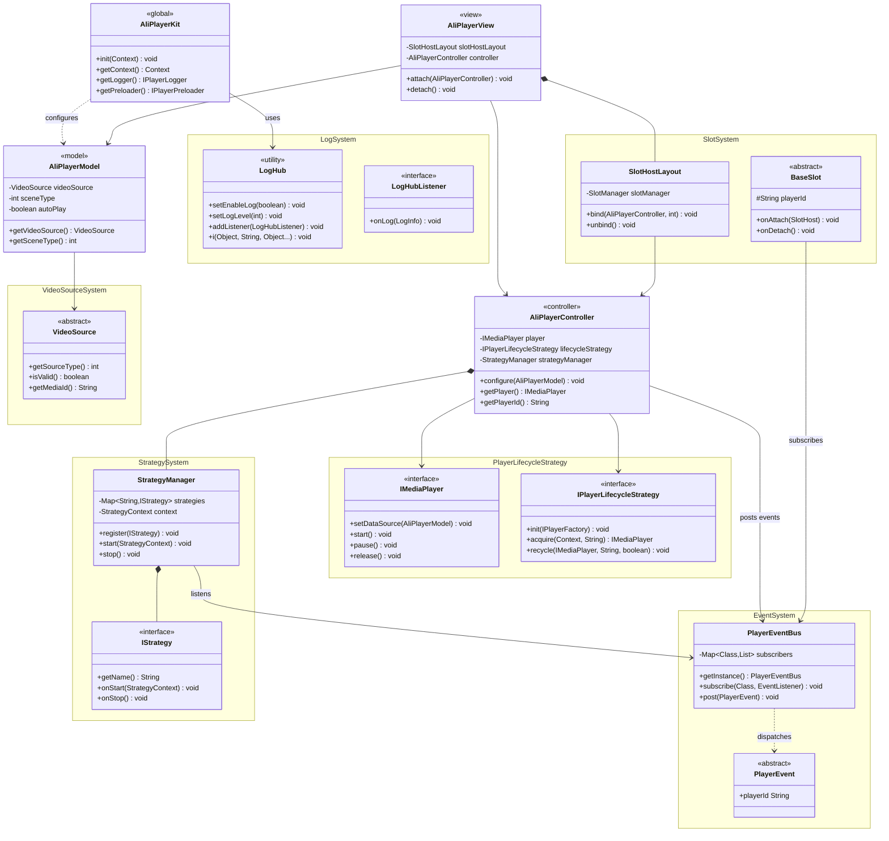

> 📚 **Recommended Reading Path**
>
> **Core Features** → [Integration](./Integration-EN.md) → [Quick Start](./QuickStart-EN.md) → [API Reference](./ApiReference-EN.md)

---

# **AliPlayerKit Core Features**

**AliPlayerKit** is a business-oriented set of **low-code player UI components** and **scenario-based solutions**.

By encapsulating player capabilities and UI interactions at a high level, AliPlayerKit helps clients quickly build in-app video playback with minimal integration effort — no need to call low-level player APIs directly or implement complex player UI yourself.

---

## **1. Product Positioning**

### **1.1 Design Goals**

AliPlayerKit is not just designed as a set of player UI components — it is positioned as a **general-purpose playback architecture layer**:

| Design Goal | Description |
|---------|------|
| **Low-code Integration** | Integrate complete playback scenarios with minimal code |
| **Multi-scenario Coverage** | Cover diverse playback scenarios including VOD, live streaming, and short video |
| **Reusable Architecture** | Avoid duplicate development of player capabilities across business lines through the slot + strategy architecture |
| **Unified Foundation** | Serve as the unified foundation for all player solutions and scenario-based solutions |

### **1.2 Architectural Layers**

In terms of architecture, **AliPlayerKit sits on top of the player core**, providing a unified UI component system and playback scenario abstraction to host the common capabilities of various playback businesses:

| Layer | Positioning | Module Location | Responsibilities |
| ---------- | -------------- | ------------------- | ------------------------------------------------------------ |
| **Component Layer** | Player UI Components | `playerkit/` | Provides out-of-the-box, configurable player UI components covering basic playback and common interactions. |
| **Scene Layer** | Scenario-based Solutions | `playerkit-scenes/` | Provides standardized integration examples for typical scenarios such as short drama, medium/long video, and live streaming, helping clients rapidly build complete playback capabilities with minimal code. |

---

## **2. Core Architecture**

**AliPlayerKit adopts a "3 + 1" core architecture design to build the player framework:**

- **3 runtime interfaces**: Following the **MVC architectural pattern** to achieve separation and decoupling between UI presentation, playback control, and data configuration
  - `AliPlayerView`: Player UI component, responsible for view rendering and user interaction (View)
  - `AliPlayerController`: Playback control component, responsible for playback logic and state management (Controller)
  - `AliPlayerModel`: Data model component, encapsulates player configuration and media information (Model)
- **1 global interface**: Provides framework initialization and global capability management as the unified entry point of the player framework
  - `AliPlayerKit`: Responsible for framework initialization, providing global configuration, log management, preloading, and other foundational capabilities

### **2.1 Architecture Design**

AliPlayerKit adopts the classic **MVC architecture**, splitting the player into independent components:

### **2.2 Component Responsibilities**

| Component | Type | Responsibilities | Lifecycle |
|-----|------|------|---------|
| `AliPlayerKit` | Global Entry | Global configuration, cache management, version information | Application-level |
| `AliPlayerView` | View | UI presentation, slot management, lifecycle binding | Page-level |
| `AliPlayerController` | Controller | Playback control, state management, event dispatching | Page-level |
| `AliPlayerModel` | Model | Configuration data encapsulation, Builder pattern | Request-level |

### **2.3 Core APIs**

The core APIs that each player instance needs to invoke:

| API | Description |
|-----|------|
| `new AliPlayerController(Context)` | Create a controller |
| `new AliPlayerModel.Builder()...build()` | Build the data model |
| `controller.configure(model)` | Configure playback data |
| `AliPlayerView.attach(controller)` | Bind a controller |
| `AliPlayerView.detach()` | Unbind the UI |
| `controller.destroy()` | Release player resources |
| `AliPlayerView.onBackPressed()` | Handle the back-press event (optional) |

> **Detailed API Reference**: For the complete method list and parameter descriptions of each component, see [API Reference](./ApiReference-EN.md).

### **2.4 Core Class Diagram**

### **2.5 Call Sequence**

The complete invocation flow of the core APIs, covering the full lifecycle from creation, binding, playback to release:

> **Quick Onboarding**: See [Quick Start](./QuickStart-EN.md) for the full integration steps.

---

## **3. Core Capabilities**

### **3.1 Slot System**

The **Slot System** breaks the player UI down into independent slot components, each responsible for a specific part of the interface — such as the top control bar, bottom progress bar, cover image, etc. Developers can freely assemble them like building blocks: integrate quickly with the default UI, replace specific components on demand, or fully customize the entire interface.

UI components are completely decoupled from the player core; customization no longer means modifying the source code, and upgrades no longer have to worry about code conflicts. Different playback scenarios can reuse the same slot components, reducing duplicate development.

For details, see [Slot System](./advanced/SlotSystem-EN.md).

### **3.2 Strategy System**

The **Strategy System** encapsulates the player's business logic into independent strategy components, each carrying a clear responsibility — such as first-frame timing statistics, stuttering detection, traffic protection, memory playback, etc.

Business teams can extend at the strategy layer without intruding into the framework core. Each strategy has a single responsibility and is isolated from others; strategies can be reused across player instances and enabled or disabled on demand. Framework upgrades and business customizations operate independently and do not interfere with each other.

For details, see [Strategy System](./advanced/StrategySystem-EN.md).

### **3.3 Event System**

The **Event System** is the communication architecture of AliPlayerKit. It uses the publish-subscribe pattern to fully decouple components. UI components subscribe to events of interest and send required commands without holding controller references; controllers handle commands and publish state without caring who is listening.

This design allows UI components and business logic to be developed, tested, and maintained independently. Each event carries a playerId, naturally supporting event isolation across multiple player instances.

For details, see [Event System](./advanced/EventSystem-EN.md).

### **3.4 Player Lifecycle Strategy**

The **Player Lifecycle Strategy** unifies the management of player instance creation, reuse, recycling, and destruction. Four built-in strategies — Default, Singleton, ReusePool, and IdScopedPool — are provided to fit common scenarios, single-player scenarios, list playback scenarios, and preloading scenarios respectively.

Developers don't need to worry about the underlying implementation details — simply choose an appropriate strategy to strike the best balance between performance and resources. For example, in a short video list scenario, using the ReusePool strategy to reuse instances can significantly improve scrolling smoothness and first-frame speed.

For details, see [Player Lifecycle Strategy](./advanced/PlayerLifecycleStrategy-EN.md).

### **3.5 Log System**

The **Log System** provides a unified logging center, LogHub, supporting multi-level output, level filtering, and listener extensions. Every key step during player runtime is traceable, providing support for issue diagnosis and performance analysis.

During development, you can enable verbose logs to assist debugging; in production, you can streamline output. You can also use listeners to write logs to a file or report them to a server, making it easy to provide them to the technical support team during troubleshooting.

For details, see [Log System](./advanced/LogSystem-EN.md).

### **3.6 Multi Video Source Support**

AliPlayerKit supports multiple video source types, **with VidAuth being the recommended approach**:

| Source Type | Creation Method | Use Case |
|-------|---------|---------|
| VidAuth Source | `VideoSourceFactory.createVidAuthSource(...)` | Recommended approach for ApsaraVideo for VOD (recommended) |
| VidSts Source | `VideoSourceFactory.createVidStsSource(...)` | Alibaba Cloud STS temporary credential approach |
| URL Source | `VideoSourceFactory.createUrlSource(url)` | Live streaming or simple scenarios |

For details, see [Multi Video Source Support](./advanced/VideoSource-EN.md).

### **3.7 Custom Config**

**Custom Config** provides a two-layer configuration mechanism, allowing developers to inject custom SDK configurations at key timings without modifying the framework source code, enabling fine-grained tuning at the global or instance level.

| Layer | Registration | Trigger Timing | Typical Use Cases |
|------|---------|---------|----------|
| Global | `AliPlayerKit.setOnGlobalInit()` | After `init()` completes (only once) | setOption, global log level |
| Instance | `AliPlayerModel.Builder.onPlayerConfig()` | Inside `configure()`, before `prepare()` | setPlayConfig, Referer |

For details, see [Custom Config](./advanced/CustomConfig-EN.md).

---

Through the introduction above, you now have an understanding of the core components and overall architecture design of AliPlayerKit.

Next, you can refer to **[Integration](./Integration-EN.md)** to integrate AliPlayerKit into your project.
