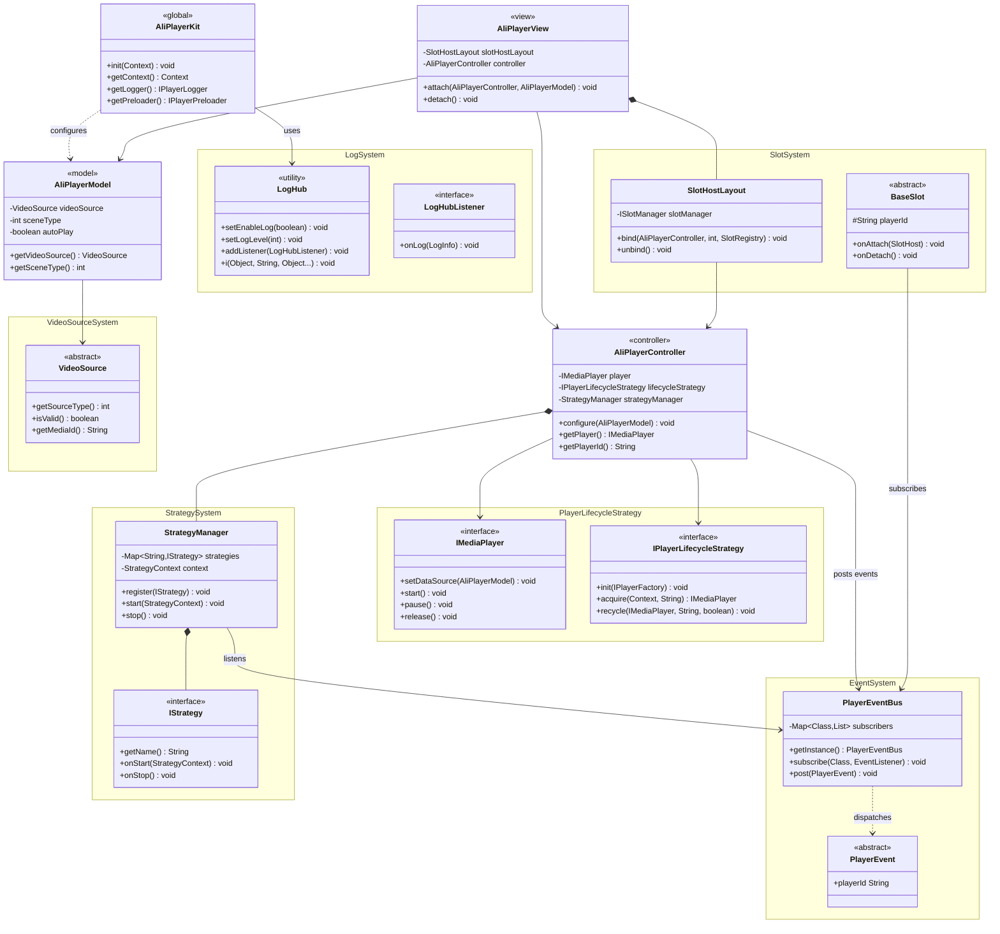

Language: 中文简体 | [English](CoreFeatures-EN.md)

> 📚 **推荐阅读路径**
>
> **核心能力** → [集成准备](./Integration.md) → [快速开始](./QuickStart.md) → [API 参考](./ApiReference.md)

---

# **AliPlayerKit 核心能力**

**AliPlayerKit** 是一套面向业务的 **低代码播放器 UI 组件** 与 **场景化解决方案**。

通过对播放器能力和 UI 交互的高度封装，AliPlayerKit 帮助客户以极低的接入成本快速完成 App 播放能力建设，无需直接调用底层播放器 API，也无需自行实现复杂的播放器 UI。

---

## **1. 产品定位**

### **1.1 设计目标**

AliPlayerKit 的设计目标并不仅限于播放器 UI 组件，而是将其定位为**播放通用架构层**来建设：

| 设计目标 | 说明 |
|---------|------|
| **低代码接入** | 通过少量代码即可接入完整播放场景 |
| **多场景覆盖** | 覆盖点播、直播、短视频等多种播放场景 |
| **可复用架构** | 通过插槽 + 策略架构，避免各业务重复建设播放器能力 |
| **统一基座** | 作为所有播放器解决方案和场景化解决方案的统一基座 |

### **1.2 架构层级**

在架构层级上，**AliPlayerKit 位于播放器内核之上**，通过统一的 UI 组件体系与播放场景抽象，承载不同播放业务的共性能力：

| 层级       | 定位           | 模块位置            | 职责                                                         |
| ---------- | -------------- | ------------------- | ------------------------------------------------------------ |
| **组件层** | 播放器 UI 组件 | `playerkit/`        | 提供开箱即用、可配置的播放器 UI 组件，覆盖基础播放与常见交互能力。 |
| **场景层** | 场景化解决方案 | `playerkit-scenes/` | 围绕短剧、中长视频、直播等典型场景，提供标准化接入示例，帮助客户以少量代码快速搭建完整播放能力。 |

---

## **2. 核心架构**

**AliPlayerKit 采用「3 + 1」核心架构设计构建播放器框架：**

- **3 个运行时接口**：遵循 **MVC 架构模式**，实现 UI 展示、播放控制与数据配置的职责分层与解耦
  - `AliPlayerView`：播放器 UI 组件，负责界面渲染与用户交互（View）
  - `AliPlayerController`：播放控制组件，负责播放逻辑与状态管理（Controller）
  - `AliPlayerModel`：数据模型组件，封装播放器的播放配置与媒体信息（Model）
- **1 个全局接口**：提供框架初始化与全局能力管理，是播放器框架的统一入口
  - `AliPlayerKit`：负责框架初始化，并提供全局配置、日志管理、预加载等基础能力

### **2.1 架构设计**

AliPlayerKit 采用经典的 **MVC 架构**，将播放器拆分为独立的组件：

### **2.2 组件职责**

| 组件 | 类型 | 职责 | 生命周期 |
|-----|------|------|---------|
| `AliPlayerKit` | 全局入口 | 全局配置、缓存管理、版本信息 | 应用级 |
| `AliPlayerView` | View | UI 展示、插槽管理、生命周期绑定 | 页面级 |
| `AliPlayerController` | Controller | 播放控制、状态管理、事件分发 | 页面级 |
| `AliPlayerModel` | Model | 配置数据封装、Builder 模式 | 请求级 |

### **2.3 核心接口**

每个播放器实例需要调用的核心接口：

| 接口 | 说明 |
|-----|------|
| `new AliPlayerController(Context)` | 创建控制器 |
| `new AliPlayerModel.Builder()...build()` | 构建数据模型 |
| `AliPlayerView.attach(controller, model)` | 绑定控制器和数据 |
| `AliPlayerView.detach()` | 解绑并释放资源 |
| `AliPlayerView.onBackPressed()` | 处理返回键事件（可选） |

> **详细 API 说明**：各组件的完整方法列表和参数说明，请参阅 [API 参考](./ApiReference.md)。

### **2.4 核心类图**

### **2.5 调用时序**

核心接口的完整调用流程，涵盖从创建、绑定、播放到释放的全生命周期：

> **快速接入**：完整接入步骤请参阅 [快速开始](./QuickStart.md)。

---

## **3. 核心能力**

### **3.1 插槽系统**

**插槽系统** 将播放器 UI 拆分为独立的插槽组件，每个插槽负责界面的一部分功能，如顶部控制栏、底部进度条、封面图等。开发者可以像搭积木一样自由组合：使用默认界面快速接入，或按需替换特定组件，甚至完全自定义整个界面。

UI 组件与播放器核心彻底解耦，定制不再意味着修改源码，升级也无需担心代码冲突。不同播放场景可以复用相同的插槽组件，减少重复开发。

详见 [插槽系统](./advanced/SlotSystem.md)。

### **3.2 策略系统**

**策略系统** 将播放器的业务逻辑封装为独立的策略组件，每个策略承载一个明确的功能，如首帧耗时统计、卡顿检测、流量保护、记忆播放等。

业务方可以在策略层进行扩展，而无需侵入框架核心。每个策略职责单一、相互隔离，既可以在不同播放器实例间复用，也支持按需启用或禁用。框架升级与业务定制各行其道，互不干扰。

详见 [策略系统](./advanced/StrategySystem.md)。

### **3.3 事件系统**

**事件系统** 是 AliPlayerKit 的通信架构，采用发布-订阅模式实现组件间的完全解耦。UI 组件订阅关心的事件、发送需要的命令，无需持有控制器引用；控制器处理命令、发布状态，无需关心谁在监听。

这种设计使 UI 组件与业务逻辑可以独立开发、测试和维护。每个事件都携带 playerId，天然支持多播放器实例的事件隔离。

详见 [事件系统](./advanced/EventSystem.md)。

### **3.4 播放器生命周期策略**

**播放器生命周期策略** 对播放器实例的创建、复用、回收与销毁进行统一管理。内置 Default、Singleton、ReusePool、IdScopedPool 四种策略，分别适配通用场景、单播放器场景、列表播放场景和预加载场景。

开发者无需关心底层实现细节，只需选择合适的策略，即可在性能与资源之间取得最佳平衡。例如，短视频列表场景下使用 ReusePool 策略复用实例，可显著提升滑动流畅度和首帧速度。

详见 [播放器生命周期策略](./advanced/PlayerLifecycleStrategy.md)。

### **3.5 日志系统**

**日志系统** 提供统一的日志中心 LogHub，支持多级别输出、级别过滤、监听器扩展等能力。播放器运行时的每一个关键节点都有迹可循，为问题定位和性能分析提供支持。

开发阶段可以开启详细日志辅助调试，生产环境可以精简输出。还可以通过监听器将日志写入文件或上报服务器，便于问题排查时提供给技术支持团队。

详见 [日志系统](./advanced/LogSystem.md)。

### **3.6 多视频源支持**

AliPlayerKit 支持多种视频源类型，**推荐使用 VidAuth 方式**：

| 源类型 | 创建方法 | 适用场景 |
|-------|---------|---------|
| VidAuth 源 | `VideoSourceFactory.createVidAuthSource(...)` | 阿里云点播推荐方式（推荐） |
| VidSts 源 | `VideoSourceFactory.createVidStsSource(...)` | 阿里云 STS 临时凭证方式 |
| URL 源 | `VideoSourceFactory.createUrlSource(url)` | 直播或简单场景 |

详见 [多视频源支持](./advanced/VideoSource.md)。

---

通过以上介绍，您已经了解了 AliPlayerKit 的核心组件和整体架构设计。

接下来，您可以参考 **[集成准备](./Integration.md)**，将 AliPlayerKit 集成到您的项目中。

