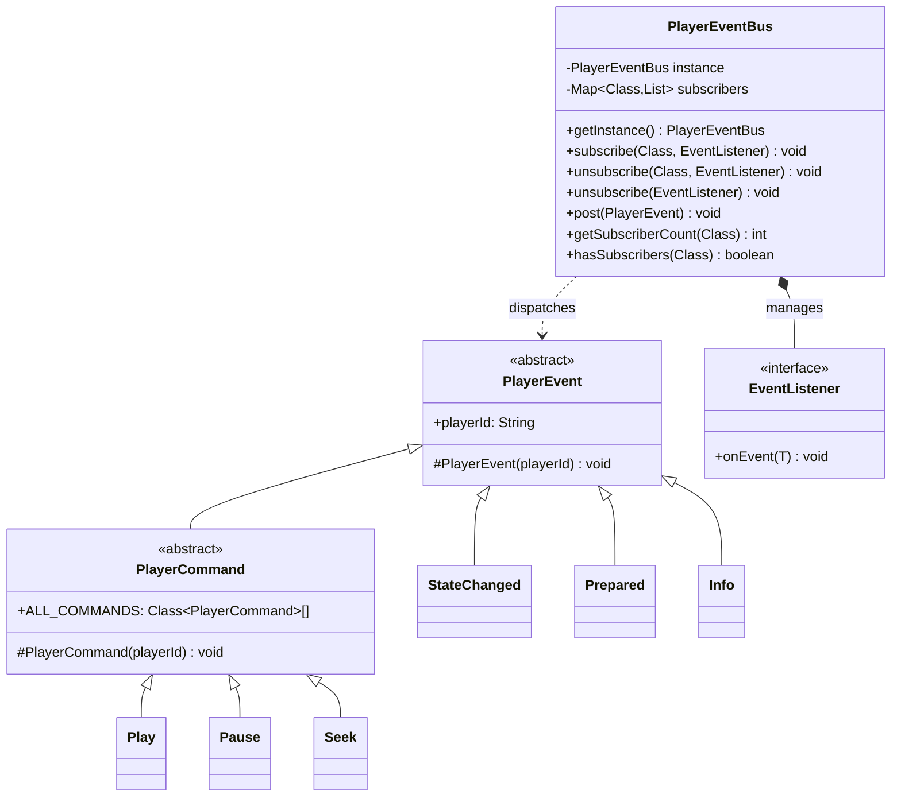
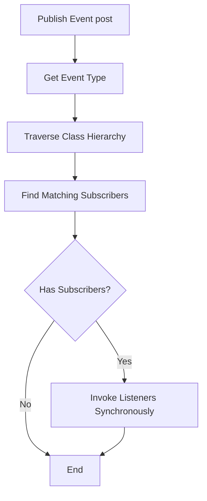

# **Event System**

The **Event System** is the communication architecture of AliPlayerKit. It uses a publish-subscribe pattern to fully decouple player components, allowing UI components and business logic to be developed, tested, and maintained independently, while supporting event isolation across multiple player instances.

---

## **1. Concept Introduction**

### **1.1 What Is an Event?**

An **Event** is a state change or behavior notification produced during player operation. Each event carries a player ID (`playerId`) used to identify the event source, enabling event isolation across multiple player instances.

Events in AliPlayerKit fall into two categories:

| Type | Description | Examples |
|------|-------------|----------|
| **State Event** | Notifications of player state changes, produced internally by the player | `StateChanged`, `Prepared`, `Error` |
| **Command Event** | Instructions to control player behavior, produced by UI or external components | `Play`, `Pause`, `Seek`, `SetSpeed` |

All events extend the `PlayerEvent` base class, ensuring a uniform event structure.

### **1.2 What Is the Event System?**

The **Event System** is the communication architecture used to manage event subscription and publishing. Its core component is `PlayerEventBus`.

It provides the following capabilities:

- **Type-safe Subscription**: Subscribe by event type, with compile-time type safety guarantees.
- **Thread Safety**: Supports event publishing and subscription in multi-threaded environments.
- **Weak Reference Management**: Listeners are stored using weak references; recycled subscribers are cleaned up automatically.
- **Event Isolation**: Achieves event isolation across multiple player instances via `playerId`.

Through the Event System, the player's UI components (Slots) and Controllers are completely decoupled: the UI is only responsible for sending commands and subscribing to state changes, without caring how commands are executed; the Controller is only responsible for handling commands and publishing state changes, without caring who is listening.

---

## **2. Features**

### **2.1 Problems Solved**

- Direct dependencies between components lead to high coupling, making components hard to replace and test.
- Events get tangled in multi-player scenarios, making it difficult to distinguish their sources.
- UI components and business logic are mixed together with unclear responsibilities.

### **2.2 Core Value**

The Event System standardizes inter-component communication. Developers can choose how to use it:

| Usage | Description | Advantage |
|-------|-------------|-----------|
| Subscribe to Events | Listen for player state changes | Decouples UI from business logic; reactive UI updates |
| Send Commands | Control player behavior | UI does not need to hold a Controller reference; imperative interaction |
| Custom Events | Extend event types | Meets specific business needs while keeping architecture consistent |

**Architectural Advantages**:

- **Decoupling**: Components communicate via events with no direct dependencies.
- **Testability**: Components can be tested independently by simulating event interactions.
- **Extensibility**: Custom event types can be added without modifying framework code.
- **Thread Safety**: Multi-threaded environments are supported with no extra synchronization required.

### **2.3 Core Capabilities**

| Capability | Description |
|------------|-------------|
| Type-safe Subscription | Subscribe by event type with compile-time type checking |
| Weak Reference Management | Automatically cleans up recycled listeners to prevent memory leaks |
| Event Inheritance Support | Subscribing to a parent event type also receives child events |
| Multi-player Isolation | Distinguishes events from different players via `playerId` |

---

## **3. Event Categories**

### **3.1 Player Events (PlayerEvents)**

State change events produced internally by the player to notify external components of the player state.

| Event | Description | Carried Data |
|-------|-------------|--------------|
| `Prepared` | Player has finished preparing | `duration` total video duration |
| `FirstFrameRendered` | First frame has been rendered | - |
| `StateChanged` | Playback state has changed | `oldState`, `newState` |
| `VideoSizeChanged` | Video size has changed | `width`, `height` |
| `Info` | Playback progress update | `currentPosition`, `duration`, `bufferedPosition` |
| `Error` | Playback error | `errorCode`, `errorMsg` |
| `LoadingBegin` | Buffering started | - |
| `LoadingProgress` | Buffering progress | `percent`, `netSpeed` |
| `LoadingEnd` | Buffering ended | - |
| `SetSpeedCompleted` | Playback speed change completed | `speed` |
| `SnapshotCompleted` | Snapshot completed | `result`, `snapshotPath`, `width`, `height` |
| `SetLoopCompleted` | Loop setting completed | `loop` |
| `SetMuteCompleted` | Mute setting completed | `mute` |
| `SetScaleTypeCompleted` | Scale type setting completed | `scaleType` |
| `SetMirrorTypeCompleted` | Mirror setting completed | `mirrorType` |
| `SetRotationCompleted` | Rotation setting completed | `rotation` |
| `TrackQualityListUpdated` | Quality list updated | `trackQualityList` |
| `TrackSelected` | Quality selection completed | `trackIndex` |

### **3.2 Player Commands (PlayerCommand)**

Command events used to control player behavior, sent by UI components or external code.

| Command | Description | Parameters |
|---------|-------------|------------|
| `Play` | Start playback | - |
| `Pause` | Pause playback | - |
| `Toggle` | Toggle play/pause | - |
| `Stop` | Stop playback | - |
| `Replay` | Replay | - |
| `Seek` | Seek to a specified position | `position` target position (ms) |
| `SetSpeed` | Set playback speed | `speed` playback speed (0.3-3.0) |
| `Snapshot` | Take a snapshot | - |
| `SetLoop` | Set loop playback | `loop` whether to loop |
| `SetMute` | Set mute | `mute` whether to mute |
| `SetScaleType` | Set scale type | `scaleType` scale type |
| `SetMirrorType` | Set mirror | `mirrorType` mirror mode |
| `SetRotation` | Set rotation | `rotationMode` rotation angle |
| `SelectTrack` | Switch quality | `trackQuality` target quality |

### **3.3 Gesture Events (GestureEvents)**

Events produced by user gestures, describing the gesture itself without business logic.

| Event | Description | Carried Data |
|-------|-------------|--------------|
| `SingleTapEvent` | Single tap | `x`, `y` tap coordinates |
| `DoubleTapEvent` | Double tap | `x`, `y` tap coordinates |
| `LongPressEvent` | Long press start | `x`, `y` long-press coordinates |
| `LongPressEndEvent` | Long press end | - |
| `HorizontalDragStartEvent` | Horizontal drag start | `startX`, `startY` |
| `HorizontalDragUpdateEvent` | Horizontal drag update | `deltaPercent` delta percentage |
| `HorizontalDragEndEvent` | Horizontal drag end | - |
| `LeftVerticalDragStartEvent` | Left vertical drag start | `startX`, `startY` |
| `LeftVerticalDragUpdateEvent` | Left vertical drag update | `deltaPercent`, `currentPercent` |
| `LeftVerticalDragEndEvent` | Left vertical drag end | - |
| `RightVerticalDragStartEvent` | Right vertical drag start | `startX`, `startY` |
| `RightVerticalDragUpdateEvent` | Right vertical drag update | `deltaPercent`, `currentPercent` |
| `RightVerticalDragEndEvent` | Right vertical drag end | - |

### **3.4 Control Bar Events (ControlBarEvents)**

Control bar visibility synchronization events.

| Event | Description |
|-------|-------------|
| `Show` | Show control bar |
| `Hide` | Hide control bar |
| `ResetTimer` | Reset auto-hide timer |
| `ShowSettings` | Show settings UI |

### **3.5 Fullscreen Events (FullscreenEvents)**

Fullscreen mode toggle events.

| Event | Description |
|-------|-------------|
| `Toggle` | Toggle fullscreen state |

### **3.6 Player Lifecycle Events (PlayerLifecycleEvents)**

Player lifecycle strategy events used to observe player instance creation, reuse, destruction, etc.

| Event | Description |
|-------|-------------|
| `PlayerCreated` | A new player instance is created |
| `PlayerDestroyed` | A player instance is destroyed |
| `PlayerReused` | An idle player instance is reused |
| `PlayerHit` | An active player instance is hit |
| `PlayerEvicted` | A player instance is evicted |

### **3.7 Slot Events (SlotEvents)**

Events produced internally by Slots.

| Event | Description |
|-------|-------------|
| `TopBarBackClicked` | Top-bar back button clicked |

---

## **4. Basic Usage**

The Event System provides two usage strategies:

| Strategy | Description | Applicable Scenarios |
|----------|-------------|----------------------|
| Strategy 1: Subscribe to Events | Listen for player state changes | UI updates, business logic responses |
| Strategy 2: Send Commands | Control player behavior | User interactions, external control |

### **4.1 Strategy 1: Subscribe to Events**

Subscribing to events takes three steps: get the event bus, create a listener, and subscribe to the event.

```java
public class MyActivity extends AppCompatActivity {

    private PlayerEventBus mEventBus;
    private PlayerEventBus.EventListener<PlayerEvents.Info> mInfoListener;

    @Override
    protected void onCreate(Bundle savedInstanceState) {
        super.onCreate(savedInstanceState);

        // 1. Get the event bus singleton
        mEventBus = PlayerEventBus.getInstance();

        // 2. Create a listener
        mInfoListener = event -> {
            // Handle playback progress updates
            long position = event.currentPosition;
            long duration = event.duration;
            updateProgressUI(position, duration);
        };

        // 3. Subscribe to the event
        mEventBus.subscribe(PlayerEvents.Info.class, mInfoListener);
    }

    @Override
    protected void onDestroy() {
        super.onDestroy();
        // 4. Unsubscribe to avoid memory leaks
        if (mEventBus != null && mInfoListener != null) {
            mEventBus.unsubscribe(PlayerEvents.Info.class, mInfoListener);
        }
    }
}
```

### **4.2 Strategy 2: Send Commands**

Commands are sent through the event bus's `post()` method:

```java
// 1. Get the event bus singleton
PlayerEventBus eventBus = PlayerEventBus.getInstance();

// 2. Get the target player ID
// [Scenario A: Inside a Slot] Use the inherited mechanism directly
// String playerId = getPlayerId();
// [Scenario B: In an Activity/Fragment] Get it from your Controller
String playerId = mAliPlayerKitController.getPlayer().getPlayerId();

// 3. Publish the command (the Controller bound to that playerId will execute synchronously)
eventBus.post(new PlayerCommand.Play(playerId));

// Other common command examples:
eventBus.post(new PlayerCommand.Pause(playerId));               // Pause playback
eventBus.post(new PlayerCommand.Toggle(playerId));              // Toggle play/pause state
eventBus.post(new PlayerCommand.Seek(playerId, 30000));         // Seek precisely to 30 s
eventBus.post(new PlayerCommand.SetSpeed(playerId, 1.5f));      // Set 1.5x playback speed
```

---

## **5. Advanced Usage**

### **5.1 How to Use Events Inside a Slot?**

There are two ways to use events inside a Slot: subscribing to events and sending commands.

**Approach 1: Subscribe to Events (recommend using `observedEvents()`)**

`BaseSlot` provides `observedEvents()` and `onEvent()` methods; the framework automatically manages the subscription lifecycle:

```java
public class MySlot extends BaseSlot {

    // 1. Declare the event types to subscribe to
    @Override
    protected List<Class<? extends PlayerEvent>> observedEvents() {
        return Arrays.asList(
            PlayerEvents.StateChanged.class,
            PlayerEvents.Info.class
        );
    }

    // 2. Handle the event callback
    @Override
    protected void onEvent(@NonNull PlayerEvent event) {
        if (event instanceof PlayerEvents.StateChanged) {
            PlayerEvents.StateChanged stateChanged = (PlayerEvents.StateChanged) event;
            updatePlayPauseIcon(stateChanged.newState);
        } else if (event instanceof PlayerEvents.Info) {
            PlayerEvents.Info info = (PlayerEvents.Info) event;
            updateProgress(info.currentPosition, info.duration);
        }
    }
}
```

**Approach 2: Send Commands**

Inside a Slot, send commands via the `postEvent()` method:

```java
public class MySlot extends BaseSlot {

    private void onPlayPauseClick() {
        // Get playerId (available after onAttach)
        String playerId = getPlayerId();
        if (playerId != null) {
            // Send the toggle play/pause command
            postEvent(new PlayerCommand.Toggle(playerId));
        }
    }

    private void onSeekTo(long position) {
        String playerId = getPlayerId();
        if (playerId != null) {
            // Send the seek command
            postEvent(new PlayerCommand.Seek(playerId, position));
        }
    }
}
```

> 💡 **Detailed Documentation**: For full Slot usage, refer to the [Slot System Documentation](./SlotSystem-EN.md).

### **5.2 How to Use Events Inside a Strategy?**

Using events inside a Strategy is similar to using them in a Slot — subscribe and handle via `observedEvents()` and `onEvent()`. However, Strategies have these characteristics:

| Characteristic | Description |
|----------------|-------------|
| Mainly for Monitoring | A Strategy generally only subscribes to events for analysis and does not send commands |
| Event Filtering Required | In multi-player scenarios you must filter via `isCurrentPlayer(event)` |
| Context Access | Access player state and data via `StrategyContext` |

**Example Code**:

```java
public class MyAnalyticsStrategy extends BaseStrategy {

    @Nullable
    @Override
    protected List<Class<? extends PlayerEvent>> observedEvents() {
        return Arrays.asList(
            PlayerEvents.StateChanged.class,
            PlayerEvents.Info.class
        );
    }

    @Override
    public void onEvent(@NonNull PlayerEvent event) {
        // ✅ Must filter event source to avoid cross-talk between players
        if (!isCurrentPlayer(event)) return;

        if (event instanceof PlayerEvents.StateChanged) {
            // Handle state change
            PlayerEvents.StateChanged stateChanged = (PlayerEvents.StateChanged) event;
            logState(stateChanged.newState);
        } else if (event instanceof PlayerEvents.Info) {
            // Handle playback progress
            PlayerEvents.Info info = (PlayerEvents.Info) event;
            trackProgress(info.currentPosition, info.duration);
        }
    }
}
```

> 💡 **Detailed Documentation**: For full Strategy usage, refer to the [Strategy System Documentation](./StrategySystem-EN.md).

### **5.3 How to Implement a Custom Event?**

When the business needs custom events, extend `PlayerEvent` to create a new event type.

**Step by Step**:

1. **Create the Event Class**

   Extend `PlayerEvent` and add the data fields required by your business:

   ```java
   /**
    * Custom player event
    */
   public class MyCustomEvent extends PlayerEvent {

       /**
        * Custom data field
        */
       public final String customData;

       /**
        * Constructor
        *
        * @param playerId player ID
        * @param customData custom data
        */
       public MyCustomEvent(@NonNull String playerId, @NonNull String customData) {
           super(playerId);
           this.customData = customData;
       }
   }
   ```

2. **Publish the Event**

   ```java
   // Create and publish the event
   MyCustomEvent event = new MyCustomEvent(playerId, "custom_data");
   PlayerEventBus.getInstance().post(event);
   ```

3. **Subscribe to the Custom Event**

   ```java
   // Subscribe to the custom event
   PlayerEventBus.getInstance().subscribe(MyCustomEvent.class, event -> {
       // Handle the custom event
       String data = event.customData;
   });
   ```

### **5.4 How to Achieve Multi-Player Event Isolation?**

Every event carries a `playerId`. Use it to isolate events between players:

```java
// Filter by playerId when subscribing
mEventBus.subscribe(PlayerEvents.Info.class, event -> {
    // Only handle events from the current player
    if (mPlayerId.equals(event.playerId)) {
        updateProgress(event.currentPosition, event.duration);
    }
});
```

### **5.5 How to Subscribe to Commands in Bulk?**

`PlayerCommand` provides the `ALL_COMMANDS` array for bulk subscription:

```java
// Bulk subscribe to all player commands
for (Class<? extends PlayerCommand> commandClass : PlayerCommand.ALL_COMMANDS) {
    mEventBus.subscribe(commandClass, mCommandListener);
}

// Bulk unsubscribe
for (Class<? extends PlayerCommand> commandClass : PlayerCommand.ALL_COMMANDS) {
    mEventBus.unsubscribe(commandClass, mCommandListener);
}
```

---

## **6. Best Practices**

### **6.1 Subscription Lifecycle Management**

| Scenario | Recommended Practice | Reason |
|----------|----------------------|--------|
| Activity/Fragment | Unsubscribe in `onDestroy()` | Avoid Activity leaks |
| Inside a Slot | Use `observedEvents()` for automatic management | The framework handles the lifecycle |
| Singleton Components | Use weak references or manage manually | Singletons are long-lived; clean up actively |

### **6.2 Thread Safety**

Event dispatch executes synchronously on the calling thread. Pay attention to the following:

```java
// Subscribed on the main thread; the callback runs on the main thread too
runOnUiThread(() -> {
    mEventBus.subscribe(PlayerEvents.Info.class, event -> {
        // The callback runs on the thread that publishes the event.
        // If you publish from a worker thread, switch to the main thread to update UI.
        runOnUiThread(() -> updateUI(event));
    });
});
```

### **6.3 Command Timing**

| Command | Recommended Timing | Description |
|---------|--------------------|-------------|
| `Play`/`Pause`/`Toggle` | Anytime | Safe commands with no side effects |
| `Seek` | After the player is `Prepared` | Ensure the video is loaded |
| `SetSpeed` | While playing or paused | Ensure the player is initialized |
| `Snapshot` | After the first frame is rendered | Ensure there is something to snapshot |

### **6.4 Notes**

- **Do not subscribe to events in the constructor**: The object is not yet fully initialized, leading to NPE risks.
- **Do not send events in the constructor**: The `playerId` may not have been injected by the framework yet.
- **Always use the same listener instance when unsubscribing**: Matching is reference-based, so the object reference must match.
- **Avoid time-consuming operations in event callbacks**: Event dispatch is **same-thread, synchronous, and blocking**. I/O or long computations will severely stall the dispatch chain and even the main thread.
- **❗ Performance Red Line for High-Frequency Events**:
  - **Characteristics**: `PlayerEvents.Info` (playback progress), `LoadingProgress`, and the Update-series of `GestureEvents` fire at very high frequencies (potentially dozens of times per second).
  - **Recommendation**: In such callbacks, **never** perform frequent memory allocations (e.g., `new String()`), heavy layout updates, or `requestLayout`. Reuse objects and apply **throttle** and **same-value filtering** strategies at the UI layer to avoid useless redraws.

---

## **7. Sample Reference**

The project provides a complete sample at `playerkit-examples/example-event-system`.

### **7.1 Sample Features**

| Feature | Description |
|---------|-------------|
| Subscribe to playback progress | Receive `PlayerEvents.Info` events in real time |
| Send playback commands | Control play/pause via `PlayerCommand.Toggle` |
| Event log display | Show the last 20 event entries |

### **7.2 Run the Sample**

In the Demo App, select the "Event System" sample to view the effect.

---

## **8. API Reference**

### **8.1 Class Structure**



### **8.2 Core Interfaces**

| Interface/Class | Description |
|-----------------|-------------|
| `PlayerEvent` | The event base class; all events inherit from it |
| `PlayerCommand` | The command base class; all commands inherit from it |
| `PlayerEventBus` | The event bus that manages subscription and publishing |
| `EventListener<T>` | The event listener interface |

### **8.3 PlayerEventBus Methods**

| Method | Description |
|--------|-------------|
| `getInstance()` | Get the event bus singleton |
| `subscribe(eventType, listener)` | Subscribe to events of the specified type |
| `unsubscribe(eventType, listener)` | Unsubscribe from events of the specified type |
| `unsubscribe(listener)` | Unsubscribe the specified listener from all subscriptions |
| `post(event)` | Publish an event |
| `getSubscriberCount(eventType)` | Get the subscriber count for the specified event type |
| `hasSubscribers(eventType)` | Check whether there are subscribers |
| `unsubscribeAll()` | Clear all subscriptions (use with caution) |

---

## **9. Technical Principles**

### **9.1 Event Dispatch Flow**



### **9.2 Weak Reference Mechanism**

The event bus stores listeners with `WeakReference`, providing the following advantages:

- **Auto Cleanup**: Once a listener is GC'd, it is automatically removed from the subscription list.
- **Leak Prevention**: Even if you forget to unsubscribe, severe leaks won't occur.
- **Safe Access**: The weak reference's validity is checked before each dispatch.

```java
// Listeners stored with weak references
List<WeakReference<EventListener<? extends PlayerEvent>>> listeners;

// Validity check before dispatching
for (WeakReference<EventListener> ref : listeners) {
    EventListener listener = ref.get();
    if (listener != null) {
        listener.onEvent(event);  // Invoke if still valid
    } else {
        listeners.remove(ref);  // Remove if invalid
    }
}
```

### **9.3 Unidirectional Data Flow and State Sync Closed Loop**

The Event System primarily handles "**transient notifications**". Combined with the PlayerStateStore, it forms a strict Unidirectional Data Flow (UDF) architecture:

```
┌──────────────────────────────────────────────────────────┐
│                  State Sync Closed Loop                  │
│                                                          │
│  ┌──────────┐    Command     ┌────────────────┐          │
│  │   UI     │ ──────────────▶│  Controller    │          │
│  │  (Slot)  │                │ (Source of     │          │
│  │          │ ◀──────────────│  Truth)        │          │
│  └────┬─────┘     Event      └───────┬────────┘          │
│       │                              │                    │
│       │      ┌───────────────────────┘                    │
│       │      │                                             │
│       │      ▼ (Pull when events are missed)              │
│       │  SlotHost.getPlayerStateStore()                   │
│       │  ├─ getPlayState()        Current play state     │
│       │  ├─ getCurrentPosition()  Current position       │
│       │  └─ getDuration()         Total duration         │
│       └─────────────────────────────────────────────────┐ │
│                                                          │
└──────────────────────────────────────────────────────────┘
```

**Data Flow**:

| Direction | Mechanism | Description |
|-----------|-----------|-------------|
| **Command Up** | UI → Controller | Slot sends command events to control player behavior |
| **State Down** | Controller → UI | Controller publishes state-change events to notify Slots |
| **State Pull** | UI → StateStore | Slot actively pulls the current state (compensation mechanism) |

**Why Is State Pulling Needed?**

Events are transient. A Slot may be attached after an event has already been published (late-binding scenario), missing earlier events. `getPlayerStateStore()` lets you get the player's current state without depending on subscription timing:

```java
@Override
public void onAttach(@NonNull SlotHost host) {
    super.onAttach(host);

    // Slot bound late and missed Prepared, StateChanged, etc.?
    // Actively pull the current state to initialize the UI.
    IPlayerStateStore stateStore = host.getPlayerStateStore();
    PlayerState currentState = stateStore.getPlayState();  // Current play state
    long position = stateStore.getCurrentPosition();       // Current position
    long duration = stateStore.getDuration();              // Total duration

    // Initialize the UI with the current state
    updatePlayPauseIcon(currentState);
    updateProgress(position, duration);
}
```

This architecture fully decouples the UI from the Controller: the UI does not need to hold a Controller reference — it just subscribes to events and sends commands; the Controller does not care who is listening — it just publishes events and processes commands.

### **9.4 Event Inheritance Support**

Subscribing to a parent event type also delivers all of its child events:

```java
// Subscribing to PlayerEvent receives all events
mEventBus.subscribe(PlayerEvent.class, event -> {
    // Receives all PlayerEvent subclass events
});

// Subscribing to PlayerCommand receives all commands
mEventBus.subscribe(PlayerCommand.class, event -> {
    // Receives all PlayerCommand subclass commands
});
```

---

## **10. FAQ**

### **10.1 Why Aren't Events Being Received?**

Check the following:

1. **Have you subscribed?** Confirm that `subscribe()` was called.
2. **Do the event types match?** The subscribed type must match the published type.
3. **Is the playerId correct?** Ensure the event's `playerId` matches.
4. **Has the listener been recycled?** Check whether the listener has been GC'd prematurely.

### **10.2 How to Debug Events?**

Use `LogHub` to view logs with the tag `PlayerEventBus`:

```java
// View subscription logs
// I/PlayerEventBus: Subscribed to Info

// View publish logs (verbose logging required)
// I/PlayerEventBus: Posted event: Info to 2 listeners
```

### **10.3 Common Crash Anti-Patterns**

The following are the most common pitfalls. Be sure to avoid them:

#### **Anti-Pattern 1: Forgetting to Unsubscribe Causes Memory Leaks**

**Bad Code**:

```java
public class MyActivity extends AppCompatActivity {

    @Override
    protected void onCreate(Bundle savedInstanceState) {
        super.onCreate(savedInstanceState);

        // ❌ Subscribed but never unsubscribed
        PlayerEventBus.getInstance().subscribe(PlayerEvents.Info.class, event -> {
            updateUI(event.currentPosition);  // Activity leaks!
        });
    }

    // No onDestroy unsubscription
}
```

**Crash Cause**: The lambda captures the Activity reference; without unsubscribing, the Activity cannot be released.

**Correct Code**:

```java
public class MyActivity extends AppCompatActivity {

    private PlayerEventBus.EventListener<PlayerEvents.Info> mListener;

    @Override
    protected void onCreate(Bundle savedInstanceState) {
        super.onCreate(savedInstanceState);

        mListener = event -> updateUI(event.currentPosition);
        PlayerEventBus.getInstance().subscribe(PlayerEvents.Info.class, mListener);
    }

    @Override
    protected void onDestroy() {
        super.onDestroy();
        // ✅ Must unsubscribe
        PlayerEventBus.getInstance().unsubscribe(PlayerEvents.Info.class, mListener);
    }
}
```

---

#### **Anti-Pattern 2: Subscribing to Events in a Constructor**

**Bad Code**:

```java
public class MyComponent {

    public MyComponent() {
        // ❌ Subscribed in the constructor; the object is not fully initialized
        PlayerEventBus.getInstance().subscribe(PlayerEvents.Info.class, event -> {
            // `this` may not be fully initialized at this point
        });
    }
}
```

**Crash Cause**: During constructor execution the object is not fully initialized, which can lead to NPEs or inconsistent state.

**Correct Approach**:

```java
public class MyComponent {

    private PlayerEventBus.EventListener<PlayerEvents.Info> mListener;

    public void init() {
        // ✅ Subscribe inside an init method
        mListener = event -> handleEvent(event);
        PlayerEventBus.getInstance().subscribe(PlayerEvents.Info.class, mListener);
    }

    public void destroy() {
        // Unsubscribe
        PlayerEventBus.getInstance().unsubscribe(PlayerEvents.Info.class, mListener);
    }
}
```

---

#### **Anti-Pattern 3: Sending Events in a Slot Constructor**

**Bad Code**:

```java
public class MySlot extends BaseSlot {

    public MySlot(Context context) {
        super(context);
        // ❌ playerId is not set in the constructor
        postEvent(new PlayerCommand.Toggle(getPlayerId()));  // getPlayerId() returns null!
    }
}
```

**Crash Cause**: `getPlayerId()` only returns a valid value after `onAttach()`; in the constructor it is `null`.

**Correct Approach**:

```java
public class MySlot extends BaseSlot {

    @Override
    public void onAttach(@NonNull SlotHost host) {
        super.onAttach(host);
        // ✅ Send events after onAttach
        String playerId = getPlayerId();
        if (playerId != null) {
            postEvent(new PlayerCommand.Toggle(playerId));
        }
    }
}
```

---

#### **Anti-Pattern 4: Time-Consuming Operations in Event Callbacks**

**Bad Code**:

```java
mEventBus.subscribe(PlayerEvents.Info.class, event -> {
    // ❌ Network request inside the callback blocks event dispatch
    String data = fetchFromNetwork();  // Blocks!
    updateUI(data);
});
```

**Crash Cause**: Event dispatch is synchronous; long-running operations block the dispatch of all subsequent events and stall the UI.

**Correct Approach**:

```java
mEventBus.subscribe(PlayerEvents.Info.class, event -> {
    // ✅ Run time-consuming operations asynchronously
    executorService.execute(() -> {
        String data = fetchFromNetwork();
        runOnUiThread(() -> updateUI(data));
    });
});
```

---

#### **Anti-Pattern 5: Slot Not Using observedEvents() for Subscription**

**Bad Code**:

```java
public class MySlot extends BaseSlot {

    @Override
    public void onAttach(@NonNull SlotHost host) {
        super.onAttach(host);
        // ❌ Manual subscription requires manual unsubscription
        PlayerEventBus.getInstance().subscribe(PlayerEvents.Info.class, mListener);
    }

    @Override
    public void onDetach() {
        // Forgot to unsubscribe, causing a leak
        super.onDetach();
    }
}
```

**Crash Cause**: Manual subscription requires manual unsubscription; forgetting to do so leaks listeners.

**Correct Approach**:

```java
public class MySlot extends BaseSlot {

    // ✅ Use observedEvents() for automatic management
    @Override
    protected List<Class<? extends PlayerEvent>> observedEvents() {
        return Arrays.asList(PlayerEvents.Info.class);
    }

    @Override
    protected void onEvent(@NonNull PlayerEvent event) {
        if (event instanceof PlayerEvents.Info) {
            // Handle the event
        }
    }
}
```

If you really need to subscribe manually, you must unsubscribe in `onDetach()`:

```java
@Override
public void onDetach() {
    PlayerEventBus.getInstance().unsubscribe(PlayerEvents.Info.class, mListener);
    super.onDetach();
}
```
