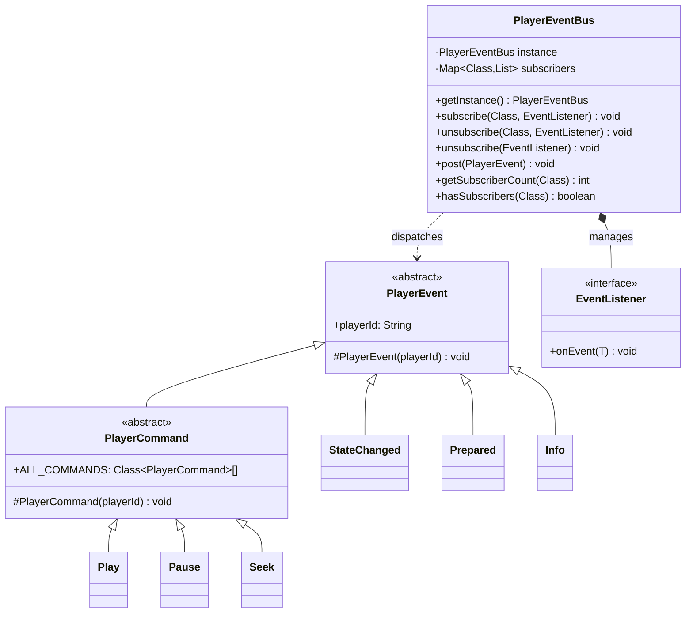
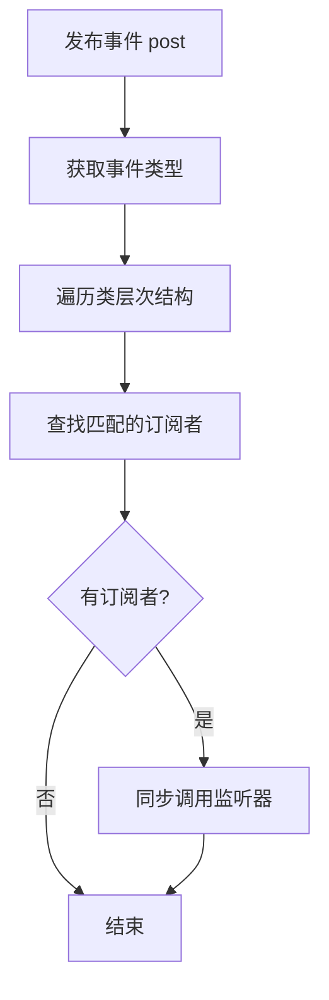

Language: 中文简体 | [English](EventSystem-EN.md)

# **事件系统 (Event System)**

**事件系统 (Event System)** 是 AliPlayerKit 的通信架构。它通过发布-订阅模式，实现了播放器组件间的完全解耦，使 UI 组件与业务逻辑可以独立开发、测试和维护，同时支持多播放器实例的事件隔离。

---

## **1. 概念介绍**

### **1.1 什么是事件？**

**事件 (Event)** 是播放器运行过程中产生的状态变化或行为通知。每个事件都携带播放器 ID (`playerId`)，用于标识事件来源，实现多播放器实例的事件隔离。

AliPlayerKit 中的事件分为两大类：

| 类型 | 说明 | 示例 |
|-----|------|------|
| **状态事件** | 播放器状态变化的通知，由播放器内部产生 | `StateChanged`、`Prepared`、`Error` |
| **命令事件** | 控制播放器行为的指令，由 UI 或外部组件产生 | `Play`、`Pause`、`Seek`、`SetSpeed` |

所有事件都继承自 `PlayerEvent` 基类，保证统一的事件结构。

### **1.2 什么是事件系统？**

**事件系统 (Event System)** 是用于管理事件订阅和发布的通信架构，核心组件是 `PlayerEventBus`。

它提供以下能力：

- **类型安全订阅**：按事件类型订阅，编译期保证类型安全
- **线程安全**：支持多线程环境下的事件发布和订阅
- **弱引用管理**：使用弱引用存储监听器，自动清理已回收的订阅者
- **事件隔离**：通过 `playerId` 实现多播放器实例的事件隔离

通过事件系统，播放器的 UI 组件（Slot）与控制器（Controller）完全解耦：UI 只负责发送命令和订阅状态变化，不关心命令如何执行；控制器只负责处理命令和发布状态变化，不关心谁在监听。

---

## **2. 功能特性**

### **2.1 解决问题**

- 组件间直接依赖导致耦合度高，难以替换和测试
- 多播放器实例场景下事件混乱，难以区分来源
- UI 组件与业务逻辑混杂，职责不清晰

### **2.2 核心价值**

事件系统将组件通信标准化，开发者可以自主选择使用方式：

| 使用方式 | 说明 | 优势 |
|---------|------|------|
| 订阅事件 | 监听播放器状态变化 | 解耦 UI 与业务逻辑，响应式更新界面 |
| 发送命令 | 控制播放器行为 | UI 无需持有控制器引用，命令式交互 |
| 自定义事件 | 扩展事件类型 | 满足特定业务场景，保持架构一致性 |

**架构优势**：

- **解耦**：组件间通过事件通信，无直接依赖
- **可测试**：组件可独立测试，通过事件模拟交互
- **可扩展**：自定义事件类型，不修改框架代码
- **线程安全**：支持多线程环境，无需额外同步

### **2.3 核心能力**

| 能力 | 说明 |
|-----|------|
| 类型安全订阅 | 按事件类型订阅，编译期类型检查 |
| 弱引用管理 | 自动清理已回收的监听器，防止内存泄漏 |
| 事件继承支持 | 订阅父类事件可接收子类事件 |
| 多播放器隔离 | 通过 `playerId` 区分不同播放器的事件 |

---

## **3. 事件分类**

### **3.1 播放事件 (PlayerEvents)**

播放器内部产生的状态变化事件，用于通知外部组件播放器状态。

| 事件 | 说明 | 携带数据 |
|-----|------|---------|
| `Prepared` | 播放器准备完成 | `duration` 视频总时长 |
| `FirstFrameRendered` | 首帧渲染完成 | - |
| `StateChanged` | 播放状态变化 | `oldState`, `newState` |
| `VideoSizeChanged` | 视频尺寸变化 | `width`, `height` |
| `Info` | 播放进度更新 | `currentPosition`, `duration`, `bufferedPosition` |
| `Error` | 播放错误 | `errorCode`, `errorMsg` |
| `LoadingBegin` | 开始缓冲 | - |
| `LoadingProgress` | 缓冲进度 | `percent`, `netSpeed` |
| `LoadingEnd` | 缓冲结束 | - |
| `SetSpeedCompleted` | 倍速设置完成 | `speed` |
| `SnapshotCompleted` | 截图完成 | `result`, `snapshotPath`, `width`, `height` |
| `SetLoopCompleted` | 循环设置完成 | `loop` |
| `SetMuteCompleted` | 静音设置完成 | `mute` |
| `SetScaleTypeCompleted` | 填充模式设置完成 | `scaleType` |
| `SetMirrorTypeCompleted` | 镜像设置完成 | `mirrorType` |
| `SetRotationCompleted` | 旋转设置完成 | `rotation` |
| `TrackQualityListUpdated` | 清晰度列表更新 | `trackQualityList` |
| `TrackSelected` | 清晰度选择完成 | `trackIndex` |

### **3.2 播放命令 (PlayerCommand)**

用于控制播放器行为的命令事件，由 UI 组件或外部代码发送。

| 命令 | 说明 | 参数 |
|-----|------|------|
| `Play` | 开始播放 | - |
| `Pause` | 暂停播放 | - |
| `Toggle` | 切换播放/暂停 | - |
| `Stop` | 停止播放 | - |
| `Replay` | 重播 | - |
| `Seek` | 跳转到指定位置 | `position` 目标位置（毫秒） |
| `SetSpeed` | 设置播放速度 | `speed` 播放速度（0.3-3.0） |
| `Snapshot` | 截图 | - |
| `SetLoop` | 设置循环播放 | `loop` 是否循环 |
| `SetMute` | 设置静音 | `mute` 是否静音 |
| `SetScaleType` | 设置填充模式 | `scaleType` 填充模式 |
| `SetMirrorType` | 设置镜像 | `mirrorType` 镜像模式 |
| `SetRotation` | 设置旋转 | `rotationMode` 旋转角度 |
| `SelectTrack` | 切换清晰度 | `trackQuality` 目标清晰度 |

### **3.3 手势事件 (GestureEvents)**

用户手势操作产生的事件，描述手势行为本身，不包含业务逻辑。

| 事件 | 说明 | 携带数据 |
|-----|------|---------|
| `SingleTapEvent` | 单击 | `x`, `y` 点击坐标 |
| `DoubleTapEvent` | 双击 | `x`, `y` 点击坐标 |
| `LongPressEvent` | 长按开始 | `x`, `y` 长按坐标 |
| `LongPressEndEvent` | 长按结束 | - |
| `HorizontalDragStartEvent` | 水平拖动开始 | `startX`, `startY` |
| `HorizontalDragUpdateEvent` | 水平拖动更新 | `deltaPercent` 增量百分比 |
| `HorizontalDragEndEvent` | 水平拖动结束 | - |
| `LeftVerticalDragStartEvent` | 左侧垂直拖动开始 | `startX`, `startY` |
| `LeftVerticalDragUpdateEvent` | 左侧垂直拖动更新 | `deltaPercent`, `currentPercent` |
| `LeftVerticalDragEndEvent` | 左侧垂直拖动结束 | - |
| `RightVerticalDragStartEvent` | 右侧垂直拖动开始 | `startX`, `startY` |
| `RightVerticalDragUpdateEvent` | 右侧垂直拖动更新 | `deltaPercent`, `currentPercent` |
| `RightVerticalDragEndEvent` | 右侧垂直拖动结束 | - |

### **3.4 控制栏事件 (ControlBarEvents)**

控制栏显示状态同步事件。

| 事件 | 说明 |
|-----|------|
| `Show` | 显示控制栏 |
| `Hide` | 隐藏控制栏 |
| `ResetTimer` | 重置自动隐藏计时器 |
| `ShowSettings` | 显示设置界面 |

### **3.5 全屏事件 (FullscreenEvents)**

全屏模式切换事件。

| 事件 | 说明 |
|-----|------|
| `Toggle` | 切换全屏状态 |

### **3.6 生命周期事件 (PlayerLifecycleEvents)**

播放器生命周期策略事件，用于观察播放器实例的创建、复用、销毁等行为。

| 事件 | 说明 |
|-----|------|
| `PlayerCreated` | 创建新播放器实例 |
| `PlayerDestroyed` | 销毁播放器实例 |
| `PlayerReused` | 复用空闲播放器实例 |
| `PlayerHit` | 命中活跃播放器实例 |
| `PlayerEvicted` | 播放器实例被淘汰 |

### **3.7 插槽事件 (SlotEvents)**

插槽内部产生的事件。

| 事件 | 说明 |
|-----|------|
| `TopBarBackClicked` | 顶部栏返回按钮点击 |

---

## **4. 基础使用**

事件系统提供两种使用策略：

| 策略 | 说明 | 适用场景 |
|-----|------|---------|
| 策略一：订阅事件 | 监听播放器状态变化 | UI 更新、业务逻辑响应 |
| 策略二：发送命令 | 控制播放器行为 | 用户交互、外部控制 |

### **4.1 策略一：订阅事件**

订阅事件需要三个步骤：获取事件总线、创建监听器、订阅事件。

```java
public class MyActivity extends AppCompatActivity {

    private PlayerEventBus mEventBus;
    private PlayerEventBus.EventListener<PlayerEvents.Info> mInfoListener;

    @Override
    protected void onCreate(Bundle savedInstanceState) {
        super.onCreate(savedInstanceState);

        // 1. 获取事件总线单例
        mEventBus = PlayerEventBus.getInstance();

        // 2. 创建监听器
        mInfoListener = event -> {
            // 处理播放进度更新
            long position = event.currentPosition;
            long duration = event.duration;
            updateProgressUI(position, duration);
        };

        // 3. 订阅事件
        mEventBus.subscribe(PlayerEvents.Info.class, mInfoListener);
    }

    @Override
    protected void onDestroy() {
        super.onDestroy();
        // 4. 取消订阅，避免内存泄漏
        if (mEventBus != null && mInfoListener != null) {
            mEventBus.unsubscribe(PlayerEvents.Info.class, mInfoListener);
        }
    }
}
```

### **4.2 策略二：发送命令**

发送命令通过事件总线 `post()` 方法实现：

```java
// 1. 获取事件总线单例
PlayerEventBus eventBus = PlayerEventBus.getInstance();

// 2. 获取目标播放器 ID
// 【场景 A：在插槽内部】 直接继承调用机制
// String playerId = getPlayerId();
// 【场景 B：在 Activity/Fragment 中】 通过你持有的控制器获取
String playerId = mAliPlayerKitController.getPlayer().getPlayerId();

// 3. 发布命令（发布后，挂载了该 playerId 的 Controller 即会同步执行）
eventBus.post(new PlayerCommand.Play(playerId));

// 其他常用命令示例：
eventBus.post(new PlayerCommand.Pause(playerId));               // 暂停播放
eventBus.post(new PlayerCommand.Toggle(playerId));              // 切换播放/暂停状态
eventBus.post(new PlayerCommand.Seek(playerId, 30000));         // 精准跳转到 30 秒
eventBus.post(new PlayerCommand.SetSpeed(playerId, 1.5f));      // 设置为 1.5 倍速
```

---

## **5. 进阶使用**

### **5.1 如何在插槽中使用事件？**

在插槽内部使用事件有两种方式：订阅事件和发送命令。

**方式一：订阅事件（推荐使用 `observedEvents()`）**

`BaseSlot` 提供了 `observedEvents()` 和 `onEvent()` 方法，框架会自动管理订阅生命周期：

```java
public class MySlot extends BaseSlot {

    // 1. 声明要订阅的事件类型
    @Override
    protected List<Class<? extends PlayerEvent>> observedEvents() {
        return Arrays.asList(
            PlayerEvents.StateChanged.class,
            PlayerEvents.Info.class
        );
    }

    // 2. 处理事件回调
    @Override
    protected void onEvent(@NonNull PlayerEvent event) {
        if (event instanceof PlayerEvents.StateChanged) {
            PlayerEvents.StateChanged stateChanged = (PlayerEvents.StateChanged) event;
            updatePlayPauseIcon(stateChanged.newState);
        } else if (event instanceof PlayerEvents.Info) {
            PlayerEvents.Info info = (PlayerEvents.Info) event;
            updateProgress(info.currentPosition, info.duration);
        }
    }
}
```

**方式二：发送命令**

在插槽中通过 `postEvent()` 方法发送命令：

```java
public class MySlot extends BaseSlot {

    private void onPlayPauseClick() {
        // 获取 playerId（在 onAttach 之后可用）
        String playerId = getPlayerId();
        if (playerId != null) {
            // 发送切换播放/暂停命令
            postEvent(new PlayerCommand.Toggle(playerId));
        }
    }

    private void onSeekTo(long position) {
        String playerId = getPlayerId();
        if (playerId != null) {
            // 发送跳转命令
            postEvent(new PlayerCommand.Seek(playerId, position));
        }
    }
}
```

> 💡 **详细文档**：插槽的完整使用方法请参考 [插槽系统文档](./SlotSystem.md)。

### **5.2 如何在策略中使用事件？**

在策略中使用事件与插槽类似，通过 `observedEvents()` 和 `onEvent()` 方法进行订阅和处理。但策略有以下特点：

| 特点 | 说明 |
|-----|------|
| 主要用于监控 | 策略一般只订阅事件进行分析，不发送命令 |
| 需要过滤事件 | 多播放器场景下必须通过 `isCurrentPlayer(event)` 过滤 |
| 访问上下文 | 通过 `StrategyContext` 访问播放器状态和数据 |

**示例代码**：

```java
public class MyAnalyticsStrategy extends BaseStrategy {

    @Nullable
    @Override
    protected List<Class<? extends PlayerEvent>> observedEvents() {
        return Arrays.asList(
            PlayerEvents.StateChanged.class,
            PlayerEvents.Info.class
        );
    }

    @Override
    public void onEvent(@NonNull PlayerEvent event) {
        // ✅ 必须过滤事件来源，避免多播放器串台
        if (!isCurrentPlayer(event)) return;

        if (event instanceof PlayerEvents.StateChanged) {
            // 处理状态变化
            PlayerEvents.StateChanged stateChanged = (PlayerEvents.StateChanged) event;
            logState(stateChanged.newState);
        } else if (event instanceof PlayerEvents.Info) {
            // 处理播放进度
            PlayerEvents.Info info = (PlayerEvents.Info) event;
            trackProgress(info.currentPosition, info.duration);
        }
    }
}
```

> 💡 **详细文档**：策略的完整使用方法请参考 [策略系统文档](./StrategySystem.md)。

### **5.3 如何实现自定义事件？**

当业务需要自定义事件时，可以继承 `PlayerEvent` 创建新的事件类型。

**Step by Step**：

1. **创建事件类**

   继承 `PlayerEvent` 并添加业务所需的数据字段：

   ```java
   /**
    * 自定义播放事件
    */
   public class MyCustomEvent extends PlayerEvent {

       /**
        * 自定义数据字段
        */
       public final String customData;

       /**
        * 构造函数
        *
        * @param playerId 播放器 ID
        * @param customData 自定义数据
        */
       public MyCustomEvent(@NonNull String playerId, @NonNull String customData) {
           super(playerId);
           this.customData = customData;
       }
   }
   ```

2. **发布事件**

   ```java
   // 创建并发布事件
   MyCustomEvent event = new MyCustomEvent(playerId, "custom_data");
   PlayerEventBus.getInstance().post(event);
   ```

3. **订阅自定义事件**

   ```java
   // 订阅自定义事件
   PlayerEventBus.getInstance().subscribe(MyCustomEvent.class, event -> {
       // 处理自定义事件
       String data = event.customData;
   });
   ```

### **5.4 如何实现多播放器事件隔离？**

每个事件都携带 `playerId`，通过判断 `playerId` 实现多播放器事件隔离：

```java
// 订阅事件时过滤 playerId
mEventBus.subscribe(PlayerEvents.Info.class, event -> {
    // 只处理当前播放器的事件
    if (mPlayerId.equals(event.playerId)) {
        updateProgress(event.currentPosition, event.duration);
    }
});
```

### **5.5 如何批量订阅命令？**

`PlayerCommand` 提供了 `ALL_COMMANDS` 数组，可用于批量订阅：

```java
// 批量订阅所有播放命令
for (Class<? extends PlayerCommand> commandClass : PlayerCommand.ALL_COMMANDS) {
    mEventBus.subscribe(commandClass, mCommandListener);
}

// 批量取消订阅
for (Class<? extends PlayerCommand> commandClass : PlayerCommand.ALL_COMMANDS) {
    mEventBus.unsubscribe(commandClass, mCommandListener);
}
```

---

## **6. 最佳实践**

### **6.1 订阅生命周期管理**

| 场景 | 推荐做法 | 原因 |
|-----|---------|------|
| Activity/Fragment | 在 `onDestroy()` 中取消订阅 | 避免 Activity 泄漏 |
| Slot 内部 | 使用 `observedEvents()` 自动管理 | 框架自动处理生命周期 |
| 单例组件 | 使用弱引用或手动管理 | 单例生命周期长，需主动清理 |

### **6.2 线程安全**

事件分发在调用线程同步执行，注意以下场景：

```java
// 在主线程订阅，事件回调也在主线程
runOnUiThread(() -> {
    mEventBus.subscribe(PlayerEvents.Info.class, event -> {
        // 此回调在发布事件的线程执行
        // 如果在子线程发布事件，需要切换到主线程更新 UI
        runOnUiThread(() -> updateUI(event));
    });
});
```

### **6.3 命令发送时机**

| 命令 | 建议发送时机 | 说明 |
|-----|------------|------|
| `Play`/`Pause`/`Toggle` | 任意时刻 | 安全命令，无副作用 |
| `Seek` | 播放器 `Prepared` 之后 | 确保视频已加载 |
| `SetSpeed` | 播放中或暂停时 | 确保播放器已初始化 |
| `Snapshot` | 首帧渲染后 | 确保有画面可截 |

### **6.4 注意事项**

- **不要在构造函数中订阅事件**：此时对象尚未完全初始化，存在空指针风险。
- **不要在构造函数中发送事件**：此时 `playerId` 可能未被框架挂载注入。
- **取消订阅时务必使用同一个监听器实例**：由于匹配机制，必须保证对象引用一致。
- **避免在事件回调中执行耗时操作**：事件分发是**同线程同步阻塞执行**的，I/O 操作或长耗时计算会极大地卡顿分发链乃至主线程。
- **❗ 高频事件的性能红线**：
  - **特点**：`PlayerEvents.Info`（播放进度）、`LoadingProgress` 及 `GestureEvents` 的 Update 系列事件触发频率极高（最高可能数十次/秒）。
  - **建议**：在此类回调中，**绝对不要**做频繁的内存分配（如 `new String()`）、重度布局刷新或 `requestLayout`。建议直接复用对象，或在 UI 层引入“**节流（Throttle）**”策略及“**同值过滤**”策略以避免无意义的视图重绘。

---

## **7. 示例参考**

项目提供了完整示例，位于 `playerkit-examples/example-event-system`。

### **7.1 示例功能**

| 功能 | 说明 |
|-----|------|
| 订阅播放进度 | 实时接收 `PlayerEvents.Info` 事件 |
| 发送播放命令 | 通过 `PlayerCommand.Toggle` 控制播放/暂停 |
| 事件日志展示 | 显示最近 20 条事件信息 |

### **7.2 运行示例**

在 Demo App 中选择「Event System」示例查看效果。

---

## **8. API 参考**

### **8.1 类结构**



### **8.2 核心接口**

| 接口/类 | 说明 |
|--------|------|
| `PlayerEvent` | 事件基类，所有事件继承此类 |
| `PlayerCommand` | 命令基类，所有命令继承此类 |
| `PlayerEventBus` | 事件总线，管理订阅和发布 |
| `EventListener<T>` | 事件监听器接口 |

### **8.3 PlayerEventBus 方法**

| 方法 | 说明 |
|-----|------|
| `getInstance()` | 获取事件总线单例 |
| `subscribe(eventType, listener)` | 订阅指定类型的事件 |
| `unsubscribe(eventType, listener)` | 取消订阅指定类型的事件 |
| `unsubscribe(listener)` | 取消指定监听器的所有订阅 |
| `post(event)` | 发布事件 |
| `getSubscriberCount(eventType)` | 获取指定事件类型的订阅者数量 |
| `hasSubscribers(eventType)` | 检查是否有订阅者 |
| `unsubscribeAll()` | 清除所有订阅（慎用） |

---

## **9. 技术原理**

### **9.1 事件分发流程**



### **9.2 弱引用机制**

事件总线使用 `WeakReference` 存储监听器，有以下优势：

- **自动清理**：监听器被 GC 回收后，自动从订阅列表中移除
- **防止泄漏**：即使忘记取消订阅，也不会导致严重泄漏
- **安全访问**：每次分发前检查弱引用是否有效

```java
// 弱引用存储监听器
List<WeakReference<EventListener<? extends PlayerEvent>>> listeners;

// 分发前检查有效性
for (WeakReference<EventListener> ref : listeners) {
    EventListener listener = ref.get();
    if (listener != null) {
        listener.onEvent(event);  // 有效则调用
    } else {
        listeners.remove(ref);  // 无效则清理
    }
}
```

### **9.3 单向数据流与状态同步闭环**

事件系统主要承担“**瞬态通知**”的职责。它与 PlayerStateStore 状态存储相结合，构成了严密的单向数据流（UDF）架构：

```
┌──────────────────────────────────────────────────────────┐
│                     状态同步闭环                           │
│                                                          │
│  ┌──────────┐    Command     ┌────────────────┐          │
│  │   UI     │ ──────────────▶│  Controller    │          │
│  │  (Slot)  │                │  (内部真相源)   │          │
│  │          │ ◀──────────────│                │          │
│  └────┬─────┘     Event      └───────┬────────┘          │
│       │                              │                    │
│       │      ┌───────────────────────┘                    │
│       │      │                                             │
│       │      ▼ (错过事件时主动拉取)                         │
│       │  SlotHost.getPlayerStateStore()                   │
│       │  ├─ getPlayState()        当前播放状态             │
│       │  ├─ getCurrentPosition()  当前播放位置             │
│       │  └─ getDuration()         视频总时长               │
│       └─────────────────────────────────────────────────┐ │
│                                                          │
└──────────────────────────────────────────────────────────┘
```

**数据流向**：

| 方向 | 机制 | 说明 |
|-----|------|------|
| **命令上行** | UI → Controller | Slot 发送命令事件控制播放器行为 |
| **状态下行** | Controller → UI | 控制器发布状态变化事件通知 Slot |
| **状态拉取** | UI → StateStore | Slot 主动拉取当前状态（补偿机制） |

**为何需要状态拉取？**

事件是瞬态的，插槽可能在事件发布后才被 attach（晚绑定场景），此时错过了早期事件。通过 `getPlayerStateStore()` 可获取播放器的当前状态，无需依赖事件订阅时机：

```java
@Override
public void onAttach(@NonNull SlotHost host) {
    super.onAttach(host);

    // 插槽晚绑定，错过了 Prepared、StateChanged 等事件？
    // 主动拉取当前状态进行 UI 初始化
    IPlayerStateStore stateStore = host.getPlayerStateStore();
    PlayerState currentState = stateStore.getPlayState();  // 当前播放状态
    long position = stateStore.getCurrentPosition();       // 当前播放位置
    long duration = stateStore.getDuration();              // 视频总时长

    // 根据当前状态初始化 UI
    updatePlayPauseIcon(currentState);
    updateProgress(position, duration);
}
```

这种架构彻底解耦了 UI 与控制器：UI 无需持有控制器引用，只需订阅事件、发送命令；控制器无需关心谁在监听，只需发布事件、处理命令。

### **9.4 事件继承支持**

订阅父类事件可接收所有子类事件：

```java
// 订阅 PlayerEvent 可接收所有事件
mEventBus.subscribe(PlayerEvent.class, event -> {
    // 接收所有 PlayerEvent 子类事件
});

// 订阅 PlayerCommand 可接收所有命令
mEventBus.subscribe(PlayerCommand.class, event -> {
    // 接收所有 PlayerCommand 子类命令
});
```

---

## **10. 常见问题**

### **10.1 为什么收不到事件？**

检查以下几点：

1. **是否已订阅**：确认调用了 `subscribe()` 方法
2. **事件类型是否匹配**：订阅的类型与发布的类型一致
3. **playerId 是否正确**：事件中的 `playerId` 是否匹配
4. **监听器是否被回收**：检查监听器是否被提前 GC

### **10.2 如何调试事件？**

使用 `LogHub` 查看日志，TAG 为 `PlayerEventBus`：

```java
// 查看订阅日志
// I/PlayerEventBus: Subscribed to Info

// 查看发布日志（需开启详细日志）
// I/PlayerEventBus: Posted event: Info to 2 listeners
```

### **10.3 高频崩溃错例**

以下是开发者最常遇到的问题，请务必避免：

#### **错例 1：忘记取消订阅导致内存泄漏**

**错误代码**：

```java
public class MyActivity extends AppCompatActivity {

    @Override
    protected void onCreate(Bundle savedInstanceState) {
        super.onCreate(savedInstanceState);

        // ❌ 订阅后未取消订阅
        PlayerEventBus.getInstance().subscribe(PlayerEvents.Info.class, event -> {
            updateUI(event.currentPosition);  // Activity 泄漏！
        });
    }

    // 没有 onDestroy 取消订阅
}
```

**崩溃原因**：Lambda 表达式持有 Activity 引用，未取消订阅导致 Activity 无法释放。

**正确代码**：

```java
public class MyActivity extends AppCompatActivity {

    private PlayerEventBus.EventListener<PlayerEvents.Info> mListener;

    @Override
    protected void onCreate(Bundle savedInstanceState) {
        super.onCreate(savedInstanceState);

        mListener = event -> updateUI(event.currentPosition);
        PlayerEventBus.getInstance().subscribe(PlayerEvents.Info.class, mListener);
    }

    @Override
    protected void onDestroy() {
        super.onDestroy();
        // ✅ 必须取消订阅
        PlayerEventBus.getInstance().unsubscribe(PlayerEvents.Info.class, mListener);
    }
}
```

---

#### **错例 2：在构造函数中订阅事件**

**错误代码**：

```java
public class MyComponent {

    public MyComponent() {
        // ❌ 构造函数中订阅，对象未完全初始化
        PlayerEventBus.getInstance().subscribe(PlayerEvents.Info.class, event -> {
            // 此时 this 可能未完全初始化
        });
    }
}
```

**崩溃原因**：构造函数执行时对象未完全初始化，可能导致空指针或状态不一致。

**正确做法**：

```java
public class MyComponent {

    private PlayerEventBus.EventListener<PlayerEvents.Info> mListener;

    public void init() {
        // ✅ 在初始化方法中订阅
        mListener = event -> handleEvent(event);
        PlayerEventBus.getInstance().subscribe(PlayerEvents.Info.class, mListener);
    }

    public void destroy() {
        // 取消订阅
        PlayerEventBus.getInstance().unsubscribe(PlayerEvents.Info.class, mListener);
    }
}
```

---

#### **错例 3：在插槽构造函数中发送事件**

**错误代码**：

```java
public class MySlot extends BaseSlot {

    public MySlot(Context context) {
        super(context);
        // ❌ 构造函数中 playerId 未设置
        postEvent(new PlayerCommand.Toggle(getPlayerId()));  // getPlayerId() 返回 null！
    }
}
```

**崩溃原因**：`getPlayerId()` 在 `onAttach()` 之后才返回有效值，构造函数中为 null。

**正确做法**：

```java
public class MySlot extends BaseSlot {

    @Override
    public void onAttach(@NonNull SlotHost host) {
        super.onAttach(host);
        // ✅ 在 onAttach 之后发送事件
        String playerId = getPlayerId();
        if (playerId != null) {
            postEvent(new PlayerCommand.Toggle(playerId));
        }
    }
}
```

---

#### **错例 4：事件回调中执行耗时操作**

**错误代码**：

```java
mEventBus.subscribe(PlayerEvents.Info.class, event -> {
    // ❌ 在回调中执行网络请求，阻塞事件分发
    String data = fetchFromNetwork();  // 阻塞！
    updateUI(data);
});
```

**崩溃原因**：事件分发是同步的，耗时操作会阻塞所有后续事件的分发，导致 UI 卡顿。

**正确做法**：

```java
mEventBus.subscribe(PlayerEvents.Info.class, event -> {
    // ✅ 耗时操作异步执行
    executorService.execute(() -> {
        String data = fetchFromNetwork();
        runOnUiThread(() -> updateUI(data));
    });
});
```

---

#### **错例 5：Slot 中未使用 observedEvents() 订阅**

**错误代码**：

```java
public class MySlot extends BaseSlot {

    @Override
    public void onAttach(@NonNull SlotHost host) {
        super.onAttach(host);
        // ❌ 手动订阅，需要手动取消
        PlayerEventBus.getInstance().subscribe(PlayerEvents.Info.class, mListener);
    }

    @Override
    public void onDetach() {
        // 忘记取消订阅，导致泄漏
        super.onDetach();
    }
}
```

**崩溃原因**：手动订阅需要手动取消，忘记取消会导致监听器泄漏。

**正确做法**：

```java
public class MySlot extends BaseSlot {

    // ✅ 使用 observedEvents() 自动管理
    @Override
    protected List<Class<? extends PlayerEvent>> observedEvents() {
        return Arrays.asList(PlayerEvents.Info.class);
    }

    @Override
    protected void onEvent(@NonNull PlayerEvent event) {
        if (event instanceof PlayerEvents.Info) {
            // 处理事件
        }
    }
}
```

如果确实需要手动订阅，必须在 `onDetach()` 中取消：

```java
@Override
public void onDetach() {
    PlayerEventBus.getInstance().unsubscribe(PlayerEvents.Info.class, mListener);
    super.onDetach();
}
```
