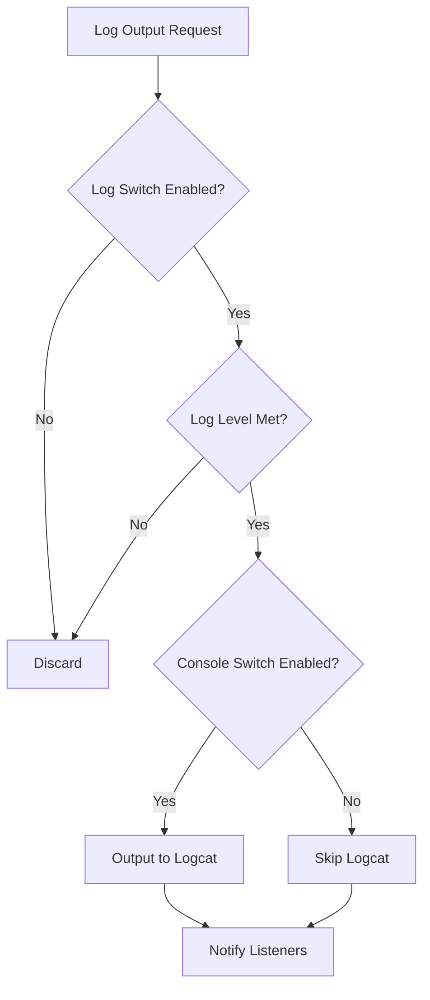
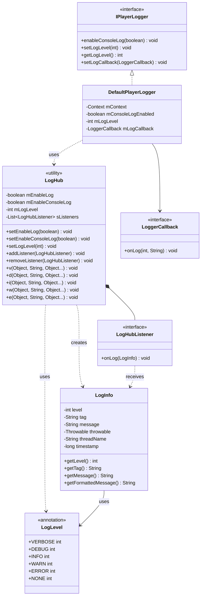
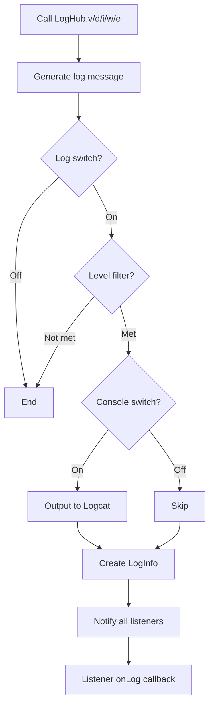

# **Log System**

The **Log System** is the foundational support module of AliPlayerKit. Through its unified log center LogHub, it provides core capabilities such as log output, level control, and listener mechanism, enabling visualization and traceability of player runtime information, and providing critical support for issue diagnosis and performance analysis.

---

## **1. Concept Introduction**

### **1.1 What is LogHub?**

**LogHub** is the unified entry point for all log output in the PlayerKit framework. It is a static utility class that provides unified log output functionality.

It encapsulates the Android native Log API, retaining the original functionality while adding the following core capabilities:

| Capability | Description |
|-----|------|
| Log Switch | Controls whether log output is enabled |
| Console Switch | Controls whether logs are output to Logcat |
| Level Filtering | Outputs only logs at the specified level and above |
| Listener Mechanism | Supports external listeners for custom processing (e.g., writing to file) |

### **1.2 What is a Log Listener?**

A **Log Listener (LogHubListener)** is a callback interface used to receive log output from LogHub. By implementing this interface, you can customize how logs are processed, for example:

- Write logs to a file for technical support team to analyze when troubleshooting issues
- Upload logs to a remote server to enable remote log collection
- Display logs in the UI for a debugging panel

---

## **2. Features**

### **2.1 Problems Solved**

- Logs are scattered and difficult to manage and filter uniformly
- Release builds need to disable debug logs but lack a unified switch
- Lack of log file support during issue diagnosis
- Player SDK logs are separated from business logs, making correlated analysis difficult

### **2.2 Core Value**

| Usage Mode | Description | Advantages |
|---------|------|------|
| Basic Usage | Output logs directly via LogHub | Zero configuration, ready to use |
| Level Control | Set log level filtering | Detailed for development, concise for production |
| Listener Extension | Register listener to handle logs | Log persistence, remote reporting, etc. |

**Architectural Advantages**:

- **Unified Entry**: All logs are output through LogHub, facilitating management and control
- **Flexible Control**: Supports triple control via global switch, console switch, and level filtering
- **Extensible**: Supports custom log processing through listener mechanism, such as file writing and remote reporting
- **Thread-Safe**: The listener list uses CopyOnWriteArrayList, supporting safe multi-threaded access

### **2.3 Core Capabilities**

| Capability | Description |
|-----|------|
| Multi-level Logs | Supports five levels: VERBOSE, DEBUG, INFO, WARN, ERROR |
| Exception Logs | Supports outputting log with Throwable exception information |
| Long Log Segmentation | Automatically segments overly long logs to avoid Logcat truncation |
| Performance Logs | Provides performance time logs for performance analysis |
| SDK Log Integration | Unified management of player SDK logs through the IPlayerLogger interface |

---

## **3. Built-in Components**

### **3.1 Log Levels**

| Level | Value | Description | Use Case |
|-----|---|------|---------|
| VERBOSE | 0 | Most detailed level, outputs all debug information | Development debugging stage |
| DEBUG | 1 | Debug information level | Debugging specific features |
| INFO | 2 | Information level, outputs general information | **Default level**, recommended for production |
| WARN | 3 | Warning level, outputs potential issue alerts | Watching for potential risks |
| ERROR | 4 | Error level, outputs error information | Watching for serious issues |
| NONE | 100 | Disables all logs | Turn off log output |

### **3.2 Core Classes**

| Class | Description |
|----|------|
| `LogHub` | Log center utility class, the unified log output entry |
| `LogLevel` | Log level annotation definition |
| `LogInfo` | Log info data class, encapsulates the complete information of a single log |
| `LogHubListener` | Log listener interface, used to receive log callbacks |
| `IPlayerLogger` | Player global log interface, encapsulates SDK log functionality |
| `DefaultPlayerLogger` | Default player log implementation |
| `LoggerCallback` | Player log callback interface |

---

## **4. Basic Usage**

The Log System provides three usage strategies. Developers can choose the appropriate one based on their needs.

| Strategy | Description | Use Case |
|-----|------|---------|
| Strategy 1: Direct Log Output | Simplest usage, directly call LogHub methods | Development debugging, ad-hoc logs |
| Strategy 2: Configure Log Level | Configure different log levels based on environment | Differentiate development/production environments |
| Strategy 3: Register Listener | Customize log processing via listener | Log persistence, remote reporting |

### **4.1 Strategy 1: Direct Log Output**

The simplest usage—directly call the static methods of LogHub to output logs:

```java
// Output INFO level log
LogHub.i(this, "playVideo", "开始播放视频");

// Output WARN level log
LogHub.w(this, "onBuffering", "缓冲中，当前进度: ", progress);

// Output ERROR level log
LogHub.e(this, "onError", "播放失败，错误码: ", errorCode);

// Output ERROR log with exception
LogHub.e(this, "onException", throwable, "发生异常");

// Output performance time log
LogHub.t("loadVideoSource", costTime);
```

**Log Format**:

```
[ClassName] methodName: message content
```

**Logcat Filter Suggestion**:

```
package:mine tag:AliPlayerKit
```

### **4.2 Strategy 2: Configure Log Level**

Configure different log levels based on the runtime environment:

```java
// Development: output all logs
if (BuildConfig.DEBUG) {
    LogHub.setEnableLog(true);
    LogHub.setEnableConsoleLog(true);
    LogHub.setLogLevel(LogLevel.VERBOSE);
}

// Production: output INFO and above only
else {
    LogHub.setEnableLog(true);
    LogHub.setEnableConsoleLog(false);  // Disable console output
    LogHub.setLogLevel(LogLevel.INFO);
}

// Fully disable logging (sensitive scenarios)
LogHub.setEnableLog(false);
```

**Triple Control Mechanism**:



### **4.3 Strategy 3: Register Listener**

Customize log processing via a listener:

```java
// Create listener
LogHubListener listener = logInfo -> {
    // Handle log info
    String formattedLog = logInfo.getFormattedMessage();
    // Write to file, upload to server, etc.
    saveToFile(formattedLog);
};

// Register listener
LogHub.addListener(listener);

// Remove listener (when no longer needed)
LogHub.removeListener(listener);
```

---

## **5. Advanced Usage**

### **5.1 How to Implement Log Persistence?**

Implement log file writing through the LogHubListener interface to facilitate troubleshooting.

**Step by Step**:

1. **Create the log listener**

   ```java
   public class FileLogListener implements LogHubListener {

       private final ExecutorService mExecutor = Executors.newSingleThreadExecutor();
       private final File mLogFile;

       public FileLogListener(Context context) {
           // Log file path
           File logDir = new File(context.getExternalFilesDir(null), "logs");
           if (!logDir.exists()) {
               logDir.mkdirs();
           }
           mLogFile = new File(logDir, "player_" + getDateStr() + ".log");
       }

       @Override
       public void onLog(@NonNull LogInfo logInfo) {
           // Write file asynchronously to avoid blocking the calling thread
           mExecutor.execute(() -> {
               try {
                   String log = logInfo.getFormattedMessage() + "\n";
                   FileOutputStream fos = new FileOutputStream(mLogFile, true);
                   fos.write(log.getBytes(StandardCharsets.UTF_8));
                   fos.close();
               } catch (IOException e) {
                   // Ignore write exception
               }
           });
       }
   }
   ```

2. **Register in Application**

   ```java
   public class MyApplication extends Application {

       private FileLogListener mFileLogListener;

       @Override
       public void onCreate() {
           super.onCreate();

           // Create and register the file log listener
           mFileLogListener = new FileLogListener(this);
           LogHub.addListener(mFileLogListener);
       }
   }
   ```

3. **Retrieve log files**

   ```java
   // Log file path
   File logDir = new File(getExternalFilesDir(null), "logs");
   File[] logFiles = logDir.listFiles();

   // Provide to the technical support team for analysis
   ```

**Example Reference**: `playerkit-examples/example-log-system/FileLogListener.java`

### **5.2 How to Integrate Player SDK Logs?**

Use the IPlayerLogger interface to manage player SDK log output uniformly.

**Step by Step**:

1. **Create a player logger instance**

   ```java
   // Initialize in Application
   IPlayerLogger playerLogger = new DefaultPlayerLogger(context);

   // Enable SDK console logs (open during debugging)
   playerLogger.enableConsoleLog(BuildConfig.DEBUG);

   // Set SDK log level
   playerLogger.setLogLevel(LogLevel.INFO);
   ```

2. **Set the SDK log callback**

   ```java
   playerLogger.setLogCallback((level, message) -> {
       // Handle SDK logs, e.g., write to file, report, etc.
       LogHub.log(level, "PlayerSDK", message);
   });
   ```

### **5.3 How to Display Logs in the UI?**

Display logs in the UI in real time via a listener.

```java
public class LogPanelActivity extends AppCompatActivity {

    private TextView mTvLogOutput;
    private LogHubListener mLogListener;

    @Override
    protected void onCreate(Bundle savedInstanceState) {
        super.onCreate(savedInstanceState);
        setContentView(R.layout.activity_log_panel);

        mTvLogOutput = findViewById(R.id.tv_log_output);

        // Create UI log listener
        mLogListener = logInfo -> runOnUiThread(() -> {
            mTvLogOutput.append(logInfo.getFormattedMessage() + "\n");
        });

        // Register listener
        LogHub.addListener(mLogListener);
    }

    @Override
    protected void onDestroy() {
        super.onDestroy();
        // Remove listener to avoid memory leak
        LogHub.removeListener(mLogListener);
    }
}
```

---

## **6. Best Practices**

### **6.1 Choosing a Log Level**

| Scenario | Recommended Level | Description |
|-----|---------|------|
| Detailed debug information | VERBOSE | Trace flow during development |
| Debugging key checkpoints | DEBUG | Record key state changes |
| Important business information | INFO | Important info kept in production |
| Potential issue warnings | WARN | Recoverable exceptions, performance warnings |
| Severe errors | ERROR | Errors that cause functional failure |

### **6.2 Production Configuration**

```java
public class MyApplication extends Application {

    @Override
    public void onCreate() {
        super.onCreate();

        if (BuildConfig.DEBUG) {
            // Development: detailed logs + console output
            LogHub.setEnableLog(true);
            LogHub.setEnableConsoleLog(true);
            LogHub.setLogLevel(LogLevel.VERBOSE);
        } else {
            // Production: concise logs + console disabled + file persistence
            LogHub.setEnableLog(true);
            LogHub.setEnableConsoleLog(false);  // Disable Logcat output
            LogHub.setLogLevel(LogLevel.INFO);   // Keep INFO and above only
            LogHub.addListener(new FileLogListener(this));
        }
    }
}
```

### **6.3 Notes**

| Item | Description |
|-----|------|
| Avoid sensitive information | Do not output user privacy, secrets, or sensitive info in logs |
| Async file writing | Write files asynchronously in listeners to avoid blocking |
| Listener exception handling | Listener exceptions should not affect normal log output |
| Remove listeners promptly | Remove listeners when pages are destroyed to avoid memory leaks |
| Global listener placement | Place file log listeners in Application to ensure full lifecycle coverage |

---

## **7. Example Reference**

The project provides a complete example located at `playerkit-examples/example-log-system`.

### **7.1 Example Features**

| Feature | Description |
|-----|------|
| Log Output Demo | Demonstrates logs at each level |
| UI Log Display | Displays logs in the UI in real time |
| File Log Listener | Demonstrates how to implement log persistence |

### **7.2 Running the Example**

In the Demo App, select the "Log System" example to view the effects.

---

## **8. API Reference**

### **8.1 Class Structure**



### **8.2 Core Interfaces**

| Interface/Class | Description |
|--------|------|
| `LogHub` | Log center, unified log output entry |
| `LogHubListener` | Log listener interface, receives log callbacks |
| `LogInfo` | Log info data class |
| `IPlayerLogger` | Player global log interface |

### **8.3 LogHub Main Methods**

| Method | Description |
|-----|------|
| `setEnableLog(boolean)` | Enable/disable log output (master switch) |
| `setEnableConsoleLog(boolean)` | Enable/disable console log output |
| `setLogLevel(int)` | Set log level filter |
| `addListener(LogHubListener)` | Add a log listener |
| `removeListener(LogHubListener)` | Remove a log listener |
| `v/d/i/w/e(Object, String, Object...)` | Output logs at the corresponding level |
| `t(String, long)` | Output performance time log |

### **8.4 LogInfo Main Methods**

| Method | Description |
|-----|------|
| `getLevel()` | Get the log level |
| `getTag()` | Get the log tag |
| `getMessage()` | Get the log message |
| `getThrowable()` | Get the exception info |
| `getThreadName()` | Get the thread name |
| `getTimestamp()` | Get the timestamp (milliseconds) |
| `getFormattedMessage()` | Get the formatted log string |

---

## **9. Technical Principles**

### **9.1 Log Output Flow**



### **9.2 Long Log Segmentation Mechanism**

Logcat has a single log length limit (about 4000 characters). LogHub handles overly long logs through a segmentation mechanism:

```java
private static final int BUFFER_SIZE = 3000;

// Segmented output to Logcat
while (startIndex < length) {
    int endIndex = Math.min(length, startIndex + BUFFER_SIZE);
    String sub = s.substring(startIndex, endIndex);
    // Output the segmented log...
    startIndex = endIndex;
}
```

**Optimization**: For listeners, the complete log content is sent; for Logcat, segmented output is used.

### **9.3 Thread Safety Mechanism**

The listener list uses `CopyOnWriteArrayList` to ensure multi-thread safety:

```java
private static final List<LogHubListener> sListeners = new CopyOnWriteArrayList<>();
```

**Characteristics**:
- Lock-free read operations, high performance
- Write operations copy a new array without affecting ongoing reads
- Suitable for read-heavy, write-light listener registration/removal scenarios

---

## **10. FAQ**

### **10.1 How to Filter PlayerKit Logs in Logcat?**

Use the following filter:

```
package:mine tag:AliPlayerKit
```

Or filter by level:

```
package:mine tag:AliPlayerKit level:info
```

### **10.2 Where Are Production Log Files Located?**

Default path (when using the FileLogListener example):

```
/sdcard/Android/data/[package_name]/files/logs/
```

### **10.3 On Which Thread Does the Listener Callback Run?**

The listener callback runs on the calling thread of the log output. If you need to handle it on the UI thread, use `runOnUiThread()` to switch threads.

### **10.4 Common Crash Anti-Patterns**

The following are the most common issues reported by customers. Avoid them:

#### **Anti-Pattern 1: Blocking Operations in Listener Cause Lag**

**Wrong code**:

```java
@Override
public void onLog(@NonNull LogInfo logInfo) {
    // ❌ Synchronously writing to file on main thread blocks the UI
    try {
        FileOutputStream fos = new FileOutputStream(mLogFile, true);
        fos.write(logInfo.getFormattedMessage().getBytes());
        fos.close();
    } catch (IOException e) {
        e.printStackTrace();
    }
}
```

**Cause**: If log output happens on the main thread, synchronous file writing will block the UI, causing lag or even ANR.

**Correct code**:

```java
private final ExecutorService mExecutor = Executors.newSingleThreadExecutor();

@Override
public void onLog(@NonNull LogInfo logInfo) {
    // ✅ Write file asynchronously
    mExecutor.execute(() -> {
        try {
            // File writing logic...
        } catch (IOException e) {
            // Ignore
        }
    });
}
```

---

#### **Anti-Pattern 2: Forgetting to Remove Listener Causes Memory Leak**

**Wrong code**:

```java
@Override
protected void onCreate(Bundle savedInstanceState) {
    super.onCreate(savedInstanceState);
    // ❌ Listener registered but never removed
    LogHub.addListener(logInfo -> {
        mTvLogOutput.append(logInfo.getMessage());
    });
}
```

**Cause**: The listener holds a reference to the Activity. After the Activity is destroyed, it cannot be released, causing a memory leak.

**Correct code**:

```java
private LogHubListener mLogListener;

@Override
protected void onCreate(Bundle savedInstanceState) {
    super.onCreate(savedInstanceState);

    mLogListener = logInfo -> runOnUiThread(() -> {
        mTvLogOutput.append(logInfo.getMessage());
    });
    LogHub.addListener(mLogListener);
}

@Override
protected void onDestroy() {
    super.onDestroy();
    // ✅ Remove the listener promptly
    if (mLogListener != null) {
        LogHub.removeListener(mLogListener);
    }
}
```

---

#### **Anti-Pattern 3: Listener Exception Affects Other Listeners**

**Wrong code**:

```java
@Override
public void onLog(@NonNull LogInfo logInfo) {
    // ❌ Exception not handled; if thrown here it may affect other listeners
    String data = logInfo.getMessage();
    int result = 1 / 0;  // Throws exception
}
```

**Cause**: Although LogHub catches listener exceptions internally, the listener itself should still handle possible exceptions to ensure its own stability.

**Correct code**:

```java
@Override
public void onLog(@NonNull LogInfo logInfo) {
    try {
        // ✅ Handle exceptions inside the listener
        processLog(logInfo);
    } catch (Exception e) {
        // The listener's own exception handling, does not affect the log system
        android.util.Log.e("FileLogListener", "Error processing log", e);
    }
}
```

---

### **10.5 How to Debug?**

1. **Check log switch state**:

   ```java
   boolean enabled = LogHub.isLogEnabled();
   boolean consoleEnabled = LogHub.isConsoleLogEnabled();
   int level = LogHub.getLogLevel();
   ```

2. **Inspect Logcat output**:

   Use `tag:AliPlayerKit` to filter and view log output.

3. **Check the number of listeners**:

   The number of listeners in the log system can be inspected via reflection (for debugging) to ensure listeners are correctly registered and removed.
