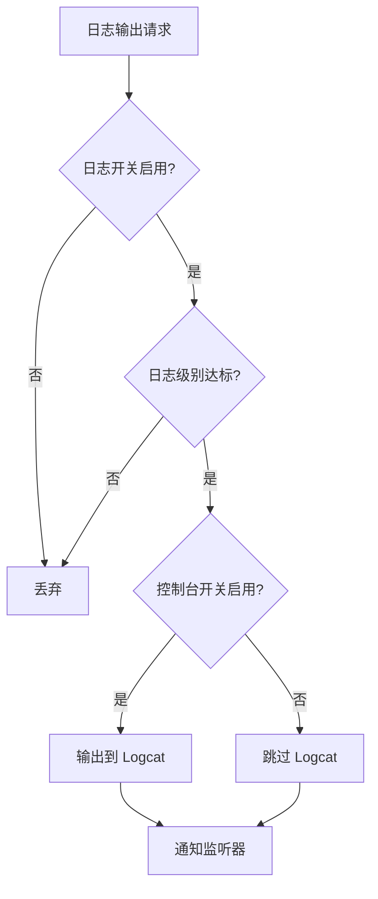
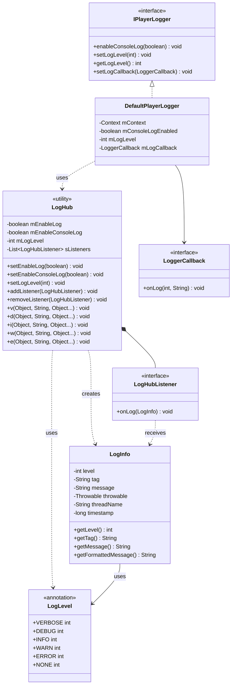
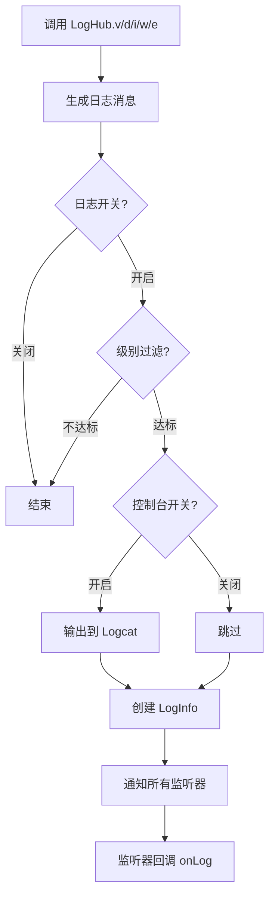

Language: 中文简体 | [English](LogSystem-EN.md)

# **日志系统 (Log System)**

**日志系统 (Log System)** 是 AliPlayerKit 的基础支撑模块。它通过统一的日志中心 LogHub，提供日志输出、级别控制、监听器机制等核心能力，实现播放器运行时信息的可视化与可追溯，为问题定位和性能分析提供关键支持。

---

## **1. 概念介绍**

### **1.1 什么是 LogHub？**

**LogHub** 是 PlayerKit 框架中所有日志输出的统一入口，是一个静态工具类，提供统一的日志输出功能。

它封装了 Android 原生 Log API，在保留原有功能的基础上，增加了以下核心能力：

| 能力 | 说明 |
|-----|------|
| 日志开关 | 控制日志输出是否启用 |
| 控制台开关 | 控制日志是否输出到 Logcat |
| 级别过滤 | 只输出指定级别及以上的日志 |
| 监听器机制 | 支持外部监听日志输出，实现自定义处理（如写入文件） |

### **1.2 什么是日志监听器？**

**日志监听器 (LogHubListener)** 是用于接收 LogHub 输出日志的回调接口。通过实现该接口，可以自定义日志的处理方式，例如：

- 将日志写入文件，便于问题排查时提供给技术支持团队
- 将日志上传到远程服务器，实现远程日志收集
- 在 UI 上展示日志，用于调试面板

---

## **2. 功能特性**

### **2.1 解决问题**

- 日志分散，难以统一管理和过滤
- 发布版本需要关闭调试日志，缺乏统一开关
- 问题排查时缺乏日志文件支持
- 播放器 SDK 日志与业务日志分离，难以关联分析

### **2.2 核心价值**

| 使用方式 | 说明 | 优势 |
|---------|------|------|
| 基础使用 | 直接使用 LogHub 输出日志 | 无需配置，开箱即用 |
| 级别控制 | 设置日志级别过滤 | 开发调试详细，生产环境精简 |
| 监听器扩展 | 注册监听器处理日志 | 日志持久化、远程上报等 |

**架构优势**：

- **统一入口**：所有日志通过 LogHub 统一输出，便于管理和控制
- **灵活控制**：支持全局开关、控制台开关、级别过滤三重控制
- **可扩展**：通过监听器机制支持自定义日志处理，如文件写入、远程上报
- **线程安全**：监听器列表使用 CopyOnWriteArrayList，支持多线程安全访问

### **2.3 核心能力**

| 能力 | 说明 |
|-----|------|
| 多级别日志 | 支持 VERBOSE、DEBUG、INFO、WARN、ERROR 五个级别 |
| 异常日志 | 支持携带 Throwable 异常信息输出 |
| 长日志分段 | 自动分段处理超长日志，避免 Logcat 截断 |
| 性能日志 | 提供性能时间日志输出，便于性能分析 |
| SDK 日志集成 | 通过 IPlayerLogger 接口统一管理播放器 SDK 日志 |

---

## **3. 内置组件详解**

### **3.1 日志级别**

| 级别 | 值 | 说明 | 适用场景 |
|-----|---|------|---------|
| VERBOSE | 0 | 最详细级别，输出所有调试信息 | 开发调试阶段 |
| DEBUG | 1 | 调试信息级别 | 调试特定功能 |
| INFO | 2 | 信息级别，输出一般信息 | **默认级别**，生产环境推荐 |
| WARN | 3 | 警告级别，输出潜在问题提示 | 关注潜在风险 |
| ERROR | 4 | 错误级别，输出错误信息 | 关注严重问题 |
| NONE | 100 | 禁用所有日志 | 关闭日志输出 |

### **3.2 核心类**

| 类 | 说明 |
|----|------|
| `LogHub` | 日志中心工具类，统一日志输出入口 |
| `LogLevel` | 日志级别注解定义 |
| `LogInfo` | 日志信息数据类，封装单条日志完整信息 |
| `LogHubListener` | 日志监听器接口，用于接收日志回调 |
| `IPlayerLogger` | 播放器全局日志接口，封装 SDK 日志功能 |
| `DefaultPlayerLogger` | 默认播放器日志实现 |
| `LoggerCallback` | 播放器日志回调接口 |

---

## **4. 基础使用**

日志系统提供三种使用策略，开发者可根据需求选择合适的方式。

| 策略 | 说明 | 适用场景 |
|-----|------|---------|
| 策略一：直接输出日志 | 最简单的使用方式，直接调用 LogHub 方法 | 开发调试、临时日志 |
| 策略二：配置日志级别 | 根据环境配置不同日志级别 | 区分开发/生产环境 |
| 策略三：注册监听器 | 通过监听器自定义日志处理 | 日志持久化、远程上报 |

### **4.1 策略一：直接输出日志**

最简单的使用方式，直接调用 LogHub 的静态方法输出日志：

```java
// 输出 INFO 级别日志
LogHub.i(this, "playVideo", "开始播放视频");

// 输出 WARN 级别日志
LogHub.w(this, "onBuffering", "缓冲中，当前进度: ", progress);

// 输出 ERROR 级别日志
LogHub.e(this, "onError", "播放失败，错误码: ", errorCode);

// 输出带异常的 ERROR 日志
LogHub.e(this, "onException", throwable, "发生异常");

// 输出性能时间日志
LogHub.t("loadVideoSource", costTime);
```

**日志格式说明**：

```
[类名] 方法名: 消息内容
```

**Logcat 过滤建议**：

```
package:mine tag:AliPlayerKit
```

### **4.2 策略二：配置日志级别**

根据运行环境配置不同的日志级别：

```java
// 开发环境：输出所有日志
if (BuildConfig.DEBUG) {
    LogHub.setEnableLog(true);
    LogHub.setEnableConsoleLog(true);
    LogHub.setLogLevel(LogLevel.VERBOSE);
}

// 生产环境：只输出 INFO 及以上级别
else {
    LogHub.setEnableLog(true);
    LogHub.setEnableConsoleLog(false);  // 关闭控制台输出
    LogHub.setLogLevel(LogLevel.INFO);
}

// 完全关闭日志（敏感场景）
LogHub.setEnableLog(false);
```

**三重控制机制**：



### **4.3 策略三：注册监听器**

通过监听器实现日志自定义处理：

```java
// 创建监听器
LogHubListener listener = logInfo -> {
    // 处理日志信息
    String formattedLog = logInfo.getFormattedMessage();
    // 写入文件、上传服务器等
    saveToFile(formattedLog);
};

// 注册监听器
LogHub.addListener(listener);

// 移除监听器（不再需要时）
LogHub.removeListener(listener);
```

---

## **5. 进阶使用**

### **5.1 如何实现日志持久化？**

通过 LogHubListener 接口实现日志文件写入，便于问题排查。

**Step by Step**：

1. **创建日志监听器**

   ```java
   public class FileLogListener implements LogHubListener {

       private final ExecutorService mExecutor = Executors.newSingleThreadExecutor();
       private final File mLogFile;

       public FileLogListener(Context context) {
           // 日志文件路径
           File logDir = new File(context.getExternalFilesDir(null), "logs");
           if (!logDir.exists()) {
               logDir.mkdirs();
           }
           mLogFile = new File(logDir, "player_" + getDateStr() + ".log");
       }

       @Override
       public void onLog(@NonNull LogInfo logInfo) {
           // 异步写入文件，避免阻塞调用线程
           mExecutor.execute(() -> {
               try {
                   String log = logInfo.getFormattedMessage() + "\n";
                   FileOutputStream fos = new FileOutputStream(mLogFile, true);
                   fos.write(log.getBytes(StandardCharsets.UTF_8));
                   fos.close();
               } catch (IOException e) {
                   // 忽略写入异常
               }
           });
       }
   }
   ```

2. **在 Application 中注册**

   ```java
   public class MyApplication extends Application {

       private FileLogListener mFileLogListener;

       @Override
       public void onCreate() {
           super.onCreate();

           // 创建并注册文件日志监听器
           mFileLogListener = new FileLogListener(this);
           LogHub.addListener(mFileLogListener);
       }
   }
   ```

3. **获取日志文件**

   ```java
   // 日志文件路径
   File logDir = new File(getExternalFilesDir(null), "logs");
   File[] logFiles = logDir.listFiles();

   // 提供给技术支持团队进行分析
   ```

**示例参考**：`playerkit-examples/example-log-system/FileLogListener.java`

### **5.2 如何集成播放器 SDK 日志？**

通过 IPlayerLogger 接口统一管理播放器 SDK 的日志输出。

**Step by Step**：

1. **创建播放器日志实例**

   ```java
   // 在 Application 中初始化
   IPlayerLogger playerLogger = new DefaultPlayerLogger(context);

   // 启用 SDK 控制台日志（调试时开启）
   playerLogger.enableConsoleLog(BuildConfig.DEBUG);

   // 设置 SDK 日志级别
   playerLogger.setLogLevel(LogLevel.INFO);
   ```

2. **设置 SDK 日志回调**

   ```java
   playerLogger.setLogCallback((level, message) -> {
       // 处理 SDK 日志，如写入文件、上报等
       LogHub.log(level, "PlayerSDK", message);
   });
   ```

### **5.3 如何在 UI 上展示日志？**

通过监听器将日志实时展示在界面上。

```java
public class LogPanelActivity extends AppCompatActivity {

    private TextView mTvLogOutput;
    private LogHubListener mLogListener;

    @Override
    protected void onCreate(Bundle savedInstanceState) {
        super.onCreate(savedInstanceState);
        setContentView(R.layout.activity_log_panel);

        mTvLogOutput = findViewById(R.id.tv_log_output);

        // 创建 UI 日志监听器
        mLogListener = logInfo -> runOnUiThread(() -> {
            mTvLogOutput.append(logInfo.getFormattedMessage() + "\n");
        });

        // 注册监听器
        LogHub.addListener(mLogListener);
    }

    @Override
    protected void onDestroy() {
        super.onDestroy();
        // 移除监听器，避免内存泄漏
        LogHub.removeListener(mLogListener);
    }
}
```

---

## **6. 最佳实践**

### **6.1 日志级别选择**

| 场景 | 推荐级别 | 说明 |
|-----|---------|------|
| 详细调试信息 | VERBOSE | 开发阶段追踪流程 |
| 调试关键节点 | DEBUG | 记录关键状态变化 |
| 重要业务信息 | INFO | 生产环境保留的重要信息 |
| 潜在问题警告 | WARN | 可恢复的异常、性能警告 |
| 严重错误 | ERROR | 导致功能失败的错误 |

### **6.2 生产环境配置**

```java
public class MyApplication extends Application {

    @Override
    public void onCreate() {
        super.onCreate();

        if (BuildConfig.DEBUG) {
            // 开发环境：详细日志 + 控制台输出
            LogHub.setEnableLog(true);
            LogHub.setEnableConsoleLog(true);
            LogHub.setLogLevel(LogLevel.VERBOSE);
        } else {
            // 生产环境：精简日志 + 关闭控制台 + 文件持久化
            LogHub.setEnableLog(true);
            LogHub.setEnableConsoleLog(false);  // 关闭 Logcat 输出
            LogHub.setLogLevel(LogLevel.INFO);   // 只保留 INFO 及以上
            LogHub.addListener(new FileLogListener(this));
        }
    }
}
```

### **6.3 注意事项**

| 事项 | 说明 |
|-----|------|
| 避免敏感信息 | 日志中不要输出用户隐私、密钥等敏感信息 |
| 异步写入文件 | 监听器中写文件应使用异步方式，避免阻塞 |
| 监听器异常处理 | 监听器异常不应影响正常日志输出 |
| 及时移除监听器 | 页面销毁时移除监听器，避免内存泄漏 |
| 全局监听器位置 | 文件日志监听器建议放在 Application 中，确保全生命周期收集 |

---

## **7. 示例参考**

项目提供了完整的示例，位于 `playerkit-examples/example-log-system`。

### **7.1 示例功能**

| 功能 | 说明 |
|-----|------|
| 日志输出演示 | 演示各级别日志输出 |
| UI 日志展示 | 在界面上实时展示日志 |
| 文件日志监听器 | 演示如何实现日志持久化 |

### **7.2 运行示例**

在 Demo App 中选择「Log System」示例查看效果。

---

## **8. API 参考**

### **8.1 类结构**



### **8.2 核心接口**

| 接口/类 | 说明 |
|--------|------|
| `LogHub` | 日志中心，统一日志输出入口 |
| `LogHubListener` | 日志监听器接口，接收日志回调 |
| `LogInfo` | 日志信息数据类 |
| `IPlayerLogger` | 播放器全局日志接口 |

### **8.3 LogHub 主要方法**

| 方法 | 说明 |
|-----|------|
| `setEnableLog(boolean)` | 开启/关闭日志输出（总开关） |
| `setEnableConsoleLog(boolean)` | 开启/关闭控制台日志输出 |
| `setLogLevel(int)` | 设置日志级别过滤 |
| `addListener(LogHubListener)` | 添加日志监听器 |
| `removeListener(LogHubListener)` | 移除日志监听器 |
| `v/d/i/w/e(Object, String, Object...)` | 输出各级别日志 |
| `t(String, long)` | 输出性能时间日志 |

### **8.4 LogInfo 主要方法**

| 方法 | 说明 |
|-----|------|
| `getLevel()` | 获取日志级别 |
| `getTag()` | 获取日志标签 |
| `getMessage()` | 获取日志消息 |
| `getThrowable()` | 获取异常信息 |
| `getThreadName()` | 获取线程名称 |
| `getTimestamp()` | 获取时间戳（毫秒） |
| `getFormattedMessage()` | 获取格式化的日志字符串 |

---

## **9. 技术原理**

### **9.1 日志输出流程**



### **9.2 长日志分段机制**

Logcat 单条日志有长度限制（约 4000 字符），LogHub 通过分段机制处理超长日志：

```java
private static final int BUFFER_SIZE = 3000;

// 分段输出到 Logcat
while (startIndex < length) {
    int endIndex = Math.min(length, startIndex + BUFFER_SIZE);
    String sub = s.substring(startIndex, endIndex);
    // 输出分段日志...
    startIndex = endIndex;
}
```

**优化点**：对于监听器，发送完整的日志内容；对于 Logcat，进行分段输出。

### **9.3 线程安全机制**

监听器列表使用 `CopyOnWriteArrayList`，确保多线程安全：

```java
private static final List<LogHubListener> sListeners = new CopyOnWriteArrayList<>();
```

**特点**：
- 读操作无锁，性能高
- 写操作复制新数组，不影响正在进行的读操作
- 适合读多写少的监听器注册/移除场景

---

## **10. 常见问题**

### **10.1 如何在 Logcat 中过滤 PlayerKit 日志？**

使用以下过滤条件：

```
package:mine tag:AliPlayerKit
```

或者按级别过滤：

```
package:mine tag:AliPlayerKit level:info
```

### **10.2 生产环境日志文件在哪里？**

默认路径（如果使用 FileLogListener 示例）：

```
/sdcard/Android/data/[包名]/files/logs/
```

### **10.3 监听器回调在哪个线程？**

监听器回调在日志输出的调用线程执行。如果需要在 UI 线程处理，请使用 `runOnUiThread()` 切换线程。

### **10.4 高频崩溃错例**

以下是客户反馈中最常导致问题的情况，请务必避免：

#### **错例 1：监听器中阻塞操作导致卡顿**

**错误代码**：

```java
@Override
public void onLog(@NonNull LogInfo logInfo) {
    // ❌ 在主线程同步写文件，会阻塞 UI
    try {
        FileOutputStream fos = new FileOutputStream(mLogFile, true);
        fos.write(logInfo.getFormattedMessage().getBytes());
        fos.close();
    } catch (IOException e) {
        e.printStackTrace();
    }
}
```

**问题原因**：如果日志输出在主线程，同步文件写入会阻塞 UI，导致卡顿甚至 ANR。

**正确代码**：

```java
private final ExecutorService mExecutor = Executors.newSingleThreadExecutor();

@Override
public void onLog(@NonNull LogInfo logInfo) {
    // ✅ 异步写入文件
    mExecutor.execute(() -> {
        try {
            // 文件写入逻辑...
        } catch (IOException e) {
            // 忽略
        }
    });
}
```

---

#### **错例 2：忘记移除监听器导致内存泄漏**

**错误代码**：

```java
@Override
protected void onCreate(Bundle savedInstanceState) {
    super.onCreate(savedInstanceState);
    // ❌ 注册了监听器但从未移除
    LogHub.addListener(logInfo -> {
        mTvLogOutput.append(logInfo.getMessage());
    });
}
```

**问题原因**：监听器持有 Activity 引用，Activity 销毁后无法释放，导致内存泄漏。

**正确代码**：

```java
private LogHubListener mLogListener;

@Override
protected void onCreate(Bundle savedInstanceState) {
    super.onCreate(savedInstanceState);

    mLogListener = logInfo -> runOnUiThread(() -> {
        mTvLogOutput.append(logInfo.getMessage());
    });
    LogHub.addListener(mLogListener);
}

@Override
protected void onDestroy() {
    super.onDestroy();
    // ✅ 及时移除监听器
    if (mLogListener != null) {
        LogHub.removeListener(mLogListener);
    }
}
```

---

#### **错例 3：监听器异常影响其他监听器**

**错误代码**：

```java
@Override
public void onLog(@NonNull LogInfo logInfo) {
    // ❌ 未处理异常，如果此处抛出异常会影响其他监听器
    String data = logInfo.getMessage();
    int result = 1 / 0;  // 抛出异常
}
```

**问题原因**：虽然 LogHub 内部已捕获监听器异常，但监听器本身应该处理可能的异常，保证自身稳定性。

**正确代码**：

```java
@Override
public void onLog(@NonNull LogInfo logInfo) {
    try {
        // ✅ 在监听器内部处理异常
        processLog(logInfo);
    } catch (Exception e) {
        // 监听器自身的异常处理，不影响日志系统
        android.util.Log.e("FileLogListener", "Error processing log", e);
    }
}
```

---

### **10.5 如何调试？**

1. **检查日志开关状态**：

   ```java
   boolean enabled = LogHub.isLogEnabled();
   boolean consoleEnabled = LogHub.isConsoleLogEnabled();
   int level = LogHub.getLogLevel();
   ```

2. **查看 Logcat 输出**：

   使用 `tag:AliPlayerKit` 过滤查看日志输出。

3. **检查监听器数量**：

   日志系统的监听器数量可通过反射查看（调试用），确保监听器正确注册和移除。
