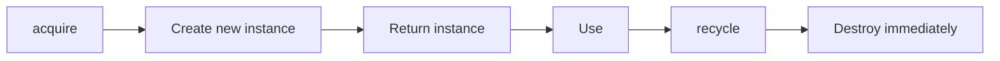
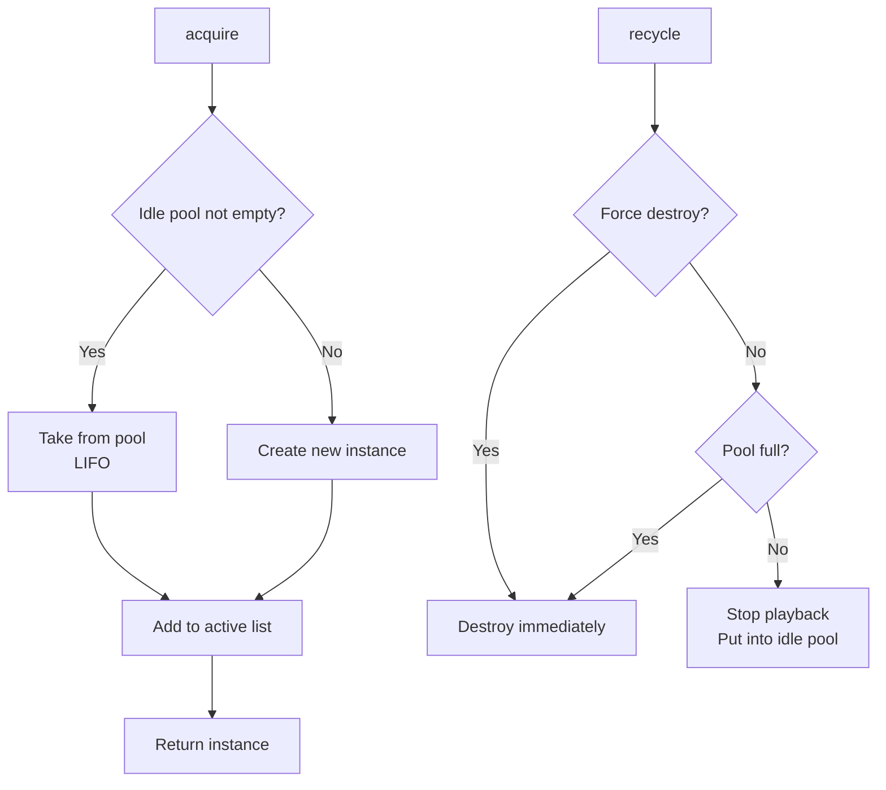
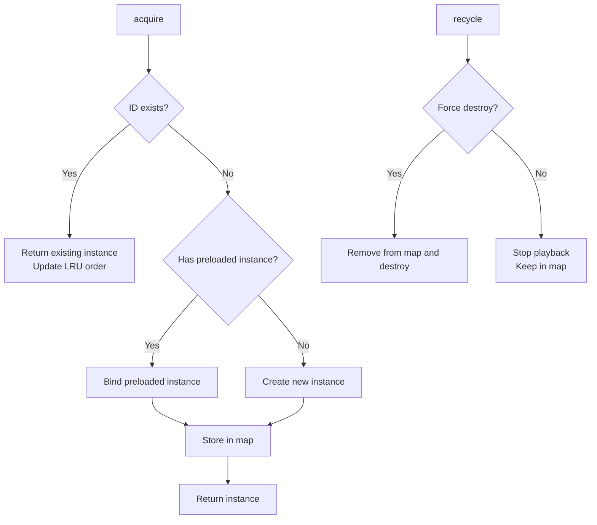
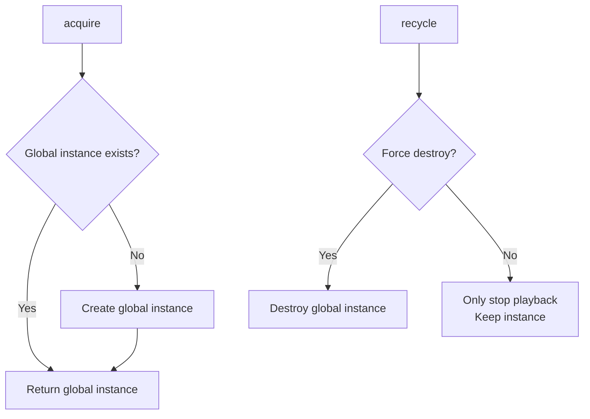
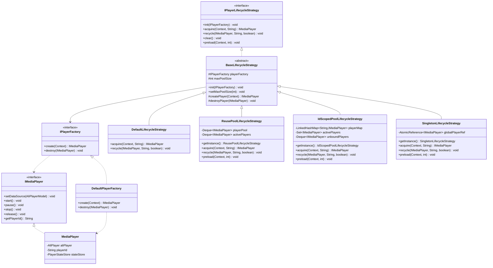
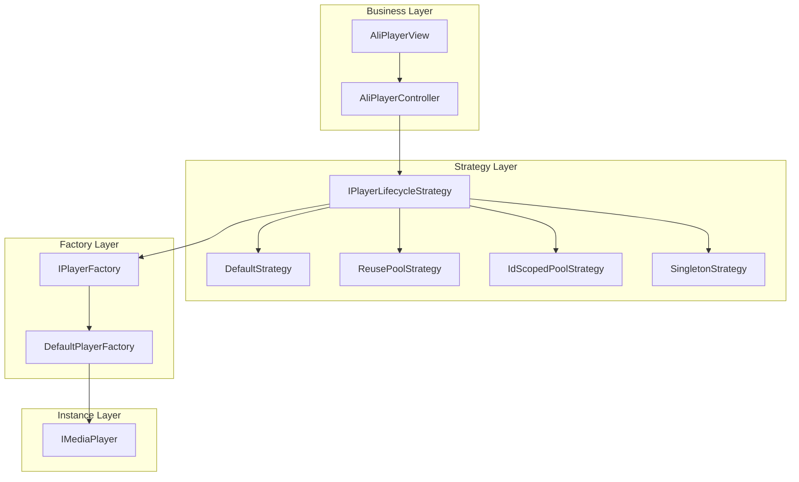

# **Player Lifecycle Strategy**

The **Player Lifecycle Strategy** is a core architectural design of AliPlayerKit, **targeted at advanced technical developers**. It provides an abstract strategy framework for complex playback scenarios.

By defining multiple player instance management strategies, it provides unified lifecycle management for the **creation, reuse, recycling, and destruction** of player instances, enabling more reasonable resource scheduling and performance optimization across different business scenarios, in **pursuit of ultimate performance and ultimate experience**.

---

## **1. Concept Introduction**

### **1.1 Design Background**

The architectural design of the Player Lifecycle Strategy originates from the **multi-instance player pool in Alibaba Cloud's mini-drama solution**, and is a systematic abstraction and elevation of that practice.

In mini-drama scenarios, users rapidly swipe and switch videos in a feed, placing extremely high demands on player performance: **fast first frame, smooth switching, and controllable memory**. The multi-instance player pool was born to solve these problems—through a globally shared player instance pool, it achieves instance reuse, flexible instance count configuration, and optimized thread resource management.

AliPlayerKit abstracts this practical experience into the **Strategy Pattern**, forming a more general and flexible player lifecycle management architecture that can adapt to a wider range of business scenarios.

### **1.2 What Is the Player Lifecycle Strategy?**

The **Player Lifecycle Strategy** is an architectural mechanism for managing the lifecycle of player instances. It defines core operations such as acquiring (acquire), recycling (recycle), and clearing (clear) player instances, decoupling player resource management from business code.

Different business scenarios have different requirements for managing player instances:

| Scenario | Requirements | Recommended Strategy |
|-----|---------|---------|
| Regular video playback | Simple and direct, no reuse needed | Default |
| Short video list | Frequent switching, fast first frame | ReusePool |
| Video preloading | ID bound to instance, supports preloading | IdScopedPool |
| Memory-sensitive scenarios | Globally unique instance, minimal memory footprint | Singleton |

### **1.3 Advantages of the Strategy Pattern**

Managing the player lifecycle through the strategy pattern brings the following core advantages:

- **Decoupling**: Business code does not need to care about the details of player instance creation and destruction
- **Flexibility**: Switch strategies dynamically at runtime without modifying business code
- **Extensibility**: Implement custom strategies to meet specific business needs
- **Observability**: Unified lifecycle events facilitate monitoring and debugging

---

## **2. Features**

### **2.1 Problems Solved**

- Player instance management is scattered and difficult to control uniformly
- Frequent creation/destruction of players causes performance loss
- Different scenarios cannot reuse player instances
- Memory consumption cannot be effectively controlled

### **2.2 Core Value**

| Usage Mode | Description | Advantages |
|---------|------|------|
| Default Strategy | Create a new instance each time, destroy after use | Simple and direct, no state residue |
| Reuse Pool Strategy | Maintain an object pool, reuse idle instances | Reduce creation overhead, improve first-frame speed |
| ID-Scoped Strategy | Maintain an independent instance per ID | Supports preloading, ID-bound reuse |
| Singleton Strategy | Globally unique instance | Minimum memory footprint |

**Architectural Advantages**:

- **Strategy Decoupling**: Player resource management is separated from business logic with clear responsibilities
- **Runtime Switching**: Switch strategy implementations without restart
- **Thread Safety**: All strategy implementations support multi-thread safe access
- **Event-Driven**: Lifecycle events are published via the event bus for easy monitoring

### **2.3 Core Capabilities**

| Capability | Description |
|-----|------|
| Instance Acquisition | acquire() obtains a player instance; the strategy decides whether to create or reuse |
| Instance Recycling | recycle() recycles a player instance; the strategy decides whether to destroy or retain |
| Resource Cleanup | clear() cleans up all resources, supporting safe release |
| Preloading | preload() pre-creates instances, reducing first-frame latency |
| Pool Capacity Control | setMaxPoolSize() dynamically adjusts pool capacity |

---

## **3. Built-in Components**

### **3.1 Strategy Types**

AliPlayerKit provides 4 built-in player lifecycle strategies:

| Strategy | Description | Use Case | Memory Footprint |
|-----|------|---------|---------|
| DefaultLifecycleStrategy | Default strategy: create a new instance each time, destroy immediately after use | Regular playback, simple and direct | Low |
| ReusePoolLifecycleStrategy | Reuse pool strategy: maintains an idle pool, LIFO reuse | Short video list, feed | Medium |
| IdScopedPoolLifecycleStrategy | ID-scoped strategy: maintains an independent instance per ID, LRU eviction | Video preloading, multi-video switching | Medium |
| SingletonLifecycleStrategy | Singleton strategy: globally unique instance | Memory-sensitive scenarios, single video playback | Lowest |

### **3.2 Strategy Details**

#### **3.2.1 DefaultLifecycleStrategy**

The simplest strategy: each acquire() call creates a new instance, and each recycle() destroys it immediately.



**Characteristics**:
- Stateless—each is a brand-new instance
- No reuse, suitable for simple scenarios
- Lowest memory footprint (released immediately after use)

#### **3.2.2 ReusePoolLifecycleStrategy**

Based on the object pool pattern, it maintains an idle pool and an active list. Uses LIFO (Last-In-First-Out) for instance reuse.



**Characteristics**:
- Idle pool LIFO strategy: most recently used instances are reused first
- Supports preloading—pre-create instances in advance
- Configurable pool capacity; instances exceeding capacity are destroyed
- Suitable for short video list and feed scenarios

**Memory Suggestion**: Each player instance occupies approximately 35–40MB of memory. The default pool capacity is 3, which can be adjusted based on device performance.

#### **3.2.3 IdScopedPoolLifecycleStrategy**

Maintains an independent player instance for each uniqueId. The same uniqueId always returns the same instance. Uses LRU (Least Recently Used) to control the number of instances.



**Characteristics**:
- ID-bound: the same ID always reuses the same instance
- LRU eviction mechanism: automatically clears the least recently used instances
- Supports preloading—pre-create unbound instances in advance
- Suitable for video preloading and multi-video switching scenarios

#### **3.2.4 SingletonLifecycleStrategy**

Maintains a single globally unique player instance. Regardless of the uniqueId value, always returns the same instance.



**Characteristics**:
- Globally unique: all places share the same instance
- Lowest memory footprint
- Not suitable for scenarios with simultaneous multi-video playback

### **3.3 Lifecycle Events**

The strategy publishes lifecycle events during execution. They can be observed via the event bus:

| Event | Description | Trigger Timing |
|-----|------|---------|
| PlayerCreated | Player created | When a new instance is created |
| PlayerDestroyed | Player destroyed | When an instance is destroyed |
| PlayerReused | Player reused | When an instance is taken from the pool for reuse |
| PlayerHit | Player hit | When the same ID hits an existing instance |
| PlayerEvicted | Player evicted | On LRU eviction or pool overflow |

---

## **4. Basic Usage**

### **4.1 Use the Default Strategy**

The simplest usage, no extra configuration required:

```java
// Create the controller (DefaultLifecycleStrategy is used automatically)
AliPlayerController controller = new AliPlayerController(context);

// Bind playback
AliPlayerModel model = new AliPlayerModel.Builder()
        .videoSource(videoSource)
        .build();
controller.configure(model);
playerView.attach(controller);
```

### **4.2 Use the Reuse Pool Strategy**

Suitable for short video list and feed scenarios:

```java
// Get the singleton of the reuse pool strategy
ReusePoolLifecycleStrategy strategy = ReusePoolLifecycleStrategy.getInstance();

// Set the pool capacity (optional, default is 3)
strategy.setMaxPoolSize(3);

// Inject the strategy when creating the controller
AliPlayerController controller = new AliPlayerController(context, strategy);

// Clean up resources after use
strategy.clear();
```

### **4.3 Use the ID-Scoped Strategy**

Suitable for scenarios that require preloading and multi-video switching:

```java
// Get the singleton of the ID-scoped strategy
IdScopedPoolLifecycleStrategy strategy = IdScopedPoolLifecycleStrategy.getInstance();

// Set the pool capacity
strategy.setMaxPoolSize(3);

// Preload player instances (optional)
strategy.preload(context, 2);

// Inject the strategy when creating the controller
AliPlayerController controller = new AliPlayerController(context, strategy);

// Clean up resources after use
strategy.clear();
```

### **4.4 Use the Singleton Strategy**

Suitable for memory-sensitive scenarios:

```java
// Get the singleton instance
SingletonLifecycleStrategy strategy = SingletonLifecycleStrategy.getInstance();

// Preload (optional, only one instance is created)
strategy.preload(context, 1);

// Inject the strategy when creating the controller
AliPlayerController controller = new AliPlayerController(context, strategy);
```

---

## **5. Advanced Usage**

### **5.1 How to Listen to Lifecycle Events?**

Listen to internal lifecycle events of the strategy via the event bus, useful for debugging and monitoring:

```java
PlayerEventBus eventBus = PlayerEventBus.getInstance();

// Listen for player creation
eventBus.subscribe(PlayerLifecycleEvents.PlayerCreated.class, event -> {
    Log.d("Player", "Created: " + event.playerId);
});

// Listen for player reuse
eventBus.subscribe(PlayerLifecycleEvents.PlayerReused.class, event -> {
    Log.d("Player", "Reused: " + event.playerId);
});

// Listen for player eviction
eventBus.subscribe(PlayerLifecycleEvents.PlayerEvicted.class, event -> {
    Log.d("Player", "Evicted: " + event.playerId);
});

// Listen for player destruction
eventBus.subscribe(PlayerLifecycleEvents.PlayerDestroyed.class, event -> {
    Log.d("Player", "Destroyed: " + event.playerId);
});

// Unsubscribe when no longer needed
eventBus.unsubscribe(PlayerLifecycleEvents.PlayerCreated.class, listener);
```

### **5.2 How to Switch Strategies Dynamically?**

The strategy can be switched dynamically at runtime according to business needs:

```java
private IPlayerLifecycleStrategy mCurrentStrategy;

private void switchToReusePool() {
    // 1. Clean up old resources
    if (mCurrentStrategy != null) {
        mCurrentStrategy.clear();
    }

    // 2. Switch to the reuse pool strategy
    mCurrentStrategy = ReusePoolLifecycleStrategy.getInstance();
    mCurrentStrategy.setMaxPoolSize(3);

    // 3. Preload
    mCurrentStrategy.preload(this, 2);
}

private void switchToSingleton() {
    // 1. Clean up old resources
    if (mCurrentStrategy != null) {
        mCurrentStrategy.clear();
    }

    // 2. Switch to the singleton strategy
    mCurrentStrategy = SingletonLifecycleStrategy.getInstance();
}
```

### **5.3 How to Preload Player Instances?**

Preloading can pre-create player instances in advance to reduce first-frame latency:

```java
// Reuse pool strategy: preloaded instances are placed into the idle pool
ReusePoolLifecycleStrategy strategy = ReusePoolLifecycleStrategy.getInstance();
strategy.preload(context, 2);  // Pre-create 2 instances

// ID-scoped strategy: preload unbound instances
IdScopedPoolLifecycleStrategy strategy = IdScopedPoolLifecycleStrategy.getInstance();
strategy.preload(context, 2);  // Pre-create 2 unbound instances

// Singleton strategy: preload the global instance
SingletonLifecycleStrategy strategy = SingletonLifecycleStrategy.getInstance();
strategy.preload(context, 1);  // Create the global instance (count parameter is ignored)
```

### **5.4 How to Implement a Custom Strategy?**

Implement a custom strategy by extending BaseLifecycleStrategy:

```java
public class MyCustomStrategy extends BaseLifecycleStrategy {

    private final Map<String, IMediaPlayer> playerMap = new HashMap<>();

    @NonNull
    @Override
    public IMediaPlayer acquire(@NonNull Context context, @NonNull String uniqueId) {
        // Custom acquisition logic
        IMediaPlayer player = playerMap.get(uniqueId);
        if (player != null) {
            // Hit an existing instance
            PlayerEventBus.getInstance().post(
                new PlayerLifecycleEvents.PlayerHit(player.getPlayerId()));
            return player;
        }

        // Create a new instance
        player = createPlayer(context);
        playerMap.put(uniqueId, player);
        return player;
    }

    @Override
    public void recycle(@Nullable IMediaPlayer player, @NonNull String uniqueId, boolean force) {
        if (player == null) return;

        if (force) {
            // Force destroy
            playerMap.remove(uniqueId);
            destroyPlayer(player);
        } else {
            // Only stop, keep the instance
            player.stop();
        }
    }

    @Override
    public void clear() {
        // Clean up all instances
        for (IMediaPlayer player : playerMap.values()) {
            destroyPlayer(player);
        }
        playerMap.clear();
    }
}
```

---

## **6. Best Practices**

### **6.1 Strategy Selection Guide**

| Scenario | Recommended Strategy | Description |
|-----|---------|------|
| Regular video playback | Default | Simple and direct, no extra overhead |
| Short video list (TikTok-like) | ReusePool | Reuse instances, fast switching |
| Video preloading | IdScopedPool | ID-bound, supports preloading |
| Low-end devices | Singleton | Minimum memory footprint |
| Educational videos (multi-video switching) | IdScopedPool | Preload the next video |

### **6.2 Memory Optimization Suggestions**

Each player instance occupies approximately **35–40MB** of memory (based on memory profiling results from Alibaba Cloud's mini-drama multi-instance player pool). Adjust the pool capacity based on device performance:

| Device Type | Recommended Configuration | Pool Capacity |
|---------|---------|-------|
| High-end devices | ReusePool or IdScopedPool | 3 |
| Mid-range devices | ReusePool or IdScopedPool | 2 |
| Low-end devices | Singleton | 1 (default) |
| Memory-sensitive scenarios | Singleton | 1 |

```java
// Adjust dynamically based on device memory
ActivityManager am = (ActivityManager) context.getSystemService(Context.ACTIVITY_SERVICE);
boolean isLowMemory = am.isLowRamDevice();

if (isLowMemory) {
    // Low memory devices use the singleton strategy
    strategy = SingletonLifecycleStrategy.getInstance();
} else {
    // Regular devices use the reuse pool strategy
    strategy = ReusePoolLifecycleStrategy.getInstance();
    strategy.setMaxPoolSize(isHighEndDevice ? 3 : 2);
}
```

### **6.3 Notes**

| Item | Description |
|-----|------|
| Cleanup promptly | Call clear() or recycle(force=true) when the page is destroyed to release resources |
| Strategy singletons | ReusePool, IdScopedPool, and Singleton are all singletons—globally shared state |
| Thread safety | All strategy implementations are thread-safe and can be used in multi-threaded environments |
| Event unbinding | After listening to lifecycle events, unsubscribe at appropriate times to avoid memory leaks |
| Initialization order | The strategy is initialized automatically; no need to manually call init() |

---

## **7. Example Reference**

The project provides a complete example located at `playerkit-examples/example-lifecycle-strategy`.

### **7.1 Example Features**

| Feature | Description |
|-----|------|
| Strategy Switching | Dynamically switch between the 4 built-in strategies |
| Status Display | Display strategy status in real time (Created/Reused/Hit/Evicted) |
| Event Listening | Listen for and display lifecycle events |
| Multi-Video Playback | Demonstrate multi-video switching effects under different strategies |

### **7.2 Running the Example**

In the Demo App, select the "Lifecycle Strategy" example to view the effects.

---

## **8. API Reference**

### **8.1 Class Structure**



### **8.2 Core Interfaces**

| Interface/Class | Description |
|--------|--------------------|
| `IPlayerLifecycleStrategy` | Player lifecycle strategy interface, defines core operations |
| `BaseLifecycleStrategy` | Strategy base class, encapsulates common logic |
| `IPlayerFactory` | Player factory interface, responsible for creating and destroying instances |

### **8.3 IPlayerLifecycleStrategy Methods**

| Method | Description |
|-----|------|
| `init(IPlayerFactory)` | Initialize the strategy and inject the player factory |
| `acquire(Context, String)` | Acquire a player instance |
| `recycle(IMediaPlayer, String, boolean)` | Recycle a player instance |
| `clear()` | Clean up all resources |
| `preload(Context, int)` | Preload player instances |

### **8.4 BaseLifecycleStrategy Methods**

| Method | Description |
|-----|------|
| `setMaxPoolSize(int)` | Set the maximum pool capacity (only effective for pool strategies) |
| `createPlayer(Context)` | Create a player instance (called by subclass) |
| `destroyPlayer(IMediaPlayer)` | Destroy a player instance (called by subclass) |

---

## **9. Technical Principles**

### **9.1 Strategy Pattern Architecture**



### **9.2 Thread Safety Mechanism**

| Strategy | Thread Safety Mechanism |
|-----|------------|
| DefaultLifecycleStrategy | Stateless, thread-safe |
| ReusePoolLifecycleStrategy | synchronized blocks |
| IdScopedPoolLifecycleStrategy | synchronized blocks |
| SingletonLifecycleStrategy | AtomicReference + double-checked locking |

### **9.3 Pooling Strategy Comparison**

| Feature | ReusePool | IdScopedPool |
|-----|-----------|--------------|
| Reuse Mechanism | LIFO (Last-In-First-Out) | ID binding + LRU |
| Preload Support | Yes (placed into idle pool) | Yes (unbound queue) |
| Eviction Strategy | Evict when pool is full | LRU automatic eviction |
| Use Case | Short video list | Multi-video preloading |

**💡 Underlying Architectural Reasoning:**

- **Why does ReusePool use LIFO (Last-In-First-Out)?**

  In feed scenarios with frequent up/down swiping, the player instance just placed into the idle pool has the "hottest" underlying decoder context and hardware resources (cache hasn't yet been paged out by the system). Waking it up first significantly reduces the system's underlying context reset overhead and improves first-frame speed (based on the principle of spatial locality).

- **Why does IdScopedPool use LRU (Least Recently Used eviction)?**

  Multi-instance pooling follows the law of "temporal locality": as the user's browsing flow progresses, the probability of immediately replaying a video from far in the past decreases. LRU eviction conforms to the decay pattern of the user's historical browsing trajectory, effectively controlling the application's peak memory while still fully binding to the ID.

---

## **10. FAQ**

### **10.1 How to Choose an Appropriate Strategy?**

Choose based on the business scenario:

- **Simple playback scenarios**: use the Default strategy, no extra complexity
- **Short videos / feed**: use the ReusePool strategy for fast switching
- **Video preloading**: use the IdScopedPool strategy with ID binding
- **Memory-sensitive**: use the Singleton strategy for minimum footprint

### **10.2 What Is the Appropriate Pool Capacity?**

Adjust based on device performance and business needs:

- Each player instance occupies approximately 35–40MB of memory
- The default pool capacity is 3, occupying about 100–120MB
- For low-end devices, set it to 2 or use Singleton

### **10.3 When to Use Preloading?**

Preloading is suitable for scenarios where you need to reduce first-frame latency:

- Short video list: preload 1–2 instances
- Video detail page: preload the next recommended video
- Avoid excessive preloading: it increases memory usage

### **10.4 Common Crash Anti-Patterns**

The following are the most common issues reported by customers. Avoid them:

#### **Anti-Pattern 1: Forgetting to Call clear() Causes Memory Leak**

**Wrong code**:

```java
@Override
protected void onDestroy() {
    super.onDestroy();
    // ❌ Only the View is detached; forgot to clean up instances held by the strategy
    mPlayerView.detach();
}
```

**Cause**: The strategy (e.g., ReusePool) internally holds references to player instances. Not cleaning up causes memory leaks.

**Correct code**:

```java
@Override
protected void onDestroy() {
    super.onDestroy();
    // ✅ Detach the View
    mPlayerView.detach();
    // ✅ Clean up strategy resources
    if (mStrategy != null) {
        mStrategy.clear();
    }
}
```

---

#### **Anti-Pattern 2: Event Listener Not Cancelled Causes Memory Leak**

**Wrong code**:

```java
@Override
protected void onCreate(Bundle savedInstanceState) {
    super.onCreate(savedInstanceState);
    // ❌ Subscribed to the event but never unsubscribed
    PlayerEventBus.getInstance().subscribe(
        PlayerLifecycleEvents.PlayerCreated.class,
        event -> updateUI()
    );
}
```

**Cause**: The event bus holds a reference to the Activity. After the Activity is destroyed, it cannot be released.

**Correct code**:

```java
private PlayerEventBus.EventListener<PlayerLifecycleEvents.PlayerCreated> mListener;

@Override
protected void onCreate(Bundle savedInstanceState) {
    super.onCreate(savedInstanceState);
    mListener = event -> updateUI();
    PlayerEventBus.getInstance().subscribe(
        PlayerLifecycleEvents.PlayerCreated.class, mListener);
}

@Override
protected void onDestroy() {
    super.onDestroy();
    // ✅ Unsubscribe
    if (mListener != null) {
        PlayerEventBus.getInstance().unsubscribe(
            PlayerLifecycleEvents.PlayerCreated.class, mListener);
    }
}
```

---

#### **Anti-Pattern 3: Continuing to Use the Player Instance After recycle**

**Wrong code**:

```java
// Recycle the player
strategy.recycle(player, "video_1", false);

// ❌ Continuing to use after recycling
player.start();  // May cause an exception
```

**Cause**: After recycling, the player may have been stopped or destroyed; continuing to use it can cause exceptions.

**Correct code**:

```java
// Recycle the player
strategy.recycle(player, "video_1", false);
player = null;  // ✅ Clear the reference to avoid misuse

// Re-acquire when needed again
player = strategy.acquire(context, "video_1");
```

---

### **10.5 How to Debug?**

1. **Check logs**: Use `tag:AliPlayerKit` to filter Logcat

2. **Listen to lifecycle events**: Observe creation, reuse, and eviction actions via the event bus

3. **Inspect pool state**: Check the current pool size and number of active instances via logs

4. **Memory analysis**: Use Android Profiler to inspect the number of player instances and memory usage
