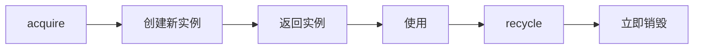
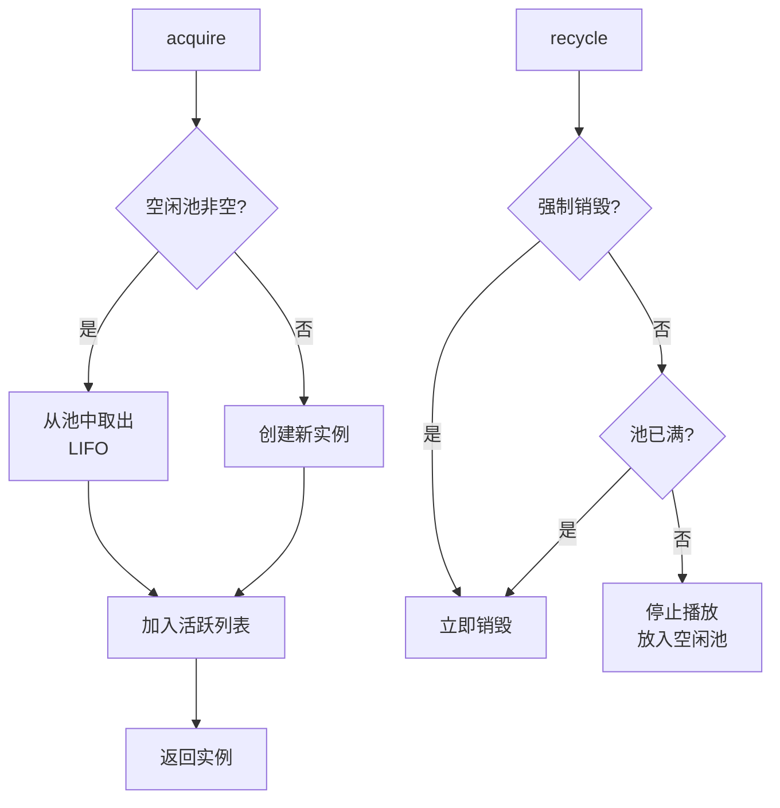
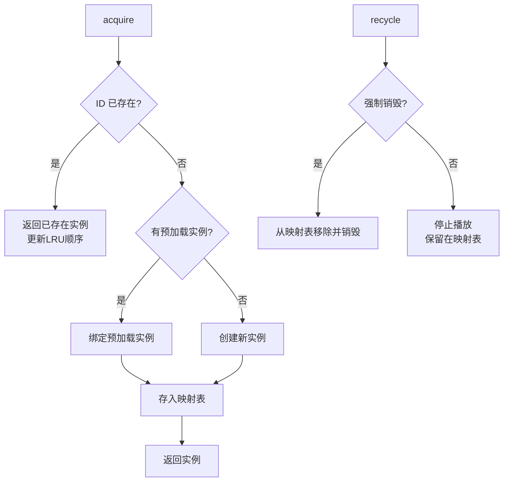
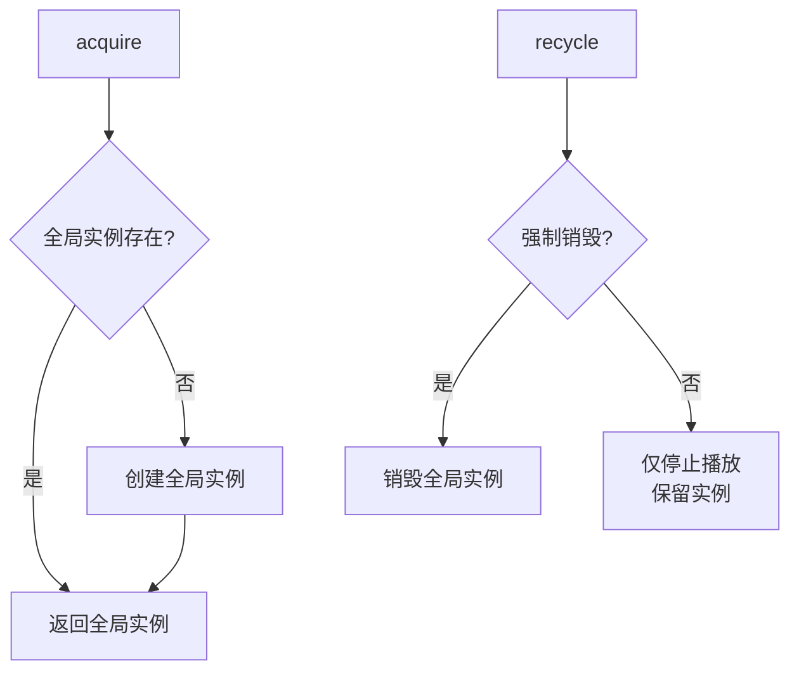
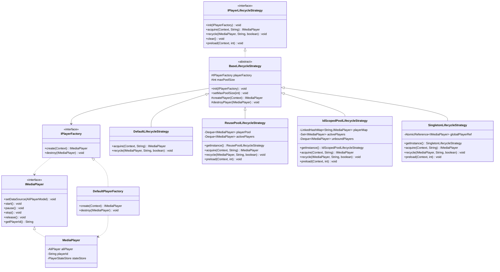
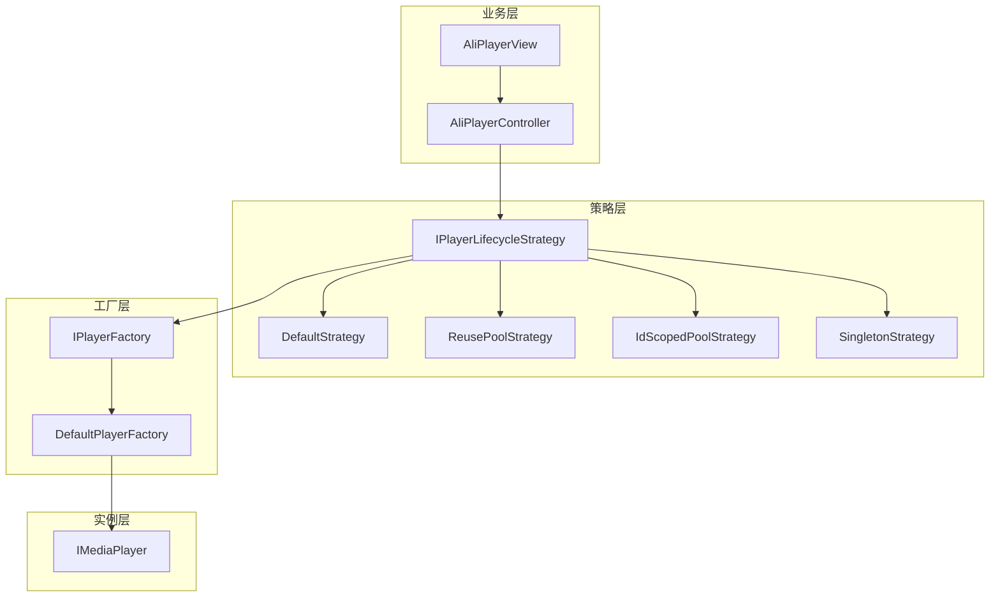

Language: 中文简体 | [English](LifecycleStrategy-EN.md)

# **播放器生命周期策略 (Player Lifecycle Strategy)**

**播放器生命周期策略 (Player Lifecycle Strategy)** 是 AliPlayerKit 的核心架构设计，**面向高阶技术开发者**，为复杂播放场景提供的一套抽象化策略框架。

通过定义多种播放器实例管理策略，对播放器实例的 **创建、复用、回收与销毁** 进行统一的生命周期管理，从而在不同业务场景下实现更合理的资源调度与性能优化，**追求极致性能与极致体验**。

---

## **1. 概念介绍**

### **1.1 设计背景**

播放器生命周期策略的架构设计，源于**阿里云微短剧解决方案**中的多实例播放器池，是对其的系统性抽象与升华。

微短剧场景下，用户在信息流中快速滑动切换视频，对播放器性能提出了极高要求：**首帧要快、切换要顺滑、内存要可控**。多实例播放器池正是为解决这些问题而生，通过全局共享的播放器实例池，实现实例复用、灵活配置实例数、优化线程资源管控。

AliPlayerKit 将这一实践经验抽象为**策略模式**，形成了更加通用、灵活的播放器生命周期管理架构，使其能够适应更广泛的业务场景。

### **1.2 什么是播放器生命周期策略？**

**播放器生命周期策略 (Player Lifecycle Strategy)** 是用于管理播放器实例生命周期的架构机制。它定义了播放器实例的获取（acquire）、回收（recycle）、清理（clear）等核心操作，将播放器资源管理从业务代码中解耦出来。

不同的业务场景对播放器实例的管理有不同的需求：

| 场景 | 需求特点 | 推荐策略 |
|-----|---------|---------|
| 普通视频播放 | 简单直接，无需复用 | Default |
| 短视频列表 | 频繁切换，需要快速起播 | ReusePool |
| 视频预加载 | ID 与实例绑定，支持预加载 | IdScopedPool |
| 内存敏感场景 | 全局唯一实例，最小内存占用 | Singleton |

### **1.3 策略模式的优势**

通过策略模式管理播放器生命周期，带来以下核心优势：

- **解耦**：业务代码无需关心播放器实例的创建和销毁细节
- **灵活**：运行时动态切换策略，无需修改业务代码
- **可扩展**：可实现自定义策略，满足特定业务需求
- **可观测**：统一的生命周期事件，便于监控和调试

---

## **2. 功能特性**

### **2.1 解决问题**

- 播放器实例管理分散，难以统一控制
- 频繁创建/销毁播放器导致性能损耗
- 不同场景无法复用播放器实例
- 内存占用无法有效控制

### **2.2 核心价值**

| 使用方式 | 说明 | 优势 |
|---------|------|------|
| 默认策略 | 每次创建新实例，用完销毁 | 简单直接，无状态残留 |
| 复用池策略 | 维护对象池，复用空闲实例 | 减少创建开销，提升起播速度 |
| ID 作用域策略 | 为每个 ID 维护独立实例 | 支持预加载，ID 绑定复用 |
| 单例策略 | 全局唯一实例 | 最小内存占用 |

**架构优势**：

- **策略解耦**：播放器资源管理与业务逻辑分离，职责清晰
- **运行时切换**：无需重启即可切换策略实现
- **线程安全**：所有策略实现都支持多线程安全访问
- **事件驱动**：通过事件总线发布生命周期事件，便于监控

### **2.3 核心能力**

| 能力 | 说明 |
|-----|------|
| 实例获取 | acquire() 获取播放器实例，由策略决定创建或复用 |
| 实例回收 | recycle() 回收播放器实例，由策略决定销毁或保留 |
| 资源清理 | clear() 清理所有资源，支持安全释放 |
| 预加载 | preload() 预创建实例，减少首帧耗时 |
| 池容量控制 | setMaxPoolSize() 动态调整池容量 |

---

## **3. 内置组件详解**

### **3.1 策略类型**

AliPlayerKit 提供 4 种内置的播放器生命周期策略：

| 策略 | 说明 | 适用场景 | 内存占用 |
|-----|------|---------|---------|
| DefaultLifecycleStrategy | 默认策略，每次创建新实例，用完立即销毁 | 普通播放场景，简单直接 | 低 |
| ReusePoolLifecycleStrategy | 复用池策略，维护空闲池，LIFO 复用 | 短视频列表、信息流 | 中 |
| IdScopedPoolLifecycleStrategy | ID 作用域策略，为每个 ID 维护独立实例，LRU 淘汰 | 视频预加载、多视频切换 | 中 |
| SingletonLifecycleStrategy | 单例策略，全局唯一实例 | 内存敏感场景、单视频播放 | 最低 |

### **3.2 策略详解**

#### **3.2.1 DefaultLifecycleStrategy**

最简单的策略，每次调用 acquire() 创建新实例，每次 recycle() 立即销毁。



**特点**：
- 无状态，每次都是全新实例
- 无复用，适合简单场景
- 内存占用最低（用完即释放）

#### **3.2.2 ReusePoolLifecycleStrategy**

基于对象池模式，维护空闲池和活跃列表。使用 LIFO（后进先出）策略复用实例。



**特点**：
- 空闲池 LIFO 策略，最近使用的实例优先复用
- 支持预加载，提前创建实例
- 池容量可配置，超出时销毁
- 适合短视频列表、信息流场景

**内存建议**：每个播放器实例约占用 35~40MB 内存。默认池容量为 3，可根据设备性能调整。

#### **3.2.3 IdScopedPoolLifecycleStrategy**

为每个 uniqueId 维护独立的播放器实例。相同 uniqueId 始终返回同一实例。使用 LRU（最近最少使用）机制控制实例数量。



**特点**：
- ID 绑定，相同 ID 始终复用同一实例
- LRU 淘汰机制，自动清理最近最少使用的实例
- 支持预加载，提前创建未绑定实例
- 适合视频预加载、多视频切换场景

#### **3.2.4 SingletonLifecycleStrategy**

全局维护唯一一个播放器实例。无论 uniqueId 为何值，始终返回同一实例。



**特点**：
- 全局唯一，所有位置共享同一实例
- 内存占用最低
- 不适合多视频同时播放场景

### **3.3 生命周期事件**

策略执行过程中会发布生命周期事件，可通过事件总线监听：

| 事件 | 说明 | 触发时机 |
|-----|------|---------|
| PlayerCreated | 播放器创建 | 创建新实例时 |
| PlayerDestroyed | 播放器销毁 | 销毁实例时 |
| PlayerReused | 播放器复用 | 从池中取出复用时 |
| PlayerHit | 播放器命中 | 相同 ID 命中已存在实例时 |
| PlayerEvicted | 播放器淘汰 | LRU 淘汰或池满时 |

---

## **4. 基础使用**

### **4.1 使用默认策略**

最简单的使用方式，无需额外配置：

```java
// 创建控制器（自动使用 DefaultLifecycleStrategy）
AliPlayerController controller = new AliPlayerController(context);

// 绑定播放
AliPlayerModel model = new AliPlayerModel.Builder()
        .videoSource(videoSource)
        .build();
playerView.attach(controller, model);
```

### **4.2 使用复用池策略**

适合短视频列表、信息流场景：

```java
// 获取复用池策略单例
ReusePoolLifecycleStrategy strategy = ReusePoolLifecycleStrategy.getInstance();

// 设置池容量（可选，默认为 3）
strategy.setMaxPoolSize(3);

// 创建控制器时注入策略
AliPlayerController controller = new AliPlayerController(context, strategy);

// 使用完毕后清理资源
strategy.clear();
```

### **4.3 使用 ID 作用域策略**

适合需要预加载和多视频切换的场景：

```java
// 获取 ID 作用域策略单例
IdScopedPoolLifecycleStrategy strategy = IdScopedPoolLifecycleStrategy.getInstance();

// 设置池容量
strategy.setMaxPoolSize(3);

// 预加载播放器实例（可选）
strategy.preload(context, 2);

// 创建控制器时注入策略
AliPlayerController controller = new AliPlayerController(context, strategy);

// 使用完毕后清理资源
strategy.clear();
```

### **4.4 使用单例策略**

适合内存敏感场景：

```java
// 获取单例策略实例
SingletonLifecycleStrategy strategy = SingletonLifecycleStrategy.getInstance();

// 预加载（可选，只创建一个实例）
strategy.preload(context, 1);

// 创建控制器时注入策略
AliPlayerController controller = new AliPlayerController(context, strategy);
```

---

## **5. 进阶使用**

### **5.1 如何监听生命周期事件？**

通过事件总线监听策略内部的生命周期事件，用于调试和监控：

```java
PlayerEventBus eventBus = PlayerEventBus.getInstance();

// 监听播放器创建
eventBus.subscribe(PlayerLifecycleEvents.PlayerCreated.class, event -> {
    Log.d("Player", "Created: " + event.playerId);
});

// 监听播放器复用
eventBus.subscribe(PlayerLifecycleEvents.PlayerReused.class, event -> {
    Log.d("Player", "Reused: " + event.playerId);
});

// 监听播放器淘汰
eventBus.subscribe(PlayerLifecycleEvents.PlayerEvicted.class, event -> {
    Log.d("Player", "Evicted: " + event.playerId);
});

// 监听播放器销毁
eventBus.subscribe(PlayerLifecycleEvents.PlayerDestroyed.class, event -> {
    Log.d("Player", "Destroyed: " + event.playerId);
});

// 不再需要时取消订阅
eventBus.unsubscribe(PlayerLifecycleEvents.PlayerCreated.class, listener);
```

### **5.2 如何动态切换策略？**

运行时可以根据业务需求动态切换策略：

```java
private IPlayerLifecycleStrategy mCurrentStrategy;

private void switchToReusePool() {
    // 1. 清理旧资源
    if (mCurrentStrategy != null) {
        mCurrentStrategy.clear();
    }

    // 2. 切换到复用池策略
    mCurrentStrategy = ReusePoolLifecycleStrategy.getInstance();
    mCurrentStrategy.setMaxPoolSize(3);

    // 3. 预加载
    mCurrentStrategy.preload(this, 2);
}

private void switchToSingleton() {
    // 1. 清理旧资源
    if (mCurrentStrategy != null) {
        mCurrentStrategy.clear();
    }

    // 2. 切换到单例策略
    mCurrentStrategy = SingletonLifecycleStrategy.getInstance();
}
```

### **5.3 如何预加载播放器实例？**

预加载可以提前创建播放器实例，减少首帧耗时：

```java
// 复用池策略：预加载实例放入空闲池
ReusePoolLifecycleStrategy strategy = ReusePoolLifecycleStrategy.getInstance();
strategy.preload(context, 2);  // 预创建 2 个实例

// ID 作用域策略：预加载未绑定实例
IdScopedPoolLifecycleStrategy strategy = IdScopedPoolLifecycleStrategy.getInstance();
strategy.preload(context, 2);  // 预创建 2 个未绑定实例

// 单例策略：预加载全局实例
SingletonLifecycleStrategy strategy = SingletonLifecycleStrategy.getInstance();
strategy.preload(context, 1);  // 创建全局实例（count 参数被忽略）
```

### **5.4 如何实现自定义策略？**

通过继承 BaseLifecycleStrategy 实现自定义策略：

```java
public class MyCustomStrategy extends BaseLifecycleStrategy {

    private final Map<String, IMediaPlayer> playerMap = new HashMap<>();

    @NonNull
    @Override
    public IMediaPlayer acquire(@NonNull Context context, @NonNull String uniqueId) {
        // 自定义获取逻辑
        IMediaPlayer player = playerMap.get(uniqueId);
        if (player != null) {
            // 命中已有实例
            PlayerEventBus.getInstance().post(
                new PlayerLifecycleEvents.PlayerHit(player.getPlayerId()));
            return player;
        }

        // 创建新实例
        player = createPlayer(context);
        playerMap.put(uniqueId, player);
        return player;
    }

    @Override
    public void recycle(@Nullable IMediaPlayer player, @NonNull String uniqueId, boolean force) {
        if (player == null) return;

        if (force) {
            // 强制销毁
            playerMap.remove(uniqueId);
            destroyPlayer(player);
        } else {
            // 仅停止，保留实例
            player.stop();
        }
    }

    @Override
    public void clear() {
        // 清理所有实例
        for (IMediaPlayer player : playerMap.values()) {
            destroyPlayer(player);
        }
        playerMap.clear();
    }
}
```

---

## **6. 最佳实践**

### **6.1 策略选择指南**

| 场景 | 推荐策略 | 说明 |
|-----|---------|------|
| 普通视频播放 | Default | 简单直接，无额外开销 |
| 短视频列表（类似 TikTok） | ReusePool | 复用实例，快速切换 |
| 视频预加载 | IdScopedPool | ID 绑定，支持预加载 |
| 低端设备 | Singleton | 最小内存占用 |
| 教育视频（多视频切换） | IdScopedPool | 预加载下一视频 |

### **6.2 内存优化建议**

每个播放器实例约占用 **35~40MB** 内存（基于阿里云微短剧多实例播放器池的内存 Profiling 结果），建议根据设备性能调整池容量：

| 设备类型 | 推荐配置 | 池容量 |
|---------|---------|-------|
| 高端设备 | ReusePool 或 IdScopedPool | 3 |
| 中端设备 | ReusePool 或 IdScopedPool | 2 |
| 低端设备 | Singleton | 1（默认） |
| 内存敏感场景 | Singleton | 1 |

```java
// 根据设备内存动态调整
ActivityManager am = (ActivityManager) context.getSystemService(Context.ACTIVITY_SERVICE);
boolean isLowMemory = am.isLowRamDevice();

if (isLowMemory) {
    // 低内存设备使用单例策略
    strategy = SingletonLifecycleStrategy.getInstance();
} else {
    // 普通设备使用复用池策略
    strategy = ReusePoolLifecycleStrategy.getInstance();
    strategy.setMaxPoolSize(isHighEndDevice ? 3 : 2);
}
```

### **6.3 注意事项**

| 事项 | 说明 |
|-----|------|
| 及时清理 | 页面销毁时调用 clear() 或 recycle(force=true) 释放资源 |
| 策略单例 | ReusePool、IdScopedPool、Singleton 都是单例，全局共享状态 |
| 线程安全 | 所有策略实现都是线程安全的，可放心在多线程环境使用 |
| 事件解绑 | 监听生命周期事件后，需在适当时机取消订阅，避免内存泄漏 |
| 初始化顺序 | 策略会自动初始化，无需手动调用 init() |

---

## **7. 示例参考**

项目提供了完整的示例，位于 `playerkit-examples/example-lifecycle-strategy`。

### **7.1 示例功能**

| 功能 | 说明 |
|-----|------|
| 策略切换 | 动态切换 4 种内置策略 |
| 状态展示 | 实时显示策略状态（新建/复用/命中/淘汰） |
| 事件监听 | 监听并展示生命周期事件 |
| 多视频播放 | 演示不同策略下的多视频切换效果 |

### **7.2 运行示例**

在 Demo App 中选择「Lifecycle Strategy」示例查看效果。

---

## **8. API 参考**

### **8.1 类结构**



### **8.2 核心接口**

| 接口/类 | 说明                 |
|--------|--------------------|
| `IPlayerLifecycleStrategy` | 播放器生命周期策略接口，定义核心操作 |
| `BaseLifecycleStrategy` | 策略基类，封装通用逻辑        |
| `IPlayerFactory` | 播放器工厂接口，负责创建和销毁实例  |

### **8.3 IPlayerLifecycleStrategy 方法**

| 方法 | 说明 |
|-----|------|
| `init(IPlayerFactory)` | 初始化策略，注入播放器工厂 |
| `acquire(Context, String)` | 获取播放器实例 |
| `recycle(IMediaPlayer, String, boolean)` | 回收播放器实例 |
| `clear()` | 清理所有资源 |
| `preload(Context, int)` | 预加载播放器实例 |

### **8.4 BaseLifecycleStrategy 方法**

| 方法 | 说明 |
|-----|------|
| `setMaxPoolSize(int)` | 设置池最大容量（仅对池策略有效） |
| `createPlayer(Context)` | 创建播放器实例（子类调用） |
| `destroyPlayer(IMediaPlayer)` | 销毁播放器实例（子类调用） |

---

## **9. 技术原理**

### **9.1 策略模式架构**



### **9.2 线程安全机制**

| 策略 | 线程安全机制 |
|-----|------------|
| DefaultLifecycleStrategy | 无状态，线程安全 |
| ReusePoolLifecycleStrategy | synchronized 同步块 |
| IdScopedPoolLifecycleStrategy | synchronized 同步块 |
| SingletonLifecycleStrategy | AtomicReference + 双重检查锁定 |

### **9.3 池化策略对比**

| 特性 | ReusePool | IdScopedPool |
|-----|-----------|--------------|
| 复用机制 | LIFO（后进先出） | ID 绑定 + LRU |
| 预加载支持 | 是（放入空闲池） | 是（未绑定队列） |
| 淘汰策略 | 池满时淘汰 | LRU 自动淘汰 |
| 适用场景 | 短视频列表 | 多视频预加载 |

**💡 架构底层逻辑解析：**

- **ReusePool 为什么要用 LIFO（后进先出）？**

  在 Feed 流上下滑动频繁的场景下，刚进入空闲池的播放器实例，其底层解码器上下文与硬件资源通常是最“热”的（缓存尚未被系统换页剥夺）。优先被唤醒，能够明显减少系统底层的上下文重置耗时，提升起播速度（基于空间局部性原理）。

- **IdScopedPool 为什么要用 LRU（最近最少使用淘汰）？**

  多实例池化存在“时间局部性”法则：随着用户浏览流推进，越久之前的视频立刻遭遇回放的概率越低。LRU 淘汰顺应了用户历史浏览轨迹的衰减规律，做到在完全绑定 ID 的前提下，仍能有效控制应用的内存峰值。

---

## **10. 常见问题**

### **10.1 如何选择合适的策略？**

根据业务场景选择：

- **简单播放场景**：使用 Default 策略，无额外复杂度
- **短视频/信息流**：使用 ReusePool 策略，快速切换
- **视频预加载**：使用 IdScopedPool 策略，ID 绑定
- **内存敏感**：使用 Singleton 策略，最小占用

### **10.2 池容量设置多少合适？**

建议根据设备性能和业务需求调整：

- 每个播放器实例约占用 35~40MB 内存
- 默认池容量为 3，约占用 100~120MB
- 低端设备建议设为 2 或使用 Singleton

### **10.3 预加载何时使用？**

预加载适用于需要减少首帧耗时的场景：

- 短视频列表：预加载 1~2 个实例
- 视频详情页：预加载下一个推荐视频
- 避免过多预加载：会增加内存占用

### **10.4 高频崩溃错例**

以下是客户反馈中最常导致问题的情况，请务必避免：

#### **错例 1：忘记调用 clear() 导致内存泄漏**

**错误代码**：

```java
@Override
protected void onDestroy() {
    super.onDestroy();
    // ❌ 只解绑了 View，忘记清理策略持有的实例
    mPlayerView.detach();
}
```

**问题原因**：策略（如 ReusePool）内部持有播放器实例引用，不清理会导致内存泄漏。

**正确代码**：

```java
@Override
protected void onDestroy() {
    super.onDestroy();
    // ✅ 解绑 View
    mPlayerView.detach();
    // ✅ 清理策略资源
    if (mStrategy != null) {
        mStrategy.clear();
    }
}
```

---

#### **错例 2：事件监听未取消导致内存泄漏**

**错误代码**：

```java
@Override
protected void onCreate(Bundle savedInstanceState) {
    super.onCreate(savedInstanceState);
    // ❌ 订阅了事件但从未取消
    PlayerEventBus.getInstance().subscribe(
        PlayerLifecycleEvents.PlayerCreated.class,
        event -> updateUI()
    );
}
```

**问题原因**：事件总线持有 Activity 引用，Activity 销毁后无法释放。

**正确代码**：

```java
private PlayerEventBus.EventListener<PlayerLifecycleEvents.PlayerCreated> mListener;

@Override
protected void onCreate(Bundle savedInstanceState) {
    super.onCreate(savedInstanceState);
    mListener = event -> updateUI();
    PlayerEventBus.getInstance().subscribe(
        PlayerLifecycleEvents.PlayerCreated.class, mListener);
}

@Override
protected void onDestroy() {
    super.onDestroy();
    // ✅ 取消订阅
    if (mListener != null) {
        PlayerEventBus.getInstance().unsubscribe(
            PlayerLifecycleEvents.PlayerCreated.class, mListener);
    }
}
```

---

#### **错例 3：在 recycle 后继续使用播放器实例**

**错误代码**：

```java
// 回收播放器
strategy.recycle(player, "video_1", false);

// ❌ 回收后继续使用
player.start();  // 可能导致异常
```

**问题原因**：回收后播放器可能已停止或销毁，继续使用会导致异常。

**正确代码**：

```java
// 回收播放器
strategy.recycle(player, "video_1", false);
player = null;  // ✅ 清空引用，避免误用

// 需要再次使用时，重新获取
player = strategy.acquire(context, "video_1");
```

---

### **10.5 如何调试？**

1. **查看日志**：使用 `tag:AliPlayerKit` 过滤 Logcat

2. **监听生命周期事件**：通过事件总线观察创建、复用、淘汰等动作

3. **检查池状态**：通过日志查看当前池大小和活跃实例数

4. **内存分析**：使用 Android Profiler 检查播放器实例数量和内存占用
