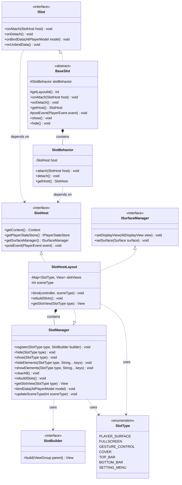
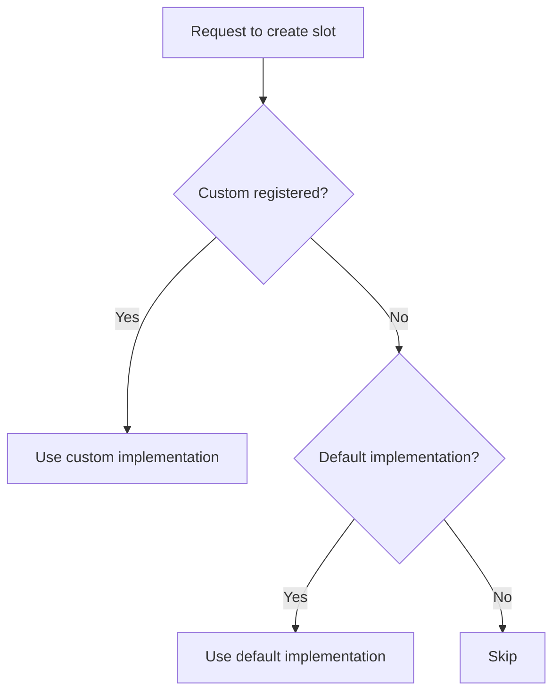
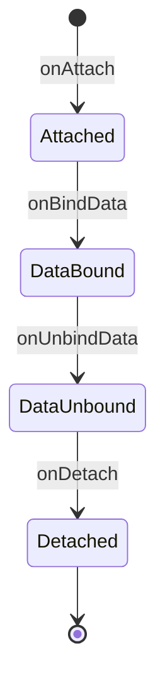

# **Slot System**

The **Slot System** is the core architectural design of AliPlayerKit. Through componentization and a pluggable mechanism, it splits the player UI into multiple independent slot components, all managed and scheduled by a unified system, enabling decoupling, composition, and flexible extension of the player interface.

---

## **1. Concept Introduction**

### **1.1 What is a Slot?**

A **Slot** is the basic building block of the player UI. Each slot represents an independent UI component responsible for a specific portion of the player interface, such as the top control bar, bottom progress bar, cover image, or hint messages.

All slots are stacked according to a predefined **z-order hierarchy**, together composing the complete player interface. Each slot focuses solely on its own UI rendering and interaction logic, enabling a clear-responsibility, fine-grained UI structure.

Through this design, the player UI is abstracted into a set of **layered, componentized** UI units, making the interface structure clearer and providing a solid foundation for future feature extension and component replacement.

### **1.2 What is the Slot System?**

The **Slot System** is the architectural mechanism for unified management of these slot components.

It defines the slot's **registration mechanism, lifecycle management, scene adaptation, and rendering order**, and uniformly manages the creation, display, hiding, and destruction of slots during player runtime.

Based on this mechanism, developers can build the player UI flexibly like assembling building blocks: they can either use the system-provided default slots to quickly assemble the player UI, replace or extend specific slots as needed, or even fully customize all components for a highly customized player interface.

---

## **2. Features**

### **2.1 Problems Solved**

- High coupling between UI components, making them hard to replace and extend
- Different scenes require different UI combinations, lacking flexibility
- Customizing the UI requires modifying framework source code

### **2.2 Core Value**

The Slot System decouples UI components from the player component, allowing customers to choose how they use it:

| Usage | Description | Advantage |
|-------|-------------|-----------|
| Use Default UI | Player component uses official default UI | Simplifies integration, lowers integration cost, low-code |
| Custom Use | Replace some or all slot implementations | Meets various rich UI requirements |
| No Slots | Use playback capability only | Pure playback scenarios, no UI dependency |

**Architectural Advantages**:

- **Decoupling**: UI components are separated from the player core logic, with clear responsibilities
- **Flexibility**: Dynamically compose and replace UI components at runtime, without restart
- **Extensibility**: Customize UI without modifying the framework, strong extensibility
- **Separation of Concerns**: UI styling is separated from business logic — layout is defined in XML files, while business logic is handled in Slot classes

### **2.3 Core Capabilities**

| Capability | Description |
|------------|-------------|
| Dynamic Composition | Freely compose UI components at runtime |
| Hot Swap | Replace component implementations without restart |
| Scene Adaptation | Automatically switch UI behavior for different playback scenes |

---

## **3. Built-in Components**

### **3.1 Slot Types**

| Slot Type | Description | Default Implementation |
|-----------|-------------|------------------------|
| PLAYER_SURFACE | Video frame display, supports multiple rendering views | DisplayViewSlot / SurfaceViewSlot / TextureViewSlot |
| FULLSCREEN | Fullscreen management, handles screen orientation switching | FullscreenSlot |
| GESTURE_CONTROL | Gesture control, handles tap/double-tap/long-press/drag | GestureControlSlot |
| LANDSCAPE_HINT | Landscape viewing hint, guides users to fullscreen | LandscapeHintSlot |
| COVER | Cover image, displays video cover before playback | CoverSlot |
| CENTER_DISPLAY | Center display, shows speed/brightness/volume status | CenterDisplaySlot |
| PLAY_STATE | Play State, displays loading/error messages | PlayStateSlot |
| LOG_PANEL | Log panel, displays player logs during debugging | LogPanelSlot |
| TOP_BAR | Top Bar, displays back/title/settings, etc. | TopBarSlot |
| BOTTOM_BAR | Bottom Bar, displays playback controls/progress bar | BottomBarSlot |
| SETTING_MENU | Settings Menu, displays speed/quality/mirror settings | SettingMenuSlot |

### **3.2 Scene Adaptation**

AliPlayerKit defines 5 playback scenes. Slot behavior automatically adapts under different scenes:

| Scene | Description | Typical Use Cases |
|-------|-------------|-------------------|
| VOD | Video-on-demand scene, supports all features | Regular video playback |
| LIVE | Live streaming scene, disables timeline operations | Real-time live streams |
| VIDEO_LIST | List playback scene, disables vertical gestures | Feed, short video lists |
| RESTRICTED | Restricted playback scene, restricts seeking | Education/training, exam monitoring |
| MINIMAL | Minimal playback scene, only displays the video frame | Background videos, decorative videos |

**Slot Visibility Rules**:

| Slot | VOD | LIVE | VIDEO_LIST | RESTRICTED | MINIMAL |
|------|-----|------|------------|------------|---------|
| PLAYER_SURFACE | ✓ | ✓ | ✓ | ✓ | ✓ |
| FULLSCREEN | ✓ | ✓ | ✓ | ✓ | ✓ |
| GESTURE_CONTROL | ✓ | ✓ | ✓ | ✓ | ✗ |
| LANDSCAPE_HINT | ✓ | ✓ | ✓ | ✓ | ✗ |
| COVER | ✓ | ✗ | ✓ | ✗ | ✗ |
| CENTER_DISPLAY | ✓ | ✓ | ✓ | ✓ | ✗ |
| PLAY_STATE | ✓ | ✓ | ✓ | ✓ | ✓ |
| LOG_PANEL | Configurable | Configurable | Configurable | Configurable | ✗ |
| TOP_BAR | ✓ | ✓ | ✓ | ✓ | ✗ |
| BOTTOM_BAR | ✓ | ✓ | ✓ | ✓ | ✗ |
| SETTING_MENU | ✓ | ✓ | ✓ | ✓ | ✗ |

**Gesture Behavior Differences**:

| Gesture | VOD | LIVE | VIDEO_LIST | RESTRICTED | MINIMAL |
|---------|-----|------|------------|------------|---------|
| Tap | Show/Hide control bar | Show/Hide control bar | Show/Hide control bar | Show/Hide control bar | Disabled |
| Double-tap | Toggle play/pause | Toggle play/pause | Toggle play/pause | Toggle play/pause | Disabled |
| Long press | 2x speed playback | Disabled | 2x speed playback | Disabled | Disabled |
| Horizontal drag | Seek | Disabled | Seek | Disabled | Disabled |
| Left vertical drag | Brightness adjustment | Brightness adjustment | Disabled | Brightness adjustment | Disabled |
| Right vertical drag | Volume adjustment | Volume adjustment | Disabled | Volume adjustment | Disabled |

**Bottom Bar Differences**:

| Control | VOD | LIVE | VIDEO_LIST | RESTRICTED | MINIMAL |
|---------|-----|------|------------|------------|---------|
| Play/Pause button | ✓ | ✓ | ✓ | ✓ | ✗ |
| Progress bar | Draggable | Not draggable | Draggable | Not draggable | ✗ |
| Time display | ✓ | ✓ | ✓ | ✓ | ✗ |
| Refresh button | ✗ | ✓ | ✗ | ✗ | ✗ |

---

## **4. Basic Usage**

The Slot System provides three usage strategies; developers can choose the appropriate one based on their needs:

| Strategy | Description | Use Case |
|----------|-------------|----------|
| Strategy 1: Use Default UI | Simplest usage; the player component uses the default UI | Quick integration, standard playback |
| Strategy 2: Customize Some Slots | Customize only specific slots, others use the default UI | Partial customization, retain default interactions |
| Strategy 3: Fully Custom UI | Customize all slots, create a fully personalized player UI | Deep customization, brand-specific UI |

### **4.1 Strategy 1: Use Default UI**

The simplest usage; the player component uses the default UI:

```java
// 1. Create the controller and configure playback data
AliPlayerController controller = new AliPlayerController(this);
controller.configure(new AliPlayerModel.Builder()
        .videoSource(videoSource)
        .build());

// 2. Get the player view and bind it (default slots used automatically)
AliPlayerView playerView = findViewById(R.id.player_view);
playerView.attach(controller);
```

### **4.2 Strategy 2: Customize Some Slots**

Customize only specific slots, others use the default UI. For example, to customize only the Top Bar:

```java
// 1. Create the controller and configure playback data
AliPlayerController controller = new AliPlayerController(this);
controller.configure(new AliPlayerModel.Builder()
        .videoSource(videoSource)
        .build());

// 2. Get the player view
AliPlayerView playerView = findViewById(R.id.player_view);

// 3. Register the slot you want to customize through SlotManager (override the default)
SlotManager slotManager = playerView.getSlotManager();
slotManager.register(SlotType.TOP_BAR, parent -> new MyTopBarSlot(parent.getContext()));

// 4. Bind the controller
playerView.attach(controller);
```

### **4.3 Strategy 3: Fully Custom UI**

Customize all slots to create a fully personalized player UI:

```java
// 1. Create the controller and configure playback data
AliPlayerController controller = new AliPlayerController(this);
controller.configure(new AliPlayerModel.Builder()
        .videoSource(videoSource)
        .build());

// 2. Get the player view
AliPlayerView playerView = findViewById(R.id.player_view);

// 3. Clear default slots, start from scratch
SlotManager slotManager = playerView.getSlotManager();
slotManager.clearAll();

// 4. Register all slots
slotManager.register(SlotType.PLAYER_SURFACE, parent -> new MySurfaceSlot(parent.getContext()));
slotManager.register(SlotType.COVER, parent -> new MyCoverSlot(parent.getContext()));
slotManager.register(SlotType.TOP_BAR, parent -> new MyTopBarSlot(parent.getContext()));
slotManager.register(SlotType.BOTTOM_BAR, parent -> new MyBottomBarSlot(parent.getContext()));
// ... register other slots

// 5. Bind the controller
playerView.attach(controller);
```

### **4.4 Slot Visibility Control**

`SlotManager` provides convenient visibility control methods, allowing you to hide/show entire slots or specific elements within slots without replacing slot implementations:

```java
SlotManager slotManager = playerView.getSlotManager();

// Hide an entire slot
slotManager.hide(SlotType.LOG_PANEL);

// Hide specific elements within a slot
slotManager.hideElements(SlotType.TOP_BAR, "download_btn", "snapshot_btn");

// Show previously hidden elements
slotManager.showElements(SlotType.TOP_BAR, "download_btn");

playerView.attach(controller);
```

**Visibility Control Methods**:

| Method | Description |
|--------|-------------|
| `hide(SlotType)` | Hide an entire slot |
| `show(SlotType)` | Show a previously hidden slot |
| `hideElements(SlotType, String...)` | Hide specific elements within a slot |
| `showElements(SlotType, String...)` | Show previously hidden elements within a slot |
| `setHiddenElements(SlotType, Set<String>)` | Set the hidden element set of a slot (overwriting) |
| `setAllHiddenElements(Map)` | Batch set hidden elements for multiple slots |

---

## **5. Advanced Usage**

### **5.1 How to Dynamically Switch Slots?**

Dynamically switch slot implementations at runtime:

```java
// Get the manager
SlotManager slotManager = playerView.getSlotManager();

// Switch the Surface type
slotManager.register(SlotType.PLAYER_SURFACE,
    parent -> new TextureViewSlot(parent.getContext()));
slotManager.rebuildSlots();
```

### **5.2 How to Implement a Custom Slot?**

AliPlayerKit provides two ways to implement custom slots; developers can choose based on their needs.

**Approach 1: Extend BaseSlot (Recommended)**

Extending `BaseSlot` is the simplest approach — the framework has already encapsulated common logic such as lifecycle management and event subscription.

**Use Case**: Most UI slots, such as cover, control bar, status display.

**Step by Step**:

1. **Create the Layout File**

   Create a layout file under the `res/layout/` directory:

   ```xml
   <!-- res/layout/my_cover_layout.xml -->
   <?xml version="1.0" encoding="utf-8"?>
   <FrameLayout xmlns:android="http://schemas.android.com/apk/res/android"
       android:layout_width="match_parent"
       android:layout_height="match_parent">

       <ImageView
           android:id="@+id/cover_image"
           android:layout_width="match_parent"
           android:layout_height="match_parent"
           android:scaleType="centerCrop" />

   </FrameLayout>
   ```

2. **Create the Slot Class**

   Extend `BaseSlot` and override the necessary methods:

   ```java
   public class MyCoverSlot extends BaseSlot {

       public MyCoverSlot(@NonNull Context context) {
           super(context);
       }

       @Override
       protected int getLayoutId() {
           return R.layout.my_cover_layout;  // return the layout ID
       }

       @Override
       public void onBindData(@NonNull AliPlayerModel model) {
           // Bind data
           ImageView coverImage = findViewByIdCompat(R.id.cover_image);
           Glide.with(getContext()).load(model.getCoverUrl()).into(coverImage);
       }

       @Override
       public void onUnbindData() {
           // Clean up resources
           ImageView coverImage = findViewByIdCompat(R.id.cover_image);
           Glide.with(getContext()).clear(coverImage);
       }
   }
   ```

3. **Register and Use**

   ```java
   SlotManager slotManager = playerView.getSlotManager();
   slotManager.register(SlotType.COVER, parent -> new MyCoverSlot(parent.getContext()));
   playerView.attach(controller);
   ```

**Reference Example**: `slots/DisplayViewSlot.java`

**Approach 2: Implement the ISlot Interface**

Implementing the `ISlot` interface directly gives more flexibility, but requires handling the lifecycle manually.

**Use Case**: Need full control over the view hierarchy, or need to extend a specific View type (e.g., SurfaceView, TextureView).

**Step by Step**:

1. **Create the Layout File**

   Same as Approach 1, create the corresponding layout file.

2. **Create the Slot Class**

   Implement the `ISlot` interface and gain slot capabilities through composition with `SlotBehavior`:

   ```java
   public class MySurfaceSlot extends FrameLayout implements ISlot, ISurfaceProvider {

       // Gain core slot capabilities through composition
       private final SlotBehavior slotBehavior = new SlotBehavior();
       private SlotHost host;

       public MySurfaceSlot(@NonNull Context context) {
           super(context);
           View.inflate(context, R.layout.my_surface_layout, this);
       }

       @Override
       public void onAttach(@NonNull SlotHost host) {
           // 1. Delegate lifecycle to SlotBehavior
           slotBehavior.attach(host);
           // 2. Save the host reference
           this.host = host;
           // 3. Set up Surface
           setupSurfaceProvider(host);
       }

       @Override
       public void onDetach() {
           if (host != null) {
               onSurfaceDestroyed(host);
           }
           slotBehavior.detach();
           host = null;
       }

       @Override
       public void onBindData(@NonNull AliPlayerModel model) {
           // Data binding logic
       }

       @Override
       public void onUnbindData() {
           // Data cleanup logic
       }

       @Override
       public void setupSurfaceProvider(@Nullable SlotHost host) {
           // Surface setup logic
       }
   }
   ```

3. **Register and Use**

   Same as Approach 1, register through `SlotManager`.

**Reference Examples**:
- `slots/SurfaceViewSlot.java`
- `slots/TextureViewSlot.java`

**Comparison of the Two Approaches**

| Feature | Extend BaseSlot | Implement ISlot |
|---------|-----------------|------------------|
| Code amount | Less, only focus on business logic | More, lifecycle handled manually |
| Flexibility | Medium, extends FrameLayout | High, can extend any View type |
| Lifecycle | Auto-managed by framework | Must delegate manually to SlotBehavior |
| Recommended Scenarios | Most UI slots | Special view types required |

### **5.3 How to Achieve UI Restoration?**

In real projects, you may need to restore the player UI based on a design spec. The following are approaches for different scenarios:

**Scenario 1: Officially Provided Slots Don't Cover Your Need**

If the player component does not provide the slot type you need, implement it yourself:

1. **Create a Custom Slot**

   It is recommended to put custom slots under the `ui/slots/custom` directory to differentiate from official implementations:

   ```
   your-module/src/main/java/com/yourpackage/
   └── ui/
       └── slots/
           └── custom/
               ├── MyDanmakuSlot.java      // Danmaku slot
               ├── MySubtitleSlot.java     // Subtitle slot
               └── MyWatermarkSlot.java    // Watermark slot
   ```

2. **Provide Feedback to the Official Team**

   It is recommended to provide feedback to the official team and have them deliver a unified slot implementation. Benefits:
   - Unify industry standards
   - Reduce duplicate development
   - Benefit more customers

**Scenario 2: Officially Provided Slots Are Not Needed**

If the player component provides a slot but your scene does not need it, there are two approaches:

*Approach 1: Disable via Configuration (Recommended)*

In the `createDefaultConfigs()` method of `SlotConstants`, remove the corresponding configuration entry:

```java
// Before: SlotManager will inject the default component
configs.add(new SlotConfig.Builder()
        .type(SlotType.LOG_PANEL)
        .excludeScenes(createSet(SceneType.MINIMAL))
        .condition(AliPlayerKit::isLogPanelEnabled)
        .build());

// After: Comment out or delete this configuration; SlotManager will not inject the default component
// configs.add(new SlotConfig.Builder()
//         .type(SlotType.LOG_PANEL)
//         ...
//         .build());
```

*Approach 2: Physical Deletion (Not Recommended)*

Directly delete the corresponding Slot class files and related resources. Not recommended.

**Scenario 3: Official Slot UI Style Doesn't Meet Your Need**

If the official slot is provided but the UI style doesn't meet your need, you can directly modify the XML layout file for UI restoration. Thanks to the separation of concerns between UI styling and business logic, modifying the layout file does not affect the business logic.

**Restoration Steps**:

1. **Find the Corresponding Layout File**

   Layout files are located under `playerkit/src/main/res/layout/`, named as `layout_{slot_type}.xml`:

   | Slot Type | Layout File |
   |-----------|-------------|
   | TOP_BAR | `layout_top_bar_slot.xml` |
   | BOTTOM_BAR | `layout_bottom_bar_slot.xml` |
   | COVER | `layout_cover_slot.xml` |
   | PLAY_STATE | `layout_play_state_slot.xml` |
   | ... | ... |

2. **Modify the Layout File**

   Modify the style attributes in the XML file directly. **Be sure to keep the widget IDs unchanged**:

   ```xml
   <!-- Before: official default style -->
   <LinearLayout
       android:background="#80000000"
       android:padding="8dp">

       <ImageView
           android:id="@+id/iv_back"
           android:layout_width="40dp"
           android:layout_height="40dp" />
   </LinearLayout>

   <!-- After: custom style (keep ID unchanged) -->
   <LinearLayout
       android:background="@drawable/custom_top_bar_bg"
       android:padding="12dp">

       <ImageView
           android:id="@+id/iv_back"
           android:layout_width="48dp"
           android:layout_height="48dp"
           android:src="@drawable/ic_custom_back" />
   </LinearLayout>
   ```

3. **Architectural Constraints**

   The following constraints ensure custom code does not conflict with the official code:
   - Widget IDs are fixed; the Slot class looks up widgets by ID and binds events
   - Layout structure can be adjusted, but core widgets must exist
   - Business logic does not need modification and adapts to the new layout automatically

4. **Upgrade Compatibility Recommendation**

   If extensive UI modifications are required, we recommend the **Custom Slot strategy** to avoid conflicts when upgrading AliPlayerKit:

   - **Do not directly modify** the official layout files or Slot classes
   - **Create a V2 version**, e.g., `TopBarSlotV2.java` and `layout_top_bar_slot_v2.xml`
   - **Register through SlotManager** or **modify SlotConstants** to replace the default implementation

   ```java
   public class TopBarSlotV2 extends BaseSlot {
   
       @Override
       protected int getLayoutId() {
           return R.layout.layout_top_bar_slot_v2;
       }
   }
   ```


### **5.4 How to Implement a Headless Slot?**

The value of the Slot System lies not only in UI componentization but also in **business logic componentization**. In addition to UI slots that render an interface, **Headless Slots** are also supported — slots that handle only business logic and render no UI.

**Example: Fullscreen Management Slot**

The official `FullscreenSlot` is a typical headless slot. It only manages fullscreen toggling logic and renders no UI:

```java
public class FullscreenSlot extends BaseSlot {

    @Override
    protected int getLayoutId() {
        return 0;  // Returning 0 means no layout, no UI rendering
    }

    @Override
    public void onAttach(@NonNull SlotHost host) {
        super.onAttach(host);
        // Listen to fullscreen toggle events
    }

    @Override
    protected void onEvent(@NonNull PlayerEvent event) {
        if (event instanceof FullscreenEvents.Toggle) {
            // Handle fullscreen toggle logic
            toggleFullscreen();
        }
    }

    private void toggleFullscreen() {
        // Pure logic processing: change Activity orientation, adjust system UI, etc.
    }
}
```

**Implementation Approaches**:

| Approach | Description | Use Case |
|----------|-------------|----------|
| Extend `BaseSlot`, `getLayoutId()` returns 0 | Simple; extends FrameLayout but renders nothing | Most headless slots |
| Implement `ISlot` + compose `SlotBehavior` | Flexible, does not extend View at all | Pure logic components |

**Design Value**:

Headless slots allow business logic to enjoy the benefits of the slot system:
- Unified lifecycle management
- Auto-sync with player state
- Pluggable, replaceable
- Equal collaboration with UI slots

### 5.5 Fine-Grained Control

AliPlayerKit provides the **Element Registry** architecture, allowing developers to hide sub-components or disable gestures at the element level while keeping the default slot UI.

#### 5.5.1 Architecture Overview

Fine-grained control adopts a **dual-mode** design:

| Mode | Use Case | Usage |
|------|----------|-------|
| Static element registration | View-type UI elements (buttons, text, etc.) | `registerElement(key, view)` |
| Behavior element query | Gesture, event-driven features | `isElementVisible(key)` |

**Lifecycle**:

```
onAttach(host)              ← Subclass initializes Views
    ↓
dispatchRegisterElements()  ← Framework injects SlotType + triggers onRegisterElements()
    ↓
onBindData(model)           ← Framework: cache hidden config → apply visibility; subclass: process data
    ↓
onUnbindData()              ← Framework: reset visibility
    ↓
onDetach()                  ← Framework: clean up registry + SlotType
```

`onRegisterElements()` is **automatically invoked immediately** by the framework after `onAttach()` returns (via the package-level method `dispatchRegisterElements()`). The framework automatically injects `SlotType` before invocation; subclasses do not need to override `getSlotType()` — SlotType is automatically determined by the framework based on the registry during `attachSlot()`. This phase belongs to the Setup/Attach lifecycle phase, separated from the Data lifecycle phase (`onBindData` / `onUnbindData`).

**Data Flow**:

```
SlotManager.hideElements() / setAllHiddenElements() (declarative config)
        ↓
BaseSlot.onBindData() (framework auto-cached)
        ↓
    ┌───────────────────────────────────┐
    │  Static elements: auto traverse Registry  │
    │  Behavior elements: runtime query         │
    └───────────────────────────────────┘
```

#### 5.5.2 Basic Usage

**Declare Hidden Configuration** (consumer perspective):

```java
SlotManager slotManager = playerView.getSlotManager();
slotManager.hideElements(SlotType.TOP_BAR, SlotElements.TopBar.BACK, SlotElements.TopBar.SNAPSHOT);
slotManager.hideElements(SlotType.GESTURE_CONTROL, SlotElements.GestureControl.DOUBLE_TAP);
playerView.attach(controller);
```

#### 5.5.3 Use Inside Custom Slots

**Static Element Registration** (extending BaseSlot):

```java
public class MyTopBarSlot extends BaseSlot {

    @Override
    public void onAttach(@NonNull SlotHost host) {
        super.onAttach(host);
        // Initialize Views ...
        mBtnBack = findViewByIdCompat(R.id.btn_back);
        mTvTitle = findViewByIdCompat(R.id.tv_title);
    }

    @Override
    protected void onRegisterElements() {
        // Auto-invoked by the framework after onAttach; declarative registration — framework auto-manages visibility
        // SlotType is auto-injected by the framework; the subclass need not be aware
        registerElement(SlotElements.TopBar.BACK, mBtnBack);
        registerElement(SlotElements.TopBar.TITLE, mTvTitle);
    }

    // No need to handle visibility manually in onBindData; the framework does it automatically
}
```

> **Architectural Advantage**: Subclasses get SlotType with zero configuration. The convenience overload `registerElement(key, view)` registers in one line, internally wrapping into `view.setVisibility(visible ? VISIBLE : GONE)`. The view parameter can be null (silently skipped without crashing), accommodating cases where a widget may not exist under different layouts.

**Old vs New Style Comparison**:

```java
// ❌ Before simplification (old style) — deprecated
@Nullable @Override
protected SlotType getSlotType() { return SlotType.TOP_BAR; }

@Override
protected void onRegisterElements() {
    registerElement(SlotElements.TopBar.BACK, new SlotElementHandle() {
        @Override
        public void setVisible(boolean visible) {
            mIvBack.setVisibility(visible ? View.VISIBLE : View.GONE);
        }
    });
}

// ✅ After simplification (new style) — recommended
@Override
protected void onRegisterElements() {
    registerElement(SlotElements.TopBar.BACK, mIvBack);
    registerElement(SlotElements.TopBar.TITLE, mTvTitle);
}
```

**Behavior Element Query** (gesture/event-driven):

```java
public class MyGestureSlot extends BaseSlot {

    private void handleDoubleTap() {
        // Runtime query: skip if hidden
        if (!isElementVisible(SlotElements.GestureControl.DOUBLE_TAP)) {
            return;
        }
        // Handle double-tap logic...
    }
}
```

**Custom SlotElementHandle** (used when controlling multiple Views or non-standard behavior):

When you need to control multiple Views or need non-standard visibility behavior, still use the `SlotElementHandle` approach:

```java
// Progress bar controls two Views
registerElement(SlotElements.BottomBar.PROGRESS, new SlotElementHandle() {
    @Override
    public void setVisible(boolean visible) {
        mSeekBar.setVisibility(visible ? View.VISIBLE : View.GONE);
        mTvTime.setVisibility(visible ? View.VISIBLE : View.GONE);
    }
});
```

#### 5.5.4 Reset Mechanism

The framework automatically restores all registered elements to visible during `onUnbindData()`. When switching the video source (re-invoking `onBindData()`), it re-applies visibility based on the new configuration, ensuring no residual state.

#### 5.5.5 Available Element Constants

All controllable elements are defined in the `SlotElements` class:

| Slot Type | Constants Class | Available Elements |
|-----------|-----------------|--------------------|
| TOP_BAR | `SlotElements.TopBar` | BACK, TITLE, DOWNLOAD, SNAPSHOT, PIP, SETTINGS |
| BOTTOM_BAR | `SlotElements.BottomBar` | PLAY, PROGRESS, REFRESH, SUBTITLE, FULLSCREEN, SPEED, QUALITY |
| SETTING_MENU | `SlotElements.SettingMenu` | VOLUME, BRIGHTNESS, SPEED, TRACK_INFO, LOOP, MUTE, MIRROR_MODE, ROTATE_MODE, SCALE_MODE, SUBTITLE |
| CENTER_DISPLAY | `SlotElements.CenterDisplay` | VOLUME, BRIGHTNESS, SPEED |
| PLAY_STATE | `SlotElements.PlayState` | ERROR_ICON, ERROR_MESSAGE |
| GESTURE_CONTROL | `SlotElements.GestureControl` | SINGLE_TAP, DOUBLE_TAP, LONG_PRESS, HORIZONTAL_DRAG, LEFT_VERTICAL_DRAG, RIGHT_VERTICAL_DRAG |

### 5.6 Z-Order Control

The slot system in AliPlayerKit uses an **explicit z-order control** mechanism, defining each slot's render order in the view tree via the `order` value. Built-in slots increment by 10, leaving ample room for inserting custom slots.

#### 5.6.1 Design Philosophy

The player UI consists of multiple stacked slots; the z-order directly determines the UI overlay relationships. The framework achieves flexible and controllable z-order management through the following design:

- **Explicit definition**: Each slot declares its z-order position via the `order` value, with clear semantics
- **Reserved spacing**: Built-in slots are spaced by 10, allowing developers to insert custom slots between any two built-in slots
- **Unified sorting**: All slots (built-in + custom) are sorted by `order` and rendered uniformly during `SlotHostLayout` rebuild

#### 5.6.2 Built-in Slot Z-Order Table

| Slot Type | Order Value | Layer Description | Function |
|-----------|-------------|-------------------|----------|
| PLAYER_SURFACE | 10 | Bottom layer | Video frame rendering |
| FULLSCREEN | 15 | Logic layer | Fullscreen toggle management (no UI) |
| GESTURE_CONTROL | 20 | Interaction layer | Gesture recognition and control |
| LANDSCAPE_HINT | 30 | Hint layer | Landscape viewing guidance |
| COVER | 40 | Overlay layer | Video cover image |
| CENTER_DISPLAY | 50 | Info layer | Speed/brightness/volume status |
| PLAY_STATE | 60 | Status layer | Loading/error messages |
| LOG_PANEL | 70 | Debug layer | Log panel |
| TOP_BAR | 80 | Control layer | Top Bar |
| BOTTOM_BAR | 90 | Control layer | Bottom Bar |
| SETTING_MENU | 100 | Menu layer | Settings Menu overlay |
| OPTION_PANEL | 110 | Menu layer | Option panel (landscape speed/quality) |

> **Z-Order Rule**: Smaller order values are at the bottom (rendered first, occluded first); larger order values are on top (rendered last, occluding others).

#### 5.6.3 Custom Slot Z-Order

Through the `CustomSlotType` class, developers can create custom slots and specify their z-order position.

**CustomSlotType Constructor Parameters**:

| Parameter | Type | Description |
|-----------|------|-------------|
| key | String | Unique slot identifier; distinguishes different custom slots |
| order | int | Z-order value; determines rendering position |

**Usage Example: Creating a Watermark Slot**

```java
// 1. Define the custom slot type (order=25, between GESTURE_CONTROL(20) and LANDSCAPE_HINT(30))
CustomSlotType WATERMARK = new CustomSlotType("watermark", 25);

// 2. Register the builder via SlotManager
SlotManager slotManager = playerView.getSlotManager();
slotManager.register(WATERMARK, parent -> new WatermarkSlot(parent.getContext()));

// 3. Bind to the player view
playerView.attach(controller);
```

**Custom Slot Implementation Example**:

```java
public class WatermarkSlot extends BaseSlot {

    public WatermarkSlot(@NonNull Context context) {
        super(context);
    }

    @Override
    protected int getLayoutId() {
        return R.layout.layout_watermark_slot;
    }

    @Override
    public void onBindData(@NonNull AliPlayerModel model) {
        // Set the watermark content
        TextView tvWatermark = findViewByIdCompat(R.id.tv_watermark);
        tvWatermark.setText(model.getWatermarkText());
    }

    @Override
    public void onUnbindData() {
        // Cleanup
    }
}
```

#### 5.6.4 Z-Order Sorting Rules

When `SlotHostLayout` performs `rebuildSlots()`, it merges all registered slots (built-in + custom) and renders them according to the following rules:

| Rule | Description |
|------|-------------|
| Sort by order ascending | Smaller order values are added to the view tree first (bottom layer) |
| Same order value | Sorted by registration order (registered first is below, registered later is above) |
| Unbounded range | Custom slots can use any integer value, including negatives or values greater than 100 |

**Z-Order Diagram**:

```
┌─────────────────────────────────┐  ← order 110: OPTION_PANEL (Menu layer)
│  ┌───────────────────────────┐  │  ← order 100: SETTING_MENU (Menu layer)
│  │  ┌─────────────────────┐  │  │  ← order  90: BOTTOM_BAR
│  │  │  ┌───────────────┐  │  │  │  ← order  85: Custom Danmaku slot
│  │  │  │  ┌─────────┐  │  │  │  │  ← order  80: TOP_BAR
│  │  │  │  │  ...    │  │  │  │  │
│  │  │  │  └─────────┘  │  │  │  │  ← order  25: Custom Watermark slot
│  │  │  └───────────────┘  │  │  │
│  │  └─────────────────────┘  │  │
│  └───────────────────────────┘  │
└─────────────────────────────────┘  ← order  10: PLAYER_SURFACE (Bottom layer)
```

#### 5.6.5 Design Principles

**Why Spacing of 10?**

Built-in slot order values increment by 10, meaning each pair of adjacent built-in slots leaves 9 available integer values in between. For example:
- Custom slots with order 31~39 can be inserted between LANDSCAPE_HINT(30) and COVER(40)
- Custom slots with order 81~89 can be inserted between TOP_BAR(80) and BOTTOM_BAR(90)

This design satisfies most scenarios while keeping order values readable.

**How to Choose an Appropriate Order Value?**

| Need | Recommended Order Value | Description |
|------|--------------------------|-------------|
| Background layer above the video frame | 11~19 | Above PLAYER_SURFACE, below GESTURE_CONTROL |
| Watermark/subtitles above the cover | 41~49 | Above COVER, below CENTER_DISPLAY |
| Danmaku near the control bars | 81~89 | Above TOP_BAR, below BOTTOM_BAR |
| Topmost global overlay | >110 | Above all built-in slots |

**Backward Compatibility Guarantees**:

- Built-in slot order values are part of the framework contract and will not change in subsequent versions
- When new built-in slots are added, values from the current gaps (e.g., 15, 25) will be used, without affecting existing order assignments
- Custom slot order values are fully controlled by developers; the framework will not interfere

#### 5.6.6 Complete Example

The following example shows how to define and register multiple custom slots to build a player UI containing a watermark, danmaku, and subtitles:

```java
// ==================== Define Custom Slot Types ====================

// Watermark slot: between GESTURE_CONTROL(20) and LANDSCAPE_HINT(30)
public static final CustomSlotType WATERMARK = new CustomSlotType("watermark", 25);

// Subtitle slot: between CENTER_DISPLAY(50) and PLAY_STATE(60)
public static final CustomSlotType SUBTITLE = new CustomSlotType("subtitle", 55);

// Danmaku slot: between TOP_BAR(80) and BOTTOM_BAR(90)
public static final CustomSlotType DANMAKU = new CustomSlotType("danmaku", 85);

// Global overlay: above all built-in slots
public static final CustomSlotType GLOBAL_OVERLAY = new CustomSlotType("global_overlay", 120);

// ==================== Register Slots ====================

SlotManager slotManager = playerView.getSlotManager();

// Register custom slots
slotManager.register(WATERMARK, parent -> new WatermarkSlot(parent.getContext()));
slotManager.register(SUBTITLE, parent -> new SubtitleSlot(parent.getContext()));
slotManager.register(DANMAKU, parent -> new DanmakuSlot(parent.getContext()));
slotManager.register(GLOBAL_OVERLAY, parent -> new GlobalOverlaySlot(parent.getContext()));

// You may also customize built-in slots simultaneously
slotManager.register(SlotType.TOP_BAR, parent -> new MyTopBarSlot(parent.getContext()));

// ==================== Bind to the Player ====================

playerView.attach(controller);

// Final render order (bottom to top):
// PLAYER_SURFACE(10) → FULLSCREEN(15) → GESTURE_CONTROL(20) → WATERMARK(25)
// → LANDSCAPE_HINT(30) → COVER(40) → CENTER_DISPLAY(50) → SUBTITLE(55)
// → PLAY_STATE(60) → LOG_PANEL(70) → TOP_BAR(80) → DANMAKU(85) → BOTTOM_BAR(90)
// → SETTING_MENU(100) → OPTION_PANEL(110) → GLOBAL_OVERLAY(120)
```

---

## **6. Best Practices**

### **6.1 Lifecycle Management**

```java
public class MySlot extends BaseSlot {

    @Override
    public void onAttach(@NonNull SlotHost host) {
        super.onAttach(host);
        // Initialize views
    }

    @Override
    public void onDetach() {
        // Clean up resources
        super.onDetach();
    }
}
```

### **6.2 Event Subscription**

```java
@Override
protected List<Class<? extends PlayerEvent>> observedEvents() {
    return Arrays.asList(PlayerEvents.StateChanged.class);
}

@Override
protected void onEvent(@NonNull PlayerEvent event) {
    if (event instanceof PlayerEvents.StateChanged) {
        // Handle state change
    }
}
```

### **6.3 Surface Selection**

| Scenario | Recommended Type | Reason |
|----------|------------------|--------|
| Normal playback | SurfaceView | Better performance |
| Animation needed | TextureView | Supports transformations |
| Background playback | No Surface | Saves resources |

---

## **7. Reference Examples**

The project provides a complete example located at `playerkit-examples/example-slot-system`.

### **7.1 Example Features**

| Feature | Description |
|---------|-------------|
| SurfaceView switching | Suitable for normal playback scenarios |
| TextureView switching | Suitable for scenarios requiring animations |
| Empty slot switching | Suitable for pure audio playback |

### **7.2 Run the Example**

In the Demo App, select the "Slot System" example to see the effect.

---

## **8. API Reference**

### **8.1 Class Structure**



### **8.2 Core Interfaces**

| Interface/Class | Description |
|-----------------|-------------|
| `ISlot` | Slot interface, defines the lifecycle |
| `BaseSlot` | Slot base class, encapsulates common logic |
| `SlotManager` | Manager, provides registration, visibility control, rebuild, and query |

### **8.3 BaseSlot Methods**

| Method | Description |
|--------|-------------|
| `getLayoutId()` | Returns the layout resource ID |
| `getHost()` | Gets the slot host |
| `show()` / `hide()` / `gone()` | Control visibility |
| `postEvent(event)` | Post an event |

---

## **9. Technical Principles**

### **9.1 Slot Selection Strategy**



**Priority**: Custom implementation > Default implementation > Skip

### **9.2 Lifecycle**

Slots adopt a dual-lifecycle system:



| Lifecycle | Description |
|-----------|-------------|
| View lifecycle | `onAttach` → `onDetach` |
| Data lifecycle | `onBindData` → `onUnbindData` |

**Relationship with the Android Lifecycle**:

The slot lifecycle is independent of the Android Activity/Fragment lifecycle. If you need to perform specific actions when the App switches between foreground and background (e.g., pause animations, stop polling), it is recommended to handle them in the following ways:

**Approach 1: Listen to Play State Events**

Subscribe to play state changes via `observedEvents()`. Stop animations when the player pauses:

```java
@Override
protected List<Class<? extends PlayerEvent>> observedEvents() {
    return Arrays.asList(PlayerEvents.StateChanged.class);
}

@Override
protected void onEvent(@NonNull PlayerEvent event) {
    if (event instanceof PlayerEvents.StateChanged) {
        PlayerState state = ((PlayerEvents.StateChanged) event).newState;
        if (state == PlayerState.PAUSED || state == PlayerState.STOPPED) {
            stopAnimation();  // Pause animation
        } else if (state == PlayerState.PLAYING) {
            startAnimation();  // Resume animation
        }
    }
}
```

**Approach 2: Control from Activity/Fragment**

In the Activity's `onPause()`/`onResume()`, get the slot via the slot manager and call its methods:

```java
@Override
protected void onPause() {
    super.onPause();
    MyAnimationSlot slot = playerView.getSlotManager().getSlot(SlotType.CUSTOM);
    if (slot != null) {
        slot.pauseAnimation();
    }
}

@Override
protected void onResume() {
    super.onResume();
    MyAnimationSlot slot = playerView.getSlotManager().getSlot(SlotType.CUSTOM);
    if (slot != null) {
        slot.resumeAnimation();
    }
}
```

### **9.3 Unidirectional Data Flow**

The slot system adopts a unidirectional data flow architecture. Slots do not hold direct references to the Controller; instead, they interact in a decoupled manner through interfaces provided by the host:

```
Controller → State / Event → Slot (state flows down, read-only)
Slot → Command → Controller (command flows up, send-only)
```

- **State flows down**: Two ways to obtain state
  - **Active query**: Query the current state via `getPlayerStateStore()`
  - **Passive listening**: Receive state change notifications via event subscription
- **Command flows up**: Slots send commands via `postEvent()`, executed by the Controller; slots do not care about execution details

**Active State Query**: Get read-only access to the player state via `host.getPlayerStateStore()`:

```java
@Override
public void onAttach(@NonNull SlotHost host) {
    super.onAttach(host);

    // Query the play state
    PlayerState state = host.getPlayerStateStore().getPlayState();

    // Query the current playback position and total duration
    long position = host.getPlayerStateStore().getCurrentPosition();
    long duration = host.getPlayerStateStore().getDuration();
}
```

**Passive State Listening**: Receive state changes via event subscription:

```java
@Override
protected List<Class<? extends PlayerEvent>> observedEvents() {
    return Arrays.asList(
        PlayerEvents.StateChanged.class,    // Play state change
        PlayerEvents.Info.class             // Playback progress update
    );
}

@Override
protected void onEvent(@NonNull PlayerEvent event) {
    if (event instanceof PlayerEvents.StateChanged) {
        // Handle play state change
        updatePlayPauseIcon(((PlayerEvents.StateChanged) event).newState);
    } else if (event instanceof PlayerEvents.Info) {
        // Handle playback progress update
        PlayerEvents.Info info = (PlayerEvents.Info) event;
        updateProgress(info.currentPosition, info.bufferedPosition, info.duration);
    }
}
```

**Sending Commands**: Trigger player actions by sending command events via `postEvent()`:

```java
// Toggle play/pause
postEvent(new PlayerCommand.Toggle(mPlayerId));

// Seek to a specific position
postEvent(new PlayerCommand.Seek(mPlayerId, 30000));

// Set the playback speed
postEvent(new PlayerCommand.SetSpeed(mPlayerId, 1.5f));

// Take a snapshot
postEvent(new PlayerCommand.Snapshot(mPlayerId));
```

**Design Philosophy**: This unidirectional data flow architecture thoroughly decouples slots from the Controller. Slots do not need to hold a Controller reference — they only need to care about "what state to query" and "what command to send", achieving true separation of concerns.

### **9.4 Horizontal Isolation Between Slots and Event Conventions**

To ensure architectural stability, **slots must never directly obtain another slot's instance or perform peer-to-peer communication.**

When one slot (e.g., the Settings overlay slot) triggers a state change that needs to affect another slot (e.g., the Bottom Bar slot):
1. **Single source of truth relay**: The originating slot sends an event to the `Controller` via `postEvent()`.
2. **State distribution flows down**: The `Controller` or `StateStore` orchestrates and broadcasts the new state event to all slots interested in it.

Through this "**events flow up, state flows down**" U-shaped chain, web-like UI coupling and deadlocks are completely avoided.

**Event Interception Reminder**: For slot containers overlaying the surface region of the page, ensure proper handling of Android's `onTouchEvent` dispatch when no gesture response is needed, to avoid blocking the underlying `GestureControlSlot` from properly detecting gestures.

---

## **10. FAQ**

### **10.1 When is onAttach Called?**

It is triggered when `playerView.attach()` or `slotManager.rebuildSlots()` is invoked.

### **10.2 What Should I Pay Attention to in Custom Slots?**

1. Call `super.onAttach(host)` in `onAttach`
2. Clean up resources before `onDetach`

### **10.3 How to Debug?**

Use `LogHub` to view logs, with TAG format: `ClassName.BaseSlot`

### **10.4 Common Crash Anti-Patterns**

The following are the issues most commonly causing crashes in customer feedback. Please be sure to avoid them:

#### **Anti-Pattern 1: Forgetting to Call super.onAttach() Causes a Lifecycle Break**

**Wrong Code**:

```java
public class MySlot extends BaseSlot {

    @Override
    public void onAttach(@NonNull SlotHost host) {
        // ❌ Forgot to call super.onAttach(host)
        // Initialize the view directly
        ImageView iv = findViewByIdCompat(R.id.iv_icon);
        iv.setOnClickListener(v -> postEvent(...));  // NullPointerException!
    }
}
```

**Crash Reason**: `super.onAttach(host)` initializes `slotBehavior`, subscribes to events, sets up the Surface, etc. Skipping it causes `getHost()` to return null, `postEvent()` to fail, and event subscription to be ineffective.

**Correct Code**:

```java
@Override
public void onAttach(@NonNull SlotHost host) {
    super.onAttach(host);  // ✅ Must be called first
    // Then initialize the view
    ImageView iv = findViewByIdCompat(R.id.iv_icon);
    iv.setOnClickListener(v -> postEvent(...));
}
```

---

#### **Anti-Pattern 2: ID Override in Custom XML Causes NullPointerException**

**Wrong Code**:

```xml
<!-- When customizing the layout, the ID conflicts with the official default ID -->
<LinearLayout ...>
    <!-- The official uses @+id/iv_back; you overrode it -->
    <ImageView
        android:id="@+id/iv_back"
        android:src="@drawable/my_icon" />  <!-- Officially expected to be the back button -->
</LinearLayout>
```

**Crash Reason**: The Slot class looks up widgets and binds click events via `findViewByIdCompat(R.id.iv_back)`. If the layout lacks this ID or the ID points to a wrong widget type, the cast fails or the click event is bound to the wrong widget.

**Correct Approach**:

1. **Keep core widget IDs unchanged**: If a Slot class uses a certain ID, the layout must keep that ID
2. **Type must match**: The widget type associated with the ID must match the type in the code

```xml
<!-- ✅ Keep core IDs unchanged -->
<LinearLayout ...>
    <ImageView
        android:id="@+id/iv_back"  <!-- Keep ID, but style can be changed -->
        android:layout_width="48dp"
        android:layout_height="48dp"
        android:src="@drawable/custom_back" />  <!-- Icon can be changed -->
</LinearLayout>
```

---

#### **Anti-Pattern 3: Calling getHost() in the Constructor**

**Wrong Code**:

```java
public class MySlot extends BaseSlot {

    public MySlot(@NonNull Context context) {
        super(context);
        // ❌ getHost() returns null in the constructor
        SlotHost host = getHost();  // null!
    }
}
```

**Crash Reason**: At construction time, the slot instance has not yet been attached to the host; `getHost()` returns null.

**Correct Approach**:

```java
@Override
public void onAttach(@NonNull SlotHost host) {
    super.onAttach(host);
    // ✅ host is accessible only after onAttach
    SlotHost host = getHost();  // works normally
}
```

---

#### **Anti-Pattern 4: onDetach Not Cleaning Up Resources Causes Memory Leaks**

**Wrong Code**:

```java
public class MySlot extends BaseSlot {

    private Handler handler = new Handler();

    @Override
    public void onAttach(@NonNull SlotHost host) {
        super.onAttach(host);
        handler.postDelayed(() -> updateUI(), 1000);  // delayed task
    }

    @Override
    public void onDetach() {
        // ❌ Forgot to remove the delayed task
        super.onDetach();
    }
}
```

**Crash Reason**: The delayed task holds a reference to the Slot that cannot be released, causing a memory leak; furthermore, when the task executes, the Slot may have already been detached.

**Correct Code**:

```java
@Override
public void onDetach() {
    handler.removeCallbacksAndMessages(null);  // ✅ Clean up all delayed tasks
    super.onDetach();
}
```

---

#### **Anti-Pattern 5: Event Subscription Not Declared in observedEvents()**

**Wrong Code**:

```java
public class MySlot extends BaseSlot {

    @Override
    public void onAttach(@NonNull SlotHost host) {
        super.onAttach(host);
        // ❌ Expects to receive events but did not declare them in observedEvents()
    }

    @Override
    protected void onEvent(@NonNull PlayerEvent event) {
        // Will never be called!
    }
}
```

**Crash Reason**: BaseSlot relies on the return value of `observedEvents()` to subscribe to events. Without declaration, no subscription occurs.

**Correct Code**:

```java
@Override
protected List<Class<? extends PlayerEvent>> observedEvents() {
    return Arrays.asList(
        PlayerEvents.StateChanged.class,  // ✅ Declare events to subscribe
        PlayerEvents.Info.class
    );
}

@Override
protected void onEvent(@NonNull PlayerEvent event) {
    // Now events can be received normally
}
```
