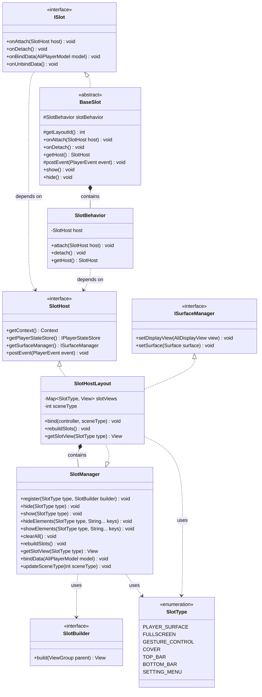
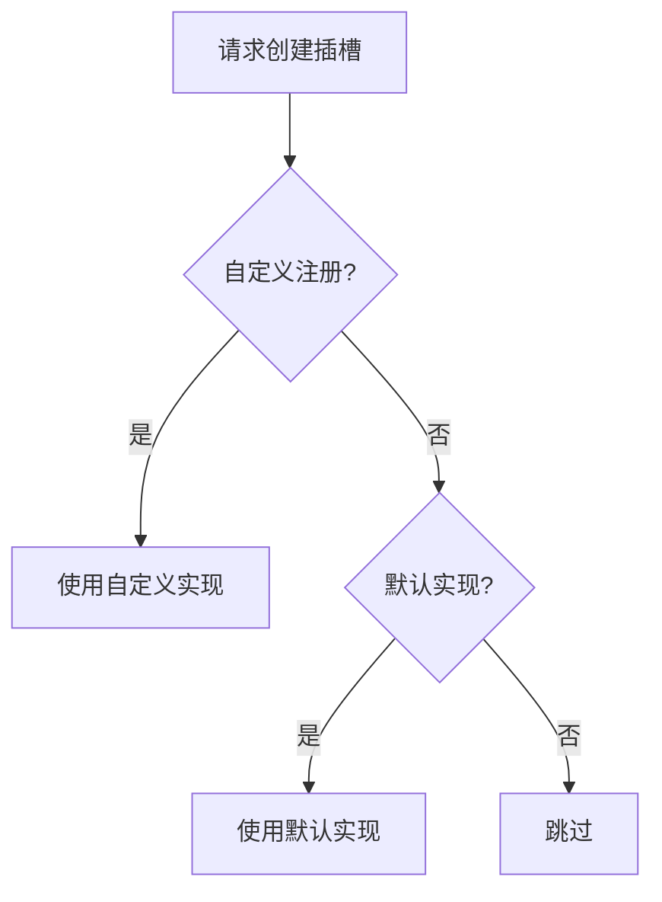
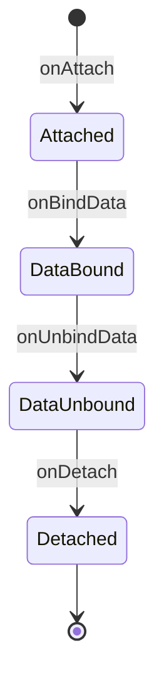

# **插槽系统 (Slot System)**

**插槽系统 (Slot System)** 是 AliPlayerKit 的核心架构设计。它通过组件化与可插拔机制，将播放器 UI 拆分为多个独立的插槽组件，并由统一的系统进行管理与调度，从而实现播放器界面的解耦、组合与灵活扩展。

---

## **1. 概念介绍**

### **1.1 什么是插槽？**

**插槽 (Slot)** 是播放器 UI 的基本组成单元，每个插槽代表一个独立的界面组件，负责播放器界面中的某一部分功能，例如顶部控制栏、底部进度条、封面图或提示信息等。

所有插槽按照预定义的 **z-order 层级** 进行叠加排列，共同构成完整的播放器界面。每个插槽只关注自身的 UI 展示与交互逻辑，从而实现职责清晰、粒度可控的界面结构。

通过这种设计，播放器 UI 被抽象为一组 **层级化、组件化** 的界面单元，使界面结构更加清晰，也为后续的功能扩展与组件替换提供了良好的基础。

### **1.2 什么是插槽系统？**

**插槽系统 (Slot System)** 是用于统一管理这些插槽组件的架构机制。

它负责定义插槽的 **注册机制、生命周期管理、场景适配以及渲染顺序**，并在播放器运行过程中统一管理插槽的创建、展示、隐藏与销毁。

基于这一机制，开发者可以像搭积木一样灵活构建播放器界面：既可以使用系统提供的默认插槽快速搭建播放器 UI，也可以按需替换或扩展特定插槽，甚至完全自定义所有组件，实现高度定制化的播放器界面。

---

## **2. 功能特性**

### **2.1 解决问题**

- UI 组件耦合度高，难以替换和扩展
- 不同场景需要不同的 UI 组合，缺乏灵活性
- 自定义 UI 需要修改框架源码

### **2.2 核心价值**

插槽系统将播放器组件中的 UI 组件拆离出来，客户可以自主选择使用方式：

| 使用方式 | 说明 | 优势 |
|---------|------|------|
| 使用默认界面 | 播放器组件使用官方默认 UI | 简化接入流程，降低接入成本，低代码接入 |
| 自定义使用 | 替换部分或全部插槽实现 | 满足各类丰富的 UI 需求 |
| 不使用插槽 | 仅使用播放能力 | 纯播放场景，无 UI 依赖 |

**架构优势**：

- **解耦**：UI 组件与播放器核心逻辑分离，职责清晰
- **灵活**：运行时动态组合、替换 UI 组件，无需重启
- **可扩展**：无需修改框架即可自定义 UI，扩展性强
- **关注点分离**：UI 样式与业务逻辑分离，布局定义在 XML 文件中，业务逻辑在 Slot 类中处理

### **2.3 核心能力**

| 能力 | 说明 |
|-----|------|
| 动态组合 | 运行时自由组合 UI 组件 |
| 热替换 | 无需重启即可替换组件实现 |
| 场景适配 | 不同播放场景自动切换 UI 行为 |

---

## **3. 内置组件**

### **3.1 插槽类型**

| 插槽类型 | 说明 | 默认实现 |
|---------|------|---------|
| PLAYER_SURFACE | 视频画面显示，支持多种渲染视图 | DisplayViewSlot / SurfaceViewSlot / TextureViewSlot |
| FULLSCREEN | 全屏管理，处理屏幕方向切换 | FullscreenSlot |
| GESTURE_CONTROL | 手势控制，处理单击/双击/长按/拖动 | GestureControlSlot |
| LANDSCAPE_HINT | 横屏观看提示，引导用户全屏 | LandscapeHintSlot |
| COVER | 封面图，播放前显示视频封面 | CoverSlot |
| CENTER_DISPLAY | 中心显示，显示倍速/亮度/音量等状态 | CenterDisplaySlot |
| PLAY_STATE | 播放状态，显示加载中/错误提示等 | PlayStateSlot |
| LOG_PANEL | 日志面板，调试时显示播放器日志 | LogPanelSlot |
| TOP_BAR | 顶部控制栏，显示返回/标题/设置等 | TopBarSlot |
| BOTTOM_BAR | 底部控制栏，显示播放控制/进度条等 | BottomBarSlot |
| SETTING_MENU | 设置菜单，显示倍速/清晰度/镜像等设置 | SettingMenuSlot |

### **3.2 场景适配**

AliPlayerKit 定义了 5 种播放场景，不同场景下插槽行为自动适配：

| 场景 | 说明 | 典型应用 |
|-----|------|---------|
| VOD | 点播场景，支持所有功能 | 常规视频播放 |
| LIVE | 直播场景，禁用时间轴操作 | 实时直播流 |
| VIDEO_LIST | 列表播放场景，禁用垂直手势 | 信息流、短视频列表 |
| RESTRICTED | 受限播放场景，限制跳跃播放 | 教育培训、考试监控 |
| MINIMAL | 最小化播放场景，仅显示视频画面 | 背景视频、装饰视频 |

**插槽可见性规则**：

| 插槽 | VOD | LIVE | VIDEO_LIST | RESTRICTED | MINIMAL |
|-----|-----|------|------------|------------|---------|
| PLAYER_SURFACE | ✓ | ✓ | ✓ | ✓ | ✓ |
| FULLSCREEN | ✓ | ✓ | ✓ | ✓ | ✓ |
| GESTURE_CONTROL | ✓ | ✓ | ✓ | ✓ | ✗ |
| LANDSCAPE_HINT | ✓ | ✓ | ✓ | ✓ | ✗ |
| COVER | ✓ | ✗ | ✓ | ✗ | ✗ |
| CENTER_DISPLAY | ✓ | ✓ | ✓ | ✓ | ✗ |
| PLAY_STATE | ✓ | ✓ | ✓ | ✓ | ✓ |
| LOG_PANEL | 可配置 | 可配置 | 可配置 | 可配置 | ✗ |
| TOP_BAR | ✓ | ✓ | ✓ | ✓ | ✗ |
| BOTTOM_BAR | ✓ | ✓ | ✓ | ✓ | ✗ |
| SETTING_MENU | ✓ | ✓ | ✓ | ✓ | ✗ |

**手势行为差异**：

| 手势 | VOD | LIVE | VIDEO_LIST | RESTRICTED | MINIMAL |
|-----|-----|------|------------|------------|---------|
| 单击 | 显示/隐藏控制栏 | 显示/隐藏控制栏 | 显示/隐藏控制栏 | 显示/隐藏控制栏 | 禁用 |
| 双击 | 切换播放/暂停 | 切换播放/暂停 | 切换播放/暂停 | 切换播放/暂停 | 禁用 |
| 长按 | 2倍速播放 | 禁用 | 2倍速播放 | 禁用 | 禁用 |
| 水平拖动 | 进度跳转 | 禁用 | 进度跳转 | 禁用 | 禁用 |
| 左侧垂直拖动 | 亮度调节 | 亮度调节 | 禁用 | 亮度调节 | 禁用 |
| 右侧垂直拖动 | 音量调节 | 音量调节 | 禁用 | 音量调节 | 禁用 |

**底部控制栏差异**：

| 控件 | VOD | LIVE | VIDEO_LIST | RESTRICTED | MINIMAL |
|-----|-----|------|------------|------------|---------|
| 播放/暂停按钮 | ✓ | ✓ | ✓ | ✓ | ✗ |
| 进度条 | 可拖拽 | 不可拖拽 | 可拖拽 | 不可拖拽 | ✗ |
| 时间显示 | ✓ | ✓ | ✓ | ✓ | ✗ |
| 刷新按钮 | ✗ | ✓ | ✗ | ✗ | ✗ |
| 全屏按钮 | ✓ | ✓ | ✓ | ✓ | ✗ |

---

## **4. 基础使用**

插槽系统提供三种使用策略，开发者可根据需求选择合适的方式：

| 策略 | 说明 | 适用场景 |
|-----|------|---------|
| 策略一：使用默认界面 | 最简单的使用方式，播放器组件将使用默认界面 | 快速集成、标准播放场景 |
| 策略二：自定义部分插槽 | 只自定义特定插槽，其他使用默认界面 | 局部定制、保留默认交互 |
| 策略三：完全自定义界面 | 自定义所有插槽，创建完全个性化的播放器界面 | 深度定制、品牌专属 UI |

### **4.1 策略一：使用默认界面**

最简单的使用方式，播放器组件将使用默认界面：

```java
// 1. 创建控制器并配置播放数据
AliPlayerController controller = new AliPlayerController(this);
controller.configure(new AliPlayerModel.Builder()
        .videoSource(videoSource)
        .build());

// 2. 获取播放器视图并绑定（自动使用默认插槽）
AliPlayerView playerView = findViewById(R.id.player_view);
playerView.attach(controller);
```

### **4.2 策略二：自定义部分插槽**

只自定义特定插槽，其他使用默认界面。例如，只自定义顶部栏：

```java
// 1. 创建控制器并配置播放数据
AliPlayerController controller = new AliPlayerController(this);
controller.configure(new AliPlayerModel.Builder()
        .videoSource(videoSource)
        .build());

// 2. 获取播放器视图
AliPlayerView playerView = findViewById(R.id.player_view);

// 3. 通过 SlotManager 注册需要自定义的插槽（覆盖默认实现）
SlotManager slotManager = playerView.getSlotManager();
slotManager.register(SlotType.TOP_BAR, parent -> new MyTopBarSlot(parent.getContext()));

// 4. 绑定控制器
playerView.attach(controller);
```

### **4.3 策略三：完全自定义界面**

自定义所有插槽，创建完全个性化的播放器界面：

```java
// 1. 创建控制器并配置播放数据
AliPlayerController controller = new AliPlayerController(this);
controller.configure(new AliPlayerModel.Builder()
        .videoSource(videoSource)
        .build());

// 2. 获取播放器视图
AliPlayerView playerView = findViewById(R.id.player_view);

// 3. 清除默认插槽，从空白开始
SlotManager slotManager = playerView.getSlotManager();
slotManager.clearAll();

// 4. 注册所有插槽
slotManager.register(SlotType.PLAYER_SURFACE, parent -> new MySurfaceSlot(parent.getContext()));
slotManager.register(SlotType.COVER, parent -> new MyCoverSlot(parent.getContext()));
slotManager.register(SlotType.TOP_BAR, parent -> new MyTopBarSlot(parent.getContext()));
slotManager.register(SlotType.BOTTOM_BAR, parent -> new MyBottomBarSlot(parent.getContext()));
// ... 注册其他插槽

// 5. 绑定控制器
playerView.attach(controller);
```

### **4.4 插槽可见性控制**

`SlotManager` 提供了便捷的可见性控制方法，允许在不替换插槽实现的情况下，隐藏/显示整个插槽或插槽内的特定元素：

```java
SlotManager slotManager = playerView.getSlotManager();

// 隐藏整个插槽
slotManager.hide(SlotType.LOG_PANEL);

// 隐藏插槽内特定元素
slotManager.hideElements(SlotType.TOP_BAR, "download_btn", "snapshot_btn");

// 显示之前隐藏的元素
slotManager.showElements(SlotType.TOP_BAR, "download_btn");

playerView.attach(controller);
```

**可见性控制方法一览**：

| 方法 | 说明 |
|-----|------|
| `hide(SlotType)` | 隐藏整个插槽 |
| `show(SlotType)` | 显示之前隐藏的插槽 |
| `hideElements(SlotType, String...)` | 隐藏插槽内特定元素 |
| `showElements(SlotType, String...)` | 显示插槽内之前隐藏的元素 |
| `setHiddenElements(SlotType, Set<String>)` | 设置插槽的隐藏元素集合（覆盖式） |
| `setAllHiddenElements(Map)` | 批量设置多个插槽的隐藏元素 |

---

## **5. 进阶使用**

### **5.1 如何实现动态切换插槽？**

运行时动态切换插槽实现：

```java
// 获取管理器
SlotManager slotManager = playerView.getSlotManager();

// 切换 Surface 类型
slotManager.register(SlotType.PLAYER_SURFACE,
    parent -> new TextureViewSlot(parent.getContext()));
slotManager.rebuildSlots();
```

### **5.2 如何实现自定义插槽？**

AliPlayerKit 提供两种方式实现自定义插槽，开发者可根据需求选择合适的方式。

**方式一：继承 BaseSlot（推荐）**

继承 `BaseSlot` 是最简单的方式，框架已封装好生命周期管理、事件订阅等通用逻辑。

**适用场景**：大多数 UI 插槽，如封面、控制栏、状态显示等。

**Step by Step**：

1. **创建布局文件**

   在 `res/layout/` 目录下创建布局文件：

   ```xml
   <!-- res/layout/my_cover_layout.xml -->
   <?xml version="1.0" encoding="utf-8"?>
   <FrameLayout xmlns:android="http://schemas.android.com/apk/res/android"
       android:layout_width="match_parent"
       android:layout_height="match_parent">

       <ImageView
           android:id="@+id/cover_image"
           android:layout_width="match_parent"
           android:layout_height="match_parent"
           android:scaleType="centerCrop" />

   </FrameLayout>
   ```

2. **创建 Slot 类**

   继承 `BaseSlot` 并重写必要方法：

   ```java
   public class MyCoverSlot extends BaseSlot {

       public MyCoverSlot(@NonNull Context context) {
           super(context);
       }

       @Override
       protected int getLayoutId() {
           return R.layout.my_cover_layout;  // 返回布局 ID
       }

       @Override
       public void onBindData(@NonNull AliPlayerModel model) {
           // 绑定数据
           ImageView coverImage = findViewByIdCompat(R.id.cover_image);
           Glide.with(getContext()).load(model.getCoverUrl()).into(coverImage);
       }

       @Override
       public void onUnbindData() {
           // 清理资源
           ImageView coverImage = findViewByIdCompat(R.id.cover_image);
           Glide.with(getContext()).clear(coverImage);
       }
   }
   ```

3. **注册使用**

   ```java
   SlotManager slotManager = playerView.getSlotManager();
   slotManager.register(SlotType.COVER, parent -> new MyCoverSlot(parent.getContext()));
   playerView.attach(controller);
   ```

**示例参考**：`slots/DisplayViewSlot.java`

**方式二：实现 ISlot 接口**

直接实现 `ISlot` 接口可以获得更高的灵活性，但需要自行处理生命周期。

**适用场景**：需要完全控制视图层级，或需要继承特定 View 类型（如 SurfaceView、TextureView）。

**Step by Step**：

1. **创建布局文件**

   与方式一相同，创建对应的布局文件。

2. **创建 Slot 类**

   实现 `ISlot` 接口，并通过组合 `SlotBehavior` 获得插槽能力：

   ```java
   public class MySurfaceSlot extends FrameLayout implements ISlot, ISurfaceProvider {

       // 通过组合获得插槽核心能力
       private final SlotBehavior slotBehavior = new SlotBehavior();
       private SlotHost host;

       public MySurfaceSlot(@NonNull Context context) {
           super(context);
           View.inflate(context, R.layout.my_surface_layout, this);
       }

       @Override
       public void onAttach(@NonNull SlotHost host) {
           // 1. 委托给 SlotBehavior 处理生命周期
           slotBehavior.attach(host);
           // 2. 保存宿主引用
           this.host = host;
           // 3. 设置 Surface
           setupSurfaceProvider(host);
       }

       @Override
       public void onDetach() {
           if (host != null) {
               onSurfaceDestroyed(host);
           }
           slotBehavior.detach();
           host = null;
       }

       @Override
       public void onBindData(@NonNull AliPlayerModel model) {
           // 数据绑定逻辑
       }

       @Override
       public void onUnbindData() {
           // 数据清理逻辑
       }

       @Override
       public void setupSurfaceProvider(@Nullable SlotHost host) {
           // Surface 设置逻辑
       }
   }
   ```

3. **注册使用**

   与方式一相同，通过 `SlotManager` 注册。

**示例参考**：
- `slots/SurfaceViewSlot.java`
- `slots/TextureViewSlot.java`

**两种方式对比**

| 特性 | 继承 BaseSlot | 实现 ISlot 接口 |
|-----|--------------|----------------|
| 代码量 | 少，只需关注业务逻辑 | 多，需手动处理生命周期 |
| 灵活性 | 中等，继承 FrameLayout | 高，可继承任意 View 类型 |
| 生命周期 | 框架自动管理 | 需手动委托给 SlotBehavior |
| 推荐场景 | 大多数 UI 插槽 | 需要特殊视图类型 |

### **5.3 如何实现 UI 还原？**

在实际项目中，您可能需要根据设计稿还原播放器 UI。以下是不同场景下的处理方式：

**场景一：官方未提供所需插槽**

如果播放器组件官方未提供您需要的插槽类型，需要自行实现：

1. **创建自定义插槽**

   建议将自定义插槽放在 `ui/slots/custom` 目录下，与官方实现区分：

   ```
   your-module/src/main/java/com/yourpackage/
   └── ui/
       └── slots/
           └── custom/
               ├── MyDanmakuSlot.java      // 弹幕插槽
               ├── MySubtitleSlot.java     // 字幕插槽
               └── MyWatermarkSlot.java    // 水印插槽
   ```

2. **反馈给官方**

   推荐将需求反馈给官方团队，由官方提供统一的插槽实现。这样可以：
   - 统一行业标准
   - 减少重复开发
   - 惠及更多客户

**场景二：官方提供了插槽但不需要**

如果播放器组件官方提供了插槽，但您的场景不需要，有两种处理方式：

*方式一：配置禁用（推荐）*

在 `SlotConstants` 的 `createDefaultConfigs()` 方法中删除对应的配置项：

```java
// 修改前：SlotManager 会注入默认组件
configs.add(new SlotConfig.Builder()
        .type(SlotType.LOG_PANEL)
        .excludeScenes(createSet(SceneType.MINIMAL))
        .condition(AliPlayerKit::isLogPanelEnabled)
        .build());

// 修改后：注释或删除该配置，SlotManager 将不再注入默认组件
// configs.add(new SlotConfig.Builder()
//         .type(SlotType.LOG_PANEL)
//         ...
//         .build());
```

*方式二：物理删除（不推荐）*

直接删除对应的 Slot 类文件及其相关资源，不建议使用。

**场景三：官方插槽 UI 样式不满足**

如果官方提供了插槽但 UI 样式不满足需求，可以直接修改 XML 布局文件进行 UI 还原。得益于 UI 样式与业务逻辑的关注点分离设计，修改布局文件不会影响业务逻辑。

**还原步骤**：

1. **找到对应的布局文件**

   布局文件位于 `playerkit/src/main/res/layout/` 目录，命名规则为 `layout_{slot_type}.xml`：

   | 插槽类型 | 布局文件 |
   |---------|---------|
   | TOP_BAR | `layout_top_bar_slot.xml` |
   | BOTTOM_BAR | `layout_bottom_bar_slot.xml` |
   | COVER | `layout_cover_slot.xml` |
   | PLAY_STATE | `layout_play_state_slot.xml` |
   | ... | ... |

2. **修改布局文件**

   直接修改 XML 文件中的样式属性，**注意保持控件 ID 不变**：

   ```xml
   <!-- 修改前：官方默认样式 -->
   <LinearLayout
       android:background="#80000000"
       android:padding="8dp">

       <ImageView
           android:id="@+id/iv_back"
           android:layout_width="40dp"
           android:layout_height="40dp" />
   </LinearLayout>

   <!-- 修改后：自定义样式（保持 ID 不变） -->
   <LinearLayout
       android:background="@drawable/custom_top_bar_bg"
       android:padding="12dp">

       <ImageView
           android:id="@+id/iv_back"
           android:layout_width="48dp"
           android:layout_height="48dp"
           android:src="@drawable/ic_custom_back" />
   </LinearLayout>
   ```

3. **架构约束**

   通过以下约束保证自定义代码与官方代码不冲突：
   - 控件 ID 固定，Slot 类通过 ID 查找控件并绑定事件
   - 布局结构可调整，但核心控件必须存在
   - 业务逻辑无需修改，自动适配新布局

4. **升级兼容建议**

   如果需要对 UI 进行大量修改，我们建议采用 **自定义 Slot 策略** 来避免后续升级 AliPlayerKit 时的冲突：

   - **不要直接修改** 官方的布局文件或 Slot 类
   - **创建 V2 版本**，如 `TopBarSlotV2.java` 和 `layout_top_bar_slot_v2.xml`
   - **通过 SlotManager 注册** 或 **修改 SlotConstants** 替换默认实现

   ```java
   public class TopBarSlotV2 extends BaseSlot {
   
       @Override
       protected int getLayoutId() {
           return R.layout.layout_top_bar_slot_v2;
       }
   }
   ```


### **5.4 如何实现无头插槽？**

插槽系统的价值不仅在于 UI 组件化，还在于**业务逻辑组件化**。除了渲染界面的 UI 插槽，还支持**无头插槽（Headless Slot）**——只处理业务逻辑、不渲染任何 UI 的插槽。

**示例：全屏管理插槽**

官方提供的 `FullscreenSlot` 就是一个典型的无头插槽，它只负责全屏切换的逻辑管理，不渲染任何界面：

```java
public class FullscreenSlot extends BaseSlot {

    @Override
    protected int getLayoutId() {
        return 0;  // 返回 0 表示无布局，不渲染 UI
    }

    @Override
    public void onAttach(@NonNull SlotHost host) {
        super.onAttach(host);
        // 监听全屏切换事件
    }

    @Override
    protected void onEvent(@NonNull PlayerEvent event) {
        if (event instanceof FullscreenEvents.Toggle) {
            // 处理全屏切换逻辑
            toggleFullscreen();
        }
    }

    private void toggleFullscreen() {
        // 纯逻辑处理：修改 Activity 方向、调整系统 UI 等
    }
}
```

**实现方式**：

| 方式 | 说明 | 适用场景 |
|-----|------|---------|
| 继承 `BaseSlot`，`getLayoutId()` 返回 0 | 简单，继承 FrameLayout 但不渲染 | 大多数无头插槽 |
| 实现 `ISlot` 接口 + 组合 `SlotBehavior` | 灵活，完全不继承 View | 纯逻辑组件 |

**设计价值**：

无头插槽让业务逻辑也能享受插槽系统的好处：
- 统一的生命周期管理
- 与播放器状态自动同步
- 可插拔、可替换
- 与 UI 插槽平等协作

### 5.5 细粒度控制

AliPlayerKit 提供了 **Element Registry** 架构，允许开发者在保留默认插槽 UI 的前提下，按元素级别隐藏子组件或禁用手势。

#### 5.5.1 架构概述

细粒度控制采用 **双模式** 设计：

| 模式 | 适用场景 | 使用方式 |
|------|---------|----------|
| 静态元素注册 | View 类型的 UI 元素（按钮、文本等） | `registerElement(key, view)` |
| 行为元素查询 | 手势、事件驱动的功能 | `isElementVisible(key)` |

**生命周期**：

```
onAttach(host)              ← 子类初始化 View
    ↓
dispatchRegisterElements()  ← 框架注入 SlotType + 触发 onRegisterElements()
    ↓
onBindData(model)           ← 框架：缓存隐藏配置 → 应用可见性；子类：处理数据
    ↓
onUnbindData()              ← 框架：重置可见性
    ↓
onDetach()                  ← 框架：清理注册表 + SlotType
```

`onRegisterElements()` 由框架在 `onAttach()` 返回后**立即自动调用**（通过 `dispatchRegisterElements()` 包级方法）。框架在调用前会自动注入 `SlotType`，子类无需覆写 `getSlotType()` 方法——SlotType 由框架在 `attachSlot()` 时根据注册表自动确定。此阶段属于 Setup/Attach 生命周期阶段，与 Data 生命周期阶段（`onBindData` / `onUnbindData`）职责分离。

**数据流**：

```
SlotManager.hideElements() / setAllHiddenElements() (声明式配置)
        ↓
BaseSlot.onBindData() (框架自动缓存)
        ↓
    ┌───────────────────────────────┐
    │  静态元素: 自动遍历 Registry  │
    │  行为元素: 运行时查询         │
    └───────────────────────────────┘
```

#### 5.5.2 基本用法

**声明隐藏配置**（使用者视角）：

```java
SlotManager slotManager = playerView.getSlotManager();
slotManager.hideElements(SlotType.TOP_BAR, SlotElements.TopBar.BACK, SlotElements.TopBar.SNAPSHOT);
slotManager.hideElements(SlotType.GESTURE_CONTROL, SlotElements.GestureControl.DOUBLE_TAP);
playerView.attach(controller);
```

#### 5.5.3 自定义插槽中使用

**静态元素注册**（继承 BaseSlot）：

```java
public class MyTopBarSlot extends BaseSlot {

    @Override
    public void onAttach(@NonNull SlotHost host) {
        super.onAttach(host);
        // 初始化 View ...
        mBtnBack = findViewByIdCompat(R.id.btn_back);
        mTvTitle = findViewByIdCompat(R.id.tv_title);
    }

    @Override
    protected void onRegisterElements() {
        // 框架在 onAttach 后自动调用，声明式注册 — 框架自动管理可见性
        // SlotType 由框架自动注入，子类无需关心
        registerElement(SlotElements.TopBar.BACK, mBtnBack);
        registerElement(SlotElements.TopBar.TITLE, mTvTitle);
    }

    // onBindData 中无需手动处理可见性，框架全自动
}
```

> **架构优势**：子类零配置获得 SlotType。`registerElement(key, view)` 便捷重载一行注册，内部自动封装为 `view.setVisibility(visible ? VISIBLE : GONE)`。view 参数可为 null（静默跳过，不崩溃），适配不同布局下控件可能不存在的情况。

**新旧风格对比**：

```java
// ❌ 简化前（旧风格）— 已废弃
@Nullable @Override
protected SlotType getSlotType() { return SlotType.TOP_BAR; }

@Override
protected void onRegisterElements() {
    registerElement(SlotElements.TopBar.BACK, new SlotElementHandle() {
        @Override
        public void setVisible(boolean visible) {
            mIvBack.setVisibility(visible ? View.VISIBLE : View.GONE);
        }
    });
}

// ✅ 简化后（新风格）— 推荐
@Override
protected void onRegisterElements() {
    registerElement(SlotElements.TopBar.BACK, mIvBack);
    registerElement(SlotElements.TopBar.TITLE, mTvTitle);
}
```

**行为元素查询**（手势/事件驱动）：

```java
public class MyGestureSlot extends BaseSlot {

    private void handleDoubleTap() {
        // 运行时查询：如果被隐藏则跳过
        if (!isElementVisible(SlotElements.GestureControl.DOUBLE_TAP)) {
            return;
        }
        // 处理双击逻辑...
    }
}
```

**自定义 SlotElementHandle**（控制多个 View 或非标准行为时使用）：

当需要控制多个 View 或需要非标准的可见性行为时，仍使用 `SlotElementHandle` 方式：

```java
// 进度条控制两个 View
registerElement(SlotElements.BottomBar.PROGRESS, new SlotElementHandle() {
    @Override
    public void setVisible(boolean visible) {
        mSeekBar.setVisibility(visible ? View.VISIBLE : View.GONE);
        mTvTime.setVisibility(visible ? View.VISIBLE : View.GONE);
    }
});
```

#### 5.5.4 重置机制

框架在 `onUnbindData()` 时自动将所有已注册元素恢复为可见状态。当切换视频源（重新调用 `onBindData()`）时，会根据新配置重新应用可见性，确保状态不会残留。

#### 5.5.5 可用元素常量

所有可控元素定义在 `SlotElements` 类中：

| 插槽类型 | 常量类 | 可用元素 |
|---------|--------|----------|
| TOP_BAR | `SlotElements.TopBar` | BACK, TITLE, DOWNLOAD, SNAPSHOT, PIP, SETTINGS |
| BOTTOM_BAR | `SlotElements.BottomBar` | PLAY, PROGRESS, REFRESH, SUBTITLE, FULLSCREEN, SPEED, QUALITY |
| SETTING_MENU | `SlotElements.SettingMenu` | VOLUME, BRIGHTNESS, SPEED, TRACK_INFO, LOOP, MUTE, MIRROR_MODE, ROTATE_MODE, SCALE_MODE, SUBTITLE |
| CENTER_DISPLAY | `SlotElements.CenterDisplay` | VOLUME, BRIGHTNESS, SPEED |
| PLAY_STATE | `SlotElements.PlayState` | ERROR_ICON, ERROR_MESSAGE |
| GESTURE_CONTROL | `SlotElements.GestureControl` | SINGLE_TAP, DOUBLE_TAP, LONG_PRESS, HORIZONTAL_DRAG, LEFT_VERTICAL_DRAG, RIGHT_VERTICAL_DRAG |

### 5.6 层级控制

AliPlayerKit 的插槽系统采用**显式层级控制**机制，通过 `order` 值定义每个插槽在视图树中的渲染顺序。内置插槽以 10 为间距递增，为自定义插槽预留了充足的插入空间。

#### 5.6.1 设计理念

播放器界面由多个插槽层叠组成，层级顺序直接决定了 UI 的遮盖关系。框架通过以下设计实现灵活且可控的层级管理：

- **显式定义**：每个插槽通过 `order` 值声明自身的层级位置，语义清晰
- **间距预留**：内置插槽间距为 10，开发者可在任意两个内置插槽之间插入自定义插槽
- **统一排序**：所有插槽（内置 + 自定义）在 `SlotHostLayout` 重建时统一按 `order` 值排序渲染

#### 5.6.2 内置插槽层级表

| 插槽类型 | Order 值 | 层级说明 | 功能描述 |
|---------|----------|---------|----------|
| PLAYER_SURFACE | 10 | 底层 | 视频画面渲染 |
| FULLSCREEN | 15 | 逻辑层 | 全屏切换管理（无 UI） |
| GESTURE_CONTROL | 20 | 交互层 | 手势识别与控制 |
| LANDSCAPE_HINT | 30 | 提示层 | 横屏观看引导 |
| COVER | 40 | 覆盖层 | 视频封面图 |
| CENTER_DISPLAY | 50 | 信息层 | 倍速/亮度/音量状态 |
| PLAY_STATE | 60 | 状态层 | 加载中/错误提示 |
| LOG_PANEL | 70 | 调试层 | 日志面板 |
| TOP_BAR | 80 | 控制层 | 顶部控制栏 |
| BOTTOM_BAR | 90 | 控制层 | 底部控制栏 |
| SETTING_MENU | 100 | 菜单层 | 设置菜单浮层 |
| OPTION_PANEL | 110 | 菜单层 | 选项面板（横屏倍速/清晰度） |

> **层级规则**：order 值越小越靠底层（先渲染、先被遮盖），order 值越大越靠顶层（后渲染、后遮盖其他）。

#### 5.6.3 自定义插槽层级

通过 `CustomSlotType` 类，开发者可以创建自定义插槽并指定其层级位置。

**CustomSlotType 构造参数**：

| 参数 | 类型 | 说明 |
|-----|------|------|
| key | String | 插槽唯一标识，用于区分不同的自定义插槽 |
| order | int | 层级顺序值，决定渲染位置 |

**使用示例：创建水印插槽**

```java
// 1. 定义自定义插槽类型（order=25，位于 GESTURE_CONTROL(20) 和 LANDSCAPE_HINT(30) 之间）
CustomSlotType WATERMARK = new CustomSlotType("watermark", 25);

// 2. 通过 SlotManager 注册构建器
SlotManager slotManager = playerView.getSlotManager();
slotManager.register(WATERMARK, parent -> new WatermarkSlot(parent.getContext()));

// 3. 绑定到播放器视图
playerView.attach(controller);
```

**自定义插槽实现示例**：

```java
public class WatermarkSlot extends BaseSlot {

    public WatermarkSlot(@NonNull Context context) {
        super(context);
    }

    @Override
    protected int getLayoutId() {
        return R.layout.layout_watermark_slot;
    }

    @Override
    public void onBindData(@NonNull AliPlayerModel model) {
        // 设置水印内容
        TextView tvWatermark = findViewByIdCompat(R.id.tv_watermark);
        tvWatermark.setText(model.getWatermarkText());
    }

    @Override
    public void onUnbindData() {
        // 清理
    }
}
```

#### 5.6.4 层级排序规则

`SlotHostLayout` 在执行 `rebuildSlots()` 时，会将所有已注册的插槽（内置 + 自定义）合并，并按照以下规则排序渲染：

| 规则 | 说明 |
|-----|------|
| 按 order 值升序 | order 值从小到大排列，值小的先添加到视图树（位于底层） |
| 相同 order 值 | 按注册顺序排列（先注册的在下，后注册的在上） |
| 无限制范围 | 自定义插槽可使用任意整数值，包括负数或大于 100 的值 |

**层级示意**：

```
┌─────────────────────────────────┐  ← order 110: OPTION_PANEL（菜单层）
│  ┌───────────────────────────┐  │  ← order 100: SETTING_MENU（菜单层）
│  │  ┌─────────────────────┐  │  │  ← order  90: BOTTOM_BAR
│  │  │  ┌───────────────┐  │  │  │  ← order  85: 自定义弹幕插槽
│  │  │  │  ┌─────────┐  │  │  │  │  ← order  80: TOP_BAR
│  │  │  │  │  ...    │  │  │  │  │
│  │  │  │  └─────────┘  │  │  │  │  ← order  25: 自定义水印插槽
│  │  │  └───────────────┘  │  │  │
│  │  └─────────────────────┘  │  │
│  └───────────────────────────┘  │
└─────────────────────────────────┘  ← order  10: PLAYER_SURFACE（底层）
```

#### 5.6.5 设计原则

**为什么选择间距 10？**

内置插槽的 order 值以 10 为步长递增，这意味着每两个相邻内置插槽之间有 9 个可用的整数值。例如：
- LANDSCAPE_HINT(30) 和 COVER(40) 之间可插入 order 为 31~39 的自定义插槽
- TOP_BAR(80) 和 BOTTOM_BAR(90) 之间可插入 order 为 81~89 的自定义插槽

这种设计在满足大多数场景的同时，保持了 order 值的可读性。

**如何选择合适的 order 值？**

| 需求 | 推荐 order 值 | 说明 |
|-----|--------------|------|
| 视频画面之上的背景层 | 11~19 | 位于 PLAYER_SURFACE 之上、GESTURE_CONTROL 之下 |
| 封面之上的水印/字幕 | 41~49 | 位于 COVER 之上、CENTER_DISPLAY 之下 |
| 控制栏附近的弹幕 | 81~89 | 位于 TOP_BAR 之上、BOTTOM_BAR 之下 |
| 最顶层的全局浮层 | >110 | 位于所有内置插槽之上 |

**向后兼容保证**：

- 内置插槽的 order 值是框架契约的一部分，不会在后续版本中变更
- 新增内置插槽时，会使用当前间隙中的值（如 15、25 等），不影响已有的 order 分配
- 自定义插槽的 order 值由开发者完全控制，框架不会干预

#### 5.6.6 完整示例

以下示例展示了如何定义和注册多个自定义插槽，构建一个包含水印、弹幕和字幕的播放器界面：

```java
// ==================== 定义自定义插槽类型 ====================

// 水印插槽：位于 GESTURE_CONTROL(20) 和 LANDSCAPE_HINT(30) 之间
public static final CustomSlotType WATERMARK = new CustomSlotType("watermark", 25);

// 字幕插槽：位于 CENTER_DISPLAY(50) 和 PLAY_STATE(60) 之间
public static final CustomSlotType SUBTITLE = new CustomSlotType("subtitle", 55);

// 弹幕插槽：位于 TOP_BAR(80) 和 BOTTOM_BAR(90) 之间
public static final CustomSlotType DANMAKU = new CustomSlotType("danmaku", 85);

// 全局浮层：位于所有内置插槽之上
public static final CustomSlotType GLOBAL_OVERLAY = new CustomSlotType("global_overlay", 120);

// ==================== 注册插槽 ====================

SlotManager slotManager = playerView.getSlotManager();

// 注册自定义插槽
slotManager.register(WATERMARK, parent -> new WatermarkSlot(parent.getContext()));
slotManager.register(SUBTITLE, parent -> new SubtitleSlot(parent.getContext()));
slotManager.register(DANMAKU, parent -> new DanmakuSlot(parent.getContext()));
slotManager.register(GLOBAL_OVERLAY, parent -> new GlobalOverlaySlot(parent.getContext()));

// 也可以同时自定义内置插槽
slotManager.register(SlotType.TOP_BAR, parent -> new MyTopBarSlot(parent.getContext()));

// ==================== 绑定到播放器 ====================

playerView.attach(controller);

// 最终渲染顺序（从底到顶）：
// PLAYER_SURFACE(10) → FULLSCREEN(15) → GESTURE_CONTROL(20) → WATERMARK(25)
// → LANDSCAPE_HINT(30) → COVER(40) → CENTER_DISPLAY(50) → SUBTITLE(55)
// → PLAY_STATE(60) → LOG_PANEL(70) → TOP_BAR(80) → DANMAKU(85) → BOTTOM_BAR(90)
// → SETTING_MENU(100) → OPTION_PANEL(110) → GLOBAL_OVERLAY(120)
```

---

## **6. 最佳实践**

### **6.1 生命周期管理**

```java
public class MySlot extends BaseSlot {

    @Override
    public void onAttach(@NonNull SlotHost host) {
        super.onAttach(host);
        // 初始化视图
    }

    @Override
    public void onDetach() {
        // 清理资源
        super.onDetach();
    }
}
```

### **6.2 事件订阅**

```java
@Override
protected List<Class<? extends PlayerEvent>> observedEvents() {
    return Arrays.asList(PlayerEvents.StateChanged.class);
}

@Override
protected void onEvent(@NonNull PlayerEvent event) {
    if (event instanceof PlayerEvents.StateChanged) {
        // 处理状态变化
    }
}
```

### **6.3 Surface 选择**

| 场景 | 推荐类型 | 原因 |
|-----|---------|------|
| 普通播放 | SurfaceView | 性能更好 |
| 需要动画 | TextureView | 支持变换 |
| 后台播放 | 无 Surface | 节省资源 |

---

## **7. 示例参考**

项目提供了完整的示例，位于 `playerkit-examples/example-slot-system`。

### **7.1 示例功能**

| 功能 | 说明 |
|-----|------|
| SurfaceView 切换 | 适合普通播放场景 |
| TextureView 切换 | 适合需要动画的场景 |
| 空插槽切换 | 适合纯音频播放 |

### **7.2 运行示例**

在 Demo App 中选择「Slot System」示例查看效果。

---

## **8. API 参考**

### **8.1 类结构**



### **8.2 核心接口**

| 接口/类 | 说明 |
|--------|------|
| `ISlot` | 插槽接口，定义生命周期 |
| `BaseSlot` | 插槽基类，封装通用逻辑 |
| `SlotManager` | 管理器，提供注册、可见性控制、重建和查询 |

### **8.3 BaseSlot 方法**

| 方法 | 说明 |
|-----|------|
| `getLayoutId()` | 返回布局资源 ID |
| `getHost()` | 获取插槽宿主 |
| `show()` / `hide()` / `gone()` | 控制可见性 |
| `postEvent(event)` | 发布事件 |

---

## **9. 技术原理**

### **9.1 槽位选择策略**



**优先级**：自定义实现 > 默认实现 > 跳过

### **9.2 生命周期**

插槽采用双生命周期系统：



| 生命周期 | 说明 |
|---------|------|
| View 生命周期 | `onAttach` → `onDetach` |
| Data 生命周期 | `onBindData` → `onUnbindData` |

**与 Android 生命周期的关系**：

插槽生命周期独立于 Android Activity/Fragment 生命周期。如果需要在 App 前后台切换时执行特定操作（如暂停动画、停止轮询），建议通过以下方式处理：

**方式一：监听播放状态事件**

通过 `observedEvents()` 监听播放状态变化，当播放器暂停时停止动画：

```java
@Override
protected List<Class<? extends PlayerEvent>> observedEvents() {
    return Arrays.asList(PlayerEvents.StateChanged.class);
}

@Override
protected void onEvent(@NonNull PlayerEvent event) {
    if (event instanceof PlayerEvents.StateChanged) {
        PlayerState state = ((PlayerEvents.StateChanged) event).newState;
        if (state == PlayerState.PAUSED || state == PlayerState.STOPPED) {
            stopAnimation();  // 暂停动画
        } else if (state == PlayerState.PLAYING) {
            startAnimation();  // 恢复动画
        }
    }
}
```

**方式二：在 Activity/Fragment 中控制**

在 Activity 的 `onPause()`/`onResume()` 中通过插槽管理器获取插槽并调用方法：

```java
@Override
protected void onPause() {
    super.onPause();
    MyAnimationSlot slot = playerView.getSlotManager().getSlot(SlotType.CUSTOM);
    if (slot != null) {
        slot.pauseAnimation();
    }
}

@Override
protected void onResume() {
    super.onResume();
    MyAnimationSlot slot = playerView.getSlotManager().getSlot(SlotType.CUSTOM);
    if (slot != null) {
        slot.resumeAnimation();
    }
}
```

### **9.3 单向数据流**

插槽系统采用单向数据流架构，插槽不直接持有控制器引用，而是通过宿主提供的接口进行解耦交互：

```
Controller → State / Event → Slot（状态下行，只读）
Slot → Command → Controller（命令上行，只发）
```

- **状态下行**：两种方式获取状态
  - **主动查询**：通过 `getPlayerStateStore()` 查询当前状态
  - **被动监听**：通过订阅事件接收状态变化通知
- **命令上行**：插槽通过 `postEvent()` 发送命令，由控制器执行，插槽不关心执行细节

**主动查询状态**：通过 `host.getPlayerStateStore()` 获取播放器状态的只读访问：

```java
@Override
public void onAttach(@NonNull SlotHost host) {
    super.onAttach(host);

    // 查询播放状态
    PlayerState state = host.getPlayerStateStore().getPlayState();

    // 查询当前播放位置和总时长
    long position = host.getPlayerStateStore().getCurrentPosition();
    long duration = host.getPlayerStateStore().getDuration();
}
```

**被动监听状态**：通过订阅事件接收状态变化：

```java
@Override
protected List<Class<? extends PlayerEvent>> observedEvents() {
    return Arrays.asList(
        PlayerEvents.StateChanged.class,    // 播放状态变化
        PlayerEvents.Info.class             // 播放进度更新
    );
}

@Override
protected void onEvent(@NonNull PlayerEvent event) {
    if (event instanceof PlayerEvents.StateChanged) {
        // 处理播放状态变化
        updatePlayPauseIcon(((PlayerEvents.StateChanged) event).newState);
    } else if (event instanceof PlayerEvents.Info) {
        // 处理播放进度更新
        PlayerEvents.Info info = (PlayerEvents.Info) event;
        updateProgress(info.currentPosition, info.bufferedPosition, info.duration);
    }
}
```

**发送命令**：通过 `postEvent()` 发送命令事件触发播放器行为：

```java
// 播放/暂停切换
postEvent(new PlayerCommand.Toggle(mPlayerId));

// 跳转到指定位置
postEvent(new PlayerCommand.Seek(mPlayerId, 30000));

// 设置播放速度
postEvent(new PlayerCommand.SetSpeed(mPlayerId, 1.5f));

// 截图
postEvent(new PlayerCommand.Snapshot(mPlayerId));
```

**设计理念**：这种单向数据流架构彻底解耦了插槽与控制器。插槽无需持有控制器引用，只需关心"查询什么状态"和"发送什么命令"，实现了真正的关注点分离。

### **9.4 插槽间的横向隔离与事件规范**

为保障架构的稳定性，**插槽之间严禁直接获取对方实例或进行点对点通信。**

当一个插槽（如：设置浮层插槽）引发了状态变更，需要影响另一个插槽（如：底部控制栏插槽）时：
1. **单一信源兜转**：发起插槽通过 `postEvent()` 发送事件给 `Controller`。
2. **状态分发下沉**：由 `Controller` 或 `StateStore` 统筹后，散播新的状态事件给所有关注此事件的插槽。

通过这种“**事件上浮，状态下沉**”的 U 型链路，彻底避免了网状的 UI 耦合和死锁。

**事件拦截提醒：** 对于覆盖在页面表层区域的插槽容器，请确保在无需响应手势时处理好 Android 的 `onTouchEvent` 下发，避免遮挡底部 `GestureControlSlot` 的正常手势检测。

---

## **10. 常见问题**

### **10.1 onAttach 什么时候调用？**

调用 `playerView.attach()` 或 `slotManager.rebuildSlots()` 时触发。

### **10.2 自定义插槽注意事项？**

1. 在 `onAttach` 中调用 `super.onAttach(host)`
2. 在 `onDetach` 前清理资源

### **10.3 如何调试？**

使用 `LogHub` 查看日志，TAG 格式：`类名.BaseSlot`

### **10.4 高频崩溃错例**

以下是客户反馈中最常导致崩溃的问题，请务必避免：

#### **错例 1：忘记调用 super.onAttach() 导致生命周期断层**

**错误代码**：

```java
public class MySlot extends BaseSlot {

    @Override
    public void onAttach(@NonNull SlotHost host) {
        // ❌ 忘记调用 super.onAttach(host)
        // 直接初始化视图
        ImageView iv = findViewByIdCompat(R.id.iv_icon);
        iv.setOnClickListener(v -> postEvent(...));  // NullPointerException!
    }
}
```

**崩溃原因**：`super.onAttach(host)` 会初始化 `slotBehavior`、订阅事件、设置 Surface 等。不调用会导致 `getHost()` 返回 null、`postEvent()` 失败、事件订阅无效。

**正确代码**：

```java
@Override
public void onAttach(@NonNull SlotHost host) {
    super.onAttach(host);  // ✅ 必须首先调用
    // 然后再初始化视图
    ImageView iv = findViewByIdCompat(R.id.iv_icon);
    iv.setOnClickListener(v -> postEvent(...));
}
```

---

#### **错例 2：自定义 XML 时 ID 覆盖导致 NullPointerException**

**错误代码**：

```xml
<!-- 自定义布局时，ID 与官方默认 ID 冲突 -->
<LinearLayout ...>
    <!-- 官方使用 @+id/iv_back，你覆盖了它 -->
    <ImageView
        android:id="@+id/iv_back"
        android:src="@drawable/my_icon" />  <!-- 官方期望的是返回按钮 -->
</LinearLayout>
```

**崩溃原因**：Slot 类通过 `findViewByIdCompat(R.id.iv_back)` 查找控件并绑定点击事件。如果布局中缺少该 ID 或 ID 指向了错误的控件类型，会导致强转失败或点击事件绑定到错误的控件。

**正确做法**：

1. **保持核心控件 ID 不变**：如果 Slot 类中使用了某个 ID，布局中必须保留该 ID
2. **类型必须匹配**：ID 对应的控件类型必须与代码中的类型一致

```xml
<!-- ✅ 保持核心 ID 不变 -->
<LinearLayout ...>
    <ImageView
        android:id="@+id/iv_back"  <!-- 保持 ID，但可以改样式 -->
        android:layout_width="48dp"
        android:layout_height="48dp"
        android:src="@drawable/custom_back" />  <!-- 可以换图标 -->
</LinearLayout>
```

---

#### **错例 3：在构造函数中调用 getHost()**

**错误代码**：

```java
public class MySlot extends BaseSlot {

    public MySlot(@NonNull Context context) {
        super(context);
        // ❌ 构造函数中 getHost() 返回 null
        SlotHost host = getHost();  // null!
    }
}
```

**崩溃原因**：插槽实例在构造时还未 attach 到宿主，`getHost()` 返回 null。

**正确做法**：

```java
@Override
public void onAttach(@NonNull SlotHost host) {
    super.onAttach(host);
    // ✅ 在 onAttach 之后才能访问 host
    SlotHost host = getHost();  // 正常获取
}
```

---

#### **错例 4：onDetach 未清理资源导致内存泄漏**

**错误代码**：

```java
public class MySlot extends BaseSlot {

    private Handler handler = new Handler();

    @Override
    public void onAttach(@NonNull SlotHost host) {
        super.onAttach(host);
        handler.postDelayed(() -> updateUI(), 1000);  // 延迟任务
    }

    @Override
    public void onDetach() {
        // ❌ 忘记移除延迟任务
        super.onDetach();
    }
}
```

**崩溃原因**：延迟任务持有的 Slot 引用无法释放，导致内存泄漏，且任务执行时 Slot 可能已 detach。

**正确代码**：

```java
@Override
public void onDetach() {
    handler.removeCallbacksAndMessages(null);  // ✅ 清理所有延迟任务
    super.onDetach();
}
```

---

#### **错例 5：事件订阅未在 observedEvents() 中声明**

**错误代码**：

```java
public class MySlot extends BaseSlot {

    @Override
    public void onAttach(@NonNull SlotHost host) {
        super.onAttach(host);
        // ❌ 期望收到事件，但未在 observedEvents() 中声明
    }

    @Override
    protected void onEvent(@NonNull PlayerEvent event) {
        // 永远不会被调用！
    }
}
```

**崩溃原因**：BaseSlot 依赖 `observedEvents()` 返回值来订阅事件，未声明则不会订阅。

**正确代码**：

```java
@Override
protected List<Class<? extends PlayerEvent>> observedEvents() {
    return Arrays.asList(
        PlayerEvents.StateChanged.class,  // ✅ 声明要订阅的事件
        PlayerEvents.Info.class
    );
}

@Override
protected void onEvent(@NonNull PlayerEvent event) {
    // 现在可以正常收到事件了
}
```
