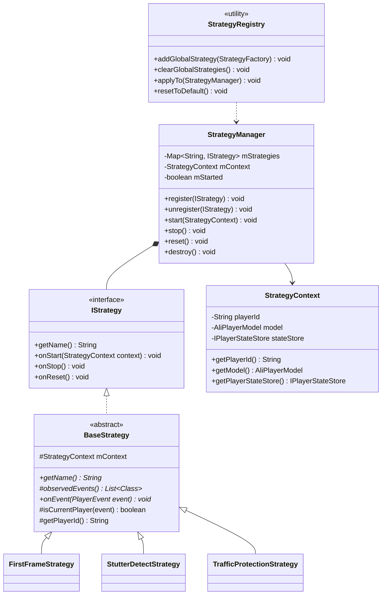
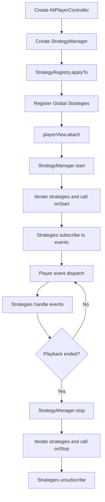
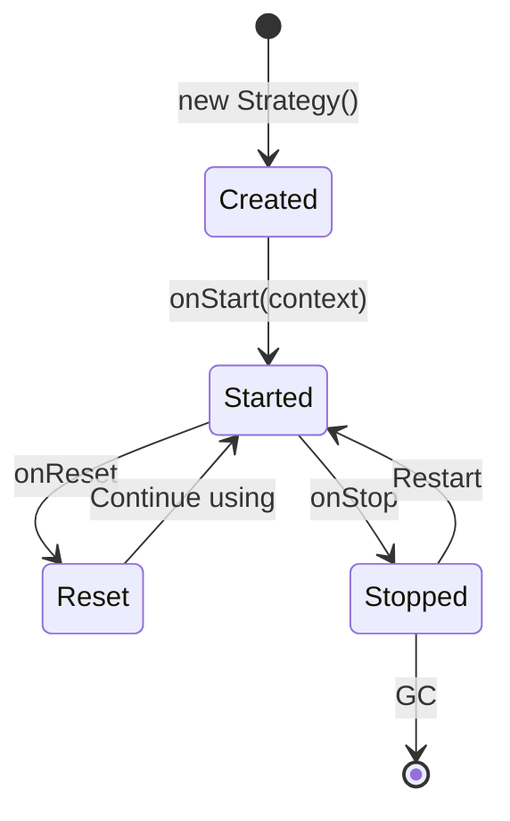

# **Strategy System**

The **Strategy System** is a core architectural design of AliPlayerKit. Through an event-driven strategy mechanism, it encapsulates player monitoring, analysis, and optimization logic into independent strategy components, enabling decoupling, reuse, and flexible extension of player business logic.

---

## **1. Concept Introduction**

### **1.1 Design Background**

The design of the Strategy System originates from our systematic reflection on the **conflict between business logic customization and framework evolvability** during the large-scale implementation of AUI Kits.

As a low-code application solution facing customers, AUI Kits often needs to customize UI or core flows according to different business parties. If this business logic is directly embedded into the framework code, it will become highly coupled with the framework, leading to significant challenges in subsequent version upgrades — **either the framework cannot be upgraded, or the upgrade process produces a large number of code conflicts, even invalidating existing business logic and causing functional regression**.

Essentially, this logic belongs to the **customer's own business logic**, not framework capabilities. Without a reasonable carrier mechanism, business differences will continuously intrude into the framework, affecting system stability and evolvability.

The Strategy System is born to solve this pain point: it abstracts business differences into independently extensible strategy units, decoupling business logic from the framework core and achieving **proper placement of business logic**. Business parties can extend at the strategy layer without intruding into the framework core, thereby reducing the cost of subsequent version iteration and upgrade.

At the same time, this mechanism enables business capabilities accumulated during customer engagement to be systematically managed and reused, gradually forming an **iterable, reusable, and extensible** capability system, providing a stable architectural foundation for the long-term evolution of **AliPlayerKit**.

### **1.2 What is a Strategy?**

A **Strategy** is an independent encapsulation unit of player business logic, carrying specific business capabilities or custom logic, such as first frame timing statistics, stutter detection, traffic protection, and resume playback.

**Core Characteristics**:

- **Single Responsibility**: Each strategy focuses on one clear functional goal
- **Event-Driven**: Subscribes to player events through the event bus and executes reactively
- **Independent Isolation**: Strategies are independent and do not interfere with each other

Through this design, the non-core capabilities of the player are abstracted into a set of **pluggable and composable** strategy units, keeping the player core concise while providing a flexible implementation method for capability extension.

### **1.3 What is the Strategy System?**

The **Strategy System** is the architectural mechanism for unified management of strategy components.

It is responsible for defining the **registration mechanism, lifecycle management, context injection, and event subscription** of strategies, and uniformly manages the creation, startup, pause, reset, and destruction of strategies during player runtime.

Based on this mechanism, developers can enable or disable specific strategies as needed, quickly implement custom strategies, or even completely replace default strategies to meet customization requirements in different business scenarios.

---

## **2. Features**

### **2.1 Problems Solved**

- **Scattered Logic**: Business logic scattered everywhere, difficult to maintain and reuse
- **Scenario Differences**: Different business scenarios require different combinations of business logic, lacking flexibility
- **Framework Intrusion**: Custom business logic requires modifying the framework source code
- **Instance Crossover**: In multi-player scenarios, business logic is prone to crossover

### **2.2 Core Value**

The Strategy System extracts the player's monitoring and analysis logic, allowing customers to choose the usage method:

| Usage | Description | Advantages |
| ------------ | -------------------------- | ---------------------- |
| Use Default Strategies | Player components use the official default strategies | Simplifies integration, ready out of the box |
| Custom Strategies | Implement strategies for specific business needs | Meets various customized business requirements |
| No Strategies | Only use playback capabilities | Pure playback scenarios, no logic dependencies |

**Architectural Advantages**:

- **Decoupling**: Strategies are separated from the player's core logic, with clear responsibilities
- **Reuse**: Strategies can be reused across different player instances
- **Extensibility**: Custom strategies can be added without modifying the framework
- **Isolation**: Strategies are independent of each other and do not affect each other

### **2.3 Core Capabilities**

| Capability | Description |
|-----|------|
| Event-Driven | Strategies subscribe to player events through the event bus and execute reactively |
| Lifecycle Management | Uniformly manages the start, stop, reset, and destroy of strategies |
| Context Injection | Strategies can access player state and data through the context |
| Factory Pattern | Supports global registration of strategy factories, automatically applied to all player instances |

---

## **3. Built-in Components**

### **3.1 Strategy Types**

| Strategy Type | Description | Default Implementation |
|---------|------|---------|
| First Frame Timing | Counts the time spent rendering the player's first frame, with phased statistics | FirstFrameStrategy |
| Stutter Detection | Detects stutters during playback, counting frequency and duration | StutterDetectStrategy |
| Traffic Protection | Listens to network state, prompting the user when switching from WiFi to mobile network | TrafficProtectionStrategy |

### **3.2 Strategy Details**

#### **First Frame Strategy (FirstFrameStrategy)**

Counts the time elapsed from PREPARING to first frame rendering completion in three phases:

| Phase | Description |
|-----|------|
| Preparation Phase | PREPARING → Prepared |
| Rendering Phase | Prepared → FirstFrameRendered |
| Total Duration | PREPARING → FirstFrameRendered |

**Use Cases**: Performance monitoring, user experience optimization, player tuning.

#### **Stutter Detection Strategy (StutterDetectStrategy)**

Monitors Loading state during playback and counts stutter occurrences:

| Metric | Description |
|-----|------|
| Stutter Count | The number of times Loading occurs |
| Stutter Duration | The duration of each stutter |
| Total Stutter Duration | The total stutter duration of the entire playback session |
| Effective Playback Duration | Actual viewing time (excluding pauses and stutters) |

**Use Cases**: Playback quality monitoring, user experience analysis.

#### **Traffic Protection Strategy (TrafficProtectionStrategy)**

Listens to network state changes and prompts the user in specific scenarios:

| Scenario | Behavior |
|-----|------|
| WiFi → Mobile Network | Prompts the user that mobile data is being used for playback |
| Mobile Network at Playback Start | Prompts the user that mobile data is currently being used |

**Use Cases**: Traffic-sensitive scenarios, user care.

---

## **4. Basic Usage**

The Strategy System provides three usage approaches. Developers can choose the appropriate method based on their needs:

| Approach | Description | Applicable Scenarios |
|-----|------|---------|
| Approach 1: Use Default Strategies | The simplest usage; the player component automatically registers default strategies | Quick integration, standard playback scenarios |
| Approach 2: Customize Some Strategies | Register only specific strategies, leaving others unused | Local customization, on-demand enabling |
| Approach 3: Fully Customize Strategies | Customize all strategies to create a fully personalized monitoring system | Deep customization, specific business needs |

### **4.1 Approach 1: Use Default Strategies**

The simplest usage; the player component will automatically register default strategies:

```java
// 1. Create the player controller (default strategies are registered automatically)
AliPlayerController controller = new AliPlayerController(this);

// 2. Prepare playback data
AliPlayerModel model = new AliPlayerModel.Builder()
        .videoSource(videoSource)
        .build();

// 3. Bind to the view
controller.configure(model);
playerView.attach(controller);
```

The default registered strategies include:
- FirstFrameStrategy (First Frame Timing)
- StutterDetectStrategy (Stutter Detection)
- TrafficProtectionStrategy (Traffic Protection)

### **4.2 Approach 2: Customize Some Strategies**

Register only the required strategies, without enabling others:

```java
// 1. Create the player controller
AliPlayerController controller = new AliPlayerController(this);

// 2. Get the strategy manager and clear default strategies
StrategyManager strategyManager = controller.getStrategyManager();

// 3. Register only the required strategies
strategyManager.register(new FirstFrameStrategy());
strategyManager.register(new StutterDetectStrategy());

// 4. Prepare playback data and bind
AliPlayerModel model = new AliPlayerModel.Builder()
        .videoSource(videoSource)
        .build();
controller.configure(model);
playerView.attach(controller);
```

### **4.3 Approach 3: Fully Customize Strategies**

Implement custom strategies to create a fully personalized monitoring system:

```java
// 1. Create the player controller
AliPlayerController controller = new AliPlayerController(this);

// 2. Get the strategy manager
StrategyManager strategyManager = controller.getStrategyManager();

// 3. Register custom strategies
strategyManager.register(new MyCustomStrategy());
strategyManager.register(new MyAnalyticsStrategy());

// 4. Prepare playback data and bind
AliPlayerModel model = new AliPlayerModel.Builder()
        .videoSource(videoSource)
        .build();
controller.configure(model);
playerView.attach(controller);
```

---

## **5. Advanced Usage**

### **5.1 How to Implement a Custom Strategy?**

Two implementation approaches are provided. Choose based on your needs:

| Approach                  | Characteristics                       | Applicable Scenarios         |
| --------------------- | -------------------------- | ---------------- |
| Extend `BaseStrategy`   | Less code, framework manages event subscription | Most monitoring strategies   |
| Implement `IStrategy` interface | High flexibility, fully self-controlled     | Requires special control logic |

#### **Approach 1: Extend BaseStrategy (Recommended)**

Extending `BaseStrategy` is the simplest approach, as the framework has already encapsulated event subscription and lifecycle management.

**Applicable Scenarios**: Most monitoring and analysis strategies, such as statistics, detection, and logging.

1. **Create the Strategy Class**

   Extend `BaseStrategy` and implement the necessary methods:

   ```java
   public class MyAnalyticsStrategy extends BaseStrategy {

       private static final String TAG = "MyAnalyticsStrategy";

       @NonNull
       @Override
       public String getName() {
           return TAG;  // Returns the strategy name, used for logging and debugging
       }

       @Nullable
       @Override
       protected List<Class<? extends PlayerEvent>> observedEvents() {
           // Declare the event types to subscribe to
           return Arrays.asList(
               PlayerEvents.StateChanged.class,
               PlayerEvents.Prepared.class,
               PlayerEvents.Info.class
           );
       }

       @Override
       public void onEvent(@NonNull PlayerEvent event) {
           // Filter out events not from the current player
           if (!isCurrentPlayer(event)) return;

           // Handle events
           if (event instanceof PlayerEvents.StateChanged) {
               handleStateChanged((PlayerEvents.StateChanged) event);
           } else if (event instanceof PlayerEvents.Prepared) {
               handlePrepared((PlayerEvents.Prepared) event);
           } else if (event instanceof PlayerEvents.Info) {
               handleInfo((PlayerEvents.Info) event);
           }
       }

       @Override
       public void onReset() {
           super.onReset();
           // Reset internal state, ready to handle a new video
       }

       private void handleStateChanged(PlayerEvents.StateChanged event) {
           // Handle state change
       }

       private void handlePrepared(PlayerEvents.Prepared event) {
           // Handle preparation completion
       }

       private void handleInfo(PlayerEvents.Info event) {
           // Handle playback info update
       }
   }
   ```

2. **Register and Use**

   ```java
   StrategyManager strategyManager = controller.getStrategyManager();
   strategyManager.register(new MyAnalyticsStrategy());
   ```

**Example Reference**: `strategies/FirstFrameStrategy.java`

#### **Approach 2: Implement the IStrategy Interface**

Implementing the `IStrategy` interface directly provides higher flexibility, but you need to handle event subscription yourself.

**Applicable Scenarios**: Need full control over strategy behavior, or require special initialization logic.

1. **Create the Strategy Class**

   Implement the `IStrategy` interface and manage event subscription yourself:

   ```java
   public class MyCustomStrategy implements IStrategy, PlayerEventBus.EventListener<PlayerEvent> {

       private static final String TAG = "MyCustomStrategy";

       private StrategyContext mContext;

       @NonNull
       @Override
       public String getName() {
           return TAG;
       }

       @Override
       public void onStart(@NonNull StrategyContext context) {
           mContext = context;
           // Manually subscribe to events
           PlayerEventBus.getInstance().subscribe(PlayerEvents.StateChanged.class, this);
       }

       @Override
       public void onStop() {
           // Manually unsubscribe
           PlayerEventBus.getInstance().unsubscribe(PlayerEvents.StateChanged.class, this);
           mContext = null;
       }

       @Override
       public void onReset() {
           // Reset internal state
       }

       @Override
       public void onEvent(@NonNull PlayerEvent event) {
           // Handle events
       }
   }
   ```

2. **Register and Use**

   Same as Approach 1, register through `StrategyManager`.

### **5.2 How to Implement a Strategy with Callbacks?**

A strategy can notify the business layer of results through a callback interface:

```java
public class MyAnalyticsStrategy extends BaseStrategy {

    public interface Callback {
        void onAnalysisComplete(AnalysisResult result);
    }

    @Nullable
    private final Callback mCallback;

    // Support no-argument constructor
    public MyAnalyticsStrategy() {
        this(null);
    }

    // Support passing in a callback
    public MyAnalyticsStrategy(@Nullable Callback callback) {
        mCallback = callback;
    }

    @Override
    public void onEvent(@NonNull PlayerEvent event) {
        // ... business logic

        // Notify the result through the callback
        if (mCallback != null) {
            mCallback.onAnalysisComplete(result);
        }
    }
}
```

**Usage**:

```java
strategyManager.register(new MyAnalyticsStrategy(result -> {
    // Handle analysis result
    Log.d("Analytics", "Result: " + result);
}));
```

**Example Reference**: `strategies/FirstFrameStrategy.java`

### **5.3 How to Access Player State?**

A strategy can access the player state and data through `StrategyContext`:

```java
@Override
public void onEvent(@NonNull PlayerEvent event) {
    if (!isCurrentPlayer(event)) return;

    // Get the player ID
    String playerId = getPlayerId();

    // Get the playback data model
    AliPlayerModel model = mContext.getModel();
    if (model != null) {
        String title = model.getVideoTitle();
        VideoSource source = model.getVideoSource();
    }

    // Get the player state store
    IPlayerStateStore stateStore = mContext.getPlayerStateStore();
    long position = stateStore.getCurrentPosition();
    long duration = stateStore.getDuration();
    PlayerState state = stateStore.getPlayState();
}
```

**Note**: `mContext` is only available after `onStart()`, and is null in the constructor.

### **5.4 How to Register Global Strategies?**

Global strategies can be registered through `StrategyRegistry`, which will be automatically applied to all newly created player instances:

```java
// Register a global strategy
StrategyRegistry.addGlobalStrategy(() -> new MyAnalyticsStrategy());

// All AliPlayerControllers created afterwards will automatically register this strategy
AliPlayerController controller = new AliPlayerController(this);
```

**Restore Default Configuration**:

```java
StrategyRegistry.resetToDefault();
```

---

## **6. Best Practices**

### **6.1 Lifecycle Management**

```java
public class MyStrategy extends BaseStrategy {

    @Override
    public void onStart(@NonNull StrategyContext context) {
        super.onStart(context);  // Must be called
        // Initialize resources
    }

    @Override
    public void onStop() {
        // Clean up resources
        super.onStop();  // Must be called
    }

    @Override
    public void onReset() {
        super.onReset();
        // Reset internal state, ready to handle a new video
    }
}
```

### **6.2 Event Filtering**

In multi-player scenarios, you must filter the event source:

```java
@Override
public void onEvent(@NonNull PlayerEvent event) {
    // Filter out events not from the current player to avoid crossover
    if (!isCurrentPlayer(event)) return;

    // Handle events from the current player
}
```

### **6.3 Resource Cleanup**

If a strategy contains asynchronous resources such as Handlers and Runnables, they must be cleaned up in `onStop()`:

```java
public class MyStrategy extends BaseStrategy {

    private final Handler mHandler = new Handler();
    private Runnable mRunnable;

    @Override
    public void onStart(@NonNull StrategyContext context) {
        super.onStart(context);
        mRunnable = () -> doSomething();
        mHandler.postDelayed(mRunnable, 1000);
    }

    @Override
    public void onStop() {
        // Clean up async tasks to avoid memory leaks
        mHandler.removeCallbacks(mRunnable);
        super.onStop();
    }
}
```

### **6.4 Notes**

| Scenario | Recommended Practice | Reason |
|-----|---------|------|
| Multi-Player Scenarios | Use `isCurrentPlayer()` to filter events | Avoid event crossover |
| Long-Running Tasks | Cancel tasks in `onStop()` | Avoid memory leaks |
| Video Switching | Reset state in `onReset()` | Ensure correct state |
| Accessing Context | Get via `mContext.getModel()` | Ensure context is available |

---

## **7. Example Reference**

The project provides a complete example located at `playerkit-examples/example-strategy-system`.

### **7.1 Example Features**

| Feature | Description |
|-----|------|
| Resume Playback Strategy | Automatically records playback progress and restores it on next playback |
| Strategy Registration Demo | Demonstrates how to register custom strategies |

### **7.2 Running the Example**

Select the "Strategy System" example in the Demo App to view the effect.

---

## **8. API Reference**

### **8.1 Class Structure**



### **8.2 Core Interfaces**

| Interface/Class | Description |
|--------|------|
| `IStrategy` | Strategy interface, defining lifecycle methods |
| `BaseStrategy` | Strategy base class, encapsulating event subscription management |
| `StrategyManager` | Strategy manager, managing strategy lifecycle |
| `StrategyContext` | Strategy context, providing read-only player information |
| `StrategyRegistry` | Strategy registry, managing global strategies |

### **8.3 BaseStrategy Methods**

| Method | Description |
|-----|------|
| `getName()` | Returns the strategy name, used for logging and debugging |
| `observedEvents()` | Returns the list of event types to subscribe to |
| `onEvent(event)` | Event callback, handles subscribed events |
| `isCurrentPlayer(event)` | Checks whether the event comes from the current player |
| `getPlayerId()` | Gets the current player ID |

### **8.4 StrategyManager Methods**

| Method | Description |
|-----|------|
| `register(strategy)` | Register a strategy |
| `unregister(strategy)` | Unregister a strategy |
| `getStrategy(name)` | Get a strategy by name |
| `start(context)` | Start all strategies |
| `stop()` | Stop all strategies |
| `reset()` | Reset all strategies |
| `destroy()` | Destroy the manager |

### **8.5 StrategyContext Methods**

| Method | Description |
|-----|------|
| `getPlayerId()` | Get the player ID |
| `getModel()` | Get the playback data model |
| `getPlayerStateStore()` | Get the player state store (read-only) |

---

## **9. Technical Principles**

### **9.1 Overall Architecture**

The Strategy System adopts an **event-driven + manager-scheduled** architectural pattern:

```
┌─────────────────────────────────────────────────────────┐
│                    AliPlayerController                   │
│  ┌─────────────────────────────────────────────────┐   │
│  │               StrategyManager                     │   │
│  │  ┌─────────┐ ┌─────────┐ ┌─────────┐            │   │
│  │  │Strategy1│ │Strategy2│ │Strategy3│            │   │
│  │  └────┬────┘ └────┬────┘ └────┬────┘            │   │
│  └───────┼──────────┼──────────┼──────────────────┘   │
│          │          │          │                       │
│          └──────────┼──────────┘                       │
│                     ▼                                  │
│  ┌─────────────────────────────────────────────────┐   │
│  │              PlayerEventBus                      │   │
│  │           (Global Singleton Event Bus)           │   │
│  └─────────────────────────────────────────────────┘   │
└─────────────────────────────────────────────────────────┘
```

**Design Highlights**:

- **Strategies do not hold player references**: Fully decoupled through event-driven design
- **Strategies focus only on events**: Just need to declare "what to subscribe" and "how to handle"
- **Manager unified scheduling**: Lifecycle and event dispatching are controlled by the manager

### **9.2 Workflow**



### **9.3 Lifecycle**

Strategies adopt a three-phase lifecycle:



| Lifecycle           | Trigger Time                     | Description                           |
| ------------------ | ---------------------------- | ------------------------------ |
| `onStart(context)` | `playerView.attach()`        | Strategy starts, subscribes to events, initializes resources |
| `onReset()`        | Playback content switch                 | Resets internal state, ready to handle a new video   |
| `onStop()`         | `playerView.detach()` or destroy | Strategy stops, unsubscribes, cleans up resources   |

### **9.3 Event-Driven Mechanism**

Strategies subscribe to player events through the event bus, using the publish-subscribe pattern:

```
Player ──publish──▶ EventBus ──dispatch──▶ Strategy
                         │
                         └── Global singleton, manages all subscriptions
```

**Event Subscription Flow**:

1. Strategies declare the event types to subscribe to in `observedEvents()`
2. `BaseStrategy` automatically subscribes to these events in `onStart()`
3. `BaseStrategy` automatically unsubscribes in `onStop()`
4. Strategies handle received events in `onEvent()`

**Design Philosophy**: This event-driven mechanism completely decouples strategies from the player. Strategies do not need to hold player references; they only need to focus on "what events to subscribe to" and "how to handle events", achieving true separation of concerns.

### **9.4 Multi-Player Isolation**

In multi-player scenarios, the Strategy System ensures isolation through the following mechanisms:

1. **Independent StrategyManager**: Each `AliPlayerController` has an independent `StrategyManager`
2. **Independent StrategyContext**: Each strategy context is bound to a specific player ID
3. **Event Filtering**: Strategies filter event sources through `isCurrentPlayer(event)`

```java
@Override
public void onEvent(@NonNull PlayerEvent event) {
    // Each player instance's events carry a playerId
    // isCurrentPlayer() checks whether the event comes from the current player
    if (!isCurrentPlayer(event)) return;

    // Only handle events from the current player
}
```

---

## **10. FAQ**

### **10.1 When does a strategy start?**

When `playerView.attach()` is called, all registered strategies are automatically started.

### **10.2 How to get the player's current state?**

Through the `getPlayerStateStore()` method of `StrategyContext`:

```java
IPlayerStateStore stateStore = mContext.getPlayerStateStore();
PlayerState state = stateStore.getPlayState();
long position = stateStore.getCurrentPosition();
```

### **10.3 How to debug strategies?**

Use `LogHub` to view logs. The TAG format is: `StrategyName.BaseStrategy` or `StrategyManager`.

### **10.4 High-Frequency Crash Cases**

The following are the most common crash issues reported by customers. Please be sure to avoid them:

#### **Bad Example 1: Accessing mContext in the Constructor**

**Incorrect Code**:

```java
public class MyStrategy extends BaseStrategy {

    public MyStrategy() {
        super();
        // ❌ mContext is null in the constructor
        String playerId = getPlayerId();  // Returns empty string
        AliPlayerModel model = mContext.getModel();  // NullPointerException!
    }
}
```

**Crash Reason**: `mContext` is only assigned after `onStart()` is called; the strategy is not yet started when the constructor executes.

**Correct Code**:

```java
@Override
public void onStart(@NonNull StrategyContext context) {
    super.onStart(context);  // ✅ Must be called first
    // mContext can only be accessed after onStart
    String playerId = getPlayerId();  // Normal access
    AliPlayerModel model = mContext.getModel();  // Normal access
}
```

---

#### **Bad Example 2: Forgetting to Call super.onStart() Causes Event Subscription to Fail**

**Incorrect Code**:

```java
public class MyStrategy extends BaseStrategy {

    @Override
    public void onStart(@NonNull StrategyContext context) {
        // ❌ Forgot to call super.onStart(context)
        // mContext is null, event subscription will not be executed
        initMyResources();
    }

    @Override
    public void onEvent(@NonNull PlayerEvent event) {
        // Will never be called! Because event subscription was not executed
    }
}
```

**Crash Reason**: `super.onStart(context)` initializes `mContext` and subscribes to events returned by `observedEvents()`. Not calling it causes `mContext` to be null and event subscription to be invalid.

**Correct Code**:

```java
@Override
public void onStart(@NonNull StrategyContext context) {
    super.onStart(context);  // ✅ Must be called first
    initMyResources();
}
```

---

#### **Bad Example 3: Failure to Filter Events Causes Multi-Player Crossover**

**Incorrect Code**:

```java
public class MyStrategy extends BaseStrategy {

    @Override
    public void onEvent(@NonNull PlayerEvent event) {
        // ❌ Did not filter the event source; multi-player scenarios will cross over
        if (event instanceof PlayerEvents.StateChanged) {
            // State changes from all players will trigger this logic
            updateUI();  // May operate on the wrong player's UI
        }
    }
}
```

**Crash Reason**: In multi-player scenarios, events from all players are dispatched to all strategies. Without filtering, a strategy will handle events from other players.

**Correct Code**:

```java
@Override
public void onEvent(@NonNull PlayerEvent event) {
    // ✅ First filter out events not from the current player
    if (!isCurrentPlayer(event)) return;

    if (event instanceof PlayerEvents.StateChanged) {
        updateUI();  // Only handle events from the current player
    }
}
```

---

#### **Bad Example 4: onStop Not Cleaning Up Async Tasks Causes Memory Leak**

**Incorrect Code**:

```java
public class MyStrategy extends BaseStrategy {

    private Handler handler = new Handler();

    @Override
    public void onStart(@NonNull StrategyContext context) {
        super.onStart(context);
        handler.postDelayed(() -> updateProgress(), 1000);  // Delayed task
    }

    @Override
    public void onStop() {
        // ❌ Forgot to remove the delayed task
        super.onStop();
    }
}
```

**Crash Reason**: The delayed task holds a reference to the strategy instance. After the strategy is stopped, it cannot be garbage collected, causing a memory leak. When the task executes, it may access destroyed resources.

**Correct Code**:

```java
@Override
public void onStop() {
    handler.removeCallbacksAndMessages(null);  // ✅ Clean up all delayed tasks
    super.onStop();
}
```

---

#### **Bad Example 5: observedEvents Returning null Causes Event Subscription Failure**

**Incorrect Code**:

```java
public class MyStrategy extends BaseStrategy {

    @Nullable
    @Override
    protected List<Class<? extends PlayerEvent>> observedEvents() {
        // ❌ Returns null; although it won't crash, event subscription won't execute
        return null;
    }

    @Override
    public void onEvent(@NonNull PlayerEvent event) {
        // Will never be called
    }
}
```

**Crash Reason**: When `BaseStrategy` subscribes to events, it checks the return value of `observedEvents()`. Both null and empty lists will not subscribe to any events.

**Correct Code**:

```java
@Nullable
@Override
protected List<Class<? extends PlayerEvent>> observedEvents() {
    return Arrays.asList(
        PlayerEvents.StateChanged.class,  // ✅ Declare the events to subscribe to
        PlayerEvents.Prepared.class
    );
}

@Override
public void onEvent(@NonNull PlayerEvent event) {
    // Now events can be received normally
}
```

---

#### **Bad Example 6: onReset Not Resetting Internal State Causes Data Errors**

**Incorrect Code**:

```java
public class MyStrategy extends BaseStrategy {

    private int mPlayCount = 0;

    @Override
    public void onEvent(@NonNull PlayerEvent event) {
        if (!isCurrentPlayer(event)) return;

        if (event instanceof PlayerEvents.Prepared) {
            mPlayCount++;  // ❌ Not reset on video switch, will accumulate
            Log.d(TAG, "Play count: " + mPlayCount);
        }
    }

    @Override
    public void onReset() {
        super.onReset();
        // ❌ Forgot to reset mPlayCount
    }
}
```

**Crash Reason**: `onReset()` is called when switching videos to reset the internal state of the strategy. Not resetting causes state accumulation, affecting statistics accuracy.

**Correct Code**:

```java
@Override
public void onReset() {
    super.onReset();
    mPlayCount = 0;  // ✅ Reset internal state
}
```
