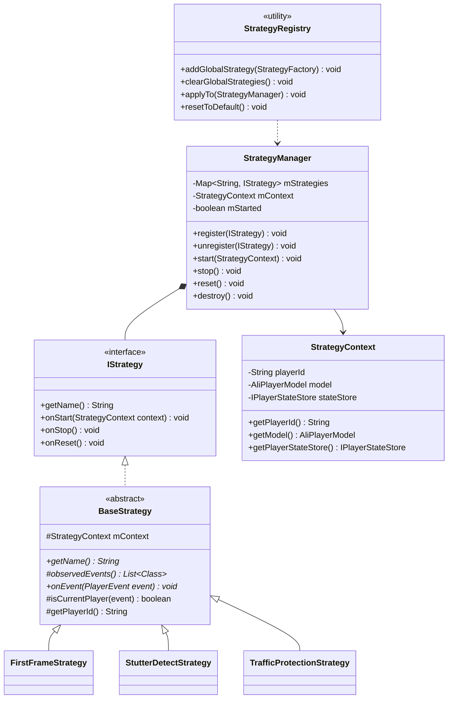
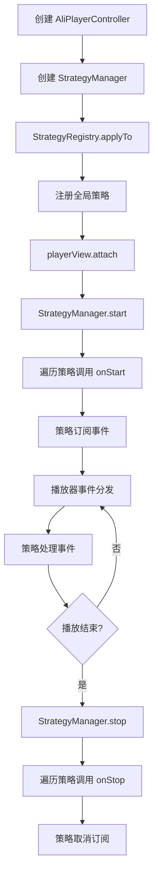
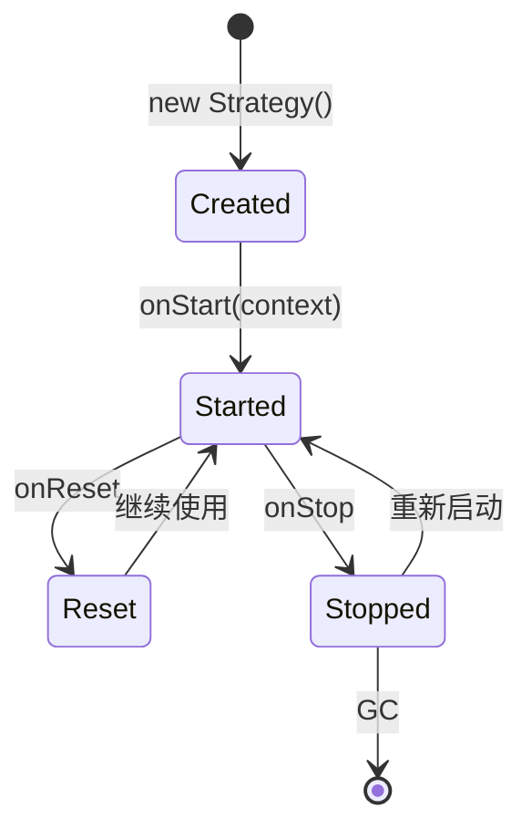

Language: 中文简体 | [English](StrategySystem-EN.md)

# **策略系统 (Strategy System)**

**策略系统 (Strategy System)** 是 AliPlayerKit 的核心架构设计。它通过事件驱动的策略机制，将播放器监控、分析和优化逻辑封装为独立的策略组件，实现播放器业务逻辑的解耦、复用与灵活扩展。

---

## **1. 概念介绍**

### **1.1 设计背景**

策略系统的设计，源于我们对 AUI Kits 在规模化落地过程中 **业务逻辑定制与框架可演进性之间矛盾** 的系统性思考。

作为面向客户的低代码应用方案，AUI Kits 在服务不同业务方时，客户往往需要根据自身需求对 UI 或核心流程进行定制。如果这些业务逻辑直接嵌入框架代码，就会与框架产生高度耦合，导致后续版本升级困难重重——**要么无法升级，要么在升级过程中产生大量代码冲突，甚至导致既有业务逻辑失效，引发功能回归**。

本质上，这些逻辑属于 **客户自身的业务逻辑**，而非框架能力。如果缺乏合理的承载机制，业务差异将不断侵入框架内部，进而影响系统的稳定性与可演进性。

策略系统正是为解决这一痛点而生：该系统将业务差异抽象为可独立扩展的策略单元，使业务逻辑从框架核心中解耦，实现**业务逻辑的合理归位**。业务方可以在策略层进行扩展，而无需侵入框架核心，从而降低后续版本迭代和升级的成本。

同时，这一机制也使对客过程中沉淀的业务能力能够被系统化管理与复用，逐步形成 **可迭代、可复用、可扩展** 的能力体系，为 **AliPlayerKit** 的长期演进提供稳定的架构基础。

### **1.2 什么是策略？**

**策略 (Strategy)** 是播放器业务逻辑的独立封装单元，承载特定业务能力或自定义逻辑，如首帧耗时统计、卡顿检测、流量保护、记忆播放等。

**核心特征**：

- **单一职责**：每个策略围绕一个明确的功能目标
- **事件驱动**：通过事件总线订阅播放器事件，响应式执行
- **独立隔离**：策略之间相互独立、互不干扰

通过这种设计，播放器的非核心能力被抽象为一组 **可插拔、可组合** 的策略单元，使播放器核心保持简洁，同时为能力扩展提供灵活的实现方式。

### **1.3 什么是策略系统？**

**策略系统 (Strategy System)** 是用于统一管理策略组件的架构机制。

它负责定义策略的 **注册机制、生命周期管理、上下文注入以及事件订阅**，并在播放器运行过程中统一管理策略的创建、启动、暂停、重置与销毁。

基于这一机制，开发者可以按需启用或禁用特定策略，也可以快速实现自定义策略，甚至完全替换默认策略，以满足不同业务场景下的定制需求。

---

## **2. 功能特性**

### **2.1 解决问题**

- **逻辑分散**：业务逻辑散落各处，难以维护和复用
- **场景差异**：不同业务场景需要不同的业务逻辑组合，缺乏灵活性
- **框架侵入**：自定义业务逻辑需要修改框架源码
- **实例串台**：多播放器场景下业务逻辑容易串台

### **2.2 核心价值**

策略系统将播放器的监控与分析逻辑抽离出来，客户可以自主选择使用方式：

| 使用方式     | 说明                       | 优势                   |
| ------------ | -------------------------- | ---------------------- |
| 使用默认策略 | 播放器组件使用官方默认策略 | 简化接入流程，开箱即用 |
| 自定义策略   | 实现特定业务需求的策略     | 满足各类定制化业务需求 |
| 不使用策略   | 仅使用播放能力             | 纯播放场景，无逻辑依赖 |

**架构优势**：

- **解耦**：策略与播放器核心逻辑分离，职责清晰
- **复用**：策略可在不同播放器实例间复用
- **可扩展**：无需修改框架即可自定义策略
- **隔离**：策略间相互独立，互不影响

### **2.3 核心能力**

| 能力 | 说明 |
|-----|------|
| 事件驱动 | 策略通过事件总线订阅播放器事件，响应式执行 |
| 生命周期管理 | 统一管理策略的启动、停止、重置、销毁 |
| 上下文注入 | 策略可通过上下文访问播放器状态和数据 |
| 工厂模式 | 支持全局注册策略工厂，自动应用于所有播放器实例 |

---

## **3. 内置组件**

### **3.1 策略类型**

| 策略类型 | 说明 | 默认实现 |
|---------|------|---------|
| 首帧耗时 | 统计播放器首帧渲染耗时，支持分阶段统计 | FirstFrameStrategy |
| 卡顿检测 | 检测播放过程中的卡顿，统计次数和时长 | StutterDetectStrategy |
| 流量保护 | 监听网络状态，在 WiFi 切换到移动网络时提醒用户 | TrafficProtectionStrategy |

### **3.2 策略详情**

#### **首帧耗时策略 (FirstFrameStrategy)**

统计播放器从 PREPARING 到首帧渲染完成的耗时，细分三个阶段：

| 阶段 | 说明 |
|-----|------|
| 准备阶段 | PREPARING → Prepared |
| 渲染阶段 | Prepared → FirstFrameRendered |
| 总耗时 | PREPARING → FirstFrameRendered |

**使用场景**：性能监控、用户体验优化、播放器调优。

#### **卡顿检测策略 (StutterDetectStrategy)**

监控播放过程中的 Loading 状态，统计卡顿情况：

| 指标 | 说明 |
|-----|------|
| 卡顿次数 | Loading 发生的次数 |
| 卡顿时长 | 每次卡顿的持续时间 |
| 卡顿总时长 | 整个播放会话的卡顿时长总和 |
| 有效播放时长 | 实际观看时长（不含暂停和卡顿） |

**使用场景**：播放质量监控、用户体验分析。

#### **流量保护策略 (TrafficProtectionStrategy)**

监听网络状态变化，在特定场景下提醒用户：

| 场景 | 行为 |
|-----|------|
| WiFi → 移动网络 | 提示用户正在使用流量播放 |
| 起播时为移动网络 | 提示用户当前使用流量 |

**使用场景**：流量敏感场景、用户关怀。

---

## **4. 基础使用**

策略系统提供三种使用策略，开发者可根据需求选择合适的方式：

| 策略 | 说明 | 适用场景 |
|-----|------|---------|
| 策略一：使用默认策略 | 最简单的使用方式，播放器组件自动注册默认策略 | 快速集成、标准播放场景 |
| 策略二：自定义部分策略 | 只注册特定策略，其他不使用 | 局部定制、按需启用 |
| 策略三：完全自定义策略 | 自定义所有策略，创建完全个性化的监控体系 | 深度定制、特定业务需求 |

### **4.1 策略一：使用默认策略**

最简单的使用方式，播放器组件将自动注册默认策略：

```java
// 1. 创建播放器控制器（自动注册默认策略）
AliPlayerController controller = new AliPlayerController(this);

// 2. 准备播放数据
AliPlayerModel model = new AliPlayerModel.Builder()
        .videoSource(videoSource)
        .build();

// 3. 绑定到视图
playerView.attach(controller, model);
```

默认注册的策略包括：
- FirstFrameStrategy（首帧耗时）
- StutterDetectStrategy（卡顿检测）
- TrafficProtectionStrategy（流量保护）

### **4.2 策略二：自定义部分策略**

只注册需要的策略，其他不启用：

```java
// 1. 创建播放器控制器
AliPlayerController controller = new AliPlayerController(this);

// 2. 获取策略管理器并清除默认策略
StrategyManager strategyManager = controller.getStrategyManager();

// 3. 只注册需要的策略
strategyManager.register(new FirstFrameStrategy());
strategyManager.register(new StutterDetectStrategy());

// 4. 准备播放数据并绑定
AliPlayerModel model = new AliPlayerModel.Builder()
        .videoSource(videoSource)
        .build();
playerView.attach(controller, model);
```

### **4.3 策略三：完全自定义策略**

实现自定义策略，创建完全个性化的监控体系：

```java
// 1. 创建播放器控制器
AliPlayerController controller = new AliPlayerController(this);

// 2. 获取策略管理器
StrategyManager strategyManager = controller.getStrategyManager();

// 3. 注册自定义策略
strategyManager.register(new MyCustomStrategy());
strategyManager.register(new MyAnalyticsStrategy());

// 4. 准备播放数据并绑定
AliPlayerModel model = new AliPlayerModel.Builder()
        .videoSource(videoSource)
        .build();
playerView.attach(controller, model);
```

---

## **5. 进阶使用**

### **5.1 如何实现自定义策略？**

提供两种实现方式，根据需求选择：

| 方式                  | 特点                       | 适用场景         |
| --------------------- | -------------------------- | ---------------- |
| 继承 `BaseStrategy`   | 代码量少，框架管理事件订阅 | 大多数监控策略   |
| 实现 `IStrategy` 接口 | 灵活性高，完全自主控制     | 需要特殊控制逻辑 |

#### **方式一：继承 BaseStrategy（推荐）**

继承 `BaseStrategy` 是最简单的方式，框架已封装好事件订阅和生命周期管理。

**适用场景**：大多数监控和分析策略，如统计、检测、日志等。

1. **创建策略类**

   继承 `BaseStrategy` 并实现必要方法：

   ```java
   public class MyAnalyticsStrategy extends BaseStrategy {

       private static final String TAG = "MyAnalyticsStrategy";

       @NonNull
       @Override
       public String getName() {
           return TAG;  // 返回策略名称，用于日志和调试
       }

       @Nullable
       @Override
       protected List<Class<? extends PlayerEvent>> observedEvents() {
           // 声明需要订阅的事件类型
           return Arrays.asList(
               PlayerEvents.StateChanged.class,
               PlayerEvents.Prepared.class,
               PlayerEvents.Info.class
           );
       }

       @Override
       public void onEvent(@NonNull PlayerEvent event) {
           // 过滤非当前播放器事件
           if (!isCurrentPlayer(event)) return;

           // 处理事件
           if (event instanceof PlayerEvents.StateChanged) {
               handleStateChanged((PlayerEvents.StateChanged) event);
           } else if (event instanceof PlayerEvents.Prepared) {
               handlePrepared((PlayerEvents.Prepared) event);
           } else if (event instanceof PlayerEvents.Info) {
               handleInfo((PlayerEvents.Info) event);
           }
       }

       @Override
       public void onReset() {
           super.onReset();
           // 重置内部状态，准备处理新的视频
       }

       private void handleStateChanged(PlayerEvents.StateChanged event) {
           // 处理状态变化
       }

       private void handlePrepared(PlayerEvents.Prepared event) {
           // 处理准备完成
       }

       private void handleInfo(PlayerEvents.Info event) {
           // 处理播放信息更新
       }
   }
   ```

2. **注册使用**

   ```java
   StrategyManager strategyManager = controller.getStrategyManager();
   strategyManager.register(new MyAnalyticsStrategy());
   ```

**示例参考**：`strategies/FirstFrameStrategy.java`

#### **方式二：实现 IStrategy 接口**

直接实现 `IStrategy` 接口可以获得更高的灵活性，但需要自行处理事件订阅。

**适用场景**：需要完全控制策略行为，或需要特殊初始化逻辑。

1. **创建策略类**

   实现 `IStrategy` 接口，并自行管理事件订阅：

   ```java
   public class MyCustomStrategy implements IStrategy, PlayerEventBus.EventListener<PlayerEvent> {

       private static final String TAG = "MyCustomStrategy";

       private StrategyContext mContext;

       @NonNull
       @Override
       public String getName() {
           return TAG;
       }

       @Override
       public void onStart(@NonNull StrategyContext context) {
           mContext = context;
           // 手动订阅事件
           PlayerEventBus.getInstance().subscribe(PlayerEvents.StateChanged.class, this);
       }

       @Override
       public void onStop() {
           // 手动取消订阅
           PlayerEventBus.getInstance().unsubscribe(PlayerEvents.StateChanged.class, this);
           mContext = null;
       }

       @Override
       public void onReset() {
           // 重置内部状态
       }

       @Override
       public void onEvent(@NonNull PlayerEvent event) {
           // 处理事件
       }
   }
   ```

2. **注册使用**

   与方式一相同，通过 `StrategyManager` 注册。

### **5.2 如何实现带回调的策略？**

策略可以通过回调接口将结果通知给业务层：

```java
public class MyAnalyticsStrategy extends BaseStrategy {

    public interface Callback {
        void onAnalysisComplete(AnalysisResult result);
    }

    @Nullable
    private final Callback mCallback;

    // 支持无参构造
    public MyAnalyticsStrategy() {
        this(null);
    }

    // 支持传入回调
    public MyAnalyticsStrategy(@Nullable Callback callback) {
        mCallback = callback;
    }

    @Override
    public void onEvent(@NonNull PlayerEvent event) {
        // ... 业务逻辑

        // 通过回调通知结果
        if (mCallback != null) {
            mCallback.onAnalysisComplete(result);
        }
    }
}
```

**使用方式**：

```java
strategyManager.register(new MyAnalyticsStrategy(result -> {
    // 处理分析结果
    Log.d("Analytics", "Result: " + result);
}));
```

**示例参考**：`strategies/FirstFrameStrategy.java`

### **5.3 如何访问播放器状态？**

策略可以通过 `StrategyContext` 访问播放器状态和数据：

```java
@Override
public void onEvent(@NonNull PlayerEvent event) {
    if (!isCurrentPlayer(event)) return;

    // 获取播放器 ID
    String playerId = getPlayerId();

    // 获取播放数据模型
    AliPlayerModel model = mContext.getModel();
    if (model != null) {
        String title = model.getVideoTitle();
        VideoSource source = model.getVideoSource();
    }

    // 获取播放器状态存储
    IPlayerStateStore stateStore = mContext.getPlayerStateStore();
    long position = stateStore.getCurrentPosition();
    long duration = stateStore.getDuration();
    PlayerState state = stateStore.getPlayState();
}
```

**注意**：`mContext` 在 `onStart()` 之后才可用，在构造函数中为 null。

### **5.4 如何注册全局策略？**

通过 `StrategyRegistry` 可以注册全局策略，自动应用于所有新创建的播放器实例：

```java
// 注册全局策略
StrategyRegistry.addGlobalStrategy(() -> new MyAnalyticsStrategy());

// 之后创建的所有 AliPlayerController 都会自动注册此策略
AliPlayerController controller = new AliPlayerController(this);
```

**恢复默认配置**：

```java
StrategyRegistry.resetToDefault();
```

---

## **6. 最佳实践**

### **6.1 生命周期管理**

```java
public class MyStrategy extends BaseStrategy {

    @Override
    public void onStart(@NonNull StrategyContext context) {
        super.onStart(context);  // 必须调用
        // 初始化资源
    }

    @Override
    public void onStop() {
        // 清理资源
        super.onStop();  // 必须调用
    }

    @Override
    public void onReset() {
        super.onReset();
        // 重置内部状态，准备处理新视频
    }
}
```

### **6.2 事件过滤**

在多播放器场景下，务必过滤事件来源：

```java
@Override
public void onEvent(@NonNull PlayerEvent event) {
    // 过滤非当前播放器事件，避免串台
    if (!isCurrentPlayer(event)) return;

    // 处理当前播放器的事件
}
```

### **6.3 资源清理**

策略中如果有 Handler、Runnable 等异步资源，务必在 `onStop()` 中清理：

```java
public class MyStrategy extends BaseStrategy {

    private final Handler mHandler = new Handler();
    private Runnable mRunnable;

    @Override
    public void onStart(@NonNull StrategyContext context) {
        super.onStart(context);
        mRunnable = () -> doSomething();
        mHandler.postDelayed(mRunnable, 1000);
    }

    @Override
    public void onStop() {
        // 清理异步任务，避免内存泄漏
        mHandler.removeCallbacks(mRunnable);
        super.onStop();
    }
}
```

### **6.4 注意事项**

| 场景 | 推荐做法 | 原因 |
|-----|---------|------|
| 多播放器场景 | 使用 `isCurrentPlayer()` 过滤事件 | 避免事件串台 |
| 长时间运行任务 | 在 `onStop()` 中取消任务 | 避免内存泄漏 |
| 视频切换 | 在 `onReset()` 中重置状态 | 确保状态正确 |
| 访问 Context | 通过 `mContext.getModel()` 获取 | 确保上下文可用 |

---

## **7. 示例参考**

项目提供了完整的示例，位于 `playerkit-examples/example-strategy-system`。

### **7.1 示例功能**

| 功能 | 说明 |
|-----|------|
| 记忆播放策略 | 自动记录播放进度，下次播放时恢复 |
| 策略注册演示 | 演示如何注册自定义策略 |

### **7.2 运行示例**

在 Demo App 中选择「Strategy System」示例查看效果。

---

## **8. API 参考**

### **8.1 类结构**



### **8.2 核心接口**

| 接口/类 | 说明 |
|--------|------|
| `IStrategy` | 策略接口，定义生命周期方法 |
| `BaseStrategy` | 策略基类，封装事件订阅管理 |
| `StrategyManager` | 策略管理器，管理策略生命周期 |
| `StrategyContext` | 策略上下文，提供只读的播放器信息 |
| `StrategyRegistry` | 策略注册中心，管理全局策略 |

### **8.3 BaseStrategy 方法**

| 方法 | 说明 |
|-----|------|
| `getName()` | 返回策略名称，用于日志和调试 |
| `observedEvents()` | 返回需要订阅的事件类型列表 |
| `onEvent(event)` | 事件回调，处理订阅的事件 |
| `isCurrentPlayer(event)` | 检查事件是否来自当前播放器 |
| `getPlayerId()` | 获取当前播放器 ID |

### **8.4 StrategyManager 方法**

| 方法 | 说明 |
|-----|------|
| `register(strategy)` | 注册策略 |
| `unregister(strategy)` | 注销策略 |
| `getStrategy(name)` | 根据名称获取策略 |
| `start(context)` | 启动所有策略 |
| `stop()` | 停止所有策略 |
| `reset()` | 重置所有策略 |
| `destroy()` | 销毁管理器 |

### **8.5 StrategyContext 方法**

| 方法 | 说明 |
|-----|------|
| `getPlayerId()` | 获取播放器 ID |
| `getModel()` | 获取播放数据模型 |
| `getPlayerStateStore()` | 获取播放器状态存储（只读） |

---

## **9. 技术原理**

### **9.1 整体架构**

策略系统采用 **事件驱动 + 管理器调度** 的架构模式：

```
┌─────────────────────────────────────────────────────────┐
│                    AliPlayerController                   │
│  ┌─────────────────────────────────────────────────┐   │
│  │               StrategyManager                     │   │
│  │  ┌─────────┐ ┌─────────┐ ┌─────────┐            │   │
│  │  │Strategy1│ │Strategy2│ │Strategy3│            │   │
│  │  └────┬────┘ └────┬────┘ └────┬────┘            │   │
│  └───────┼──────────┼──────────┼──────────────────┘   │
│          │          │          │                       │
│          └──────────┼──────────┘                       │
│                     ▼                                  │
│  ┌─────────────────────────────────────────────────┐   │
│  │              PlayerEventBus                      │   │
│  │           (全局单例事件总线)                       │   │
│  └─────────────────────────────────────────────────┘   │
└─────────────────────────────────────────────────────────┘
```

**设计要点**：

- **策略不持有播放器引用**：通过事件驱动，彻底解耦
- **策略只关注事件**：只需声明"订阅什么"和"如何处理"
- **管理器统一调度**：生命周期、事件分发由管理器控制

### **9.2 工作流程**



### **9.3 生命周期**

策略采用三阶段生命周期：



| 生命周期           | 触发时机                     | 说明                           |
| ------------------ | ---------------------------- | ------------------------------ |
| `onStart(context)` | `playerView.attach()`        | 策略启动，订阅事件，初始化资源 |
| `onReset()`        | 播放内容切换                 | 重置内部状态，准备处理新视频   |
| `onStop()`         | `playerView.detach()` 或销毁 | 策略停止，取消订阅，清理资源   |

### **9.3 事件驱动机制**

策略通过事件总线订阅播放器事件，采用发布-订阅模式：

```
Player ──publish──▶ EventBus ──dispatch──▶ Strategy
                         │
                         └── 全局单例，管理所有订阅关系
```

**事件订阅流程**：

1. 策略在 `observedEvents()` 中声明需要订阅的事件类型
2. `BaseStrategy` 在 `onStart()` 中自动订阅这些事件
3. `BaseStrategy` 在 `onStop()` 中自动取消订阅
4. 策略在 `onEvent()` 中处理接收到的事件

**设计理念**：这种事件驱动机制彻底解耦了策略与播放器。策略无需持有播放器引用，只需关心"订阅什么事件"和"如何处理事件"，实现了真正的关注点分离。

### **9.4 多播放器隔离**

在多播放器场景下，策略系统通过以下机制确保隔离：

1. **独立 StrategyManager**：每个 `AliPlayerController` 拥有独立的 `StrategyManager`
2. **独立 StrategyContext**：每个策略上下文绑定特定播放器 ID
3. **事件过滤**：策略通过 `isCurrentPlayer(event)` 过滤事件来源

```java
@Override
public void onEvent(@NonNull PlayerEvent event) {
    // 每个播放器实例的事件都带有 playerId
    // isCurrentPlayer() 检查事件是否来自当前播放器
    if (!isCurrentPlayer(event)) return;

    // 只处理当前播放器的事件
}
```

---

## **10. 常见问题**

### **10.1 策略什么时候启动？**

调用 `playerView.attach()` 时自动启动所有已注册的策略。

### **10.2 如何获取播放器当前状态？**

通过 `StrategyContext` 的 `getPlayerStateStore()` 方法：

```java
IPlayerStateStore stateStore = mContext.getPlayerStateStore();
PlayerState state = stateStore.getPlayState();
long position = stateStore.getCurrentPosition();
```

### **10.3 如何调试策略？**

使用 `LogHub` 查看日志，TAG 格式：`策略名称.BaseStrategy` 或 `StrategyManager`。

### **10.4 高频崩溃错例**

以下是客户反馈中最常导致崩溃的问题，请务必避免：

#### **错例 1：在构造函数中访问 mContext**

**错误代码**：

```java
public class MyStrategy extends BaseStrategy {

    public MyStrategy() {
        super();
        // ❌ 构造函数中 mContext 为 null
        String playerId = getPlayerId();  // 返回空字符串
        AliPlayerModel model = mContext.getModel();  // NullPointerException!
    }
}
```

**崩溃原因**：`mContext` 在 `onStart()` 调用后才被赋值，构造函数执行时还未启动策略。

**正确代码**：

```java
@Override
public void onStart(@NonNull StrategyContext context) {
    super.onStart(context);  // ✅ 必须首先调用
    // 在 onStart 之后才能访问 mContext
    String playerId = getPlayerId();  // 正常获取
    AliPlayerModel model = mContext.getModel();  // 正常获取
}
```

---

#### **错例 2：忘记调用 super.onStart() 导致事件订阅失效**

**错误代码**：

```java
public class MyStrategy extends BaseStrategy {

    @Override
    public void onStart(@NonNull StrategyContext context) {
        // ❌ 忘记调用 super.onStart(context)
        // mContext 为 null，事件订阅不会执行
        initMyResources();
    }

    @Override
    public void onEvent(@NonNull PlayerEvent event) {
        // 永远不会被调用！因为事件订阅未执行
    }
}
```

**崩溃原因**：`super.onStart(context)` 会初始化 `mContext` 并订阅 `observedEvents()` 返回的事件。不调用会导致 `mContext` 为 null、事件订阅无效。

**正确代码**：

```java
@Override
public void onStart(@NonNull StrategyContext context) {
    super.onStart(context);  // ✅ 必须首先调用
    initMyResources();
}
```

---

#### **错例 3：未过滤事件导致多播放器串台**

**错误代码**：

```java
public class MyStrategy extends BaseStrategy {

    @Override
    public void onEvent(@NonNull PlayerEvent event) {
        // ❌ 未过滤事件来源，多播放器场景会串台
        if (event instanceof PlayerEvents.StateChanged) {
            // 所有播放器的状态变化都会触发此逻辑
            updateUI();  // 可能操作错误的播放器 UI
        }
    }
}
```

**崩溃原因**：在多播放器场景下，所有播放器的事件都会分发到所有策略。不进行过滤会导致策略处理其他播放器的事件。

**正确代码**：

```java
@Override
public void onEvent(@NonNull PlayerEvent event) {
    // ✅ 首先过滤非当前播放器事件
    if (!isCurrentPlayer(event)) return;

    if (event instanceof PlayerEvents.StateChanged) {
        updateUI();  // 只处理当前播放器的事件
    }
}
```

---

#### **错例 4：onStop 未清理异步任务导致内存泄漏**

**错误代码**：

```java
public class MyStrategy extends BaseStrategy {

    private Handler handler = new Handler();

    @Override
    public void onStart(@NonNull StrategyContext context) {
        super.onStart(context);
        handler.postDelayed(() -> updateProgress(), 1000);  // 延迟任务
    }

    @Override
    public void onStop() {
        // ❌ 忘记移除延迟任务
        super.onStop();
    }
}
```

**崩溃原因**：延迟任务持有策略实例引用，策略停止后无法被 GC，导致内存泄漏。任务执行时可能访问已销毁的资源。

**正确代码**：

```java
@Override
public void onStop() {
    handler.removeCallbacksAndMessages(null);  // ✅ 清理所有延迟任务
    super.onStop();
}
```

---

#### **错例 5：observedEvents 返回 null 导致事件订阅失败**

**错误代码**：

```java
public class MyStrategy extends BaseStrategy {

    @Nullable
    @Override
    protected List<Class<? extends PlayerEvent>> observedEvents() {
        // ❌ 返回 null，虽然不会崩溃，但事件订阅不会执行
        return null;
    }

    @Override
    public void onEvent(@NonNull PlayerEvent event) {
        // 永远不会被调用
    }
}
```

**崩溃原因**：`BaseStrategy` 在订阅事件时会检查 `observedEvents()` 返回值，null 或空列表都不会订阅任何事件。

**正确代码**：

```java
@Nullable
@Override
protected List<Class<? extends PlayerEvent>> observedEvents() {
    return Arrays.asList(
        PlayerEvents.StateChanged.class,  // ✅ 声明要订阅的事件
        PlayerEvents.Prepared.class
    );
}

@Override
public void onEvent(@NonNull PlayerEvent event) {
    // 现在可以正常收到事件了
}
```

---

#### **错例 6：onReset 未重置内部状态导致数据错误**

**错误代码**：

```java
public class MyStrategy extends BaseStrategy {

    private int mPlayCount = 0;

    @Override
    public void onEvent(@NonNull PlayerEvent event) {
        if (!isCurrentPlayer(event)) return;

        if (event instanceof PlayerEvents.Prepared) {
            mPlayCount++;  // ❌ 视频切换时未重置，会累积
            Log.d(TAG, "Play count: " + mPlayCount);
        }
    }

    @Override
    public void onReset() {
        super.onReset();
        // ❌ 忘记重置 mPlayCount
    }
}
```

**崩溃原因**：`onReset()` 在视频切换时调用，用于重置策略内部状态。不重置会导致状态累积，影响统计准确性。

**正确代码**：

```java
@Override
public void onReset() {
    super.onReset();
    mPlayCount = 0;  // ✅ 重置内部状态
}
```
