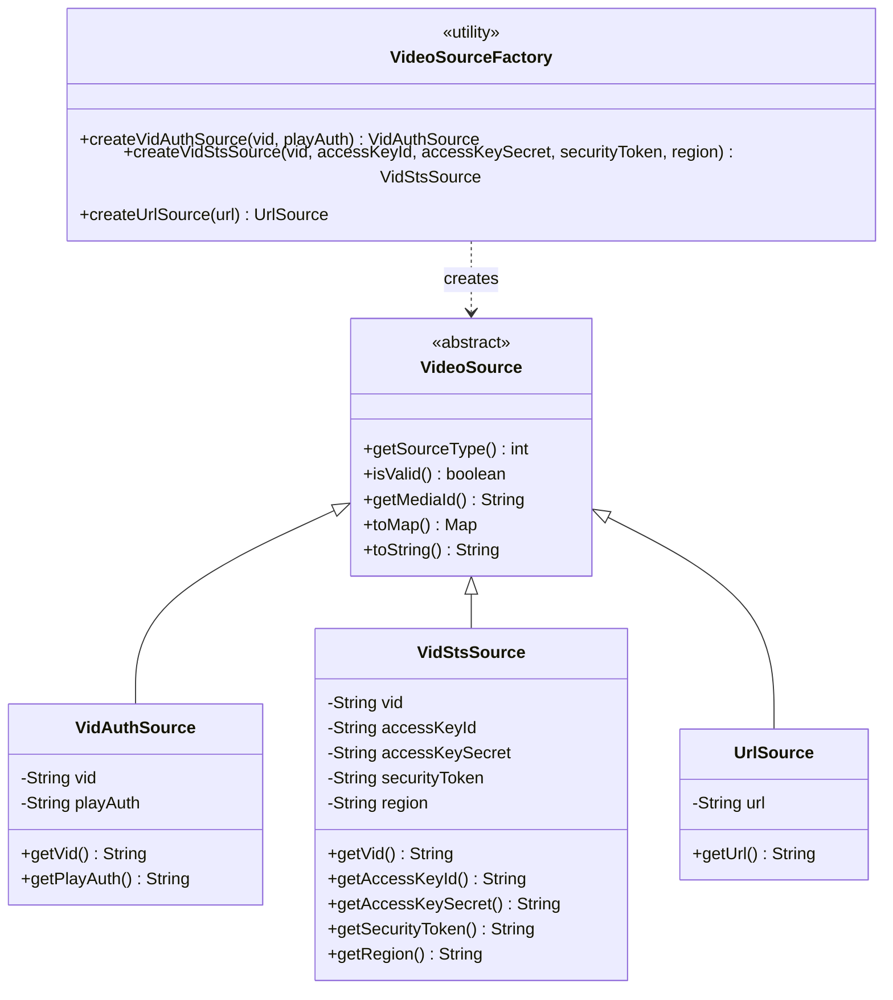
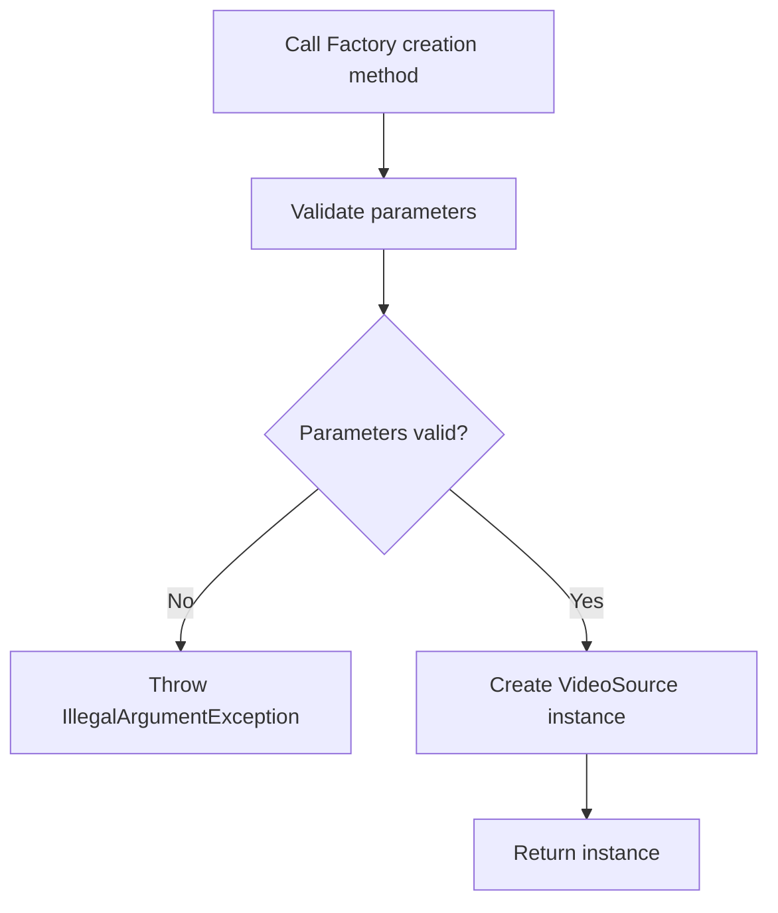
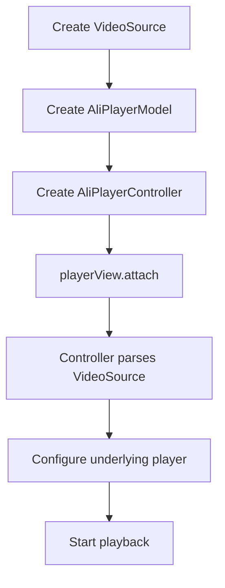

# **Video Source**

**Video Source** is the data foundation module of AliPlayerKit. It defines multiple video source types, supports three playback methods (VidAuth, VidSts, URL), and provides unified video resource configuration and management.

---

## **1. Concept Introduction**

### **1.1 What is a Video Source?**

A **Video Source** is the data origin from which the player retrieves video content. It defines how the video resource is obtained and the authorization mechanism.

AliPlayerKit supports 3 types of video sources:

| Video Source Type | Authorization Method | Use Case |
|-------------------|----------------------|----------|
| VidAuth | VID + Play Credential | **Recommended**, most production environments |
| VidSts | VID + STS Temporary Credential | High security scenarios |
| URL | Direct URL Address | Public resources, testing & demos |

### **1.2 How to Choose a Video Source Type?**

Select the appropriate video source type based on business scenarios and security requirements:

| Requirement | Recommended Type | Description |
|-------------|------------------|-------------|
| Authorization required | VidAuth (recommended) | Simple authorization mechanism, easy to integrate |
| High security required | VidSts | Temporary credentials, supports fine-grained access control |
| Public video resources | URL | No authorization required, simple to use |

---

## **2. Features**

### **2.1 Problems Solved**

- Inconsistent configuration across different video source types
- Complex authorization credential management
- Lack of unified video source validation mechanism
- Difficulty distinguishing between different types of video resources

### **2.2 Core Value**

| Feature | Description |
|---------|-------------|
| Unified Abstraction | All video source types inherit from the `VideoSource` base class with a unified API |
| Factory Creation | Simplifies creation through `VideoSourceFactory` with automatic parameter validation |
| Type Safety | Uses `@SourceType` annotation to ensure type safety |
| Configuration Validation | The `isValid()` method validates configuration validity |

### **2.3 Core Capabilities**

| Capability | Description |
|------------|-------------|
| VidAuth Playback | Authorized playback via VID and play credential |
| VidSts Playback | Authorized playback via VID and STS temporary credential |
| URL Playback | Playback via direct URL address |
| Parameter Validation | Automatic validation of required parameters during creation |
| Unique Identifier | Each video source has a unique MediaId for player pool reuse |

---

## **3. Video Source Types in Detail**

### **3.1 VidAuth Mode (Recommended)**

Authorized playback using a Video ID (VID) and Play Credential (PlayAuth).

**Use Cases**:
- Video resources that require authorization validation
- Most production environment video playback
- Scenarios that need a simple yet secure authorization method

**Characteristics**:
- Simple authorization mechanism, easy to integrate
- Provides basic security protection
- **Recommended for most business scenarios**

**Parameters**:

| Parameter | Type | Required | Description |
|-----------|------|----------|-------------|
| vid | String | Yes | Unique video identifier |
| playAuth | String | Yes | Play authorization code |

**Example**:

```java
// Create a VidAuth video source
VideoSource.VidAuthSource videoSource = VideoSourceFactory.createVidAuthSource(
    "your_video_id",      // Video ID
    "your_play_auth"      // Play credential
);

// Create the playback model
AliPlayerModel model = new AliPlayerModel.Builder()
    .videoSource(videoSource)
    .build();
```

### **3.2 VidSts Mode**

Playback using a Video ID (VID) and Alibaba Cloud STS (Security Token Service) tokens, providing higher security and access control.

**Use Cases**:
- Scenarios requiring temporary access credentials
- Video resources with high security requirements
- Scenarios requiring fine-grained access control

**Characteristics**:
- Uses temporary access credentials with high security
- Supports fine-grained access permission control
- Suitable for high-security scenarios

**Parameters**:

| Parameter | Type | Required | Description |
|-----------|------|----------|-------------|
| vid | String | Yes | Unique video identifier |
| accessKeyId | String | Yes | Access Key ID |
| accessKeySecret | String | Yes | Access Key Secret |
| securityToken | String | Yes | Security token |
| region | String | No | Region information |

**Example**:

```java
// Create a VidSts video source
VideoSource.VidStsSource videoSource = VideoSourceFactory.createVidStsSource(
    "your_video_id",              // Video ID
    "your_access_key_id",         // Access Key ID
    "your_access_key_secret",     // Access Key Secret
    "your_security_token",        // Security token
    "cn-shanghai"                 // Region (optional)
);

// Create the playback model
AliPlayerModel model = new AliPlayerModel.Builder()
    .videoSource(videoSource)
    .build();
```

### **3.3 URL Mode**

Playback via a direct video URL, suitable for publicly accessible video resources.

**Use Cases**:
- Public video resources that do not require authorization validation
- Testing and demo scenarios
- Simple video playback needs

**Characteristics**:
- Simple to use, only a video URL is required
- No additional authorization configuration needed
- Lower security, not suitable for sensitive content

**Parameters**:

| Parameter | Type | Required | Description |
|-----------|------|----------|-------------|
| url | String | Yes | Video URL address |

**Example**:

```java
// Create a URL video source
VideoSource.UrlSource videoSource = VideoSourceFactory.createUrlSource(
    "https://example.com/video.mp4"
);

// Create the playback model
AliPlayerModel model = new AliPlayerModel.Builder()
    .videoSource(videoSource)
    .build();
```

---

## **4. Basic Usage**

### **4.1 Basic Playback Flow**

```java
// 1. Create a video source (VidAuth mode is recommended)
VideoSource.VidAuthSource videoSource = VideoSourceFactory.createVidAuthSource(
    "your_video_id",
    "your_play_auth"
);

// 2. Create the playback model
AliPlayerModel model = new AliPlayerModel.Builder()
    .videoSource(videoSource)
    .coverUrl("https://example.com/cover.jpg")
    .videoTitle("Sample Video")
    .sceneType(SceneType.VOD)
    .autoPlay(true)
    .build();

// 3. Create the controller
AliPlayerController controller = new AliPlayerController(this);

// 4. Bind to the player view
controller.configure(model);
playerView.attach(controller);
```

### **4.2 Switching Video Sources**

```java
// When switching videos, detach and release the old controller first
playerView.detach();
controller.destroy();

// Create a new video source
VideoSource.VidAuthSource newSource = VideoSourceFactory.createVidAuthSource(
    "new_video_id",
    "new_play_auth"
);

// Create a new playback model
AliPlayerModel newModel = new AliPlayerModel.Builder()
    .videoSource(newSource)
    .build();

// Create a new controller and bind it
AliPlayerController newController = new AliPlayerController(this);
newController.configure(newModel);
playerView.attach(newController);
```

---

## **5. Advanced Usage**

### **5.1 How to Validate Video Source Validity?**

Before configuring the player, you can call `isValid()` to validate the video source configuration:

```java
VideoSource.VidAuthSource videoSource = VideoSourceFactory.createVidAuthSource(vid, playAuth);

if (videoSource.isValid()) {
    // Configuration is valid, can be used
    AliPlayerModel model = new AliPlayerModel.Builder()
        .videoSource(videoSource)
        .build();
    controller.configure(model);
    playerView.attach(controller);
} else {
    // Configuration is invalid, check the parameters
    Log.e(TAG, "Invalid video source configuration");
}
```

### **5.2 How to Fetch Authorization Info from the Server?**

It is **recommended** to fetch authorization information from the server side to avoid hard-coding sensitive data on the client:

```java
// ✅ Recommended: fetch from server
public void playVideo(String videoId) {
    // Request playAuth from the server
    apiService.getPlayAuth(videoId, new Callback<PlayAuthResponse>() {
        @Override
        public void onSuccess(PlayAuthResponse response) {
            VideoSource.VidAuthSource videoSource = VideoSourceFactory.createVidAuthSource(
                videoId,
                response.getPlayAuth()
            );
            // Start playback...
        }

        @Override
        public void onError(Exception e) {
            Log.e(TAG, "Failed to get playAuth", e);
        }
    });
}
```

### **5.3 How to Handle STS Token Expiration?**

For VidSts mode, pay attention to the security token's expiration time:

```java
// Check whether the token is about to expire
if (isTokenExpiringSoon(securityToken)) {
    // Refresh the token
    refreshSecurityToken(new TokenCallback() {
        @Override
        public void onTokenRefreshed(String newToken) {
            // Recreate the video source with the new token
            VideoSource.VidStsSource videoSource = VideoSourceFactory.createVidStsSource(
                vid, accessKeyId, accessKeySecret, newToken, region
            );
            // Continue playback...
        }
    });
}
```

---

## **6. Best Practices**

### **6.1 Choosing a Video Source Type**

| Scenario | Recommended Type | Reason |
|----------|------------------|--------|
| General business scenarios | VidAuth (recommended) | Simple authorization, sufficient security |
| High security scenarios | VidSts | Temporary credentials, fine-grained access control |
| Public resources | URL | No authorization required, simple to use |

### **6.2 Security Recommendations**

| Recommendation | Description |
|----------------|-------------|
| Do not hard-code sensitive information | Avoid hard-coding `playAuth`, `accessKeySecret`, etc. in client code |
| Fetch authorization from the server | Retrieve authorization info via server-side APIs and pass it to the client |
| Refresh credentials in time | VidSts tokens have an expiration period and need to be refreshed promptly |
| Use HTTPS | Ensure secure data transmission |

### **6.3 Error Handling**

It is recommended to handle errors when creating a video source:

```java
try {
    VideoSource.VidAuthSource videoSource = VideoSourceFactory.createVidAuthSource(vid, playAuth);

    if (!videoSource.isValid()) {
        // Handle invalid configuration
        showError("Invalid video source configuration");
        return;
    }

    // Use the video source
    playVideo(videoSource);

} catch (IllegalArgumentException e) {
    // Handle parameter errors
    Log.e(TAG, "Invalid video source parameters", e);
    showError("Parameter error: " + e.getMessage());
}
```

---

## **7. Example Reference**

The project provides a complete example located at `playerkit-examples/example-video-source`.

### **7.1 Example Features**

| Feature | Description |
|---------|-------------|
| URL Playback | Demonstrates direct URL playback |
| VidAuth Playback | Demonstrates VidAuth playback |
| VidSts Playback | Demonstrates VidSts playback |

### **7.2 Running the Example**

In the Demo App, select the "Video Source" example to see it in action.

---

## **8. API Reference**

### **8.1 Class Structure**



### **8.2 VideoSourceFactory Methods**

| Method | Description |
|--------|-------------|
| `createVidAuthSource(vid, playAuth)` | Create a VidAuth video source (recommended) |
| `createVidStsSource(vid, accessKeyId, accessKeySecret, securityToken, region)` | Create a VidSts video source |
| `createUrlSource(url)` | Create a URL video source |

### **8.3 VideoSource Methods**

| Method | Description |
|--------|-------------|
| `getSourceType()` | Get the video source type |
| `isValid()` | Validate whether the configuration is valid |
| `getMediaId()` | Get the unique identifier |
| `toMap()` | Convert to a configuration Map |

### **8.4 SourceType Constants**

| Constant | Value | Description |
|----------|-------|-------------|
| `VID_AUTH` | 0 | VidAuth type |
| `VID_STS` | 1 | VidSts type |
| `URL` | 2 | URL type |

---

## **9. Technical Principles**

### **9.1 Video Source Creation Flow**



### **9.2 Playback Configuration Flow**



### **9.3 MediaId Generation Rules**

| Video Source Type | MediaId Format |
|-------------------|----------------|
| VidAuth | `vidauth:{vid}` |
| VidSts | `vidsts:{vid}` |
| URL | `url:{url}` |

The MediaId is used for player instance reuse in the player lifecycle strategy. Video sources sharing the same MediaId will reuse the same player instance.

---

## **10. FAQ**

### **10.1 How to Choose a Video Source Type?**

- **Authorization required with general security needs**: use **VidAuth Mode** (recommended)
- **High security with temporary access credentials needed**: use **VidSts Mode**
- **Video is publicly accessible**: use **URL Mode**

### **10.2 What Is the Difference Between VidAuth and VidSts?**

| Feature | VidAuth | VidSts |
|---------|---------|--------|
| Authorization Method | Play credential | Temporary access credential |
| Number of Parameters | 2 | 4~5 |
| Security Level | Medium | High |
| Use Case | Most business scenarios | High security scenarios |
| Recommendation | **Recommended** | Special needs |

### **10.3 What If Video Source Creation Fails?**

Check the following:
1. Whether parameters are empty or invalid
2. Whether the URL format is correct (URL mode)
3. Whether the authorization information is valid (VidAuth and VidSts)
4. Whether the network connection is normal

### **10.4 Common Mistakes**

#### **Mistake 1: Hard-coding Sensitive Information on the Client**

**Incorrect Code**:

```java
// ❌ Do not hard-code sensitive information on the client
VideoSource.VidAuthSource videoSource = VideoSourceFactory.createVidAuthSource(
    "video_id",
    "hardcoded_play_auth_value"  // Security risk!
);
```

**Correct Approach**:

```java
// ✅ Fetch authorization info from the server
String playAuth = fetchPlayAuthFromServer(videoId);
VideoSource.VidAuthSource videoSource = VideoSourceFactory.createVidAuthSource(videoId, playAuth);
```

---

#### **Mistake 2: Not Validating Video Source Validity**

**Incorrect Code**:

```java
// ❌ Use without validating
VideoSource.VidAuthSource videoSource = VideoSourceFactory.createVidAuthSource(vid, playAuth);
controller.configure(createModel(videoSource));  // May be an invalid configuration
playerView.attach(controller);
```

**Correct Approach**:

```java
// ✅ Validate before use
VideoSource.VidAuthSource videoSource = VideoSourceFactory.createVidAuthSource(vid, playAuth);

if (videoSource.isValid()) {
    controller.configure(createModel(videoSource));
    playerView.attach(controller);
} else {
    showError("Invalid video source configuration");
}
```

---

#### **Mistake 3: Not Handling STS Token Expiration**

**Incorrect Code**:

```java
// ❌ Token expiration not handled
VideoSource.VidStsSource videoSource = VideoSourceFactory.createVidStsSource(
    vid, accessKeyId, accessKeySecret, expiredToken, region
);
// Playback fails! Token has expired
```

**Correct Approach**:

```java
// ✅ Check token validity and refresh in time
if (isTokenExpired(securityToken)) {
    securityToken = refreshToken();
}
VideoSource.VidStsSource videoSource = VideoSourceFactory.createVidStsSource(
    vid, accessKeyId, accessKeySecret, securityToken, region
);
```

---

### **10.5 How to Debug?**

1. **Check Logs**: Filter Logcat with `tag:AliPlayerKit`
2. **Call toString()**: The `toString()` method of a video source outputs masked configuration information
3. **Validate Parameters**: Use the `isValid()` method to validate configuration
4. **Check Network**: Ensure the video resource is accessible
