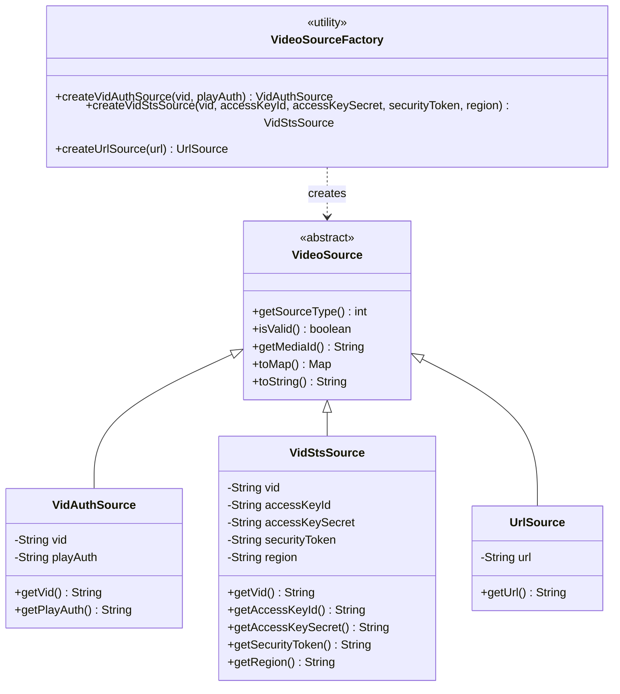
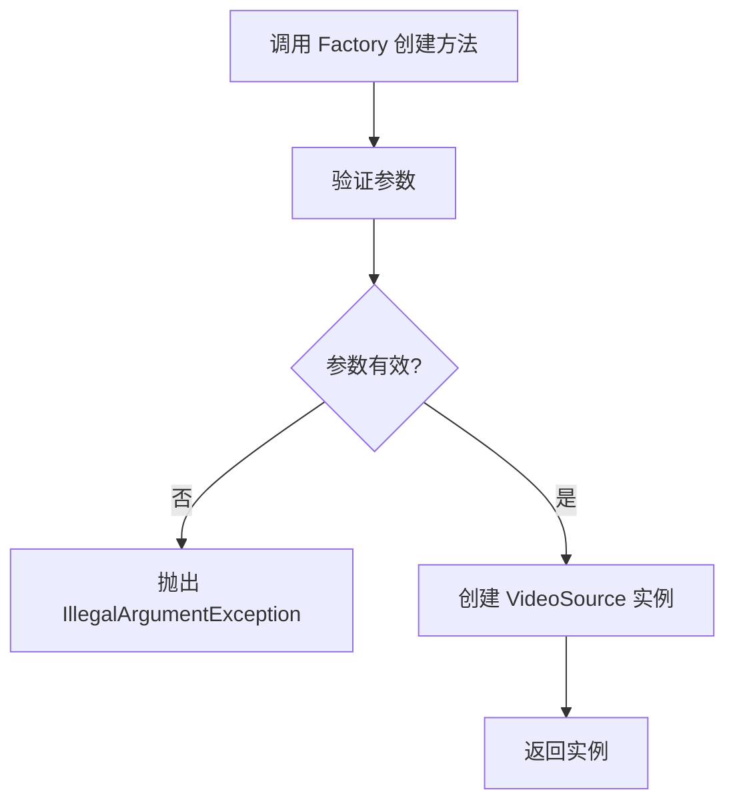
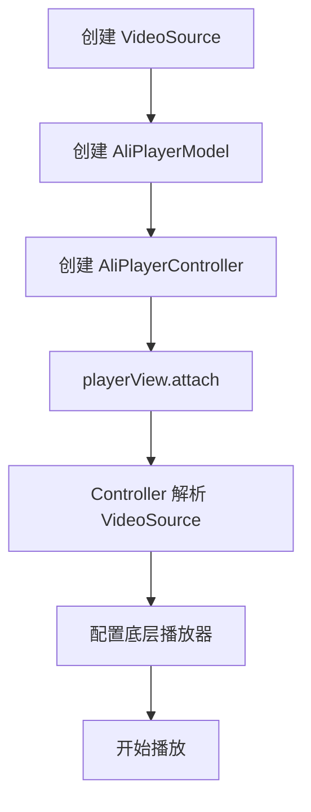

Language: 中文简体 | [English](VideoSource-EN.md)

# **视频源 (Video Source)**

**视频源 (Video Source)** 是 AliPlayerKit 的数据基础模块。它定义了多种视频源类型，支持 VidAuth、VidSts、URL 三种播放方式，实现统一的视频资源配置与管理。

---

## **1. 概念介绍**

### **1.1 什么是视频源？**

**视频源 (Video Source)** 是播放器播放视频的数据来源，定义了视频资源的获取方式和授权机制。

AliPlayerKit 支持 3 种视频源类型：

| 视频源类型 | 授权方式 | 适用场景 |
|-----------|---------|---------|
| VidAuth | VID + 播放凭证 | **推荐**，大多数生产环境 |
| VidSts | VID + STS 临时凭证 | 高安全性场景 |
| URL | 直接 URL 地址 | 公开资源、测试演示 |

### **1.2 如何选择视频源类型？**

根据业务场景和安全需求选择合适的视频源类型：

| 需求 | 推荐类型 | 说明 |
|-----|---------|------|
| 需要授权验证 | VidAuth（推荐） | 授权机制简单，易于集成 |
| 高安全性要求 | VidSts | 临时凭证，支持精细权限控制 |
| 公开视频资源 | URL | 无需授权，使用简单 |

---

## **2. 功能特性**

### **2.1 解决问题**

- 不同视频源类型配置方式不统一
- 授权凭证管理复杂
- 缺乏统一的视频源验证机制
- 难以区分不同类型的视频资源

### **2.2 核心价值**

| 特性 | 说明 |
|-----|------|
| 统一抽象 | 所有视频源类型继承自 `VideoSource` 基类，接口统一 |
| 工厂创建 | 通过 `VideoSourceFactory` 简化创建过程，自动验证参数 |
| 类型安全 | 使用 `@SourceType` 注解确保类型安全 |
| 配置验证 | `isValid()` 方法验证配置有效性 |

### **2.3 核心能力**

| 能力 | 说明 |
|-----|------|
| VidAuth 播放 | 通过 VID 和播放凭证进行授权播放 |
| VidSts 播放 | 通过 VID 和 STS 临时凭证进行授权播放 |
| URL 播放 | 通过直接 URL 地址播放视频 |
| 参数验证 | 创建时自动验证必需参数 |
| 唯一标识 | 每个视频源有唯一的 MediaId，用于播放器池复用 |

---

## **3. 视频源类型详解**

### **3.1 VidAuth 模式（推荐）**

通过视频 ID (VID) 和播放凭证 (PlayAuth) 进行授权播放。

**适用场景**：
- 需要授权验证的视频资源
- 大多数生产环境的视频播放
- 需要简单且安全的授权方式

**特点**：
- 授权机制简单，易于集成
- 提供基本的安全保障
- **推荐用于大多数业务场景**

**参数说明**：

| 参数 | 类型 | 必需 | 说明 |
|-----|------|------|------|
| vid | String | 是 | 视频唯一标识符 |
| playAuth | String | 是 | 播放授权码 |

**使用示例**：

```java
// 创建 VidAuth 类型的视频源
VideoSource.VidAuthSource videoSource = VideoSourceFactory.createVidAuthSource(
    "your_video_id",      // 视频 ID
    "your_play_auth"      // 播放凭证
);

// 创建播放数据
AliPlayerModel model = new AliPlayerModel.Builder()
    .videoSource(videoSource)
    .build();
```

### **3.2 VidSts 模式**

通过视频 ID (VID) 和阿里云 STS (Security Token Service) 令牌进行播放，提供更高的安全性和访问控制。

**适用场景**：
- 需要临时访问凭证的场景
- 高安全性要求的视频资源
- 需要精细访问控制的场景

**特点**：
- 使用临时访问凭证，安全性高
- 支持访问权限的精细控制
- 适合高安全性要求的场景

**参数说明**：

| 参数 | 类型 | 必需 | 说明 |
|-----|------|------|------|
| vid | String | 是 | 视频唯一标识符 |
| accessKeyId | String | 是 | 访问密钥 ID |
| accessKeySecret | String | 是 | 访问密钥密文 |
| securityToken | String | 是 | 安全令牌 |
| region | String | 否 | 区域信息 |

**使用示例**：

```java
// 创建 VidSts 类型的视频源
VideoSource.VidStsSource videoSource = VideoSourceFactory.createVidStsSource(
    "your_video_id",              // 视频 ID
    "your_access_key_id",         // 访问密钥 ID
    "your_access_key_secret",     // 访问密钥密文
    "your_security_token",        // 安全令牌
    "cn-shanghai"                 // 区域信息（可选）
);

// 创建播放数据
AliPlayerModel model = new AliPlayerModel.Builder()
    .videoSource(videoSource)
    .build();
```

### **3.3 URL 模式**

通过直接提供视频 URL 进行播放，适用于公开访问的视频资源。

**适用场景**：
- 公开的视频资源，无需授权验证
- 测试和演示场景
- 简单的视频播放需求

**特点**：
- 使用简单，只需提供视频 URL
- 无需额外的授权配置
- 安全性较低，不适合敏感内容

**参数说明**：

| 参数 | 类型 | 必需 | 说明 |
|-----|------|------|------|
| url | String | 是 | 视频 URL 地址 |

**使用示例**：

```java
// 创建 URL 类型的视频源
VideoSource.UrlSource videoSource = VideoSourceFactory.createUrlSource(
    "https://example.com/video.mp4"
);

// 创建播放数据
AliPlayerModel model = new AliPlayerModel.Builder()
    .videoSource(videoSource)
    .build();
```

---

## **4. 基础使用**

### **4.1 基本播放流程**

```java
// 1. 创建视频源（推荐使用 VidAuth 模式）
VideoSource.VidAuthSource videoSource = VideoSourceFactory.createVidAuthSource(
    "your_video_id",
    "your_play_auth"
);

// 2. 创建播放数据
AliPlayerModel model = new AliPlayerModel.Builder()
    .videoSource(videoSource)
    .coverUrl("https://example.com/cover.jpg")
    .videoTitle("Sample Video")
    .sceneType(SceneType.VOD)
    .autoPlay(true)
    .build();

// 3. 创建控制器
AliPlayerController controller = new AliPlayerController(this);

// 4. 绑定到播放器视图
playerView.attach(controller, model);
```

### **4.2 切换视频源**

```java
// 切换视频时，先解绑
playerView.detach();

// 创建新的视频源
VideoSource.VidAuthSource newSource = VideoSourceFactory.createVidAuthSource(
    "new_video_id",
    "new_play_auth"
);

// 创建新的播放数据
AliPlayerModel newModel = new AliPlayerModel.Builder()
    .videoSource(newSource)
    .build();

// 创建新的控制器并绑定
AliPlayerController newController = new AliPlayerController(this);
playerView.attach(newController, newModel);
```

---

## **5. 进阶使用**

### **5.1 如何验证视频源有效性？**

在配置播放器之前，可以调用 `isValid()` 方法验证视频源配置：

```java
VideoSource.VidAuthSource videoSource = VideoSourceFactory.createVidAuthSource(vid, playAuth);

if (videoSource.isValid()) {
    // 配置有效，可以使用
    AliPlayerModel model = new AliPlayerModel.Builder()
        .videoSource(videoSource)
        .build();
    playerView.attach(controller, model);
} else {
    // 配置无效，检查参数
    Log.e(TAG, "Invalid video source configuration");
}
```

### **5.2 如何从服务器获取授权信息？**

**推荐**通过服务器端获取授权信息，避免在客户端硬编码敏感数据：

```java
// ✅ 推荐：从服务器获取
public void playVideo(String videoId) {
    // 请求服务器获取 playAuth
    apiService.getPlayAuth(videoId, new Callback<PlayAuthResponse>() {
        @Override
        public void onSuccess(PlayAuthResponse response) {
            VideoSource.VidAuthSource videoSource = VideoSourceFactory.createVidAuthSource(
                videoId,
                response.getPlayAuth()
            );
            // 开始播放...
        }

        @Override
        public void onError(Exception e) {
            Log.e(TAG, "Failed to get playAuth", e);
        }
    });
}
```

### **5.3 如何处理 STS 令牌过期？**

对于 VidSts 模式，需要注意安全令牌的过期时间：

```java
// 检查令牌是否即将过期
if (isTokenExpiringSoon(securityToken)) {
    // 刷新令牌
    refreshSecurityToken(new TokenCallback() {
        @Override
        public void onTokenRefreshed(String newToken) {
            // 使用新令牌重新创建视频源
            VideoSource.VidStsSource videoSource = VideoSourceFactory.createVidStsSource(
                vid, accessKeyId, accessKeySecret, newToken, region
            );
            // 继续播放...
        }
    });
}
```

---

## **6. 最佳实践**

### **6.1 视频源类型选择**

| 需求场景 | 推荐类型 | 原因 |
|---------|---------|------|
| 一般业务场景 | VidAuth（推荐） | 授权简单，安全性足够 |
| 高安全场景 | VidSts | 临时凭证，精细权限控制 |
| 公开资源 | URL | 无需授权，使用简单 |

### **6.2 安全性建议**

| 建议 | 说明 |
|-----|------|
| 不要硬编码敏感信息 | 避免在客户端代码中硬编码 `playAuth`、`accessKeySecret` 等 |
| 从服务器获取授权 | 通过服务器端接口获取授权信息，再传递给客户端 |
| 及时刷新凭证 | VidSts 令牌有有效期，需及时刷新 |
| 使用 HTTPS | 确保数据传输安全 |

### **6.3 错误处理**

创建视频源时建议进行错误处理：

```java
try {
    VideoSource.VidAuthSource videoSource = VideoSourceFactory.createVidAuthSource(vid, playAuth);

    if (!videoSource.isValid()) {
        // 处理无效配置
        showError("视频源配置无效");
        return;
    }

    // 使用视频源
    playVideo(videoSource);

} catch (IllegalArgumentException e) {
    // 处理参数错误
    Log.e(TAG, "Invalid video source parameters", e);
    showError("参数错误: " + e.getMessage());
}
```

---

## **7. 示例参考**

项目提供了完整的示例，位于 `playerkit-examples/example-video-source`。

### **7.1 示例功能**

| 功能 | 说明 |
|-----|------|
| URL 播放 | 演示直接 URL 方式播放 |
| VidAuth 播放 | 演示 VidAuth 方式播放 |
| VidSts 播放 | 演示 VidSts 方式播放 |

### **7.2 运行示例**

在 Demo App 中选择「Video Source」示例查看效果。

---

## **8. API 参考**

### **8.1 类结构**



### **8.2 VideoSourceFactory 方法**

| 方法 | 说明 |
|-----|------|
| `createVidAuthSource(vid, playAuth)` | 创建 VidAuth 类型视频源（推荐） |
| `createVidStsSource(vid, accessKeyId, accessKeySecret, securityToken, region)` | 创建 VidSts 类型视频源 |
| `createUrlSource(url)` | 创建 URL 类型视频源 |

### **8.3 VideoSource 方法**

| 方法 | 说明 |
|-----|------|
| `getSourceType()` | 获取视频源类型 |
| `isValid()` | 验证配置是否有效 |
| `getMediaId()` | 获取唯一标识符 |
| `toMap()` | 转换为配置 Map |

### **8.4 SourceType 常量**

| 常量 | 值 | 说明 |
|-----|---|------|
| `VID_AUTH` | 0 | VidAuth 类型 |
| `VID_STS` | 1 | VidSts 类型 |
| `URL` | 2 | URL 类型 |

---

## **9. 技术原理**

### **9.1 视频源创建流程**



### **9.2 播放配置流程**



### **9.3 MediaId 生成规则**

| 视频源类型 | MediaId 格式 |
|-----------|-------------|
| VidAuth | `vidauth:{vid}` |
| VidSts | `vidsts:{vid}` |
| URL | `url:{url}` |

MediaId 用于播放器生命周期策略中的实例复用，相同 MediaId 的视频源会复用同一个播放器实例。

---

## **10. 常见问题**

### **10.1 如何选择视频源类型？**

- **需要授权且安全性要求一般**：使用 **VidAuth 模式**（推荐）
- **需要高安全性和临时访问凭证**：使用 **VidSts 模式**
- **视频是公开的**：使用 **URL 模式**

### **10.2 VidAuth 和 VidSts 有什么区别？**

| 特性 | VidAuth | VidSts |
|-----|---------|--------|
| 授权方式 | 播放凭证 | 临时访问凭证 |
| 参数数量 | 2 个 | 4~5 个 |
| 安全级别 | 中等 | 高 |
| 适用场景 | 大多数业务 | 高安全场景 |
| 推荐度 | **推荐** | 特殊需求 |

### **10.3 视频源创建失败怎么办？**

检查以下几点：
1. 参数是否为空或无效
2. URL 格式是否正确（URL 模式）
3. 授权信息是否有效（VidAuth 和 VidSts）
4. 网络连接是否正常

### **10.4 高频错误错例**

#### **错例 1：客户端硬编码敏感信息**

**错误代码**：

```java
// ❌ 不要在客户端硬编码敏感信息
VideoSource.VidAuthSource videoSource = VideoSourceFactory.createVidAuthSource(
    "video_id",
    "hardcoded_play_auth_value"  // 安全风险！
);
```

**正确做法**：

```java
// ✅ 从服务器获取授权信息
String playAuth = fetchPlayAuthFromServer(videoId);
VideoSource.VidAuthSource videoSource = VideoSourceFactory.createVidAuthSource(videoId, playAuth);
```

---

#### **错例 2：未验证视频源有效性**

**错误代码**：

```java
// ❌ 未验证就使用
VideoSource.VidAuthSource videoSource = VideoSourceFactory.createVidAuthSource(vid, playAuth);
playerView.attach(controller, createModel(videoSource));  // 可能为无效配置
```

**正确做法**：

```java
// ✅ 先验证再使用
VideoSource.VidAuthSource videoSource = VideoSourceFactory.createVidAuthSource(vid, playAuth);

if (videoSource.isValid()) {
    playerView.attach(controller, createModel(videoSource));
} else {
    showError("视频源配置无效");
}
```

---

#### **错例 3：STS 令牌过期未处理**

**错误代码**：

```java
// ❌ 未处理令牌过期
VideoSource.VidStsSource videoSource = VideoSourceFactory.createVidStsSource(
    vid, accessKeyId, accessKeySecret, expiredToken, region
);
// 播放失败！令牌已过期
```

**正确做法**：

```java
// ✅ 检查令牌有效期，及时刷新
if (isTokenExpired(securityToken)) {
    securityToken = refreshToken();
}
VideoSource.VidStsSource videoSource = VideoSourceFactory.createVidStsSource(
    vid, accessKeyId, accessKeySecret, securityToken, region
);
```

---

### **10.5 如何调试？**

1. **检查日志**：使用 `tag:AliPlayerKit` 过滤 Logcat
2. **调用 toString()**：视频源的 `toString()` 方法会输出脱敏后的配置信息
3. **验证参数**：使用 `isValid()` 方法验证配置
4. **检查网络**：确保能正常访问视频资源
